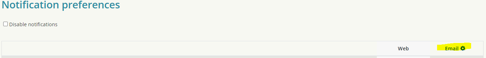
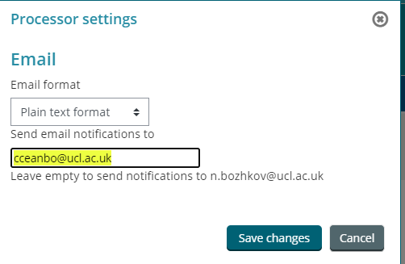

# Moodle Emails not received by students

# List of known affected users (updated 22 Apr 2021 )

<e.waite@ucl.ac.uk>
<bei.ye.20@ucl.ac.uk>
<chloe.semeria-soucail.20@ucl.ac.uk>
<emma.langridge.20@ucl.ac.uk>
<huixian.yang.20@ucl.ac.uk>
<yuehong.teng.20@ucl.ac.uk>
<r.woolston@ucl.ac.uk>
<emilie.hayter@ucl.ac.uk>
<leslie.lee.20@ucl.ac.uk>
<mingxi.zhang.19@ucl.ac.uk>
<shreeya.mistry.20@ucl.ac.uk>
<qi.ru.20@ucl.ac.uk>
<simin.zeng.20@ucl.ac.uk>
<kizzy.budd.18@ucl.ac.uk>
<chubin.ren.20@ucl.ac.uk>

<alex.dior.17@ucl.ac.uk>

carl.ridler@ucl.ac.uk

<a.fernando.16@ucl.ac.uk>

<peikai.xu.20@ucl.ac.uk>

# Problem

Since Oct 2020 some users have been reporting no email delivery from Moodle e.g. forum notifications, quickmail, etc. .

# Temporary Fix 

\*Please note Quickmail functionality is not currently working with this fix.

1.  Login to Moodle, in Site Admin-&gt;Users-&gt;Accounts→Browse List of Users find the affected user account
2.  Go to Edit profile and take their username e.g. cceanbo
3.  Go to User Preferences and then Notification preferences 
4.  Click on the cog next to Email

 

5. In "Send notification to" field  add the <username@ucl.ac.uk> e.g. <cceanbo@ucl.ac.uk>

6. Save changes

# Actions taken to date

-   apply redirect in Moodle to userid based email (majority of students have reported emails are being received after this temp fix). Some students are not receiving Quickmail even with the temp fix.
-   raised with UCU office365 team who checked email setup and confirmed everything looking normal for the examples sent.
-   checked email trace and no email is hitting the affected user mailbox
-   sent test emails (forum notification and quickmail) from Moodle to affected user(s). Email is going out but user is not receiving it (not hitting the user mailbox)
-   raised with Catalyst who deployed SES complaints plugin in AWS to monitor for any errors or warnings when emails are being sent. No problems have been identified.
-   raised with Mo (office 365 team) again to check 13/04/2021 

# Update 27 Apr 2021 

Quickmail is not working with the temp fix. The Quickmail block does not take the redirect email from the user preference settings. It is using the email in the user profile instead. More info here <https://github.com/lsuonline/lsuce-block_quickmail/issues/12>

# Update 29 Apr 2021 

Test emails sent to Mo in UCC team to help with their investigation.

# Update 25 May 2021 

Quickmail block is still not working correctly to redirect emails based on user preferences settings after Moodle 3.5.7 release.

## Attachments:

 [EmailIssueAffectedUsers.xlsx](attachments/165453022/165453032.xlsx) (application/vnd.openxmlformats-officedocument.spreadsheetml.sheet)
 [image2021-5-6\_10-7-55.png](attachments/165453022/167514232.png) (image/png)
 [image2021-5-6\_10-8-6.png](attachments/165453022/167514234.png) (image/png)
 [image2021-5-6\_10-10-32.png](attachments/165453022/167514240.png) (image/png)
 [image2021-5-6\_10-14-28.png](attachments/165453022/167514244.png) (image/png)
 [image2021-5-6\_10-16-9.png](attachments/165453022/167514246.png) (image/png)

