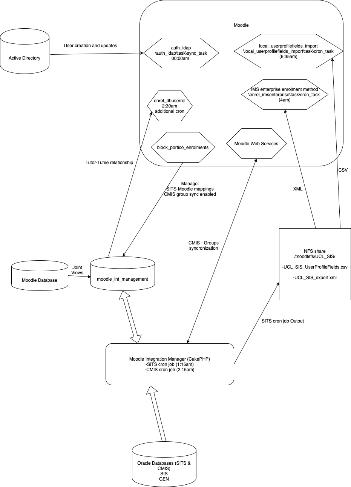
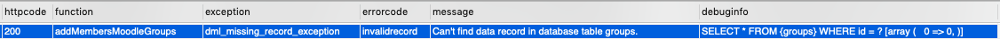

# Moodle Integration Manager (MIM) - SITS/CMIS integration

-   [Initial Design of the solution:](#MoodleIntegrationManager(MIM)SITS/CMISintegration-InitialDesignofthesolution:)
    -   [Impact assessment from changes](#MoodleIntegrationManager(MIM)SITS/CMISintegration-Impactassessmentfromchanges)
-   [Codebase](#MoodleIntegrationManager(MIM)SITS/CMISintegration-Codebase)
    -   [Old Ops team Documentation](#MoodleIntegrationManager(MIM)SITS/CMISintegration-OldOpsteamDocumentation)
-   [Data Integration key points](#MoodleIntegrationManager(MIM)SITS/CMISintegration-DataIntegrationkeypoints)
    -   [User Profile Fields - data sources](#MoodleIntegrationManager(MIM)SITS/CMISintegration-UserProfileFields-datasources)
-   [Cross-Database Access:](#MoodleIntegrationManager(MIM)SITS/CMISintegration-Cross-DatabaseAccess:)
-   [Academic Year Rollover](#MoodleIntegrationManager(MIM)SITS/CMISintegration-AcademicYearRollover)
-   [SITS Views](#MoodleIntegrationManager(MIM)SITS/CMISintegration-SITSViews)
-   [Purging bad state data from the CMIS Groups sync](#MoodleIntegrationManager(MIM)SITS/CMISintegration-PurgingbadstatedatafromtheCMISGroupssync)
    -   [Running IMS from cli](#MoodleIntegrationManager(MIM)SITS/CMISintegration-RunningIMSfromcli)
-   [Moodle Integration Manager (MIM) Override Filter settings and Details](#MoodleIntegrationManager(MIM)SITS/CMISintegration-MoodleIntegrationManager(MIM)OverrideFiltersettingsandDetails)
    -   [Overview](#MoodleIntegrationManager(MIM)SITS/CMISintegration-Overview)
    -   [Policy Statement for Override Filter Settings](#MoodleIntegrationManager(MIM)SITS/CMISintegration-PolicyStatementforOverrideFilterSettings)
        -   [How the MIM Override Trigger works](#MoodleIntegrationManager(MIM)SITS/CMISintegration-HowtheMIMOverrideTriggerworks)
        -   [Notification](#MoodleIntegrationManager(MIM)SITS/CMISintegration-Notification)
        -   [Override Trigger set to TRUE](#MoodleIntegrationManager(MIM)SITS/CMISintegration-OverrideTriggersettoTRUE)
        -   [Override Trigger set to FALSE](#MoodleIntegrationManager(MIM)SITS/CMISintegration-OverrideTriggersettoFALSE)

# Initial Design of the solution:

LLD - <https://liveuclac.sharepoint.com/:w:/r/sites/ISD.ITCPD/EducationProjects/MoodleReview/Project%20Documents/Technical/LLD_SITS_CMIS_Filter.docx?d=w5bd5c857f527476095b976ee0e7271d0&csf=1&web=1&e=zFWUDY>

CMIS integration - <https://liveuclac.sharepoint.com/:w:/r/sites/ISD.ITCPD/EducationProjects/MoodleReview/Project%20Documents/Technical/CMIS-Moodle%20Integration%20Design.doc?d=wcbe7bddb8b8144aa973d90884fd55ba2&csf=1&web=1&e=ehckuk>

Generally Moodle Improvement Project (MIP) documentation is here - [https://liveuclac.sharepoint.com/sites/ISD.ITCPD/EducationProjects/MoodleReview/Project%20Documents/Forms/AllItems.aspx?viewpath=%2Fsites%2FISD.ITCPD%2FEducationProjects%2FMoodleReview%2FProject%20Documents%2FForms%2FAllItems.aspx](https://liveuclac.sharepoint.com/sites/ISD.ITCPD/EducationProjects/MoodleReview/Project%20Documents/Forms/AllItems.aspx?viewpath=/sites/ISD.ITCPD/EducationProjects/MoodleReview/Project%20Documents/Forms/AllItems.aspx)

All the SISMGR@SIS views for new Moodle are prefixed with UCL\_BDO\_V\_MOODLE since September 2018 AMP/MIM projects.

Known limitations - M06a1 - Behaviour of CMIS group imports to Moodle

I don't like this, as I think it's not clear which bits of data comes through which route but may be useful as a starting place -[ Moodle Component Diagram v1.2.pdf](attachments/137139012/137139010.pdf)

Good detailed overview of the CMIS piece - Moodle Improvement Project (CMIS Integration Tool Document)\_2.0.docx

I had these quick thoughts on the diagram, which I don't think were reflected in an updated version of the document:

- 1.3.1 RestConfig call also includes app/Config/config\_settings.php which sets which environment to make the API call to.

-1.3.2 which database tables is this writing to?

-1.3.3 assume it refers back to the db tables written in 1.3.2  or is it looking at some views which join on moodle\_live database? (If you can’t tell from the code I can look at the database)

-1.3.4 only need 3 servers to be mentioned 'moodle-int-dev', 'moodle-pp' and 'moodle'

## Impact assessment from changes

[MIP - AMP Student Registration Impact - AN - 190705.docx](attachments/137139012/137139009.docx)

September 2019, design flaws preventing rollovers -[ MIM - Option A.odt](attachments/137139012/137139019.odt)

# Codebase

-   MIM (CakePHP) - <https://git.automation.ucl.ac.uk/moodle/moodle_integration_manager> - I believe this still has at least one secret in version control so access is restricted to Ops team.

Moodle Plugins

-   Portico enrolments block - <https://git.automation.ucl.ac.uk/moodle/moodle-block_portico_enrolments>
-   Additional User Profile Fields import -[ https://git.automation.ucl.ac.uk/moodle/moodle-local\_userprofilefields\_import](https://git.automation.ucl.ac.uk/moodle/moodle-local_userprofilefields_import)
-   Moodle Database User Relationship Role assignment - <https://github.com/uclmoodle/moodle-enrol_dbuserrel/>
-   MyFeedback - <https://github.com/uclmoodle/moodle-report_myfeedback>

## Old Ops team Documentation

[SITS filter](SITS_filter)

[CMIS - Moodle Integration](CMIS_-_Moodle_Integration)

# Data Integration key points

-   MIM copies data from SITS (SIS) and CMIS (GEN) Oracle databases into the moodle\_int\_management MySQL database colocated with the moodle\_live database.
-   Database views and triggers correlating past/present MIM/Moodle statuses are used by MIM to decide what needs to change
-   MIM (SITS job) spits out a XML file with all the enrolments (in IMS format) this is then picked up by Moodle's out of the box "IMS Enterprise" enrolment plugin nightly at 1:15am - this can be monitored here - [https://moodle.ucl.ac.uk/admin/tasklogs.php?filter=enrol\_imsenterprise\\task\\cron\_task](https://moodle.ucl.ac.uk/admin/tasklogs.php?filter=enrol_imsenterprise\task\cron_task)
-   MIM (SITS job) spits out a CSV with additional fields to enrich student user profiles, this is then ingested by the "local\_userprofilefields\_import" UCL developed plugin
-   MIM (CMIS Job) uses Moodle's web services API to check status and add/remove groups/groupings/group members into Moodle
-   CMIS group sync functionality is only activated on a course if the relevant tick box is selected in the "Portico Enrolments" block (UCL developed) for that particular course
-   Mapping of a Moodle course to a SITS module/course/programme is done via the "Portico Enrolments" block in the relevant Moodle course
-   Enrolment Suspend status feature pending inclusion in core Moodle. Until then, a few weeks after start of term all mappings are de-activated to keep enrolments exactly as is (to avoid data loss, and unexpected unenrolments)
-   UPI comes in via LDAP sync (core Moodle, ldap auth plugin) for all users, relied upon for tutor/tutee relationship for MyFeedback - sits\_v\_personaltutorrole is relied upon by [enrol\_dbuserrel](https://github.com/uclmoodle/moodle-enrol_dbuserrel/) to assign those relationships



## User Profile Fields - data sources

User Account creation: \\auth\_ldap\\task\\sync\_task

<table>
<thead>
<tr class="header">
<th>Field</th>
<th>Source</th>
<th>Relied upon by</th>
</tr>
</thead>
<tbody>
<tr class="odd">
<td>First Name</td>
<td>\auth_ldap\task\sync_task</td>
<td><br />
</td>
</tr>
<tr class="even">
<td>Surname / Last Name</td>
<td>\auth_ldap\task\sync_task</td>
<td><br />
</td>
</tr>
<tr class="odd">
<td>Email Address</td>
<td>\auth_ldap\task\sync_task</td>
<td><br />
</td>
</tr>
<tr class="even">
<td>UPI</td>
<td>\auth_ldap\task\sync_task</td>
<td>enrol_dbuserrel</td>
</tr>
<tr class="odd">
<td>Portico Student Number</td>
<td>\local_userprofilefields_import\task\cron_task</td>
<td><br />
</td>
</tr>
<tr class="even">
<td>Programme of Study</td>
<td>\local_userprofilefields_import\task\cron_task</td>
<td><br />
</td>
</tr>
<tr class="odd">
<td>Programme Code</td>
<td>\local_userprofilefields_import\task\cron_task</td>
<td><br />
</td>
</tr>
<tr class="even">
<td>Undergraduate / Postgraduate</td>
<td>\local_userprofilefields_import\task\cron_task</td>
<td>theme_adaptable</td>
</tr>
<tr class="odd">
<td>Approved Modules</td>
<td>\local_userprofilefields_import\task\cron_task</td>
<td><br />
</td>
</tr>
<tr class="even">
<td>Pre-Approval Modules</td>
<td>\local_userprofilefields_import\task\cron_task</td>
<td><br />
</td>
</tr>
<tr class="odd">
<td>Year level</td>
<td>\local_userprofilefields_import\task\cron_task</td>
<td><br />
</td>
</tr>
</tbody>
</table>

# Cross-Database Access:

**moodleuser needs access to:**

moodle\_int\_management.sits\_moduleoccurence (SELECT)

moodle\_int\_management.sits\_v\_mappings (SELECT)

moodle\_int\_management.sits\_v\_sitsdata (SELECT)

moodle\_int\_management.sits\_moduleoccurence\_mapping (SELECT, INSERT, UPDATE, DELETE)

moodle\_int\_management.sits\_mapping\_statuses (SELECT, INSERT, UPDATE, DELETE)

moodle\_int\_management.sits\_faculties\_mapping (SELECT, INSERT, UPDATE, DELETE)

moodle\_int\_management.sits\_programmes\_mapping (SELECT, INSERT, UPDATE, DELETE)

moodle\_int\_management.sits\_routes\_mapping (SELECT, INSERT, UPDATE, DELETE)

moodle\_int\_management.sits\_departments\_mapping (SELECT, INSERT, UPDATE, DELETE)

moodle\_int\_management.sits\_v\_personaltutorrole (SELECT)

**MIM Views user requires SELECT / JOIN / LEFT JOIN access to:**

-   moodle\_live.mdl\_course
-   moodle\_live.mdl\_course\_categories
-   moodle\_live.mdl\_user
-   moodle\_live.mdl\_user\_info\_data
-   moodle\_live.mdl\_user\_info\_field

because of views:

-   moodle\_int\_management.sits\_v\_enrolcourses
-   moodle\_int\_management.sits\_v\_enrolmemberships
-   moodle\_int\_management.sits\_v\_enrolstudents
-   moodle\_int\_management.sits\_v\_personaltutorrole

**MIM user requires SELECT  access to:**

-   moodle\_live.mdl\_groups
-   moodle\_live.mdl\_groups\_members
-   moodle\_live.mdl\_groupings
-   moodle\_live.mdl\_groupings\_group

([WR366884](https://wrms.catalyst.net.nz/wr.php?request_id=366884) & [WR367021](https://wrms.catalyst.net.nz/wr.php?request_id=367021) - for the CMIS Groups sync when re-implemented in 2021)

# Academic Year Rollover

1) Complete a [Global De-activation of SITS and CMIS mappings](https://wiki.ucl.ac.uk/display/ISMoodle/SQL+Queries+of+Moodle#SQLQueriesofMoodle-DeactivatePorticomappings)

2) Update Portico Block to show the new Academic Year's module occurrences 

<https://moodle.ucl.ac.uk/admin/settings.php?section=blocksettingportico_enrolments> → update 'academicyear' to the new academic year start e.g. 2023

3) Update moodle\_int\_management.system\_settings 

a) Set min\_mod\_occ\_year to the year the academic year starts in e.g 2023

b) Set threshold\_override = true. (users and membership dropping down to 0 is expected)

4) Confirm with Tom Richey that SIW\_MRG\_AYR has been set to the new academic year - check ahead with him what date this is scheduled to happen. (This is needed for view ucl\_bdo\_v\_moodle\_module\_inst which only returns module instances for the current academic year - if this hasn't change the Portico enrolment block will display the  new year's (e.g. 2023)module occurrences and allow mappings to be saved but once saved will not be listed as mappings) - (Portico Teams docs - [Rolling Academic Year Over - 2023](https://wiki.ucl.ac.uk/display/RASPorticoServ/Rolling+Academic+Year+Over+-+2023))

5) Run SITS Job manually - e.g. cd /data/moodle\_int\_management/MIM/app && Console/cake RunSits runCronJob

6) Validate XML and CSV outputs (should essentially be empty, at least no mass un-enrolment should be occurring)

7) Test adding and removing a module occurrence mapping for the new academic year via the portico block

8) Release by making Portico Enrolments block visible and re-enabling cron for MIM's SITS & CMIS jobs.

# SITS Views

All the SISMGR@SIS views for new Moodle are now prefixed with UCL\_BDO\_V\_MOODLE

ucl\_bdo\_v\_moodle\_assignment

ucl\_bdo\_v\_moodle\_department

ucl\_bdo\_v\_moodle\_faculties

ucl\_bdo\_v\_moodle\_module\_inst

ucl\_bdo\_v\_moodle\_module\_struc

ucl\_bdo\_v\_moodle\_programme

ucl\_bdo\_v\_moodle\_route

ucl\_bdo\_v\_moodle\_student

ucl\_bdo\_v\_moodle\_student\_enrl

# Purging bad state data from the CMIS Groups sync

Multiple things went wrong for start of AY 2020 with this part of the integration but essentially we ended up with bad data stored in the MIM db that needed clearing out
1) adding students to groups was still being done in batches of 500, not 1 by 1 - [Fixed that](https://git.automation.ucl.ac.uk/moodle/moodle_integration_manager/-/commit/28adb1123e0302974a154f23732d36a95297071b). (This meant if 1 failed all 500 in that batch failed to be assigned to their relevant group)
2) web service calls have been hitting throttling (AWS/cloud migration) and then errors but MIM thought it was still a success, when it wasn’t
3) because of 2, a lot of the groups created by MIM were recorded as having an id of 0
4)it then tried to assign students to group 0 which fails but because of 1), this didn’t only affect the courses/groups with the error but all of them
5)Moodle web services returns errors with an HTTP status code of 200(all ok), this should be returning 40x codes which would be caught by the cakephp error handling. This is why 2) thought it was a success.

This is logged as <https://tracker.moodle.org/browse/MDL-67176> & there is a better implementation by Matt here we should consider - <https://moodle.org/plugins/webservice_restful>

The main approach to clearing this out of the system, once the above was understood as the root cause was to:

I) clear out the state MIM thinks the students are in for groups which don’t exist

``` java
DELETE FROM moodle_int_management.cmis_group_member WHERE moodlegroupid =0;
```

II) Clear out the state MIM thinks the groups which have (not) been created are in

``` java
DELETE FROM moodle_int_management.cmis_module_group_course where moodlegroupid=0;
```

III) Run CMIS group sync a couple of times until it's not adding anymore group members

Additional failure handling needs to be added to the CMIS Groups sync to handle this, in particular:

a) batching as 1 by 1 of deleteMembersMoodleGroups and deleteMoodleGroupings web service calls

b) capture Moodle web service errors in CakePHP or switch to restful option or help updated core implementation effort (This is logged as <https://tracker.moodle.org/browse/MDL-67176> & there is a better implementation by Matt here we should consider - <https://moodle.org/plugins/webservice_restful>)



## Running IMS from cli

php admin/cli/scheduled\_task.php --execute='\\enrol\_imsenterprise\\task\\cron\_task'

# Moodle Integration Manager (MIM) Override Filter settings and Details 

## Overview 

MIM contains an alarm and fail-safe mechanism designed to prevent a bad student enrolment dataset being applied to Moodle from the upstream student record system (Portico/SITS). 

The fail-safe mechanism is implemented as thresholds, and its settings are managed as fields in the MIM system\_settings database table.  

The system settings available in the MIM database for managing threshold fail-safe behaviour are: 

|                            |                                                                                                                                                                                                                                                                                                      |
|----------------------------|------------------------------------------------------------------------------------------------------------------------------------------------------------------------------------------------------------------------------------------------------------------------------------------------------|
| threshold\_percent         | The percentage point (as a whole number), e.g. 75, that represents the proportion of students/memberships data which must remain after a dataset is imported from SITS/portico into MIM to avoid the fail-safe alarm being triggered.                                                                |
| threshold\_override        | A true/false flag that can be set to allow an import to MIM to proceed despite the threshold alarm being triggered. If set to true the MIM will ignore the threshold percent breach and import the students anyway as a one-off. This flag is reset to False after the first override is permitted.  
                                                                                                                                                                                                                                                                                                        
  This particular setting is referred to as the “**Threshold Override**” in this document.                                                                                                                                                                                                              |
| threshold\_send\_email     | True/false value indicating whether MIM sends emails to notify administrators of threshold events.                                                                                                                                                                                                   |
| threshold\_email\_subject  | Subject applied to threshold email messages sent by MIM.                                                                                                                                                                                                                                             |
| threshold\_email\_message  | Content of threshold email messages sent by MIM.                                                                                                                                                                                                                                                     |
| threshold\_email           | Email address to which threshold email messages will be sent to by MIM.                                                                                                                                                                                                                              |

POLICY STATEMENT

## Policy Statement for Override Filter Settings 

The MIM SITS data Threshold override setting must always be set to FALSE unless a specific requirement to run with the TRUE setting has been agreed by the Service Operations Manager and the Service Owner. 

 

### How the MIM Override Trigger works 

MIM acts as an intermediary in the transport of data from SITS/Portico to Moodle. At the time of this writing the automated process that imports data from SITS/Portico into Moodle is run once every 24 hours by a cron process. 

The process of evaluating whether the threshold conditions have been breached is relative, and involves comparing the change in the number of “active” student and membership records that will be sent to Moodle as a result in processing the newly available dataset from SITS/Portico. 

Threshold checks are performed before any data is processed, so if the check indicates a breach, and when the override value is false, no new data will be processed and sent to Moodle. 

However, if the check indicates a breach, and when the override value is true, the newly available data will be processed and sent to Moodle. 

The policy statement has been formed to minimise the risk of data corruption in Moodle, and is particularly informed by the awareness of the relative nature of threshold evaluation. 

  

### Notification 

MIM has configurable settings allowing interested parties to be notified of significant threshold events. These settings should be configured to alert the LAMA team (during both True and False threshold occurrences). 

 

### Override Trigger set to TRUE 

Setting the threshold override to True means that even when the latest dataset from Portico/SITS will cause a percentage drop in the number of active records to exceed the specified threshold value, the import will be allowed to run and send data to production Moodle. At this point the Override trigger will switch to false. 

 

### Override Trigger set to FALSE 

Setting the threshold override to FALSE stops the MIM data import process when the latest dataset from Portico/SITS will cause a percentage drop in the number of active records to exceed the specified threshold value. An email will be sent to the configured address (usually the LAMA team informing them that the Override has occurred). 

 

**Key Note** 

THE MIM Override Trigger always compares its current data export with the last successful run. 

## Attachments:

 [MIP - AMP Student Registration Impact - AN - 190705.docx](attachments/137139012/137139009.docx) (application/vnd.openxmlformats-officedocument.wordprocessingml.document)
 [Moodle Component Diagram v1.2.pdf](attachments/137139012/137139010.pdf) (application/pdf)
 [Moodle Improvement Project (CMIS Integration Tool Document)\_2.0.docx](attachments/137139012/137139011.docx) (application/vnd.openxmlformats-officedocument.wordprocessingml.document)
 [MIM - Option A.odt](attachments/137139012/137139019.odt) (application/vnd.oasis.opendocument.text)
 [Moodle Data Integrations.png](attachments/137139012/137143742.png) (image/png)
 [Moodle Data Integrations.png](attachments/137139012/137143823.png) (image/png)
 [Moodle Data Integrations.png](attachments/137139012/137143716.png) (image/png)
 [Screenshot 2020-10-14 at 22.19.00.png](attachments/137139012/147958556.png) (image/png)

