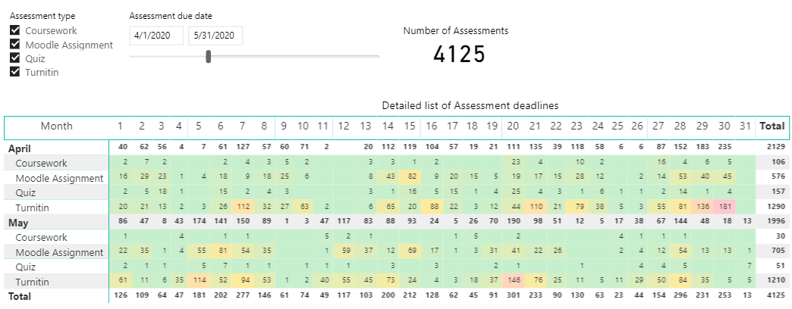

# Moodle Management Information Dashboard MVP

The first dashboard is set on basic count and date in an easy visible calendar based view as standard (eg Kings – example below) but being able to specify date ranges and drill down to subset data around:

-   Moodle Assignments
-   Turnitin Assignments
-   Moodle Quiz's

**Definition of done;** the dashboard is available in Power BI for data visualisation. Data needs to be refreshed at least daily.

Further development will create the Echo360 reporting into a similar dashboard  and use Tableau to provide a front end into that data.

### Jira and reporting

The breakdown of the work and stories are available at [Moodle MI Dashboard - Scrum](https://ucldata.atlassian.net/secure/RapidBoard.jspa?rapidView=206)

### Team Ways of working

The team is going to[publish regular updates](https://wiki.ucl.ac.uk/display/IBI/Moodle+Management+Information+Dashboard+MVP) on the next increments, demos week and the team agreement on sprint events and review. 

## Attachments:

 [moodle dashboard.png](attachments/137137155/137137211.png) (image/png)

