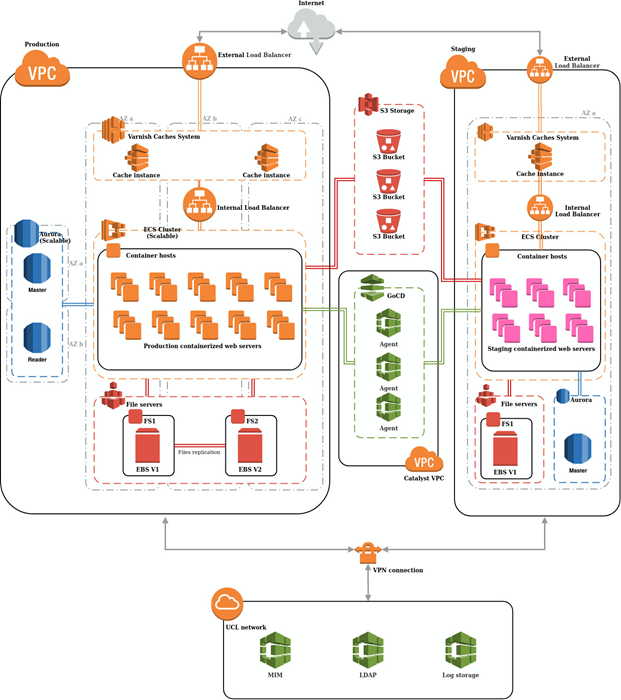

# Moodle Resilience

The aim of the following document is to identify and describe the Moodle components falling under UCL ISD responsibility when it is migrated to the cloud. The likelyhood of each individual component failing is also going to be discussed.

Below is the expected system architecture diagram for Moodle in the cloud provided by Catalyst.

Based on the above diagram the following components have been identified to fully or partly be within UCL ISD control.

## VPN to AWS

### Purpose for Moodle

It connects on-prem components within UCL data centre to the cloud (Amazon Web Services).

### Impact of Failure on Moodle

If this component fails Moodle will fail as well.

### Performance concerns

This is a new service. 

Update: 18 August 2020: Dead Peer Detection(DPD) was triggered, the on-prem component did not respond within the required time (30 sec) the connection from AWS ( Catalyst ) was dropped. This has resulted in no connection to on-prem AD and Moodle becoming un-available (can't login but site still up and working for those logged in) for a short period of time. Root cause analysis continuing at time of updating this document (3 Sept 2020)

### Service availability (last 12 months)

New service.

### **Support **

Internally Yes - ISD Networks, although this is not formally defined in any service catalogue.

3rd Party Yes - Catalyst is responsible to for the AWS connection component

### Version

Site to Site VPN Version ???

AWS side - updated automatically???

UCL side - ???

### High availability design

It is designed with high availability in mind. There are 2x VPNs each for both Moodle staging and production.

### Critical Incidents (last 6 months)

New service.

## LDAP (AD)

### Purpose for Moodle 

LDAP (AD) is used for Moodle authentication. It is highly depended on the VPN to AWS component.

### Impact of Failure on Moodle

If LDAP fails Moodle will fail as well. User will not be able to authenticate.

### Performance concerns

No performance concerns at present. The service has been relatively resilient. Need to plan transition to Shibboleth for Single-Sign-on

### Service availability (past 12 months)

100%. Last outage in May 2019

### **Supported**

It is supported by ISD Identity and WIS Teams.

### Version

LDAP AD version 3 (latest). 

### High availability design

Yes,  

VIPs are setup on the F5 GTM and LTMs to balance traffic. The load balanced configuration handles traffic routing in the event of a server or data centre failure, no manual fail-over is required.

### Critical Incidents (last 6 months)

No

## DNS internal (Bind)

### Purpose for Moodle

Performs address lookup for Moodle AWS components to locate servers and services (MIM, LDAP) hosted within UCL's datacentres.

### Impact of Failure on Moodle

Authentication and authorisation would fail as there would be issues accessing the LDAP service (see LDAP)

### Performance concerns

No performance concerns, BIND is used by all RHEL machines hosted in UCL's datacentres and all internal/campus/external DNS queries and is sized accordingly.

However is not able to handle a misbehaving service and 

### Service availability (last 12 months)

### ???

### Supported

Internally supported by PI team

### Version

BIND9 (latest major version) is in use and is kept up to date with security patches.

### High availability design

BIND servers are load balanced behind F5 VIPs. VMs in TP datacentre have Slough BIND VIP assigned as secondary and vice-versa.

### Critical Incidents (last 6 months)

Reverse DNS issues - 10th until 27th July 2020 → BIND overloaded by queries from CDRC, no active monitoring picked this up, no inclination to cut them off to stop the impact on other services. Needs better sizing/resilience to handle this.

## DNS external

### Purpose for Moodle

Moodle access relies on the public DNS address [moodle.ucl.ac.uk](http://moodle.ucl.ac.uk) for users to access the service.

### Impact of Failure on Moodle

Were clients unable to resolve [moodle.ucl.ac.uk](http://moodle.ucl.ac.uk), no one would be able to access the service.

### Performance concerns

Since the DNS name is registered in public DNS, a global service, there are no performance concerns.

### Service availability (last 12 months)

Public DNS services have high availability, however there are occasionally outages with specific providers. If there is an outage with a public DNS provider this manifests as an internet outage for the users of that provider. This is largely out of UCL's control.

### Supported

Not supported by ISD. Global internet service.

### Version

N/A

### High availability design

Global DNS is designed to be highly available, with a tiered system of resolvers and multiple providers.

### Critical Incidents (last 6 months)

N/A

## UCL Data centre network

### Purpose for Moodle 

Directs traffic between Moodle AWS components and servers and services (MIM, LDAP) hosted within UCL's datacentres.

### Impact of Failure on Moodle

Authentication and authorisation would fail as there would be issues accessing the LDAP service (see LDAP)

### Performance concerns

UCL's datacentre network is designed and sized to support the traffic required by UCL's datacentres.

### Service availability (last 12 months)

### Supported

Supported internally by the Networks Team.

### Version

Most equipment is in support. There are project proposals to keep the infrastructure up to date but there is no current project.

### High availability design

UCL's datacentre network is designed to be highly available and resistant to equipment failure. The network is designed in a sine and leaf topology.

### Critical Incidents (last 6 months)

There have been two Cis for the Datacentre Network in the past 6 months:

         CI032 - Slough Storage Array failure

CI039 - TP DC Cooling Failure. Root cause - Failure of cooling systems within the datacentre.

CI041 - TP1 Power Loss. Root cause - Faulty generator component causing switchover from mains power.

In both cases the root cause of the CI lay with the datacentre supporting services

## MIM (Moodle Integration Manager)

### Purpose for Moodle 

MIM provides integration between Moodle and SITS and Moodle and CMIS. The information it gets from SITS and CMIS is needed for Moodle user authorisation.

### Impact of Failure on Moodle

If MIM fails Moodle will be operational but new users will not be able to login, It is especially critical at busy periods with high number of new users or high number of user updates e.g. start of term.

### Performance concerns

SITS component not designed with change of academic year in mind (problem in Sept 2019).

If un-enrol command comes from MIM all Moodle students progression will be wiped out.  Mitigation: currently working on suspend status which is approaching release (updated Aug 2020).

### Service availability (last 12 months)

Not properly recorded but Learning apps team advised the following: 

SITS component - 99.99%

CMIS component - 99.99% since Jan 2020

### **Supported**

Supported by ISD Learning Apps team (on-prem component)

Supported by Catalyst (cloud component)

### Version

Internally developed with Cake PHP. 

Cake PHP version 2.10 but working toward upgrade to 4.0 (latest as of July 2020)

PHP 7.1. Once Cake PHP is upgraded to 4.0, PHP can go up to 7.4

### High availability design

Yes, Two admin servers available located on-prem. 

### Critical Incidents (last 6 months)

No

## SIEM - LogRhythm

### Purpose for Moodle 

UCL's SIEM platform collects logs from running services to analyse behaviours and identify security incidents.

### Impact of Failure on Moodle

Moodle would continue to function but ISG would lose visibility of Moodle from a security perspective which is a risk to UCL.

### Performance concerns

The current SIEM solution is likely to exceed capacity within 12 months

### Service availability (last 12 months)

???

### **Supported**

Supported by ISG

Logs shipped to SIEM from Moodle by Catalyst

### Version

???

### High availability design

Y

### Critical Incidents (last 6 months)

No

## Summary table:

<table>
<thead>
<tr class="header">
<th>Component</th>
<th>Impact on Moodle</th>
<th>Concerns</th>
<th> 
</th>
</tr>
</thead>
<tbody>
<tr class="odd">
<td>VPN to AWS</td>
<td>Moodle fails</td>
<td>
Recent timeout issue.

ISD should incorporate Public Cloud VPNs into the network team portfolio.
</td>
<td> 
</td>
</tr>
<tr class="even">
<td>LDAP (AD)</td>
<td>Moodle fails</td>
<td>
No concerns.

Need to plan transition to Shibboleth for Single-Sign-on once once AD backend is place.
</td>
<td> 
</td>
</tr>
<tr class="odd">
<td>DNS (internal) Bind</td>
<td>Moodle fails</td>
<td>
No concerns. BIND service is designed to be resilient.
</td>
<td> 
</td>
</tr>
<tr class="even">
<td>DNS External</td>
<td>Moodle fails</td>
<td>No concerns. Any failure of external DNS is beyond UCL's control and would be limited to a subset of users.</td>
<td> 
</td>
</tr>
<tr class="odd">
<td>UCL Datacentre Network</td>
<td>Moodle fails</td>
<td>
No concerns in design of datacentre network.

UCL should work to ensure that all network hardware in the datacentre is still supported by the manufacturer.
</td>
<td> 
</td>
</tr>
<tr class="even">
<td>MIM</td>
<td>
Moodle operational

with limitation
</td>
<td>
SITS component not designed with change of academic year in mind

Any data add and/or remove in SITS/CMIS

If un-enrol command comes from MIM all Moodle students progression will be wiped out.
</td>
<td> 
</td>
</tr>
<tr class="odd">
<td>SIEM</td>
<td>Moodle operational with limitation</td>
<td> 
</td>
<td> 
</td>
</tr>
</tbody>
</table>

## Attachments:

 [image2020-8-6\_8-29-25.png](attachments/142215618/142215623.png) (image/png)

