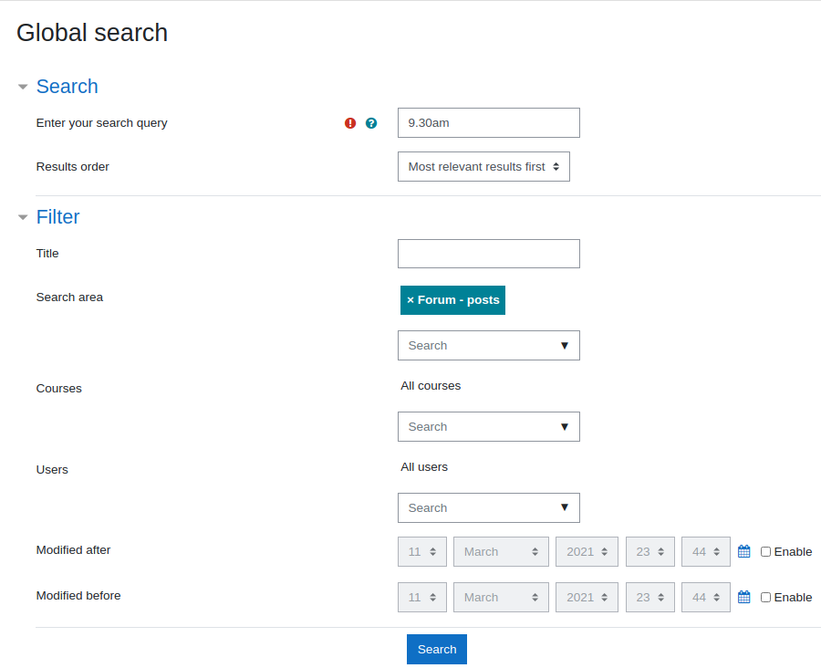

# Moodle Search Testing

## **Syntax Explanation**

#### **Wildcard characters**

Wildcard characters - single and multiple character wildcard searches within single terms (not within phrase queries). - To perform a single character wildcard search use the ""?"" symbol. - To perform a multiple character wildcard search use the asterisk \* symbol. 

i.e. mood\* m??dle

#### Boolean operators

Operators allow terms to be combined through logic operators. -The OR operator is the default conjunction operator. This means that if there is no Boolean operator between two terms, the OR operator is used. The OR operator links two terms and finds a matching document if either of the terms exist in a document -The AND operator matches documents where both terms exist anywhere in the text of a single document -The NOT operator excludes documents that contain the term after NOT. "

i.e.

+moodle +snapshot +2019

+moodle +snapshot -2019

#### Exact Match

To find the exact text only using " "

i.e "There was an error with uploading files"

#### Fuzzy

Searches based on the Levenshtein Distance, or Edit Distance algorithm. To do a fuzzy search use the tilde ~ to find similar words

i.e. mood~ will show good, food, zoom e.c.t.

#### Proximity

finding words are a within a specific numbers of words away from each other. To do a proximity search use the tilde, ""~"", symbol at the end of a Phrase.

i.e. moodle 2019~5

## **Test Form Sections**

#### Simple Keyword Searches

#### **Advanced Search Options - Searching inside activities**

#### **Advanced Search Options 2 - Multiple Keywords**

#### **Advanced Search Options 3 - Boolean operators ('AND +', 'NOT -')**

#### **Advanced Search Options 4 - Searching by file extension**

#### **Advanced Search Options 5 - Proximity Searches**

## Attachments:

 [Screenshot from 2021-03-03 19-58-22.png](attachments/163649307/163650067.png) (image/png)
 [Screenshot from 2021-03-03 20-10-01.png](attachments/163649307/163650070.png) (image/png)
 [Screenshot from 2021-03-03 20-09-39.png](attachments/163649307/163650071.png) (image/png)
 [Screenshot from 2021-03-03 20-20-21.png](attachments/163649307/163650074.png) (image/png)
 [Screenshot from 2021-03-03 20-19-55.png](attachments/163649307/163650075.png) (image/png)
 [Screenshot from 2021-03-03 20-19-02.png](attachments/163649307/163650076.png) (image/png)
 [Screenshot from 2021-03-03 20-18-36.png](attachments/163649307/163650077.png) (image/png)
 [Screenshot from 2021-03-11 19-13-54.png](attachments/163649307/163653750.png) (image/png)
 [Screenshot from 2021-03-11 19-25-04.png](attachments/163649307/163653754.png) (image/png)
 [Screenshot from 2021-03-11 19-26-11.png](attachments/163649307/163653755.png) (image/png)
 [Screenshot from 2021-03-11 19-26-11.png](attachments/163649307/163653756.png) (image/png)
 [Screenshot from 2021-03-11 19-25-04.png](attachments/163649307/163653757.png) (image/png)
 [Screenshot from 2021-03-11 19-53-33.png](attachments/163649307/163653786.png) (image/png)
 [Screenshot from 2021-03-11 23-33-06.png](attachments/163649307/163653799.png) (image/png)
 [Screenshot from 2021-03-11 23-32-51.png](attachments/163649307/163653800.png) (image/png)
 [Screenshot from 2021-03-11 23-44-30.png](attachments/163649307/163653809.png) (image/png)
 [Screenshot from 2021-03-12 00-19-43.png](attachments/163649307/163653817.png) (image/png)
 [Screenshot from 2021-03-12 00-25-28.png](attachments/163649307/163653822.png) (image/png)
 [Screenshot from 2021-03-12 00-24-56.png](attachments/163649307/163653823.png) (image/png)

