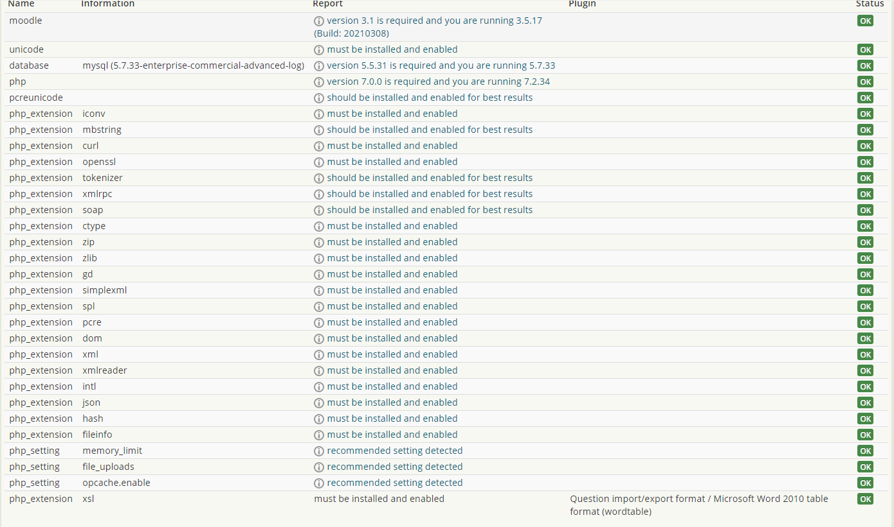

# Moodle Snapshot Tests with MySQL 5.7.33

Mysdb02t has been upgraded to MySQL 5.7.33

Moodle snapshot build 3.5.17 has been pointed to moodle\_archive\_1819 db on Mysdb02t

-   Check Moodle Environment

 

-   php check\_database\_schema.php

**** Expand source

``` bash
++ STATEMENTS section is not supported any more, please use db/install.php or db/log.php ++
* line 147 of /lib/xmldb/xmldb_file.php: call to debugging()
* line 915 of /lib/ddl/database_manager.php: call to xmldb_file->loadXMLStructure()
* line 60 of /admin/cli/check_database_schema.php: call to database_manager->get_install_xml_schema()
++ STATEMENTS section is not supported any more, please use db/install.php or db/log.php ++
* line 147 of /lib/xmldb/xmldb_file.php: call to debugging()
* line 915 of /lib/ddl/database_manager.php: call to xmldb_file->loadXMLStructure()
* line 60 of /admin/cli/check_database_schema.php: call to database_manager->get_install_xml_schema()
++ STATEMENTS section is not supported any more, please use db/install.php or db/log.php ++
* line 147 of /lib/xmldb/xmldb_file.php: call to debugging()
* line 915 of /lib/ddl/database_manager.php: call to xmldb_file->loadXMLStructure()
* line 60 of /admin/cli/check_database_schema.php: call to database_manager->get_install_xml_schema()
++ STATEMENTS section is not supported any more, please use db/install.php or db/log.php ++
* line 147 of /lib/xmldb/xmldb_file.php: call to debugging()
* line 915 of /lib/ddl/database_manager.php: call to xmldb_file->loadXMLStructure()
* line 60 of /admin/cli/check_database_schema.php: call to database_manager->get_install_xml_schema()
-------------------------------------------------------------------------------
question_gapfill
 * column 'fixedgapsize' has default '0', expected '1' (I)
-------------------------------------------------------------------------------
qtype_pmatch
 * column 'applydictionarycheck' should be NOT NULL (C)
-------------------------------------------------------------------------------
hvp
 * column 'completionpass' should be NOT NULL (I)
-------------------------------------------------------------------------------
questionnaire_question
 * column 'surveyid' should be NOT NULL (I)
 * column 'surveyid' has default 'NULL', expected '0' (I)
-------------------------------------------------------------------------------
questionnaire_response_rank
 * column 'rankvalue' has default 'NULL', expected '0' (I)
-------------------------------------------------------------------------------
questionnaire_fb_sections
 * column 'surveyid' should be NOT NULL (I)
 * column 'surveyid' has default 'NULL', expected '0' (I)
-------------------------------------------------------------------------------
questionnaire_feedback
 * column 'sectionid' should be NOT NULL (I)
 * column 'sectionid' has default 'NULL', expected '0' (I)
-------------------------------------------------------------------------------
auth_oauth2_linked_login
 * table is missing
-------------------------------------------------------------------------------
block_quickmail_signatures
 * column 'user_id' has default '0', expected 'NULL' (I)
 * column 'usermodified' has default '0', expected 'NULL' (I)
 * column 'timecreated' has default '0', expected 'NULL' (I)
 * column 'timemodified' has default '0', expected 'NULL' (I)
 * column 'timedeleted' has default '0', expected 'NULL' (I)
-------------------------------------------------------------------------------
block_quickmail_messages
 * column 'sent_at' has default '0', expected 'NULL' (I)
 * column 'to_send_at' has default '0', expected 'NULL' (I)
 * column 'usermodified' has default '0', expected 'NULL' (I)
 * column 'timecreated' has default '0', expected 'NULL' (I)
 * column 'timemodified' has default '0', expected 'NULL' (I)
 * column 'timedeleted' should allow NULL (I)
 * column 'timedeleted' has default '0', expected 'NULL' (I)
-------------------------------------------------------------------------------
block_quickmail_msg_recips
 * column 'sent_at' has default '0', expected 'NULL' (I)
 * column 'usermodified' has default '0', expected 'NULL' (I)
 * column 'timecreated' has default '0', expected 'NULL' (I)
 * column 'timemodified' has default '0', expected 'NULL' (I)
-------------------------------------------------------------------------------
block_quickmail_draft_recips
 * column 'timecreated' has default '0', expected 'NULL' (I)
 * column 'timemodified' has default '0', expected 'NULL' (I)
-------------------------------------------------------------------------------
block_quickmail_msg_ad_email
 * column 'sent_at' has default '0', expected 'NULL' (I)
 * column 'usermodified' has default '0', expected 'NULL' (I)
 * column 'timecreated' has default '0', expected 'NULL' (I)
 * column 'timemodified' has default '0', expected 'NULL' (I)
-------------------------------------------------------------------------------
block_quickmail_msg_attach
 * column 'usermodified' has default '0', expected 'NULL' (I)
 * column 'timecreated' has default '0', expected 'NULL' (I)
 * column 'timemodified' has default '0', expected 'NULL' (I)
-------------------------------------------------------------------------------
block_quickmail_alt_emails
 * column 'firstname' length is 125, expected 100 (C)
 * column 'lastname' length is 125, expected 100 (C)
 * column 'usermodified' has default '0', expected 'NULL' (I)
 * column 'timecreated' has default '0', expected 'NULL' (I)
 * column 'timemodified' has default '0', expected 'NULL' (I)
 * column 'timedeleted' should allow NULL (I)
 * column 'timedeleted' has default '0', expected 'NULL' (I)
-------------------------------------------------------------------------------
block_quickmail_notifs
 * column 'subject' should be NOT NULL (X)
 * column 'body' should be NOT NULL (X)
 * column 'usermodified' has default '0', expected 'NULL' (I)
 * column 'timecreated' has default '0', expected 'NULL' (I)
 * column 'timemodified' has default '0', expected 'NULL' (I)
 * column 'timedeleted' should allow NULL (I)
 * column 'timedeleted' has default '0', expected 'NULL' (I)
-------------------------------------------------------------------------------
block_quickmail_event_notifs
 * column 'usermodified' has default '0', expected 'NULL' (I)
 * column 'timecreated' has default '0', expected 'NULL' (I)
 * column 'timemodified' has default '0', expected 'NULL' (I)
 * column 'timedeleted' should allow NULL (I)
 * column 'timedeleted' has default '0', expected 'NULL' (I)
-------------------------------------------------------------------------------
block_quickmail_schedules
 * column 'amount' has default '0', expected 'NULL' (I)
 * column 'usermodified' has default '0', expected 'NULL' (I)
 * column 'timecreated' has default '0', expected 'NULL' (I)
 * column 'timemodified' has default '0', expected 'NULL' (I)
 * column 'timedeleted' should allow NULL (I)
 * column 'timedeleted' has default '0', expected 'NULL' (I)
-------------------------------------------------------------------------------
block_quickmail_rem_notifs
 * column 'object_id' has default '0', expected 'NULL' (I)
 * column 'schedule_id' has default '0', expected 'NULL' (I)
 * column 'usermodified' has default '0', expected 'NULL' (I)
 * column 'timecreated' has default '0', expected 'NULL' (I)
 * column 'timemodified' has default '0', expected 'NULL' (I)
 * column 'timedeleted' should allow NULL (I)
 * column 'timedeleted' has default '0', expected 'NULL' (I)
-------------------------------------------------------------------------------
plagiarism_turnitin_users
 * column 'userid' should be NOT NULL (I)
-------------------------------------------------------------------------------
plagiarism_turnitin_courses
 * column 'courseid' should be NOT NULL (I)
-------------------------------------------------------------------------------
logstore_standard_log
 * table is missing
-------------------------------------------------------------------------------
tool_mergeusers
 * table is not expected
-------------------------------------------------------------------------------
ucl_migratecourse
 * table is not expected
-------------------------------------------------------------------------------
ucl_migratecourse_dst
 * table is not expected
-------------------------------------------------------------------------------
ucl_migratecourse_dst_tmp
 * table is not expected
-------------------------------------------------------------------------------
ucl_migratecourse_restorelog
 * table is not expected
```

-   php mysql\_compressed\_rows.php

php mysql\_compressed\_rows.php -l

**** Expand source

``` bash
mdl_certificate                 Compressed
mdl_data                        Compressed
mdl_data_fields                 Compressed
mdl_enrol_lti_lti2_consumer     Compressed
mdl_enrol_paypal                Compressed
mdl_hotpot                      Compressed
mdl_hotpot_cache                Compressed
mdl_hvp                         Compressed
mdl_hvp_libraries               Compressed
mdl_hvp_libraries_hub_cache     Compressed
mdl_lti                         Compressed
mdl_oauth2_issuer               Compressed
mdl_questionnaire_survey        Compressed
mdl_user                        Compressed
mdl_user_info_field             Compressed
```

-   php mysql\_collation.php -l

**** Expand source

``` bash
Table collations summary for https://snap3517.preview-moodle.ucl.ac.uk:
utf8mb4_unicode_ci: 2056
utf8_unicode_ci: 5
[cceanbo@ad.ucl.ac.uk@mdl-preview01u cli]$ php mysql_collation.php
MySQL collation conversions script.
```

## Attachments:

 [image2021-5-17\_10-9-5.png](attachments/167517867/167517838.png) (image/png)

