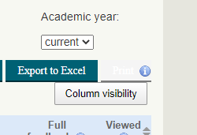

# Moodle Testing Strategy for 3.11

Following on from the success of the [Moodle Testing Strategy for 3.7](Moodle_Testing_Strategy_for_3.7) & [Moodle Testing Strategy for 3.9](Moodle_Testing_Strategy_for_3.9) we will continue to make the most of automated testing where these tests already exist and implement automated tests in UCL plugins which historically have not had any.This should increase our confidence in releasing regular updates to Moodle and reduce the amount of manual testing required. 

**A single pass of testing should be carried out for each of the below types of testing against the 3.11.0 build**. If errors are uncovered and resolved, only resolution needs to be tested. Theme may need a second pass of testing once all issues are closed if significant amounts of change.

3.11.0 [build](https://git.automation.ucl.ac.uk/moodle/moodle-1819/-/tree/PREVIEW_3114cf40eea27cdde2fa537) on <https://311.preview-moodle.ucl.ac.uk/> - upgrade notes:

-   Fatal error with auth\_basic / crawler tool but not actually used yet - <https://github.com/catalyst/moodle-auth_basic/issues/24> - DONE / submitted upstream
-   Fatal - <https://github.com/catalyst/moodle-auth_outage/issues/253> - DONE
-   Fatal - <https://ucldata.atlassian.net/browse/CTP-211> - DONE
-   Fatal - <https://ucldata.atlassian.net/browse/CTP-212> - DONE
-   Fatal - <https://ucldata.atlassian.net/browse/CTP-213> - DONE
-   Warning - <https://github.com/marcusgreen/moodle-qtype_gapfill/issues/72> - DONE
-   Warning - <https://github.com/paulholden/moodle-local_cohortrole/issues/9> - DONE
-   Must go to PHP 7.3 (had to downgrade preview to 7.2 for snapshots) - DONE
-   <https://ucldata.atlassian.net/browse/CTP-285> - many fixes submitted upstream
-   <https://github.com/moodle/moodle/blame/MOODLE_311_STABLE/lib/db/upgrade.php#L1952-L1989> - potentially problematiic

<table>
<thead>
<tr class="header">
<th>Testing Type</th>
<th>Coverage</th>
<th>Who</th>
<th>Results</th>
</tr>
</thead>
<tbody>
<tr class="odd">
<td><ul>
<li>PHPUnit</li>
</ul></td>
<td><ul>
<li>core Moodle</li>
<li>3rd party plugins</li>
</ul></td>
<td>
Alistair Spark
</td>
<td>

<pre><code>Errors: 166, Failures: 51, Warnings: 36, Risky: 1.
https://jenkins.automation.ucl.ac.uk/job/moodle/job/candidate-builds/job/moodle-1819/job/PREVIEW_311/26/execution/node/74/log/?consoleFull
This is A LOT more than usual. Some plugins looking dreadful.

Nov 2021 update - https://jenkins.automation.ucl.ac.uk/job/moodle/job/candidate-builds/job/moodle-1819/job/PREVEW_311_REBASE/10/testReport/ 

Final build for prod - https://jenkins.automation.ucl.ac.uk/job/moodle/job/candidate-builds/job/moodle-1819/job/MOODLE_311_STABLE/5/testReport/</code></pre>

</td>
</tr>
<tr class="even">
<td><ul>
<li>Behat</li>
</ul></td>
<td><ul>
<li>core Moodle</li>
<li>3rd party plugins</li>
</ul></td>
<td>
Learning Apps &amp; Devops team
</td>
<td>

<a href="https://jenkins.automation.ucl.ac.uk/job/moodle/job/candidate-builds/job/moodle-1819/job/PREVIEW_311/26/testReport/" class="uri">https://jenkins.automation.ucl.ac.uk/job/moodle/job/candidate-builds/job/moodle-1819/job/PREVIEW_311/26/testReport/</a>

<a href="https://jenkins.automation.ucl.ac.uk/job/moodle/job/candidate-builds/job/moodle-1819/job/PREVIEW_311/26/execution/node/83/log/" class="uri">https://jenkins.automation.ucl.ac.uk/job/moodle/job/candidate-builds/job/moodle-1819/job/PREVIEW_311/26/execution/node/83/log/</a>

<a href="https://jenkins.automation.ucl.ac.uk/job/moodle/job/candidate-builds/job/moodle-1819/job/PREVIEW_311/26/artifact/mdl-cand-cicd/results/text/report_behat_1.txt" class="uri">https://jenkins.automation.ucl.ac.uk/job/moodle/job/candidate-builds/job/moodle-1819/job/PREVIEW_311/26/artifact/mdl-cand-cicd/results/text/report_behat_1.txt</a>

<a href="https://jenkins.automation.ucl.ac.uk/job/moodle/job/candidate-builds/job/moodle-1819/job/PREVIEW_311/26/artifact/mdl-cand-cicd/results/text/report_behat_2.txt" class="uri">https://jenkins.automation.ucl.ac.uk/job/moodle/job/candidate-builds/job/moodle-1819/job/PREVIEW_311/26/artifact/mdl-cand-cicd/results/text/report_behat_2.txt</a>

 

Nov 2021 update - <a href="https://jenkins.automation.ucl.ac.uk/job/moodle/job/candidate-builds/job/moodle-1819/job/PREVEW_311_REBASE/10/testReport/" class="uri">https://jenkins.automation.ucl.ac.uk/job/moodle/job/candidate-builds/job/moodle-1819/job/PREVEW_311_REBASE/10/testReport/</a>

 

Final build for Prod - <a href="https://jenkins.automation.ucl.ac.uk/job/moodle/job/candidate-builds/job/moodle-1819/job/MOODLE_311_STABLE/5/testReport/" class="uri">https://jenkins.automation.ucl.ac.uk/job/moodle/job/candidate-builds/job/moodle-1819/job/MOODLE_311_STABLE/5/testReport/</a>
</td>
</tr>
<tr class="odd">
<td>Manual testing UCL plugins</td>
<td><ul>
<li>MyFeedback</li>
<li>Test Account Automation</li>
<li>Repository File Upload</li>
<li>UCL Tools</li>
<li>block_course_visibility</li>
<li>block_library_resources</li>
<li>block_library_search</li>
<li>block_timetable</li>
</ul></td>
<td>
<a href="https://wiki.ucl.ac.uk/display/ECARC/Bespoke+UCL+plugins-+testing+scripts">Bespoke UCL plugins- testing scripts</a>

<a href="Tests-MyFeedback" class="uri">Tests-MyFeedback</a>

Nikola
</td>
<td>

<a href="Bespoke_UCL_plugins-_testing_scripts_3.11.6">Bespoke UCL plugins- testing scripts 3.11.6</a>

Myfeedback test - print button colour issue. Please see screenshot 

</td>
</tr>
<tr class="even">
<td>Manual Testing of Turnitin</td>
<td><ul>
<li>Turnitintooltwo</li>
<li>Turnitin PP in Moodle Assignment</li>
</ul></td>
<td>
Fiona Harkin
</td>
<td>

 

Completed by Fi? (we might have made some changes after testing)

</td>
</tr>
<tr class="odd">
<td>Manual Testing UCL Data Integration plugins</td>
<td><ul>
<li>local_userprofilefields_import</li>
<li>block_portico_enrolments</li>
<li>enrol_dbuserrel</li>
<li>MIM</li>
</ul></td>
<td>
Alistair Spark
</td>
<td>
MIM end to end testing

Pass - enrol_dbuserrel - <a href="https://311-clc.preview-moodle.ucl.ac.uk/admin/tasklogs.php?logid=239272601" class="uri">https://311-clc.preview-moodle.ucl.ac.uk/admin/tasklogs.php?logid=239272601</a>

Pass - local_userprofilefields_import - <a href="https://311-clc.preview-moodle.ucl.ac.uk/admin/tasklogs.php?logid=239272455" class="uri">https://311-clc.preview-moodle.ucl.ac.uk/admin/tasklogs.php?logid=239272455</a>

Fail - IMS enrolment - <a href="https://311-clc.preview-moodle.ucl.ac.uk/admin/tasklogs.php?logid=239272149" class="uri">https://311-clc.preview-moodle.ucl.ac.uk/admin/tasklogs.php?logid=239272149</a>

 

</td>
</tr>
<tr class="even">
<td>Manual testing of Chemistry &amp; Maths plugins</td>
<td><ul>
<li>qtype_jme</li>
<li>filter_jmol</li>
<li>qtype_pmatchjme</li>
<li>qtype_stack</li>
</ul></td>
<td>Fiona Harkin</td>
<td> 
</td>
</tr>
<tr class="odd">
<td>Manual testing of big changes</td>
<td><ul>
<li>ldap sync</li>
</ul></td>
<td>
Fiona/Nikola/Aurelie
</td>
<td>
<a href="https://liveuclac.sharepoint.com/:x:/s/LTALearning-DigEdchannel/ERppb3w_fA5DkEacvVhpjMMBZyx7CF0i0mOcsUT_tQ-n2A?e=kKXT0Y" class="uri">https://liveuclac.sharepoint.com/:x:/s/LTALearning-DigEdchannel/ERppb3w_fA5DkEacvVhpjMMBZyx7CF0i0mOcsUT_tQ-n2A?e=kKXT0Y</a>
</td>
</tr>
<tr class="even">
<td>Load Testing</td>
<td><ul>
<li>Quiz</li>
<li>Assignment</li>
<li>Forums</li>
<li>Quiz reports</li>
<li>Turnitintooltwo</li>
<li>Assignment with Turnitin PP</li>
<li>Blackboard Ally</li>
<li>My Feedback</li>
<li>Grader Report</li>
<li>Downloading logs</li>
<li>Questionnaire</li>
<li>Attendance</li>
<li>Attendance reports / exports</li>
<li>Download some slides (folder/embedded - what is prevalent at UCL?)</li>
</ul></td>
<td>?</td>
<td>
Look for no significant degradation compared to 3.9 benchmark.

 

No
</td>
</tr>
<tr class="odd">
<td>Review Open issues</td>
<td>
All 3rd Party plugins - go to relevant issue tracker and look for any major issues affecting the version we are upgrading to.

 

</td>
<td>AS</td>
<td> 
</td>
</tr>
<tr class="even">
<td>Manual Testing of Theme</td>
<td><ul>
<li>Adaptable BS4</li>
</ul>

Testing on:

<ul>
<li>Android</li>
<li>iOS</li>
<li>MacOS</li>
<li>Windows 10</li>
</ul>

Browsers:

<ul>
<li>Chrome</li>
<li>Firefox</li>
<li>IE 11 (Windows)</li>
<li>Safari (iOS/MacOS)</li>
<li>Edge</li>
</ul></td>
<td>
Issues should be logged with the UCL tag in the upstream repository:

<a href="https://gitlab.com/jezhops/moodle-theme_adaptable/-/issues?label_name%5B%5D=UCL&amp;scope=all&amp;state=opened&amp;utf8=%E2%9C%93">https://gitlab.com/jezhops/moodle-theme_adaptable/-/issues?label_name[]=UCL&amp;scope=all&amp;state=opened&amp;utf8=%E2%9C%93</a>

Accessibility Issues will have the additional Accessibility tag

Issues currently being worked on should have the tag Doing and be assigned to the relevant developer.
</td>
<td>
<a href="https://gitlab.com/jezhops/moodle-theme_adaptable/-/issues?scope=all&amp;state=opened&amp;label_name%5B%5D=M3.11&amp;label_name%5B%5D=UCL" class="uri">https://gitlab.com/jezhops/moodle-theme_adaptable/-/issues?scope=all&amp;state=opened&amp;label_name[]=M3.11&amp;label_name[]=UCL</a>
</td>
</tr>
<tr class="odd">
<td>Manual testing of UCL hacks of Core Moodle</td>
<td><ul>
<li><a href="New_Moodle_-_Documented_changes_to_core">New Moodle - Documented changes to core</a></li>
</ul></td>
<td>Nikola / Fiona</td>
<td><ul>
<li>UCLCoreHack2 - change to lang string had to be applied to staging. </li>
<li>UCLCoreHack3</li>
<li>UCLCoreHack4</li>
<li>UCLCoreHack5</li>
<li>UCLCoreHack6</li>
<li>UCLCoreHack7</li>
</ul></td>
</tr>
<tr class="even">
<td>New Plugins</td>
<td>Issues identified with new plugins currently under review when tested in Moodle 3.11</td>
<td> 
</td>
<td>
N/A

No new plugins.
</td>
</tr>
</tbody>
</table>

## Attachments:

 [phpunitoutput-390-23June2020build3.txt](attachments/167519476/167519472.txt) (text/plain)
 [behat-390-left-to-triage.txt](attachments/167519476/167519473.txt) (text/plain)
 [behat-moodlesite-390-release-June-2020.txt](attachments/167519476/167519474.txt) (text/plain)
 [phpunitoutput-290-June2020build1.txt](attachments/167519476/167519475.txt) (text/plain)
 [image2022-3-31\_11-11-59.png](attachments/167519476/202345160.png) (image/png)

