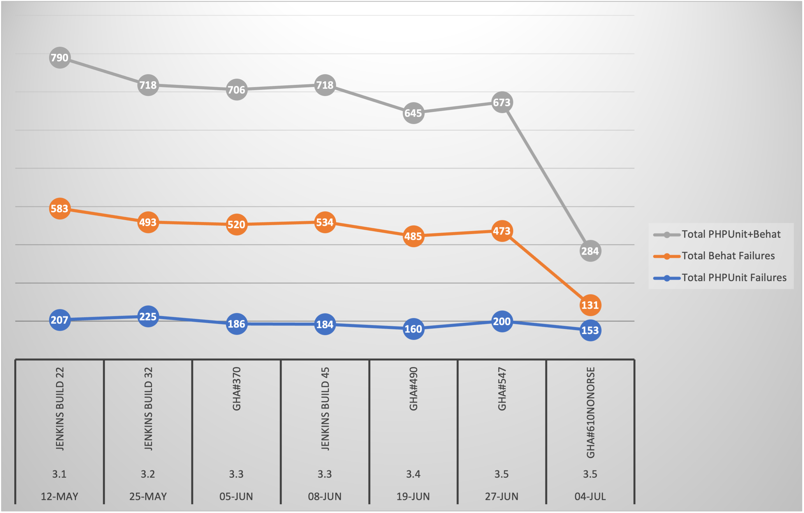

# Moodle Testing Strategy for 4.2

We are going to use <https://github.com/ucl-isd/moodle-build/tree/42-codebase> as branch for identifying, fixing and monitoring test failures. The corresponding aws instance is <https://42-codebase.preview-moodle.ucl.ac.uk/>

Jira EPIC for 42-codebase CTP-2023 - 4.2-codebase Done

Strategy:

-   compare current prod build with Moodle 4.2 test failures. Higher priority to be put on test failing in 4.2
-   split phpunit from behat
-   focus on phpunit then behat
-   behat has two layers - fix the test or fix broken front end functionality 
-   identify repeating issues i.e. one issue affecting mutliple plugins and aim to fix those to reduce number of failures
-   assign priority at some point so can focus on higher priority fixes
-   check upstream issues logged for 4.0 [Moodle 4.0 upstream logged issues](Moodle_4.0_upstream_logged_issues)

# TI progress



# Tests failing only in 4.2

[TestErrorComparison31114vs4.2.xlsx](https://liveuclac.sharepoint.com/:x:/r/sites/LTALearning-DigEdchannel/Shared%20Documents/TestErrorComparison31114vs4.2.xlsx?d=wf0fe2db76fa74de2aedfb7b2ba018edb&csf=1&web=1&e=9CLrRc)

PHPUnit

|                                                                                                                                                                                                                                                                                                                                                                                                                                                           |
|-----------------------------------------------------------------------------------------------------------------------------------------------------------------------------------------------------------------------------------------------------------------------------------------------------------------------------------------------------------------------------------------------------------------------------------------------------------|
| Moodle 42-codebase jenkins run 11                                                                                                                                                                                                                                                                                                                                                                                                                         |
| [Go Parallel / PHPUnit Tests / accesslib\_test.test\_permission\_evaluation](https://jenkins.automation.ucl.ac.uk/job/moodle/job/candidate-builds/job/moodle-1819/job/42-codebase/11/testReport/junit/(root)/accesslib_test/Go_Parallel___PHPUnit_Tests___test_permission_evaluation/)                                                                                                                                                                    |
| [Go Parallel / PHPUnit Tests / block\_html.block\_html\_test.test\_instance\_copy](https://jenkins.automation.ucl.ac.uk/job/moodle/job/candidate-builds/job/moodle-1819/job/42-codebase/11/testReport/junit/block_html/block_html_test/Go_Parallel___PHPUnit_Tests___test_instance_copy/)                                                                                                                                                                 |
| [Go Parallel / PHPUnit Tests / block\_html.privacy.provider\_test.test\_delete\_data\_for\_users](https://jenkins.automation.ucl.ac.uk/job/moodle/job/candidate-builds/job/moodle-1819/job/42-codebase/11/testReport/junit/block_html.privacy/provider_test/Go_Parallel___PHPUnit_Tests___test_delete_data_for_users/)                                                                                                                                    |
| [Go Parallel / PHPUnit Tests / block\_html.privacy.provider\_test.test\_get\_users\_in\_context](https://jenkins.automation.ucl.ac.uk/job/moodle/job/candidate-builds/job/moodle-1819/job/42-codebase/11/testReport/junit/block_html.privacy/provider_test/Go_Parallel___PHPUnit_Tests___test_get_users_in_context/)                                                                                                                                      |
| [Go Parallel / PHPUnit Tests / block\_html.privacy.provider\_test.test\_mixed\_multiple\_blocks\_exported](https://jenkins.automation.ucl.ac.uk/job/moodle/job/candidate-builds/job/moodle-1819/job/42-codebase/11/testReport/junit/block_html.privacy/provider_test/Go_Parallel___PHPUnit_Tests___test_mixed_multiple_blocks_exported/)                                                                                                                  |
| [Go Parallel / PHPUnit Tests / block\_html.privacy.provider\_test.test\_user\_block](https://jenkins.automation.ucl.ac.uk/job/moodle/job/candidate-builds/job/moodle-1819/job/42-codebase/11/testReport/junit/block_html.privacy/provider_test/Go_Parallel___PHPUnit_Tests___test_user_block/)                                                                                                                                                            |
| [Go Parallel / PHPUnit Tests / block\_html.privacy.provider\_test.test\_user\_block\_unconfigured](https://jenkins.automation.ucl.ac.uk/job/moodle/job/candidate-builds/job/moodle-1819/job/42-codebase/11/testReport/junit/block_html.privacy/provider_test/Go_Parallel___PHPUnit_Tests___test_user_block_unconfigured/)                                                                                                                                 |
| [Go Parallel / PHPUnit Tests / block\_html.privacy.provider\_test.test\_user\_multiple\_blocks\_exported](https://jenkins.automation.ucl.ac.uk/job/moodle/job/candidate-builds/job/moodle-1819/job/42-codebase/11/testReport/junit/block_html.privacy/provider_test/Go_Parallel___PHPUnit_Tests___test_user_multiple_blocks_exported/)                                                                                                                    |
| [Go Parallel / PHPUnit Tests / block\_html.search\_content\_test.test\_search\_area](https://jenkins.automation.ucl.ac.uk/job/moodle/job/candidate-builds/job/moodle-1819/job/42-codebase/11/testReport/junit/block_html/search_content_test/Go_Parallel___PHPUnit_Tests___test_search_area/)                                                                                                                                                             |
| [Go Parallel / PHPUnit Tests / core\_block.externallib\_test.test\_get\_course\_blocks](https://jenkins.automation.ucl.ac.uk/job/moodle/job/candidate-builds/job/moodle-1819/job/42-codebase/11/testReport/junit/core_block/externallib_test/Go_Parallel___PHPUnit_Tests___test_get_course_blocks/)                                                                                                                                                       |
| [Go Parallel / PHPUnit Tests / core\_block.externallib\_test.test\_get\_course\_blocks\_contents](https://jenkins.automation.ucl.ac.uk/job/moodle/job/candidate-builds/job/moodle-1819/job/42-codebase/11/testReport/junit/core_block/externallib_test/Go_Parallel___PHPUnit_Tests___test_get_course_blocks_contents/)                                                                                                                                    |
| [Go Parallel / PHPUnit Tests / core\_block.externallib\_test.test\_get\_course\_blocks\_contents\_with\_mathjax](https://jenkins.automation.ucl.ac.uk/job/moodle/job/candidate-builds/job/moodle-1819/job/42-codebase/11/testReport/junit/core_block/externallib_test/Go_Parallel___PHPUnit_Tests___test_get_course_blocks_contents_with_mathjax/)                                                                                                        |
| [Go Parallel / PHPUnit Tests / core\_block.externallib\_test.test\_get\_course\_blocks\_overrides](https://jenkins.automation.ucl.ac.uk/job/moodle/job/candidate-builds/job/moodle-1819/job/42-codebase/11/testReport/junit/core_block/externallib_test/Go_Parallel___PHPUnit_Tests___test_get_course_blocks_overrides/)                                                                                                                                  |
| [Go Parallel / PHPUnit Tests / core\_block.externallib\_test.test\_get\_course\_blocks\_site\_home](https://jenkins.automation.ucl.ac.uk/job/moodle/job/candidate-builds/job/moodle-1819/job/42-codebase/11/testReport/junit/core_block/externallib_test/Go_Parallel___PHPUnit_Tests___test_get_course_blocks_site_home/)                                                                                                                                 |
| [Go Parallel / PHPUnit Tests / core\_block.externallib\_test.test\_get\_dashboard\_blocks\_custom\_user\_dashboard](https://jenkins.automation.ucl.ac.uk/job/moodle/job/candidate-builds/job/moodle-1819/job/42-codebase/11/testReport/junit/core_block/externallib_test/Go_Parallel___PHPUnit_Tests___test_get_dashboard_blocks_custom_user_dashboard/)                                                                                                  |
| [Go Parallel / PHPUnit Tests / core\_block.externallib\_test.test\_get\_dashboard\_blocks\_default\_dashboard](https://jenkins.automation.ucl.ac.uk/job/moodle/job/candidate-builds/job/moodle-1819/job/42-codebase/11/testReport/junit/core_block/externallib_test/Go_Parallel___PHPUnit_Tests___test_get_dashboard_blocks_default_dashboard/)                                                                                                           |
| [Go Parallel / PHPUnit Tests / core\_block.externallib\_test.test\_get\_dashboard\_blocks\_default\_dashboard\_including\_sticky\_block](https://jenkins.automation.ucl.ac.uk/job/moodle/job/candidate-builds/job/moodle-1819/job/42-codebase/11/testReport/junit/core_block/externallib_test/Go_Parallel___PHPUnit_Tests___test_get_dashboard_blocks_default_dashboard_including_sticky_block/)                                                          |
| [Go Parallel / PHPUnit Tests / core\_block.externallib\_test.test\_get\_dashboard\_blocks\_my\_courses](https://jenkins.automation.ucl.ac.uk/job/moodle/job/candidate-builds/job/moodle-1819/job/42-codebase/11/testReport/junit/core_block/externallib_test/Go_Parallel___PHPUnit_Tests___test_get_dashboard_blocks_my_courses/)                                                                                                                         |
| [Go Parallel / PHPUnit Tests / core\_external.external\_api\_test.test\_all\_external\_info with data set "block\_lifecycle\_get\_scheduled\_freeze\_date"](https://jenkins.automation.ucl.ac.uk/job/moodle/job/candidate-builds/job/moodle-1819/job/42-codebase/11/testReport/junit/core_external/external_api_test/Go_Parallel___PHPUnit_Tests___test_all_external_info_with_data_set__block_lifecycle_get_scheduled_freeze_date_/)                     |
| [Go Parallel / PHPUnit Tests / core\_external.external\_api\_test.test\_all\_external\_info with data set "block\_lifecycle\_update\_auto\_freezing\_preferences"](https://jenkins.automation.ucl.ac.uk/job/moodle/job/candidate-builds/job/moodle-1819/job/42-codebase/11/testReport/junit/core_external/external_api_test/Go_Parallel___PHPUnit_Tests___test_all_external_info_with_data_set__block_lifecycle_update_auto_freezing_preferences_/)       |
| [Go Parallel / PHPUnit Tests / core\_external.external\_api\_test.test\_all\_external\_info with data set "block\_portico\_enrolments\_get\_modocc\_mappings"](https://jenkins.automation.ucl.ac.uk/job/moodle/job/candidate-builds/job/moodle-1819/job/42-codebase/11/testReport/junit/core_external/external_api_test/Go_Parallel___PHPUnit_Tests___test_all_external_info_with_data_set__block_portico_enrolments_get_modocc_mappings_/)               |
| [Go Parallel / PHPUnit Tests / core\_external.external\_api\_test.test\_all\_external\_info with data set "filter\_embedquestion\_get\_embed\_code"](https://jenkins.automation.ucl.ac.uk/job/moodle/job/candidate-builds/job/moodle-1819/job/42-codebase/11/testReport/junit/core_external/external_api_test/Go_Parallel___PHPUnit_Tests___test_all_external_info_with_data_set__filter_embedquestion_get_embed_code_/)                                  |
| [Go Parallel / PHPUnit Tests / core\_external.external\_api\_test.test\_all\_external\_info with data set "filter\_embedquestion\_get\_sharable\_question\_choices"](https://jenkins.automation.ucl.ac.uk/job/moodle/job/candidate-builds/job/moodle-1819/job/42-codebase/11/testReport/junit/core_external/external_api_test/Go_Parallel___PHPUnit_Tests___test_all_external_info_with_data_set__filter_embedquestion_get_sharable_question_choices_/)   |
| [Go Parallel / PHPUnit Tests / core\_external.external\_api\_test.test\_all\_external\_info with data set "local\_o365\_create\_onenoteassignment"](https://jenkins.automation.ucl.ac.uk/job/moodle/job/candidate-builds/job/moodle-1819/job/42-codebase/11/testReport/junit/core_external/external_api_test/Go_Parallel___PHPUnit_Tests___test_all_external_info_with_data_set__local_o365_create_onenoteassignment_/)                                   |
| [Go Parallel / PHPUnit Tests / core\_external.external\_api\_test.test\_all\_external\_info with data set "local\_o365\_delete\_onenoteassignment"](https://jenkins.automation.ucl.ac.uk/job/moodle/job/candidate-builds/job/moodle-1819/job/42-codebase/11/testReport/junit/core_external/external_api_test/Go_Parallel___PHPUnit_Tests___test_all_external_info_with_data_set__local_o365_delete_onenoteassignment_/)                                   |
| [Go Parallel / PHPUnit Tests / core\_external.external\_api\_test.test\_all\_external\_info with data set "local\_o365\_get\_assignments"](https://jenkins.automation.ucl.ac.uk/job/moodle/job/candidate-builds/job/moodle-1819/job/42-codebase/11/testReport/junit/core_external/external_api_test/Go_Parallel___PHPUnit_Tests___test_all_external_info_with_data_set__local_o365_get_assignments_/)                                                     |
| [Go Parallel / PHPUnit Tests / core\_external.external\_api\_test.test\_all\_external\_info with data set "local\_o365\_get\_bot\_message"](https://jenkins.automation.ucl.ac.uk/job/moodle/job/candidate-builds/job/moodle-1819/job/42-codebase/11/testReport/junit/core_external/external_api_test/Go_Parallel___PHPUnit_Tests___test_all_external_info_with_data_set__local_o365_get_bot_message_/)                                                    |
| [Go Parallel / PHPUnit Tests / core\_external.external\_api\_test.test\_all\_external\_info with data set "local\_o365\_get\_course\_users"](https://jenkins.automation.ucl.ac.uk/job/moodle/job/candidate-builds/job/moodle-1819/job/42-codebase/11/testReport/junit/core_external/external_api_test/Go_Parallel___PHPUnit_Tests___test_all_external_info_with_data_set__local_o365_get_course_users_/)                                                  |
| [Go Parallel / PHPUnit Tests / core\_external.external\_api\_test.test\_all\_external\_info with data set "local\_o365\_get\_onenoteassignment"](https://jenkins.automation.ucl.ac.uk/job/moodle/job/candidate-builds/job/moodle-1819/job/42-codebase/11/testReport/junit/core_external/external_api_test/Go_Parallel___PHPUnit_Tests___test_all_external_info_with_data_set__local_o365_get_onenoteassignment_/)                                         |
| [Go Parallel / PHPUnit Tests / core\_external.external\_api\_test.test\_all\_external\_info with data set "local\_o365\_get\_teachercourses"](https://jenkins.automation.ucl.ac.uk/job/moodle/job/candidate-builds/job/moodle-1819/job/42-codebase/11/testReport/junit/core_external/external_api_test/Go_Parallel___PHPUnit_Tests___test_all_external_info_with_data_set__local_o365_get_teachercourses_/)                                               |
| [Go Parallel / PHPUnit Tests / core\_external.external\_api\_test.test\_all\_external\_info with data set "local\_o365\_update\_grade"](https://jenkins.automation.ucl.ac.uk/job/moodle/job/candidate-builds/job/moodle-1819/job/42-codebase/11/testReport/junit/core_external/external_api_test/Go_Parallel___PHPUnit_Tests___test_all_external_info_with_data_set__local_o365_update_grade_/)                                                           |
| [Go Parallel / PHPUnit Tests / core\_external.external\_api\_test.test\_all\_external\_info with data set "local\_o365\_update\_onenoteassignment"](https://jenkins.automation.ucl.ac.uk/job/moodle/job/candidate-builds/job/moodle-1819/job/42-codebase/11/testReport/junit/core_external/external_api_test/Go_Parallel___PHPUnit_Tests___test_all_external_info_with_data_set__local_o365_update_onenoteassignment_/)                                   |
| [Go Parallel / PHPUnit Tests / core\_external.external\_api\_test.test\_all\_external\_info with data set "local\_ucl\_clc\_admin\_controller"](https://jenkins.automation.ucl.ac.uk/job/moodle/job/candidate-builds/job/moodle-1819/job/42-codebase/11/testReport/junit/core_external/external_api_test/Go_Parallel___PHPUnit_Tests___test_all_external_info_with_data_set__local_ucl_clc_admin_controller_/)                                            |
| [Go Parallel / PHPUnit Tests / core\_external.external\_api\_test.test\_all\_external\_info with data set "local\_ucl\_clc\_admin\_srsChangeTracker"](https://jenkins.automation.ucl.ac.uk/job/moodle/job/candidate-builds/job/moodle-1819/job/42-codebase/11/testReport/junit/core_external/external_api_test/Go_Parallel___PHPUnit_Tests___test_all_external_info_with_data_set__local_ucl_clc_admin_srsChangeTracker_/)                                |
| [Go Parallel / PHPUnit Tests / core\_external.external\_api\_test.test\_all\_external\_info with data set "local\_ucl\_clc\_category\_lookup\_cache"](https://jenkins.automation.ucl.ac.uk/job/moodle/job/candidate-builds/job/moodle-1819/job/42-codebase/11/testReport/junit/core_external/external_api_test/Go_Parallel___PHPUnit_Tests___test_all_external_info_with_data_set__local_ucl_clc_category_lookup_cache_/)                                 |
| [Go Parallel / PHPUnit Tests / core\_external.external\_api\_test.test\_all\_external\_info with data set "mod\_attendance\_add\_attendance"](https://jenkins.automation.ucl.ac.uk/job/moodle/job/candidate-builds/job/moodle-1819/job/42-codebase/11/testReport/junit/core_external/external_api_test/Go_Parallel___PHPUnit_Tests___test_all_external_info_with_data_set__mod_attendance_add_attendance_/)                                               |
| [Go Parallel / PHPUnit Tests / core\_external.external\_api\_test.test\_all\_external\_info with data set "mod\_attendance\_add\_session"](https://jenkins.automation.ucl.ac.uk/job/moodle/job/candidate-builds/job/moodle-1819/job/42-codebase/11/testReport/junit/core_external/external_api_test/Go_Parallel___PHPUnit_Tests___test_all_external_info_with_data_set__mod_attendance_add_session_/)                                                     |
| [Go Parallel / PHPUnit Tests / core\_external.external\_api\_test.test\_all\_external\_info with data set "mod\_attendance\_get\_courses\_with\_today\_sessions"](https://jenkins.automation.ucl.ac.uk/job/moodle/job/candidate-builds/job/moodle-1819/job/42-codebase/11/testReport/junit/core_external/external_api_test/Go_Parallel___PHPUnit_Tests___test_all_external_info_with_data_set__mod_attendance_get_courses_with_today_sessions_/)          |
| [Go Parallel / PHPUnit Tests / core\_external.external\_api\_test.test\_all\_external\_info with data set "mod\_attendance\_get\_session"](https://jenkins.automation.ucl.ac.uk/job/moodle/job/candidate-builds/job/moodle-1819/job/42-codebase/11/testReport/junit/core_external/external_api_test/Go_Parallel___PHPUnit_Tests___test_all_external_info_with_data_set__mod_attendance_get_session_/)                                                     |
| [Go Parallel / PHPUnit Tests / core\_external.external\_api\_test.test\_all\_external\_info with data set "mod\_attendance\_get\_sessions"](https://jenkins.automation.ucl.ac.uk/job/moodle/job/candidate-builds/job/moodle-1819/job/42-codebase/11/testReport/junit/core_external/external_api_test/Go_Parallel___PHPUnit_Tests___test_all_external_info_with_data_set__mod_attendance_get_sessions_/)                                                   |
| [Go Parallel / PHPUnit Tests / core\_external.external\_api\_test.test\_all\_external\_info with data set "mod\_attendance\_remove\_attendance"](https://jenkins.automation.ucl.ac.uk/job/moodle/job/candidate-builds/job/moodle-1819/job/42-codebase/11/testReport/junit/core_external/external_api_test/Go_Parallel___PHPUnit_Tests___test_all_external_info_with_data_set__mod_attendance_remove_attendance_/)                                         |
| [Go Parallel / PHPUnit Tests / core\_external.external\_api\_test.test\_all\_external\_info with data set "mod\_attendance\_remove\_session"](https://jenkins.automation.ucl.ac.uk/job/moodle/job/candidate-builds/job/moodle-1819/job/42-codebase/11/testReport/junit/core_external/external_api_test/Go_Parallel___PHPUnit_Tests___test_all_external_info_with_data_set__mod_attendance_remove_session_/)                                               |
| [Go Parallel / PHPUnit Tests / core\_external.external\_api\_test.test\_all\_external\_info with data set "mod\_attendance\_update\_user\_status"](https://jenkins.automation.ucl.ac.uk/job/moodle/job/candidate-builds/job/moodle-1819/job/42-codebase/11/testReport/junit/core_external/external_api_test/Go_Parallel___PHPUnit_Tests___test_all_external_info_with_data_set__mod_attendance_update_user_status_/)                                      |
| [Go Parallel / PHPUnit Tests / core\_external.external\_api\_test.test\_all\_external\_info with data set "mod\_board\_add\_column"](https://jenkins.automation.ucl.ac.uk/job/moodle/job/candidate-builds/job/moodle-1819/job/42-codebase/11/testReport/junit/core_external/external_api_test/Go_Parallel___PHPUnit_Tests___test_all_external_info_with_data_set__mod_board_add_column_/)                                                                 |
| [Go Parallel / PHPUnit Tests / core\_external.external\_api\_test.test\_all\_external\_info with data set "mod\_board\_add\_comment"](https://jenkins.automation.ucl.ac.uk/job/moodle/job/candidate-builds/job/moodle-1819/job/42-codebase/11/testReport/junit/core_external/external_api_test/Go_Parallel___PHPUnit_Tests___test_all_external_info_with_data_set__mod_board_add_comment_/)                                                               |
| [Go Parallel / PHPUnit Tests / core\_external.external\_api\_test.test\_all\_external\_info with data set "mod\_board\_board\_history"](https://jenkins.automation.ucl.ac.uk/job/moodle/job/candidate-builds/job/moodle-1819/job/42-codebase/11/testReport/junit/core_external/external_api_test/Go_Parallel___PHPUnit_Tests___test_all_external_info_with_data_set__mod_board_board_history_/)                                                           |
| [Go Parallel / PHPUnit Tests / core\_external.external\_api\_test.test\_all\_external\_info with data set "mod\_board\_can\_rate\_note"](https://jenkins.automation.ucl.ac.uk/job/moodle/job/candidate-builds/job/moodle-1819/job/42-codebase/11/testReport/junit/core_external/external_api_test/Go_Parallel___PHPUnit_Tests___test_all_external_info_with_data_set__mod_board_can_rate_note_/)                                                          |
| [Go Parallel / PHPUnit Tests / core\_external.external\_api\_test.test\_all\_external\_info with data set "mod\_board\_delete\_column"](https://jenkins.automation.ucl.ac.uk/job/moodle/job/candidate-builds/job/moodle-1819/job/42-codebase/11/testReport/junit/core_external/external_api_test/Go_Parallel___PHPUnit_Tests___test_all_external_info_with_data_set__mod_board_delete_column_/)                                                           |
| [Go Parallel / PHPUnit Tests / core\_external.external\_api\_test.test\_all\_external\_info with data set "mod\_board\_delete\_comment"](https://jenkins.automation.ucl.ac.uk/job/moodle/job/candidate-builds/job/moodle-1819/job/42-codebase/11/testReport/junit/core_external/external_api_test/Go_Parallel___PHPUnit_Tests___test_all_external_info_with_data_set__mod_board_delete_comment_/)                                                         |
| [Go Parallel / PHPUnit Tests / core\_external.external\_api\_test.test\_all\_external\_info with data set "mod\_board\_delete\_note"](https://jenkins.automation.ucl.ac.uk/job/moodle/job/candidate-builds/job/moodle-1819/job/42-codebase/11/testReport/junit/core_external/external_api_test/Go_Parallel___PHPUnit_Tests___test_all_external_info_with_data_set__mod_board_delete_note_/)                                                               |
| [Go Parallel / PHPUnit Tests / core\_external.external\_api\_test.test\_all\_external\_info with data set "mod\_board\_get\_board"](https://jenkins.automation.ucl.ac.uk/job/moodle/job/candidate-builds/job/moodle-1819/job/42-codebase/11/testReport/junit/core_external/external_api_test/Go_Parallel___PHPUnit_Tests___test_all_external_info_with_data_set__mod_board_get_board_/)                                                                   |
| [Go Parallel / PHPUnit Tests / core\_external.external\_api\_test.test\_all\_external\_info with data set "mod\_board\_get\_comments"](https://jenkins.automation.ucl.ac.uk/job/moodle/job/candidate-builds/job/moodle-1819/job/42-codebase/11/testReport/junit/core_external/external_api_test/Go_Parallel___PHPUnit_Tests___test_all_external_info_with_data_set__mod_board_get_comments_/)                                                             |
| [Go Parallel / PHPUnit Tests / core\_external.external\_api\_test.test\_all\_external\_info with data set "mod\_board\_lock\_column"](https://jenkins.automation.ucl.ac.uk/job/moodle/job/candidate-builds/job/moodle-1819/job/42-codebase/11/testReport/junit/core_external/external_api_test/Go_Parallel___PHPUnit_Tests___test_all_external_info_with_data_set__mod_board_lock_column_/)                                                               |
| [Go Parallel / PHPUnit Tests / core\_external.external\_api\_test.test\_all\_external\_info with data set "mod\_board\_move\_column"](https://jenkins.automation.ucl.ac.uk/job/moodle/job/candidate-builds/job/moodle-1819/job/42-codebase/11/testReport/junit/core_external/external_api_test/Go_Parallel___PHPUnit_Tests___test_all_external_info_with_data_set__mod_board_move_column_/)                                                               |
| [Go Parallel / PHPUnit Tests / core\_external.external\_api\_test.test\_all\_external\_info with data set "mod\_board\_move\_note"](https://jenkins.automation.ucl.ac.uk/job/moodle/job/candidate-builds/job/moodle-1819/job/42-codebase/11/testReport/junit/core_external/external_api_test/Go_Parallel___PHPUnit_Tests___test_all_external_info_with_data_set__mod_board_move_note_/)                                                                   |
| [Go Parallel / PHPUnit Tests / core\_external.external\_api\_test.test\_all\_external\_info with data set "mod\_board\_rate\_note"](https://jenkins.automation.ucl.ac.uk/job/moodle/job/candidate-builds/job/moodle-1819/job/42-codebase/11/testReport/junit/core_external/external_api_test/Go_Parallel___PHPUnit_Tests___test_all_external_info_with_data_set__mod_board_rate_note_/)                                                                   |
| [Go Parallel / PHPUnit Tests / core\_external.external\_api\_test.test\_all\_external\_info with data set "mod\_board\_submit\_form"](https://jenkins.automation.ucl.ac.uk/job/moodle/job/candidate-builds/job/moodle-1819/job/42-codebase/11/testReport/junit/core_external/external_api_test/Go_Parallel___PHPUnit_Tests___test_all_external_info_with_data_set__mod_board_submit_form_/)                                                               |
| [Go Parallel / PHPUnit Tests / core\_external.external\_api\_test.test\_all\_external\_info with data set "mod\_board\_update\_column"](https://jenkins.automation.ucl.ac.uk/job/moodle/job/candidate-builds/job/moodle-1819/job/42-codebase/11/testReport/junit/core_external/external_api_test/Go_Parallel___PHPUnit_Tests___test_all_external_info_with_data_set__mod_board_update_column_/)                                                           |
| [Go Parallel / PHPUnit Tests / core\_external.external\_api\_test.test\_all\_external\_info with data set "mod\_checklist\_update\_student\_comment"](https://jenkins.automation.ucl.ac.uk/job/moodle/job/candidate-builds/job/moodle-1819/job/42-codebase/11/testReport/junit/core_external/external_api_test/Go_Parallel___PHPUnit_Tests___test_all_external_info_with_data_set__mod_checklist_update_student_comment_/)                                |
| [Go Parallel / PHPUnit Tests / core\_external.external\_api\_test.test\_all\_external\_info with data set "mod\_choicegroup\_delete\_choicegroup\_responses"](https://jenkins.automation.ucl.ac.uk/job/moodle/job/candidate-builds/job/moodle-1819/job/42-codebase/11/testReport/junit/core_external/external_api_test/Go_Parallel___PHPUnit_Tests___test_all_external_info_with_data_set__mod_choicegroup_delete_choicegroup_responses_/)                |
| [Go Parallel / PHPUnit Tests / core\_external.external\_api\_test.test\_all\_external\_info with data set "mod\_choicegroup\_get\_choicegroup\_options"](https://jenkins.automation.ucl.ac.uk/job/moodle/job/candidate-builds/job/moodle-1819/job/42-codebase/11/testReport/junit/core_external/external_api_test/Go_Parallel___PHPUnit_Tests___test_all_external_info_with_data_set__mod_choicegroup_get_choicegroup_options_/)                          |
| [Go Parallel / PHPUnit Tests / core\_external.external\_api\_test.test\_all\_external\_info with data set "mod\_choicegroup\_submit\_choicegroup\_response"](https://jenkins.automation.ucl.ac.uk/job/moodle/job/candidate-builds/job/moodle-1819/job/42-codebase/11/testReport/junit/core_external/external_api_test/Go_Parallel___PHPUnit_Tests___test_all_external_info_with_data_set__mod_choicegroup_submit_choicegroup_response_/)                  |
| [Go Parallel / PHPUnit Tests / core\_external.external\_api\_test.test\_all\_external\_info with data set "mod\_choicegroup\_view\_choicegroup"](https://jenkins.automation.ucl.ac.uk/job/moodle/job/candidate-builds/job/moodle-1819/job/42-codebase/11/testReport/junit/core_external/external_api_test/Go_Parallel___PHPUnit_Tests___test_all_external_info_with_data_set__mod_choicegroup_view_choicegroup_/)                                         |
| [Go Parallel / PHPUnit Tests / core\_external.external\_api\_test.test\_all\_external\_info with data set "mod\_customcert\_delete\_issue"](https://jenkins.automation.ucl.ac.uk/job/moodle/job/candidate-builds/job/moodle-1819/job/42-codebase/11/testReport/junit/core_external/external_api_test/Go_Parallel___PHPUnit_Tests___test_all_external_info_with_data_set__mod_customcert_delete_issue_/)                                                   |
| [Go Parallel / PHPUnit Tests / core\_external.external\_api\_test.test\_all\_external\_info with data set "mod\_customcert\_get\_element\_html"](https://jenkins.automation.ucl.ac.uk/job/moodle/job/candidate-builds/job/moodle-1819/job/42-codebase/11/testReport/junit/core_external/external_api_test/Go_Parallel___PHPUnit_Tests___test_all_external_info_with_data_set__mod_customcert_get_element_html_/)                                          |
| [Go Parallel / PHPUnit Tests / core\_external.external\_api\_test.test\_all\_external\_info with data set "mod\_customcert\_save\_element"](https://jenkins.automation.ucl.ac.uk/job/moodle/job/candidate-builds/job/moodle-1819/job/42-codebase/11/testReport/junit/core_external/external_api_test/Go_Parallel___PHPUnit_Tests___test_all_external_info_with_data_set__mod_customcert_save_element_/)                                                   |
| [Go Parallel / PHPUnit Tests / core\_external.external\_api\_test.test\_all\_external\_info with data set "mod\_helixmedia\_get\_launch\_data"](https://jenkins.automation.ucl.ac.uk/job/moodle/job/candidate-builds/job/moodle-1819/job/42-codebase/11/testReport/junit/core_external/external_api_test/Go_Parallel___PHPUnit_Tests___test_all_external_info_with_data_set__mod_helixmedia_get_launch_data_/)                                            |
| [Go Parallel / PHPUnit Tests / core\_external.external\_api\_test.test\_all\_external\_info with data set "mod\_questionnaire\_submit\_questionnaire\_response"](https://jenkins.automation.ucl.ac.uk/job/moodle/job/candidate-builds/job/moodle-1819/job/42-codebase/11/testReport/junit/core_external/external_api_test/Go_Parallel___PHPUnit_Tests___test_all_external_info_with_data_set__mod_questionnaire_submit_questionnaire_response_/)          |
| [Go Parallel / PHPUnit Tests / core\_external.external\_api\_test.test\_all\_external\_info with data set "mod\_zoom\_get\_state"](https://jenkins.automation.ucl.ac.uk/job/moodle/job/candidate-builds/job/moodle-1819/job/42-codebase/11/testReport/junit/core_external/external_api_test/Go_Parallel___PHPUnit_Tests___test_all_external_info_with_data_set__mod_zoom_get_state_/)                                                                     |
| [Go Parallel / PHPUnit Tests / core\_external.external\_api\_test.test\_all\_external\_info with data set "mod\_zoom\_grade\_item\_update"](https://jenkins.automation.ucl.ac.uk/job/moodle/job/candidate-builds/job/moodle-1819/job/42-codebase/11/testReport/junit/core_external/external_api_test/Go_Parallel___PHPUnit_Tests___test_all_external_info_with_data_set__mod_zoom_grade_item_update_/)                                                    |
| [Go Parallel / PHPUnit Tests / core\_external.external\_api\_test.test\_all\_external\_info with data set "qtype\_pmatch\_check\_response"](https://jenkins.automation.ucl.ac.uk/job/moodle/job/candidate-builds/job/moodle-1819/job/42-codebase/11/testReport/junit/core_external/external_api_test/Go_Parallel___PHPUnit_Tests___test_all_external_info_with_data_set__qtype_pmatch_check_response_/)                                                   |
| [Go Parallel / PHPUnit Tests / core\_external.external\_api\_test.test\_all\_external\_info with data set "qtype\_pmatch\_create\_response"](https://jenkins.automation.ucl.ac.uk/job/moodle/job/candidate-builds/job/moodle-1819/job/42-codebase/11/testReport/junit/core_external/external_api_test/Go_Parallel___PHPUnit_Tests___test_all_external_info_with_data_set__qtype_pmatch_create_response_/)                                                 |
| [Go Parallel / PHPUnit Tests / core\_external.external\_api\_test.test\_all\_external\_info with data set "report\_customsql\_get\_users"](https://jenkins.automation.ucl.ac.uk/job/moodle/job/candidate-builds/job/moodle-1819/job/42-codebase/11/testReport/junit/core_external/external_api_test/Go_Parallel___PHPUnit_Tests___test_all_external_info_with_data_set__report_customsql_get_users_/)                                                     |
| [Go Parallel / PHPUnit Tests / core\_external.external\_api\_test.test\_all\_external\_info with data set "tool\_ally\_delete\_file"](https://jenkins.automation.ucl.ac.uk/job/moodle/job/candidate-builds/job/moodle-1819/job/42-codebase/11/testReport/junit/core_external/external_api_test/Go_Parallel___PHPUnit_Tests___test_all_external_info_with_data_set__tool_ally_delete_file_/)                                                               |
| [Go Parallel / PHPUnit Tests / core\_external.external\_api\_test.test\_all\_external\_info with data set "tool\_ally\_get\_content"](https://jenkins.automation.ucl.ac.uk/job/moodle/job/candidate-builds/job/moodle-1819/job/42-codebase/11/testReport/junit/core_external/external_api_test/Go_Parallel___PHPUnit_Tests___test_all_external_info_with_data_set__tool_ally_get_content_/)                                                               |
| [Go Parallel / PHPUnit Tests / core\_external.external\_api\_test.test\_all\_external\_info with data set "tool\_ally\_get\_course\_files"](https://jenkins.automation.ucl.ac.uk/job/moodle/job/candidate-builds/job/moodle-1819/job/42-codebase/11/testReport/junit/core_external/external_api_test/Go_Parallel___PHPUnit_Tests___test_all_external_info_with_data_set__tool_ally_get_course_files_/)                                                    |
| [Go Parallel / PHPUnit Tests / core\_external.external\_api\_test.test\_all\_external\_info with data set "tool\_ally\_get\_course\_invalid\_files"](https://jenkins.automation.ucl.ac.uk/job/moodle/job/candidate-builds/job/moodle-1819/job/42-codebase/11/testReport/junit/core_external/external_api_test/Go_Parallel___PHPUnit_Tests___test_all_external_info_with_data_set__tool_ally_get_course_invalid_files_/)                                   |
| [Go Parallel / PHPUnit Tests / core\_external.external\_api\_test.test\_all\_external\_info with data set "tool\_ally\_get\_course\_user\_count"](https://jenkins.automation.ucl.ac.uk/job/moodle/job/candidate-builds/job/moodle-1819/job/42-codebase/11/testReport/junit/core_external/external_api_test/Go_Parallel___PHPUnit_Tests___test_all_external_info_with_data_set__tool_ally_get_course_user_count_/)                                         |
| [Go Parallel / PHPUnit Tests / core\_external.external\_api\_test.test\_all\_external\_info with data set "tool\_ally\_get\_courses"](https://jenkins.automation.ucl.ac.uk/job/moodle/job/candidate-builds/job/moodle-1819/job/42-codebase/11/testReport/junit/core_external/external_api_test/Go_Parallel___PHPUnit_Tests___test_all_external_info_with_data_set__tool_ally_get_courses_/)                                                               |
| [Go Parallel / PHPUnit Tests / core\_external.external\_api\_test.test\_all\_external\_info with data set "tool\_ally\_get\_file\_updates"](https://jenkins.automation.ucl.ac.uk/job/moodle/job/candidate-builds/job/moodle-1819/job/42-codebase/11/testReport/junit/core_external/external_api_test/Go_Parallel___PHPUnit_Tests___test_all_external_info_with_data_set__tool_ally_get_file_updates_/)                                                    |
| [Go Parallel / PHPUnit Tests / core\_external.external\_api\_test.test\_all\_external\_info with data set "tool\_ally\_get\_file"](https://jenkins.automation.ucl.ac.uk/job/moodle/job/candidate-builds/job/moodle-1819/job/42-codebase/11/testReport/junit/core_external/external_api_test/Go_Parallel___PHPUnit_Tests___test_all_external_info_with_data_set__tool_ally_get_file_/)                                                                     |
| [Go Parallel / PHPUnit Tests / core\_external.external\_api\_test.test\_all\_external\_info with data set "tool\_ally\_get\_files"](https://jenkins.automation.ucl.ac.uk/job/moodle/job/candidate-builds/job/moodle-1819/job/42-codebase/11/testReport/junit/core_external/external_api_test/Go_Parallel___PHPUnit_Tests___test_all_external_info_with_data_set__tool_ally_get_files_/)                                                                   |
| [Go Parallel / PHPUnit Tests / core\_external.external\_api\_test.test\_all\_external\_info with data set "tool\_ally\_get\_invalid\_files"](https://jenkins.automation.ucl.ac.uk/job/moodle/job/candidate-builds/job/moodle-1819/job/42-codebase/11/testReport/junit/core_external/external_api_test/Go_Parallel___PHPUnit_Tests___test_all_external_info_with_data_set__tool_ally_get_invalid_files_/)                                                  |
| [Go Parallel / PHPUnit Tests / core\_external.external\_api\_test.test\_all\_external\_info with data set "tool\_ally\_get\_logs"](https://jenkins.automation.ucl.ac.uk/job/moodle/job/candidate-builds/job/moodle-1819/job/42-codebase/11/testReport/junit/core_external/external_api_test/Go_Parallel___PHPUnit_Tests___test_all_external_info_with_data_set__tool_ally_get_logs_/)                                                                     |
| [Go Parallel / PHPUnit Tests / core\_external.external\_api\_test.test\_all\_external\_info with data set "tool\_ally\_list\_content"](https://jenkins.automation.ucl.ac.uk/job/moodle/job/candidate-builds/job/moodle-1819/job/42-codebase/11/testReport/junit/core_external/external_api_test/Go_Parallel___PHPUnit_Tests___test_all_external_info_with_data_set__tool_ally_list_content_/)                                                             |
| [Go Parallel / PHPUnit Tests / core\_external.external\_api\_test.test\_all\_external\_info with data set "tool\_ally\_processors\_status"](https://jenkins.automation.ucl.ac.uk/job/moodle/job/candidate-builds/job/moodle-1819/job/42-codebase/11/testReport/junit/core_external/external_api_test/Go_Parallel___PHPUnit_Tests___test_all_external_info_with_data_set__tool_ally_processors_status_/)                                                   |
| [Go Parallel / PHPUnit Tests / core\_external.external\_api\_test.test\_all\_external\_info with data set "tool\_ally\_replace\_content"](https://jenkins.automation.ucl.ac.uk/job/moodle/job/candidate-builds/job/moodle-1819/job/42-codebase/11/testReport/junit/core_external/external_api_test/Go_Parallel___PHPUnit_Tests___test_all_external_info_with_data_set__tool_ally_replace_content_/)                                                       |
| [Go Parallel / PHPUnit Tests / core\_external.external\_api\_test.test\_all\_external\_info with data set "tool\_ally\_replace\_file"](https://jenkins.automation.ucl.ac.uk/job/moodle/job/candidate-builds/job/moodle-1819/job/42-codebase/11/testReport/junit/core_external/external_api_test/Go_Parallel___PHPUnit_Tests___test_all_external_info_with_data_set__tool_ally_replace_file_/)                                                             |
| [Go Parallel / PHPUnit Tests / core\_external.external\_api\_test.test\_all\_external\_info with data set "tool\_ally\_request\_view\_completion"](https://jenkins.automation.ucl.ac.uk/job/moodle/job/candidate-builds/job/moodle-1819/job/42-codebase/11/testReport/junit/core_external/external_api_test/Go_Parallel___PHPUnit_Tests___test_all_external_info_with_data_set__tool_ally_request_view_completion_/)                                      |
| [Go Parallel / PHPUnit Tests / core\_external.external\_api\_test.test\_all\_external\_info with data set "tool\_ally\_version\_info"](https://jenkins.automation.ucl.ac.uk/job/moodle/job/candidate-builds/job/moodle-1819/job/42-codebase/11/testReport/junit/core_external/external_api_test/Go_Parallel___PHPUnit_Tests___test_all_external_info_with_data_set__tool_ally_version_info_/)                                                             |
| [Go Parallel / PHPUnit Tests / core\_privacy.privacy.provider\_test.test\_all\_providers\_compliant with data set "theme\_norse"](https://jenkins.automation.ucl.ac.uk/job/moodle/job/candidate-builds/job/moodle-1819/job/42-codebase/11/testReport/junit/core_privacy.privacy/provider_test/Go_Parallel___PHPUnit_Tests___test_all_providers_compliant_with_data_set__theme_norse_/)                                                                    |
| [Go Parallel / PHPUnit Tests / core.blocklib\_test.test\_create\_all\_block\_instances](https://jenkins.automation.ucl.ac.uk/job/moodle/job/candidate-builds/job/moodle-1819/job/42-codebase/11/testReport/junit/core/blocklib_test/Go_Parallel___PHPUnit_Tests___test_create_all_block_instances/)                                                                                                                                                       |
| [Go Parallel / PHPUnit Tests / core.context\_helper\_test.test\_create\_instances](https://jenkins.automation.ucl.ac.uk/job/moodle/job/candidate-builds/job/moodle-1819/job/42-codebase/11/testReport/junit/core/context_helper_test/Go_Parallel___PHPUnit_Tests___test_create_instances/)                                                                                                                                                                |
| [Go Parallel / PHPUnit Tests / core.dml\_mysqli\_read\_slave\_test.test\_aux\_readonly](https://jenkins.automation.ucl.ac.uk/job/moodle/job/candidate-builds/job/moodle-1819/job/42-codebase/11/testReport/junit/core/dml_mysqli_read_slave_test/Go_Parallel___PHPUnit_Tests___test_aux_readonly/)                                                                                                                                                        |
| [Go Parallel / PHPUnit Tests / filter\_embedquestion.attempt\_test.test\_discard\_broken\_attempt\_one\_qa](https://jenkins.automation.ucl.ac.uk/job/moodle/job/candidate-builds/job/moodle-1819/job/42-codebase/11/testReport/junit/filter_embedquestion/attempt_test/Go_Parallel___PHPUnit_Tests___test_discard_broken_attempt_one_qa/)                                                                                                                 |
| [Go Parallel / PHPUnit Tests / filter\_embedquestion.attempt\_test.test\_discard\_broken\_attempt\_two\_qas](https://jenkins.automation.ucl.ac.uk/job/moodle/job/candidate-builds/job/moodle-1819/job/42-codebase/11/testReport/junit/filter_embedquestion/attempt_test/Go_Parallel___PHPUnit_Tests___test_discard_broken_attempt_two_qas/)                                                                                                               |
| [Go Parallel / PHPUnit Tests / filter\_embedquestion.attempt\_test.test\_question\_rendering](https://jenkins.automation.ucl.ac.uk/job/moodle/job/candidate-builds/job/moodle-1819/job/42-codebase/11/testReport/junit/filter_embedquestion/attempt_test/Go_Parallel___PHPUnit_Tests___test_question_rendering/)                                                                                                                                          |
| [Go Parallel / PHPUnit Tests / filter\_embedquestion.attempt\_test.test\_start\_new\_attempt\_at\_question\_reports\_errors](https://jenkins.automation.ucl.ac.uk/job/moodle/job/candidate-builds/job/moodle-1819/job/42-codebase/11/testReport/junit/filter_embedquestion/attempt_test/Go_Parallel___PHPUnit_Tests___test_start_new_attempt_at_question_reports_errors/)                                                                                 |
| [Go Parallel / PHPUnit Tests / filter\_embedquestion.attempt\_test.test\_start\_new\_attempt\_at\_question\_will\_select\_an\_unused\_question](https://jenkins.automation.ucl.ac.uk/job/moodle/job/candidate-builds/job/moodle-1819/job/42-codebase/11/testReport/junit/filter_embedquestion/attempt_test/Go_Parallel___PHPUnit_Tests___test_start_new_attempt_at_question_will_select_an_unused_question/)                                              |
| [Go Parallel / PHPUnit Tests / filter\_embedquestion.attempt\_test.test\_start\_new\_attempt\_at\_question\_will\_select\_an\_unused\_variant](https://jenkins.automation.ucl.ac.uk/job/moodle/job/candidate-builds/job/moodle-1819/job/42-codebase/11/testReport/junit/filter_embedquestion/attempt_test/Go_Parallel___PHPUnit_Tests___test_start_new_attempt_at_question_will_select_an_unused_variant/)                                                |
| [Go Parallel / PHPUnit Tests / filter\_embedquestion.external\_test.test\_get\_embed\_code\_working with data set \#0](https://jenkins.automation.ucl.ac.uk/job/moodle/job/candidate-builds/job/moodle-1819/job/42-codebase/11/testReport/junit/filter_embedquestion/external_test/Go_Parallel___PHPUnit_Tests___test_get_embed_code_working_with_data_set__0/)                                                                                           |
| [Go Parallel / PHPUnit Tests / filter\_embedquestion.external\_test.test\_get\_embed\_code\_working with data set \#1](https://jenkins.automation.ucl.ac.uk/job/moodle/job/candidate-builds/job/moodle-1819/job/42-codebase/11/testReport/junit/filter_embedquestion/external_test/Go_Parallel___PHPUnit_Tests___test_get_embed_code_working_with_data_set__1/)                                                                                           |
| [Go Parallel / PHPUnit Tests / filter\_embedquestion.external\_test.test\_get\_embed\_code\_working\_with\_random\_questions](https://jenkins.automation.ucl.ac.uk/job/moodle/job/candidate-builds/job/moodle-1819/job/42-codebase/11/testReport/junit/filter_embedquestion/external_test/Go_Parallel___PHPUnit_Tests___test_get_embed_code_working_with_random_questions/)                                                                               |
| [Go Parallel / PHPUnit Tests / filter\_embedquestion.external\_test.test\_get\_sharable\_question\_choices\_no\_permissions](https://jenkins.automation.ucl.ac.uk/job/moodle/job/candidate-builds/job/moodle-1819/job/42-codebase/11/testReport/junit/filter_embedquestion/external_test/Go_Parallel___PHPUnit_Tests___test_get_sharable_question_choices_no_permissions/)                                                                                |
| [Go Parallel / PHPUnit Tests / filter\_embedquestion.external\_test.test\_get\_sharable\_question\_choices\_only\_user](https://jenkins.automation.ucl.ac.uk/job/moodle/job/candidate-builds/job/moodle-1819/job/42-codebase/11/testReport/junit/filter_embedquestion/external_test/Go_Parallel___PHPUnit_Tests___test_get_sharable_question_choices_only_user/)                                                                                          |
| [Go Parallel / PHPUnit Tests / filter\_embedquestion.external\_test.test\_get\_sharable\_question\_choices\_working](https://jenkins.automation.ucl.ac.uk/job/moodle/job/candidate-builds/job/moodle-1819/job/42-codebase/11/testReport/junit/filter_embedquestion/external_test/Go_Parallel___PHPUnit_Tests___test_get_sharable_question_choices_working/)                                                                                               |
| [Go Parallel / PHPUnit Tests / filter\_embedquestion.utils\_test.test\_create\_attempt\_at\_embedded\_question](https://jenkins.automation.ucl.ac.uk/job/moodle/job/candidate-builds/job/moodle-1819/job/42-codebase/11/testReport/junit/filter_embedquestion/utils_test/Go_Parallel___PHPUnit_Tests___test_create_attempt_at_embedded_question/)                                                                                                         |
| [Go Parallel / PHPUnit Tests / local\_ucl\_tools\_quiz\_reset\_testcase.test\_local\_ucl\_tools\_quizattempts](https://jenkins.automation.ucl.ac.uk/job/moodle/job/candidate-builds/job/moodle-1819/job/42-codebase/11/testReport/junit/(root)/local_ucl_tools_quiz_reset_testcase/Go_Parallel___PHPUnit_Tests___test_local_ucl_tools_quizattempts/)                                                                                                      |
| [Go Parallel / PHPUnit Tests / mod\_board.board\_test.test\_board\_add\_column](https://jenkins.automation.ucl.ac.uk/job/moodle/job/candidate-builds/job/moodle-1819/job/42-codebase/11/testReport/junit/mod_board/board_test/Go_Parallel___PHPUnit_Tests___test_board_add_column/)                                                                                                                                                                       |
| [Go Parallel / PHPUnit Tests / mod\_board.board\_test.test\_board\_add\_note](https://jenkins.automation.ucl.ac.uk/job/moodle/job/candidate-builds/job/moodle-1819/job/42-codebase/11/testReport/junit/mod_board/board_test/Go_Parallel___PHPUnit_Tests___test_board_add_note/)                                                                                                                                                                           |
| [Go Parallel / PHPUnit Tests / mod\_board.board\_test.test\_board\_completion](https://jenkins.automation.ucl.ac.uk/job/moodle/job/candidate-builds/job/moodle-1819/job/42-codebase/11/testReport/junit/mod_board/board_test/Go_Parallel___PHPUnit_Tests___test_board_completion/)                                                                                                                                                                        |
| [Go Parallel / PHPUnit Tests / mod\_board.board\_test.test\_board\_delete\_column](https://jenkins.automation.ucl.ac.uk/job/moodle/job/candidate-builds/job/moodle-1819/job/42-codebase/11/testReport/junit/mod_board/board_test/Go_Parallel___PHPUnit_Tests___test_board_delete_column/)                                                                                                                                                                 |
| [Go Parallel / PHPUnit Tests / mod\_board.board\_test.test\_board\_delete\_note](https://jenkins.automation.ucl.ac.uk/job/moodle/job/candidate-builds/job/moodle-1819/job/42-codebase/11/testReport/junit/mod_board/board_test/Go_Parallel___PHPUnit_Tests___test_board_delete_note/)                                                                                                                                                                     |
| [Go Parallel / PHPUnit Tests / mod\_board.board\_test.test\_board\_move\_note](https://jenkins.automation.ucl.ac.uk/job/moodle/job/candidate-builds/job/moodle-1819/job/42-codebase/11/testReport/junit/mod_board/board_test/Go_Parallel___PHPUnit_Tests___test_board_move_note/)                                                                                                                                                                         |
| [Go Parallel / PHPUnit Tests / mod\_board.board\_test.test\_board\_rate\_note](https://jenkins.automation.ucl.ac.uk/job/moodle/job/candidate-builds/job/moodle-1819/job/42-codebase/11/testReport/junit/mod_board/board_test/Go_Parallel___PHPUnit_Tests___test_board_rate_note/)                                                                                                                                                                         |
| [Go Parallel / PHPUnit Tests / mod\_board.board\_test.test\_board\_update\_column](https://jenkins.automation.ucl.ac.uk/job/moodle/job/candidate-builds/job/moodle-1819/job/42-codebase/11/testReport/junit/mod_board/board_test/Go_Parallel___PHPUnit_Tests___test_board_update_column/)                                                                                                                                                                 |
| [Go Parallel / PHPUnit Tests / mod\_board.board\_test.test\_board\_update\_note](https://jenkins.automation.ucl.ac.uk/job/moodle/job/candidate-builds/job/moodle-1819/job/42-codebase/11/testReport/junit/mod_board/board_test/Go_Parallel___PHPUnit_Tests___test_board_update_note/)                                                                                                                                                                     |
| [Go Parallel / PHPUnit Tests / mod\_board.board\_test.test\_get\_note\_file](https://jenkins.automation.ucl.ac.uk/job/moodle/job/candidate-builds/job/moodle-1819/job/42-codebase/11/testReport/junit/mod_board/board_test/Go_Parallel___PHPUnit_Tests___test_get_note_file/)                                                                                                                                                                             |
| [Go Parallel / PHPUnit Tests / mod\_checklist.student\_comment\_test.test\_external\_function\_create](https://jenkins.automation.ucl.ac.uk/job/moodle/job/candidate-builds/job/moodle-1819/job/42-codebase/11/testReport/junit/mod_checklist/student_comment_test/Go_Parallel___PHPUnit_Tests___test_external_function_create/)                                                                                                                          |
| [Go Parallel / PHPUnit Tests / mod\_checklist.student\_comment\_test.test\_external\_function\_update](https://jenkins.automation.ucl.ac.uk/job/moodle/job/candidate-builds/job/moodle-1819/job/42-codebase/11/testReport/junit/mod_checklist/student_comment_test/Go_Parallel___PHPUnit_Tests___test_external_function_update/)                                                                                                                          |
| [Go Parallel / PHPUnit Tests / mod\_customcert.email\_certificate\_task\_test.test\_email\_certificates\_others](https://jenkins.automation.ucl.ac.uk/job/moodle/job/candidate-builds/job/moodle-1819/job/42-codebase/11/testReport/junit/mod_customcert/email_certificate_task_test/Go_Parallel___PHPUnit_Tests___test_email_certificates_others/)                                                                                                       |
| [Go Parallel / PHPUnit Tests / mod\_customcert.email\_certificate\_task\_test.test\_email\_certificates\_teachers](https://jenkins.automation.ucl.ac.uk/job/moodle/job/candidate-builds/job/moodle-1819/job/42-codebase/11/testReport/junit/mod_customcert/email_certificate_task_test/Go_Parallel___PHPUnit_Tests___test_email_certificates_teachers/)                                                                                                   |
| [Go Parallel / PHPUnit Tests / mod\_customcert.external\_test.test\_delete\_issue](https://jenkins.automation.ucl.ac.uk/job/moodle/job/candidate-builds/job/moodle-1819/job/42-codebase/11/testReport/junit/mod_customcert/external_test/Go_Parallel___PHPUnit_Tests___test_delete_issue/)                                                                                                                                                                |
| [Go Parallel / PHPUnit Tests / mod\_customcert.external\_test.test\_delete\_issue\_no\_capability](https://jenkins.automation.ucl.ac.uk/job/moodle/job/candidate-builds/job/moodle-1819/job/42-codebase/11/testReport/junit/mod_customcert/external_test/Go_Parallel___PHPUnit_Tests___test_delete_issue_no_capability/)                                                                                                                                  |
| [Go Parallel / PHPUnit Tests / mod\_customcert.external\_test.test\_delete\_issue\_no\_login](https://jenkins.automation.ucl.ac.uk/job/moodle/job/candidate-builds/job/moodle-1819/job/42-codebase/11/testReport/junit/mod_customcert/external_test/Go_Parallel___PHPUnit_Tests___test_delete_issue_no_login/)                                                                                                                                            |
| [Go Parallel / PHPUnit Tests / plagiarism\_turnitin\_quiz\_testcase.test\_update\_mark](https://jenkins.automation.ucl.ac.uk/job/moodle/job/candidate-builds/job/moodle-1819/job/42-codebase/11/testReport/junit/(root)/plagiarism_turnitin_quiz_testcase/Go_Parallel___PHPUnit_Tests___test_update_mark/)                                                                                                                                                |
| [Go Parallel / PHPUnit Tests / qtype\_pmatch.amati\_rule\_suggestion\_test.test\_find\_pmatch\_equivalents\_to\_amati\_commands](https://jenkins.automation.ucl.ac.uk/job/moodle/job/candidate-builds/job/moodle-1819/job/42-codebase/11/testReport/junit/qtype_pmatch/amati_rule_suggestion_test/Go_Parallel___PHPUnit_Tests___test_find_pmatch_equivalents_to_amati_commands/)                                                                          |
| [Go Parallel / PHPUnit Tests / qtype\_pmatch.testquestion\_responses\_test.test\_add\_responses](https://jenkins.automation.ucl.ac.uk/job/moodle/job/candidate-builds/job/moodle-1819/job/42-codebase/11/testReport/junit/qtype_pmatch/testquestion_responses_test/Go_Parallel___PHPUnit_Tests___test_add_responses/)                                                                                                                                     |
| [Go Parallel / PHPUnit Tests / qtype\_pmatch.testquestion\_responses\_test.test\_delete\_responses\_by\_ids](https://jenkins.automation.ucl.ac.uk/job/moodle/job/candidate-builds/job/moodle-1819/job/42-codebase/11/testReport/junit/qtype_pmatch/testquestion_responses_test/Go_Parallel___PHPUnit_Tests___test_delete_responses_by_ids/)                                                                                                               |
| [Go Parallel / PHPUnit Tests / qtype\_pmatch.testquestion\_responses\_test.test\_get\_question\_grade\_summary\_counts](https://jenkins.automation.ucl.ac.uk/job/moodle/job/candidate-builds/job/moodle-1819/job/42-codebase/11/testReport/junit/qtype_pmatch/testquestion_responses_test/Go_Parallel___PHPUnit_Tests___test_get_question_grade_summary_counts/)                                                                                          |
| [Go Parallel / PHPUnit Tests / qtype\_pmatch.testquestion\_responses\_test.test\_get\_responses with data set \#2](https://jenkins.automation.ucl.ac.uk/job/moodle/job/candidate-builds/job/moodle-1819/job/42-codebase/11/testReport/junit/qtype_pmatch/testquestion_responses_test/Go_Parallel___PHPUnit_Tests___test_get_responses_with_data_set__2/)                                                                                                  |
| [Go Parallel / PHPUnit Tests / qtype\_pmatch.testquestion\_responses\_test.test\_get\_responses with data set \#3](https://jenkins.automation.ucl.ac.uk/job/moodle/job/candidate-builds/job/moodle-1819/job/42-codebase/11/testReport/junit/qtype_pmatch/testquestion_responses_test/Go_Parallel___PHPUnit_Tests___test_get_responses_with_data_set__3/)                                                                                                  |
| [Go Parallel / PHPUnit Tests / qtype\_pmatch.testquestion\_responses\_test.test\_get\_responses with data set \#4](https://jenkins.automation.ucl.ac.uk/job/moodle/job/candidate-builds/job/moodle-1819/job/42-codebase/11/testReport/junit/qtype_pmatch/testquestion_responses_test/Go_Parallel___PHPUnit_Tests___test_get_responses_with_data_set__4/)                                                                                                  |
| [Go Parallel / PHPUnit Tests / qtype\_pmatch.testquestion\_responses\_test.test\_get\_rule\_accuracy\_counts](https://jenkins.automation.ucl.ac.uk/job/moodle/job/candidate-builds/job/moodle-1819/job/42-codebase/11/testReport/junit/qtype_pmatch/testquestion_responses_test/Go_Parallel___PHPUnit_Tests___test_get_rule_accuracy_counts/)                                                                                                             |
| [Go Parallel / PHPUnit Tests / qtype\_pmatch.testquestion\_responses\_test.test\_grade\_response](https://jenkins.automation.ucl.ac.uk/job/moodle/job/candidate-builds/job/moodle-1819/job/42-codebase/11/testReport/junit/qtype_pmatch/testquestion_responses_test/Go_Parallel___PHPUnit_Tests___test_grade_response/)                                                                                                                                   |
| [Go Parallel / PHPUnit Tests / qtype\_pmatch.testquestion\_responses\_test.test\_grade\_rule\_with\_responses](https://jenkins.automation.ucl.ac.uk/job/moodle/job/candidate-builds/job/moodle-1819/job/42-codebase/11/testReport/junit/qtype_pmatch/testquestion_responses_test/Go_Parallel___PHPUnit_Tests___test_grade_rule_with_responses/)                                                                                                           |
| [Go Parallel / PHPUnit Tests / qtype\_pmatch.testquestion\_responses\_test.test\_load\_responses\_from\_file](https://jenkins.automation.ucl.ac.uk/job/moodle/job/candidate-builds/job/moodle-1819/job/42-codebase/11/testReport/junit/qtype_pmatch/testquestion_responses_test/Go_Parallel___PHPUnit_Tests___test_load_responses_from_file/)                                                                                                             |
| [Go Parallel / PHPUnit Tests / qtype\_pmatch.testquestion\_responses\_test.test\_regrading](https://jenkins.automation.ucl.ac.uk/job/moodle/job/candidate-builds/job/moodle-1819/job/42-codebase/11/testReport/junit/qtype_pmatch/testquestion_responses_test/Go_Parallel___PHPUnit_Tests___test_regrading/)                                                                                                                                              |
| [Go Parallel / PHPUnit Tests / qtype\_pmatch.testquestion\_responses\_test.test\_save\_rule\_matches](https://jenkins.automation.ucl.ac.uk/job/moodle/job/candidate-builds/job/moodle-1819/job/42-codebase/11/testReport/junit/qtype_pmatch/testquestion_responses_test/Go_Parallel___PHPUnit_Tests___test_save_rule_matches/)                                                                                                                            |
| [Go Parallel / PHPUnit Tests / qtype\_pmatch.testquestion\_responses\_test.test\_try\_rule](https://jenkins.automation.ucl.ac.uk/job/moodle/job/candidate-builds/job/moodle-1819/job/42-codebase/11/testReport/junit/qtype_pmatch/testquestion_responses_test/Go_Parallel___PHPUnit_Tests___test_try_rule/)                                                                                                                                               |
| [Go Parallel / PHPUnit Tests / qtype\_pmatch.testquestion\_responses\_test.test\_update\_response](https://jenkins.automation.ucl.ac.uk/job/moodle/job/candidate-builds/job/moodle-1819/job/42-codebase/11/testReport/junit/qtype_pmatch/testquestion_responses_test/Go_Parallel___PHPUnit_Tests___test_update_response/)                                                                                                                                 |
| [Go Parallel / PHPUnit Tests / qtype\_pmatch.testquestion\_responses\_test.test\_validate\_csv\_file\_type](https://jenkins.automation.ucl.ac.uk/job/moodle/job/candidate-builds/job/moodle-1819/job/42-codebase/11/testReport/junit/qtype_pmatch/testquestion_responses_test/Go_Parallel___PHPUnit_Tests___test_validate_csv_file_type/)                                                                                                                 |
| [Go Parallel / PHPUnit Tests / qtype\_pmatch.testquestion\_responses\_test.test\_validate\_ods\_file\_type](https://jenkins.automation.ucl.ac.uk/job/moodle/job/candidate-builds/job/moodle-1819/job/42-codebase/11/testReport/junit/qtype_pmatch/testquestion_responses_test/Go_Parallel___PHPUnit_Tests___test_validate_ods_file_type/)                                                                                                                 |
| [Go Parallel / PHPUnit Tests / qtype\_pmatch.testquestion\_responses\_test.test\_validate\_xlsx\_file\_type](https://jenkins.automation.ucl.ac.uk/job/moodle/job/candidate-builds/job/moodle-1819/job/42-codebase/11/testReport/junit/qtype_pmatch/testquestion_responses_test/Go_Parallel___PHPUnit_Tests___test_validate_xlsx_file_type/)                                                                                                               |
| [Go Parallel / PHPUnit Tests / qtype\_regexp\_test.test\_question\_saving\_frenchflag](https://jenkins.automation.ucl.ac.uk/job/moodle/job/candidate-builds/job/moodle-1819/job/42-codebase/11/testReport/junit/(root)/qtype_regexp_test/Go_Parallel___PHPUnit_Tests___test_question_saving_frenchflag/)                                                                                                                                                  |
| [Go Parallel / PHPUnit Tests / qtype\_varnumericset\_question\_test.test\_compare\_num\_as\_string\_with\_answer\_no\_rounding](https://jenkins.automation.ucl.ac.uk/job/moodle/job/candidate-builds/job/moodle-1819/job/42-codebase/11/testReport/junit/(root)/qtype_varnumericset_question_test/Go_Parallel___PHPUnit_Tests___test_compare_num_as_string_with_answer_no_rounding/)                                                                      |
| [Go Parallel / PHPUnit Tests / qtype\_varnumericset\_question\_test.test\_num\_within\_allowed\_error with data set \#0](https://jenkins.automation.ucl.ac.uk/job/moodle/job/candidate-builds/job/moodle-1819/job/42-codebase/11/testReport/junit/(root)/qtype_varnumericset_question_test/Go_Parallel___PHPUnit_Tests___test_num_within_allowed_error_with_data_set__0/)                                                                                 |
| [Go Parallel / PHPUnit Tests / qtype\_varnumericset\_question\_test.test\_num\_within\_allowed\_error with data set \#1](https://jenkins.automation.ucl.ac.uk/job/moodle/job/candidate-builds/job/moodle-1819/job/42-codebase/11/testReport/junit/(root)/qtype_varnumericset_question_test/Go_Parallel___PHPUnit_Tests___test_num_within_allowed_error_with_data_set__1/)                                                                                 |
| [Go Parallel / PHPUnit Tests / qtype\_varnumericset\_question\_test.test\_num\_within\_allowed\_error with data set \#18](https://jenkins.automation.ucl.ac.uk/job/moodle/job/candidate-builds/job/moodle-1819/job/42-codebase/11/testReport/junit/(root)/qtype_varnumericset_question_test/Go_Parallel___PHPUnit_Tests___test_num_within_allowed_error_with_data_set__18/)                                                                               |
| [Go Parallel / PHPUnit Tests / qtype\_varnumericset\_question\_test.test\_num\_within\_allowed\_error with data set \#19](https://jenkins.automation.ucl.ac.uk/job/moodle/job/candidate-builds/job/moodle-1819/job/42-codebase/11/testReport/junit/(root)/qtype_varnumericset_question_test/Go_Parallel___PHPUnit_Tests___test_num_within_allowed_error_with_data_set__19/)                                                                               |
| [Go Parallel / PHPUnit Tests / qtype\_varnumericset\_question\_test.test\_num\_within\_allowed\_error with data set \#2](https://jenkins.automation.ucl.ac.uk/job/moodle/job/candidate-builds/job/moodle-1819/job/42-codebase/11/testReport/junit/(root)/qtype_varnumericset_question_test/Go_Parallel___PHPUnit_Tests___test_num_within_allowed_error_with_data_set__2/)                                                                                 |
| [Go Parallel / PHPUnit Tests / qtype\_varnumericset\_question\_test.test\_num\_within\_allowed\_error with data set \#24](https://jenkins.automation.ucl.ac.uk/job/moodle/job/candidate-builds/job/moodle-1819/job/42-codebase/11/testReport/junit/(root)/qtype_varnumericset_question_test/Go_Parallel___PHPUnit_Tests___test_num_within_allowed_error_with_data_set__24/)                                                                               |
| [Go Parallel / PHPUnit Tests / qtype\_varnumericset\_question\_test.test\_num\_within\_allowed\_error with data set \#25](https://jenkins.automation.ucl.ac.uk/job/moodle/job/candidate-builds/job/moodle-1819/job/42-codebase/11/testReport/junit/(root)/qtype_varnumericset_question_test/Go_Parallel___PHPUnit_Tests___test_num_within_allowed_error_with_data_set__25/)                                                                               |
| [Go Parallel / PHPUnit Tests / qtype\_varnumericset\_question\_test.test\_num\_within\_allowed\_error with data set \#26](https://jenkins.automation.ucl.ac.uk/job/moodle/job/candidate-builds/job/moodle-1819/job/42-codebase/11/testReport/junit/(root)/qtype_varnumericset_question_test/Go_Parallel___PHPUnit_Tests___test_num_within_allowed_error_with_data_set__26/)                                                                               |
| [Go Parallel / PHPUnit Tests / qtype\_varnumericset\_question\_test.test\_num\_within\_allowed\_error with data set \#27](https://jenkins.automation.ucl.ac.uk/job/moodle/job/candidate-builds/job/moodle-1819/job/42-codebase/11/testReport/junit/(root)/qtype_varnumericset_question_test/Go_Parallel___PHPUnit_Tests___test_num_within_allowed_error_with_data_set__27/)                                                                               |
| [Go Parallel / PHPUnit Tests / qtype\_varnumericset\_question\_test.test\_num\_within\_allowed\_error with data set \#28](https://jenkins.automation.ucl.ac.uk/job/moodle/job/candidate-builds/job/moodle-1819/job/42-codebase/11/testReport/junit/(root)/qtype_varnumericset_question_test/Go_Parallel___PHPUnit_Tests___test_num_within_allowed_error_with_data_set__28/)                                                                               |
| [Go Parallel / PHPUnit Tests / qtype\_varnumericset\_question\_test.test\_num\_within\_allowed\_error with data set \#29](https://jenkins.automation.ucl.ac.uk/job/moodle/job/candidate-builds/job/moodle-1819/job/42-codebase/11/testReport/junit/(root)/qtype_varnumericset_question_test/Go_Parallel___PHPUnit_Tests___test_num_within_allowed_error_with_data_set__29/)                                                                               |
| [Go Parallel / PHPUnit Tests / qtype\_varnumericset\_question\_test.test\_num\_within\_allowed\_error with data set \#3](https://jenkins.automation.ucl.ac.uk/job/moodle/job/candidate-builds/job/moodle-1819/job/42-codebase/11/testReport/junit/(root)/qtype_varnumericset_question_test/Go_Parallel___PHPUnit_Tests___test_num_within_allowed_error_with_data_set__3/)                                                                                 |
| [Go Parallel / PHPUnit Tests / qtype\_varnumericset\_question\_test.test\_num\_within\_allowed\_error with data set \#4](https://jenkins.automation.ucl.ac.uk/job/moodle/job/candidate-builds/job/moodle-1819/job/42-codebase/11/testReport/junit/(root)/qtype_varnumericset_question_test/Go_Parallel___PHPUnit_Tests___test_num_within_allowed_error_with_data_set__4/)                                                                                 |
| [Go Parallel / PHPUnit Tests / qtype\_varnumericset\_question\_test.test\_num\_within\_allowed\_error with data set \#5](https://jenkins.automation.ucl.ac.uk/job/moodle/job/candidate-builds/job/moodle-1819/job/42-codebase/11/testReport/junit/(root)/qtype_varnumericset_question_test/Go_Parallel___PHPUnit_Tests___test_num_within_allowed_error_with_data_set__5/)                                                                                 |
| [Go Parallel / PHPUnit Tests / report\_componentgrades\_events\_testcase.test\_report\_viewed](https://jenkins.automation.ucl.ac.uk/job/moodle/job/candidate-builds/job/moodle-1819/job/42-codebase/11/testReport/junit/(root)/report_componentgrades_events_testcase/Go_Parallel___PHPUnit_Tests___test_report_viewed/)                                                                                                                                  |
| [Go Parallel / PHPUnit Tests / report\_customsql.external.external\_get\_users\_test.test\_get\_users\_customsql\_view](https://jenkins.automation.ucl.ac.uk/job/moodle/job/candidate-builds/job/moodle-1819/job/42-codebase/11/testReport/junit/report_customsql.external/external_get_users_test/Go_Parallel___PHPUnit_Tests___test_get_users_customsql_view/)                                                                                          |
| [Go Parallel / PHPUnit Tests / report\_customsql.external.external\_get\_users\_test.test\_get\_users\_serch\_with\_admin](https://jenkins.automation.ucl.ac.uk/job/moodle/job/candidate-builds/job/moodle-1819/job/42-codebase/11/testReport/junit/report_customsql.external/external_get_users_test/Go_Parallel___PHPUnit_Tests___test_get_users_serch_with_admin/)                                                                                     |
| [Go Parallel / PHPUnit Tests / report\_customsql.external.external\_get\_users\_test.test\_get\_users\_serch\_without\_admins](https://jenkins.automation.ucl.ac.uk/job/moodle/job/candidate-builds/job/moodle-1819/job/42-codebase/11/testReport/junit/report_customsql.external/external_get_users_test/Go_Parallel___PHPUnit_Tests___test_get_users_serch_without_admins/)                                                                             |
| [Go Parallel / PHPUnit Tests / report\_customsql.external.external\_get\_users\_test.test\_get\_users\_site\_config](https://jenkins.automation.ucl.ac.uk/job/moodle/job/candidate-builds/job/moodle-1819/job/42-codebase/11/testReport/junit/report_customsql.external/external_get_users_test/Go_Parallel___PHPUnit_Tests___test_get_users_site_config/)                                                                                                |
| [Go Parallel / PHPUnit Tests / report\_customsql.external.external\_get\_users\_test.test\_get\_users\_site\_viewreports](https://jenkins.automation.ucl.ac.uk/job/moodle/job/candidate-builds/job/moodle-1819/job/42-codebase/11/testReport/junit/report_customsql.external/external_get_users_test/Go_Parallel___PHPUnit_Tests___test_get_users_site_viewreports/)                                                                                      |
| [Go Parallel / PHPUnit Tests / report\_embedquestion.backup\_test.test\_backup\_and\_restore\_course\_with\_user\_data\_should\_copy\_attempts](https://jenkins.automation.ucl.ac.uk/job/moodle/job/candidate-builds/job/moodle-1819/job/42-codebase/11/testReport/junit/report_embedquestion/backup_test/Go_Parallel___PHPUnit_Tests___test_backup_and_restore_course_with_user_data_should_copy_attempts/)                                              |
| [Go Parallel / PHPUnit Tests / report\_embedquestion.backup\_test.test\_backup\_and\_restore\_page\_with\_user\_data\_should\_copy\_attempts](https://jenkins.automation.ucl.ac.uk/job/moodle/job/candidate-builds/job/moodle-1819/job/42-codebase/11/testReport/junit/report_embedquestion/backup_test/Go_Parallel___PHPUnit_Tests___test_backup_and_restore_page_with_user_data_should_copy_attempts/)                                                  |
| [Go Parallel / PHPUnit Tests / report\_embedquestion.backup\_test.test\_duplicate\_activity\_should\_not\_copy\_attempts](https://jenkins.automation.ucl.ac.uk/job/moodle/job/candidate-builds/job/moodle-1819/job/42-codebase/11/testReport/junit/report_embedquestion/backup_test/Go_Parallel___PHPUnit_Tests___test_duplicate_activity_should_not_copy_attempts/)                                                                                      |
| [Go Parallel / PHPUnit Tests / report\_embedquestion.backup\_test.test\_restore\_deleted\_page\_with\_attempt](https://jenkins.automation.ucl.ac.uk/job/moodle/job/candidate-builds/job/moodle-1819/job/42-codebase/11/testReport/junit/report_embedquestion/backup_test/Go_Parallel___PHPUnit_Tests___test_restore_deleted_page_with_attempt/)                                                                                                           |
| [Go Parallel / PHPUnit Tests / report\_embedquestion.privacy\_provider\_test.test\_delete\_data\_for\_all\_users\_in\_context\_with\_data](https://jenkins.automation.ucl.ac.uk/job/moodle/job/candidate-builds/job/moodle-1819/job/42-codebase/11/testReport/junit/report_embedquestion/privacy_provider_test/Go_Parallel___PHPUnit_Tests___test_delete_data_for_all_users_in_context_with_data/)                                                        |
| [Go Parallel / PHPUnit Tests / report\_embedquestion.privacy\_provider\_test.test\_delete\_data\_for\_user\_with\_data](https://jenkins.automation.ucl.ac.uk/job/moodle/job/candidate-builds/job/moodle-1819/job/42-codebase/11/testReport/junit/report_embedquestion/privacy_provider_test/Go_Parallel___PHPUnit_Tests___test_delete_data_for_user_with_data/)                                                                                           |
| [Go Parallel / PHPUnit Tests / report\_embedquestion.privacy\_provider\_test.test\_delete\_data\_for\_users](https://jenkins.automation.ucl.ac.uk/job/moodle/job/candidate-builds/job/moodle-1819/job/42-codebase/11/testReport/junit/report_embedquestion/privacy_provider_test/Go_Parallel___PHPUnit_Tests___test_delete_data_for_users/)                                                                                                               |
| [Go Parallel / PHPUnit Tests / report\_embedquestion.privacy\_provider\_test.test\_export\_user\_data\_with\_data](https://jenkins.automation.ucl.ac.uk/job/moodle/job/candidate-builds/job/moodle-1819/job/42-codebase/11/testReport/junit/report_embedquestion/privacy_provider_test/Go_Parallel___PHPUnit_Tests___test_export_user_data_with_data/)                                                                                                    |
| [Go Parallel / PHPUnit Tests / report\_embedquestion.privacy\_provider\_test.test\_get\_contexts\_for\_userid\_with\_attempt](https://jenkins.automation.ucl.ac.uk/job/moodle/job/candidate-builds/job/moodle-1819/job/42-codebase/11/testReport/junit/report_embedquestion/privacy_provider_test/Go_Parallel___PHPUnit_Tests___test_get_contexts_for_userid_with_attempt/)                                                                               |
| [Go Parallel / PHPUnit Tests / report\_embedquestion.privacy\_provider\_test.test\_get\_users\_in\_context\_with\_attempt](https://jenkins.automation.ucl.ac.uk/job/moodle/job/candidate-builds/job/moodle-1819/job/42-codebase/11/testReport/junit/report_embedquestion/privacy_provider_test/Go_Parallel___PHPUnit_Tests___test_get_users_in_context_with_attempt/)                                                                                     |
| [Go Parallel / PHPUnit Tests / report\_embedquestion.report\_embedquestion\_lib\_testcase.test\_report\_embedquestion\_extend\_navigation\_course](https://jenkins.automation.ucl.ac.uk/job/moodle/job/candidate-builds/job/moodle-1819/job/42-codebase/11/testReport/junit/report_embedquestion/report_embedquestion_lib_testcase/Go_Parallel___PHPUnit_Tests___test_report_embedquestion_extend_navigation_course/)                                     |
| [Go Parallel / PHPUnit Tests / report\_embedquestion.report\_embedquestion\_lib\_testcase.test\_report\_embedquestion\_extend\_navigation\_module](https://jenkins.automation.ucl.ac.uk/job/moodle/job/candidate-builds/job/moodle-1819/job/42-codebase/11/testReport/junit/report_embedquestion/report_embedquestion_lib_testcase/Go_Parallel___PHPUnit_Tests___test_report_embedquestion_extend_navigation_module/)                                     |
| [Go Parallel / PHPUnit Tests / report\_embedquestion.report\_embedquestion\_lib\_testcase.test\_report\_embedquestion\_questions\_in\_use\_detects\_question\_in\_use](https://jenkins.automation.ucl.ac.uk/job/moodle/job/candidate-builds/job/moodle-1819/job/42-codebase/11/testReport/junit/report_embedquestion/report_embedquestion_lib_testcase/Go_Parallel___PHPUnit_Tests___test_report_embedquestion_questions_in_use_detects_question_in_use/) |
| [Go Parallel / PHPUnit Tests / report\_embedquestion.response\_download\_test.test\_get\_zip\_url\_with\_non\_supported\_qtype](https://jenkins.automation.ucl.ac.uk/job/moodle/job/candidate-builds/job/moodle-1819/job/42-codebase/11/testReport/junit/report_embedquestion/response_download_test/Go_Parallel___PHPUnit_Tests___test_get_zip_url_with_non_supported_qtype/)                                                                            |
| [Go Parallel / PHPUnit Tests / report\_embedquestion.response\_download\_test.test\_get\_zip\_url\_with\_supported\_qtype with data set \#1](https://jenkins.automation.ucl.ac.uk/job/moodle/job/candidate-builds/job/moodle-1819/job/42-codebase/11/testReport/junit/report_embedquestion/response_download_test/Go_Parallel___PHPUnit_Tests___test_get_zip_url_with_supported_qtype_with_data_set__1/)                                                  |
| [Go Parallel / PHPUnit Tests / tool\_ally.components\_block\_html\_component\_test.test\_file\_in\_use](https://jenkins.automation.ucl.ac.uk/job/moodle/job/candidate-builds/job/moodle-1819/job/42-codebase/11/testReport/junit/tool_ally/components_block_html_component_test/Go_Parallel___PHPUnit_Tests___test_file_in_use/)                                                                                                                          |
| [Go Parallel / PHPUnit Tests / tool\_ally.components\_block\_html\_component\_test.test\_get\_all\_html\_content](https://jenkins.automation.ucl.ac.uk/job/moodle/job/candidate-builds/job/moodle-1819/job/42-codebase/11/testReport/junit/tool_ally/components_block_html_component_test/Go_Parallel___PHPUnit_Tests___test_get_all_html_content/)                                                                                                       |
| [Go Parallel / PHPUnit Tests / tool\_ally.components\_block\_html\_component\_test.test\_get\_all\_html\_content\_items](https://jenkins.automation.ucl.ac.uk/job/moodle/job/candidate-builds/job/moodle-1819/job/42-codebase/11/testReport/junit/tool_ally/components_block_html_component_test/Go_Parallel___PHPUnit_Tests___test_get_all_html_content_items/)                                                                                          |
| [Go Parallel / PHPUnit Tests / tool\_ally.components\_block\_html\_component\_test.test\_get\_course\_html\_content\_items](https://jenkins.automation.ucl.ac.uk/job/moodle/job/candidate-builds/job/moodle-1819/job/42-codebase/11/testReport/junit/tool_ally/components_block_html_component_test/Go_Parallel___PHPUnit_Tests___test_get_course_html_content_items/)                                                                                    |
| [Go Parallel / PHPUnit Tests / tool\_ally.components\_block\_html\_component\_test.test\_list\_content](https://jenkins.automation.ucl.ac.uk/job/moodle/job/candidate-builds/job/moodle-1819/job/42-codebase/11/testReport/junit/tool_ally/components_block_html_component_test/Go_Parallel___PHPUnit_Tests___test_list_content/)                                                                                                                         |
| [Go Parallel / PHPUnit Tests / tool\_ally.components\_hsuforum\_component\_test.test\_check\_file\_in\_use](https://jenkins.automation.ucl.ac.uk/job/moodle/job/candidate-builds/job/moodle-1819/job/42-codebase/11/testReport/junit/tool_ally/components_hsuforum_component_test/Go_Parallel___PHPUnit_Tests___test_check_file_in_use/)                                                                                                                  |
| [Go Parallel / PHPUnit Tests / tool\_ally.components\_hsuforum\_component\_test.test\_get\_all\_course\_annotation\_maps](https://jenkins.automation.ucl.ac.uk/job/moodle/job/candidate-builds/job/moodle-1819/job/42-codebase/11/testReport/junit/tool_ally/components_hsuforum_component_test/Go_Parallel___PHPUnit_Tests___test_get_all_course_annotation_maps/)                                                                                       |
| [Go Parallel / PHPUnit Tests / tool\_ally.components\_hsuforum\_component\_test.test\_get\_discussion\_html\_content\_items](https://jenkins.automation.ucl.ac.uk/job/moodle/job/candidate-builds/job/moodle-1819/job/42-codebase/11/testReport/junit/tool_ally/components_hsuforum_component_test/Go_Parallel___PHPUnit_Tests___test_get_discussion_html_content_items/)                                                                                 |
| [Go Parallel / PHPUnit Tests / tool\_ally.components\_hsuforum\_component\_test.test\_resolve\_module\_instance\_id\_from\_forum](https://jenkins.automation.ucl.ac.uk/job/moodle/job/candidate-builds/job/moodle-1819/job/42-codebase/11/testReport/junit/tool_ally/components_hsuforum_component_test/Go_Parallel___PHPUnit_Tests___test_resolve_module_instance_id_from_forum/)                                                                        |
| [Go Parallel / PHPUnit Tests / tool\_ally.components\_hsuforum\_component\_test.test\_resolve\_module\_instance\_id\_from\_post](https://jenkins.automation.ucl.ac.uk/job/moodle/job/candidate-builds/job/moodle-1819/job/42-codebase/11/testReport/junit/tool_ally/components_hsuforum_component_test/Go_Parallel___PHPUnit_Tests___test_resolve_module_instance_id_from_post/)                                                                          |
| [Go Parallel / PHPUnit Tests / tool\_ally.components\_page\_component\_test.test\_list\_intro\_and\_content](https://jenkins.automation.ucl.ac.uk/job/moodle/job/candidate-builds/job/moodle-1819/job/42-codebase/11/testReport/junit/tool_ally/components_page_component_test/Go_Parallel___PHPUnit_Tests___test_list_intro_and_content/)                                                                                                                |
| [Go Parallel / PHPUnit Tests / tool\_ally.loggable\_external\_api\_test.test\_service\_version\_failure\_logged](https://jenkins.automation.ucl.ac.uk/job/moodle/job/candidate-builds/job/moodle-1819/job/42-codebase/11/testReport/junit/tool_ally/loggable_external_api_test/Go_Parallel___PHPUnit_Tests___test_service_version_failure_logged/)                                                                                                        |
| [Go Parallel / PHPUnit Tests / tool\_ally.webservice\_content\_test.test\_invalid\_component](https://jenkins.automation.ucl.ac.uk/job/moodle/job/candidate-builds/job/moodle-1819/job/42-codebase/11/testReport/junit/tool_ally/webservice_content_test/Go_Parallel___PHPUnit_Tests___test_invalid_component/)                                                                                                                                           |
| [Go Parallel / PHPUnit Tests / tool\_ally.webservice\_content\_test.test\_invalid\_field](https://jenkins.automation.ucl.ac.uk/job/moodle/job/candidate-builds/job/moodle-1819/job/42-codebase/11/testReport/junit/tool_ally/webservice_content_test/Go_Parallel___PHPUnit_Tests___test_invalid_field/)                                                                                                                                                   |
| [Go Parallel / PHPUnit Tests / tool\_ally.webservice\_content\_test.test\_invalid\_id](https://jenkins.automation.ucl.ac.uk/job/moodle/job/candidate-builds/job/moodle-1819/job/42-codebase/11/testReport/junit/tool_ally/webservice_content_test/Go_Parallel___PHPUnit_Tests___test_invalid_id/)                                                                                                                                                         |
| [Go Parallel / PHPUnit Tests / tool\_ally.webservice\_content\_test.test\_invalid\_table](https://jenkins.automation.ucl.ac.uk/job/moodle/job/candidate-builds/job/moodle-1819/job/42-codebase/11/testReport/junit/tool_ally/webservice_content_test/Go_Parallel___PHPUnit_Tests___test_invalid_table/)                                                                                                                                                   |
| [Go Parallel / PHPUnit Tests / tool\_ally.webservice\_content\_test.test\_service\_assign\_content](https://jenkins.automation.ucl.ac.uk/job/moodle/job/candidate-builds/job/moodle-1819/job/42-codebase/11/testReport/junit/tool_ally/webservice_content_test/Go_Parallel___PHPUnit_Tests___test_service_assign_content/)                                                                                                                                |
| [Go Parallel / PHPUnit Tests / tool\_ally.webservice\_content\_test.test\_service\_block\_html\_content](https://jenkins.automation.ucl.ac.uk/job/moodle/job/candidate-builds/job/moodle-1819/job/42-codebase/11/testReport/junit/tool_ally/webservice_content_test/Go_Parallel___PHPUnit_Tests___test_service_block_html_content/)                                                                                                                       |
| [Go Parallel / PHPUnit Tests / tool\_ally.webservice\_content\_test.test\_service\_course\_section](https://jenkins.automation.ucl.ac.uk/job/moodle/job/candidate-builds/job/moodle-1819/job/42-codebase/11/testReport/junit/tool_ally/webservice_content_test/Go_Parallel___PHPUnit_Tests___test_service_course_section/)                                                                                                                                |
| [Go Parallel / PHPUnit Tests / tool\_ally.webservice\_content\_test.test\_service\_course\_summary](https://jenkins.automation.ucl.ac.uk/job/moodle/job/candidate-builds/job/moodle-1819/job/42-codebase/11/testReport/junit/tool_ally/webservice_content_test/Go_Parallel___PHPUnit_Tests___test_service_course_summary/)                                                                                                                                |
| [Go Parallel / PHPUnit Tests / tool\_ally.webservice\_content\_test.test\_service\_forum\_content](https://jenkins.automation.ucl.ac.uk/job/moodle/job/candidate-builds/job/moodle-1819/job/42-codebase/11/testReport/junit/tool_ally/webservice_content_test/Go_Parallel___PHPUnit_Tests___test_service_forum_content/)                                                                                                                                  |
| [Go Parallel / PHPUnit Tests / tool\_ally.webservice\_content\_test.test\_service\_label\_content](https://jenkins.automation.ucl.ac.uk/job/moodle/job/candidate-builds/job/moodle-1819/job/42-codebase/11/testReport/junit/tool_ally/webservice_content_test/Go_Parallel___PHPUnit_Tests___test_service_label_content/)                                                                                                                                  |
| [Go Parallel / PHPUnit Tests / tool\_ally.webservice\_content\_test.test\_service\_lesson\_content](https://jenkins.automation.ucl.ac.uk/job/moodle/job/candidate-builds/job/moodle-1819/job/42-codebase/11/testReport/junit/tool_ally/webservice_content_test/Go_Parallel___PHPUnit_Tests___test_service_lesson_content/)                                                                                                                                |
| [Go Parallel / PHPUnit Tests / tool\_ally.webservice\_content\_test.test\_service\_module\_wrong\_course](https://jenkins.automation.ucl.ac.uk/job/moodle/job/candidate-builds/job/moodle-1819/job/42-codebase/11/testReport/junit/tool_ally/webservice_content_test/Go_Parallel___PHPUnit_Tests___test_service_module_wrong_course/)                                                                                                                     |
| [Go Parallel / PHPUnit Tests / tool\_ally.webservice\_content\_test.test\_service\_page\_content](https://jenkins.automation.ucl.ac.uk/job/moodle/job/candidate-builds/job/moodle-1819/job/42-codebase/11/testReport/junit/tool_ally/webservice_content_test/Go_Parallel___PHPUnit_Tests___test_service_page_content/)                                                                                                                                    |
| [Go Parallel / PHPUnit Tests / tool\_ally.webservice\_course\_content\_test.test\_service](https://jenkins.automation.ucl.ac.uk/job/moodle/job/candidate-builds/job/moodle-1819/job/42-codebase/11/testReport/junit/tool_ally/webservice_course_content_test/Go_Parallel___PHPUnit_Tests___test_service/)                                                                                                                                                 |
| [Go Parallel / PHPUnit Tests / tool\_ally.webservice\_course\_files\_test.test\_files\_in\_use](https://jenkins.automation.ucl.ac.uk/job/moodle/job/candidate-builds/job/moodle-1819/job/42-codebase/11/testReport/junit/tool_ally/webservice_course_files_test/Go_Parallel___PHPUnit_Tests___test_files_in_use/)                                                                                                                                         |
| [Go Parallel / PHPUnit Tests / tool\_ally.webservice\_course\_files\_test.test\_service](https://jenkins.automation.ucl.ac.uk/job/moodle/job/candidate-builds/job/moodle-1819/job/42-codebase/11/testReport/junit/tool_ally/webservice_course_files_test/Go_Parallel___PHPUnit_Tests___test_service/)                                                                                                                                                     |
| [Go Parallel / PHPUnit Tests / tool\_ally.webservice\_course\_files\_test.test\_service\_resource\_soft\_deleted](https://jenkins.automation.ucl.ac.uk/job/moodle/job/candidate-builds/job/moodle-1819/job/42-codebase/11/testReport/junit/tool_ally/webservice_course_files_test/Go_Parallel___PHPUnit_Tests___test_service_resource_soft_deleted/)                                                                                                      |
| [Go Parallel / PHPUnit Tests / tool\_ally.webservice\_course\_files\_test.test\_service\_section\_deleted](https://jenkins.automation.ucl.ac.uk/job/moodle/job/candidate-builds/job/moodle-1819/job/42-codebase/11/testReport/junit/tool_ally/webservice_course_files_test/Go_Parallel___PHPUnit_Tests___test_service_section_deleted/)                                                                                                                   |
| [Go Parallel / PHPUnit Tests / tool\_ally.webservice\_course\_invalid\_files\_test.test\_service](https://jenkins.automation.ucl.ac.uk/job/moodle/job/candidate-builds/job/moodle-1819/job/42-codebase/11/testReport/junit/tool_ally/webservice_course_invalid_files_test/Go_Parallel___PHPUnit_Tests___test_service/)                                                                                                                                    |
| [Go Parallel / PHPUnit Tests / tool\_ally.webservice\_course\_user\_count\_test.test\_user\_count](https://jenkins.automation.ucl.ac.uk/job/moodle/job/candidate-builds/job/moodle-1819/job/42-codebase/11/testReport/junit/tool_ally/webservice_course_user_count_test/Go_Parallel___PHPUnit_Tests___test_user_count/)                                                                                                                                   |
| [Go Parallel / PHPUnit Tests / tool\_ally.webservice\_delete\_file\_test.test\_service](https://jenkins.automation.ucl.ac.uk/job/moodle/job/candidate-builds/job/moodle-1819/job/42-codebase/11/testReport/junit/tool_ally/webservice_delete_file_test/Go_Parallel___PHPUnit_Tests___test_service/)                                                                                                                                                       |
| [Go Parallel / PHPUnit Tests / tool\_ally.webservice\_delete\_file\_test.test\_service\_invalid\_file](https://jenkins.automation.ucl.ac.uk/job/moodle/job/candidate-builds/job/moodle-1819/job/42-codebase/11/testReport/junit/tool_ally/webservice_delete_file_test/Go_Parallel___PHPUnit_Tests___test_service_invalid_file/)                                                                                                                           |
| [Go Parallel / PHPUnit Tests / tool\_ally.webservice\_delete\_file\_test.test\_service\_invalid\_user](https://jenkins.automation.ucl.ac.uk/job/moodle/job/candidate-builds/job/moodle-1819/job/42-codebase/11/testReport/junit/tool_ally/webservice_delete_file_test/Go_Parallel___PHPUnit_Tests___test_service_invalid_user/)                                                                                                                           |
| [Go Parallel / PHPUnit Tests / tool\_ally.webservice\_file\_test.test\_files\_in\_use](https://jenkins.automation.ucl.ac.uk/job/moodle/job/candidate-builds/job/moodle-1819/job/42-codebase/11/testReport/junit/tool_ally/webservice_file_test/Go_Parallel___PHPUnit_Tests___test_files_in_use/)                                                                                                                                                          |
| [Go Parallel / PHPUnit Tests / tool\_ally.webservice\_file\_test.test\_forum\_main\_page](https://jenkins.automation.ucl.ac.uk/job/moodle/job/candidate-builds/job/moodle-1819/job/42-codebase/11/testReport/junit/tool_ally/webservice_file_test/Go_Parallel___PHPUnit_Tests___test_forum_main_page/)                                                                                                                                                    |
| [Go Parallel / PHPUnit Tests / tool\_ally.webservice\_file\_test.test\_forum\_post](https://jenkins.automation.ucl.ac.uk/job/moodle/job/candidate-builds/job/moodle-1819/job/42-codebase/11/testReport/junit/tool_ally/webservice_file_test/Go_Parallel___PHPUnit_Tests___test_forum_post/)                                                                                                                                                               |
| [Go Parallel / PHPUnit Tests / tool\_ally.webservice\_file\_test.test\_service](https://jenkins.automation.ucl.ac.uk/job/moodle/job/candidate-builds/job/moodle-1819/job/42-codebase/11/testReport/junit/tool_ally/webservice_file_test/Go_Parallel___PHPUnit_Tests___test_service/)                                                                                                                                                                      |
| [Go Parallel / PHPUnit Tests / tool\_ally.webservice\_file\_test.test\_unwhitelisted\_file\_component](https://jenkins.automation.ucl.ac.uk/job/moodle/job/candidate-builds/job/moodle-1819/job/42-codebase/11/testReport/junit/tool_ally/webservice_file_test/Go_Parallel___PHPUnit_Tests___test_unwhitelisted_file_component/)                                                                                                                          |
| [Go Parallel / PHPUnit Tests / tool\_ally.webservice\_file\_updates\_test.test\_service](https://jenkins.automation.ucl.ac.uk/job/moodle/job/candidate-builds/job/moodle-1819/job/42-codebase/11/testReport/junit/tool_ally/webservice_file_updates_test/Go_Parallel___PHPUnit_Tests___test_service/)                                                                                                                                                     |
| [Go Parallel / PHPUnit Tests / tool\_ally.webservice\_files\_test.test\_service](https://jenkins.automation.ucl.ac.uk/job/moodle/job/candidate-builds/job/moodle-1819/job/42-codebase/11/testReport/junit/tool_ally/webservice_files_test/Go_Parallel___PHPUnit_Tests___test_service/)                                                                                                                                                                    |
| [Go Parallel / PHPUnit Tests / tool\_ally.webservice\_mod\_file\_view\_test.test\_service\_invalid\_file](https://jenkins.automation.ucl.ac.uk/job/moodle/job/candidate-builds/job/moodle-1819/job/42-codebase/11/testReport/junit/tool_ally/webservice_mod_file_view_test/Go_Parallel___PHPUnit_Tests___test_service_invalid_file/)                                                                                                                      |
| [Go Parallel / PHPUnit Tests / tool\_ally.webservice\_mod\_file\_view\_test.test\_service\_user\_without\_access\_to\_resource](https://jenkins.automation.ucl.ac.uk/job/moodle/job/candidate-builds/job/moodle-1819/job/42-codebase/11/testReport/junit/tool_ally/webservice_mod_file_view_test/Go_Parallel___PHPUnit_Tests___test_service_user_without_access_to_resource/)                                                                             |
| [Go Parallel / PHPUnit Tests / tool\_ally.webservice\_replace\_content\_test.test\_service\_assign](https://jenkins.automation.ucl.ac.uk/job/moodle/job/candidate-builds/job/moodle-1819/job/42-codebase/11/testReport/junit/tool_ally/webservice_replace_content_test/Go_Parallel___PHPUnit_Tests___test_service_assign/)                                                                                                                                |
| [Go Parallel / PHPUnit Tests / tool\_ally.webservice\_replace\_content\_test.test\_service\_block\_html](https://jenkins.automation.ucl.ac.uk/job/moodle/job/candidate-builds/job/moodle-1819/job/42-codebase/11/testReport/junit/tool_ally/webservice_replace_content_test/Go_Parallel___PHPUnit_Tests___test_service_block_html/)                                                                                                                       |
| [Go Parallel / PHPUnit Tests / tool\_ally.webservice\_replace\_content\_test.test\_service\_book](https://jenkins.automation.ucl.ac.uk/job/moodle/job/candidate-builds/job/moodle-1819/job/42-codebase/11/testReport/junit/tool_ally/webservice_replace_content_test/Go_Parallel___PHPUnit_Tests___test_service_book/)                                                                                                                                    |
| [Go Parallel / PHPUnit Tests / tool\_ally.webservice\_replace\_content\_test.test\_service\_course\_section](https://jenkins.automation.ucl.ac.uk/job/moodle/job/candidate-builds/job/moodle-1819/job/42-codebase/11/testReport/junit/tool_ally/webservice_replace_content_test/Go_Parallel___PHPUnit_Tests___test_service_course_section/)                                                                                                               |
| [Go Parallel / PHPUnit Tests / tool\_ally.webservice\_replace\_content\_test.test\_service\_course\_summary](https://jenkins.automation.ucl.ac.uk/job/moodle/job/candidate-builds/job/moodle-1819/job/42-codebase/11/testReport/junit/tool_ally/webservice_replace_content_test/Go_Parallel___PHPUnit_Tests___test_service_course_summary/)                                                                                                               |
| [Go Parallel / PHPUnit Tests / tool\_ally.webservice\_replace\_content\_test.test\_service\_forum](https://jenkins.automation.ucl.ac.uk/job/moodle/job/candidate-builds/job/moodle-1819/job/42-codebase/11/testReport/junit/tool_ally/webservice_replace_content_test/Go_Parallel___PHPUnit_Tests___test_service_forum/)                                                                                                                                  |
| [Go Parallel / PHPUnit Tests / tool\_ally.webservice\_replace\_content\_test.test\_service\_glossary](https://jenkins.automation.ucl.ac.uk/job/moodle/job/candidate-builds/job/moodle-1819/job/42-codebase/11/testReport/junit/tool_ally/webservice_replace_content_test/Go_Parallel___PHPUnit_Tests___test_service_glossary/)                                                                                                                            |
| [Go Parallel / PHPUnit Tests / tool\_ally.webservice\_replace\_content\_test.test\_service\_label](https://jenkins.automation.ucl.ac.uk/job/moodle/job/candidate-builds/job/moodle-1819/job/42-codebase/11/testReport/junit/tool_ally/webservice_replace_content_test/Go_Parallel___PHPUnit_Tests___test_service_label/)                                                                                                                                  |
| [Go Parallel / PHPUnit Tests / tool\_ally.webservice\_replace\_content\_test.test\_service\_lesson](https://jenkins.automation.ucl.ac.uk/job/moodle/job/candidate-builds/job/moodle-1819/job/42-codebase/11/testReport/junit/tool_ally/webservice_replace_content_test/Go_Parallel___PHPUnit_Tests___test_service_lesson/)                                                                                                                                |
| [Go Parallel / PHPUnit Tests / tool\_ally.webservice\_replace\_content\_test.test\_service\_page](https://jenkins.automation.ucl.ac.uk/job/moodle/job/candidate-builds/job/moodle-1819/job/42-codebase/11/testReport/junit/tool_ally/webservice_replace_content_test/Go_Parallel___PHPUnit_Tests___test_service_page/)                                                                                                                                    |
| [Go Parallel / PHPUnit Tests / tool\_ally.webservice\_replace\_file\_test.test\_service](https://jenkins.automation.ucl.ac.uk/job/moodle/job/candidate-builds/job/moodle-1819/job/42-codebase/11/testReport/junit/tool_ally/webservice_replace_file_test/Go_Parallel___PHPUnit_Tests___test_service/)                                                                                                                                                     |
| [Go Parallel / PHPUnit Tests / tool\_ally.webservice\_replace\_file\_test.test\_service\_block\_html](https://jenkins.automation.ucl.ac.uk/job/moodle/job/candidate-builds/job/moodle-1819/job/42-codebase/11/testReport/junit/tool_ally/webservice_replace_file_test/Go_Parallel___PHPUnit_Tests___test_service_block_html/)                                                                                                                             |
| [Go Parallel / PHPUnit Tests / tool\_ally.webservice\_replace\_file\_test.test\_service\_course\_html](https://jenkins.automation.ucl.ac.uk/job/moodle/job/candidate-builds/job/moodle-1819/job/42-codebase/11/testReport/junit/tool_ally/webservice_replace_file_test/Go_Parallel___PHPUnit_Tests___test_service_course_html/)                                                                                                                           |
| [Go Parallel / PHPUnit Tests / tool\_ally.webservice\_replace\_file\_test.test\_service\_course\_section\_html](https://jenkins.automation.ucl.ac.uk/job/moodle/job/candidate-builds/job/moodle-1819/job/42-codebase/11/testReport/junit/tool_ally/webservice_replace_file_test/Go_Parallel___PHPUnit_Tests___test_service_course_section_html/)                                                                                                          |
| [Go Parallel / PHPUnit Tests / tool\_ally.webservice\_replace\_file\_test.test\_service\_forum\_html](https://jenkins.automation.ucl.ac.uk/job/moodle/job/candidate-builds/job/moodle-1819/job/42-codebase/11/testReport/junit/tool_ally/webservice_replace_file_test/Go_Parallel___PHPUnit_Tests___test_service_forum_html/)                                                                                                                             |
| [Go Parallel / PHPUnit Tests / tool\_ally.webservice\_replace\_file\_test.test\_service\_glossary\_html](https://jenkins.automation.ucl.ac.uk/job/moodle/job/candidate-builds/job/moodle-1819/job/42-codebase/11/testReport/junit/tool_ally/webservice_replace_file_test/Go_Parallel___PHPUnit_Tests___test_service_glossary_html/)                                                                                                                       |
| [Go Parallel / PHPUnit Tests / tool\_ally.webservice\_replace\_file\_test.test\_service\_invalid\_file](https://jenkins.automation.ucl.ac.uk/job/moodle/job/candidate-builds/job/moodle-1819/job/42-codebase/11/testReport/junit/tool_ally/webservice_replace_file_test/Go_Parallel___PHPUnit_Tests___test_service_invalid_file/)                                                                                                                         |
| [Go Parallel / PHPUnit Tests / tool\_ally.webservice\_replace\_file\_test.test\_service\_invalid\_user](https://jenkins.automation.ucl.ac.uk/job/moodle/job/candidate-builds/job/moodle-1819/job/42-codebase/11/testReport/junit/tool_ally/webservice_replace_file_test/Go_Parallel___PHPUnit_Tests___test_service_invalid_user/)                                                                                                                         |
| [Go Parallel / PHPUnit Tests / tool\_ally.webservice\_replace\_file\_test.test\_service\_label\_html](https://jenkins.automation.ucl.ac.uk/job/moodle/job/candidate-builds/job/moodle-1819/job/42-codebase/11/testReport/junit/tool_ally/webservice_replace_file_test/Go_Parallel___PHPUnit_Tests___test_service_label_html/)                                                                                                                             |
| [Go Parallel / PHPUnit Tests / tool\_ally.webservice\_replace\_file\_test.test\_service\_lesson\_html](https://jenkins.automation.ucl.ac.uk/job/moodle/job/candidate-builds/job/moodle-1819/job/42-codebase/11/testReport/junit/tool_ally/webservice_replace_file_test/Go_Parallel___PHPUnit_Tests___test_service_lesson_html/)                                                                                                                           |
| [Go Parallel / PHPUnit Tests / tool\_ally.webservice\_replace\_file\_test.test\_service\_page\_html](https://jenkins.automation.ucl.ac.uk/job/moodle/job/candidate-builds/job/moodle-1819/job/42-codebase/11/testReport/junit/tool_ally/webservice_replace_file_test/Go_Parallel___PHPUnit_Tests___test_service_page_html/)                                                                                                                               |
| [Go Parallel / PHPUnit Tests / tool\_ally.webservice\_replace\_file\_test.test\_service\_qtype\_ddmatch\_html](https://jenkins.automation.ucl.ac.uk/job/moodle/job/candidate-builds/job/moodle-1819/job/42-codebase/11/testReport/junit/tool_ally/webservice_replace_file_test/Go_Parallel___PHPUnit_Tests___test_service_qtype_ddmatch_html/)                                                                                                            |
| [Go Parallel / PHPUnit Tests / tool\_ally.webservice\_replace\_file\_test.test\_service\_question\_html](https://jenkins.automation.ucl.ac.uk/job/moodle/job/candidate-builds/job/moodle-1819/job/42-codebase/11/testReport/junit/tool_ally/webservice_replace_file_test/Go_Parallel___PHPUnit_Tests___test_service_question_html/)                                                                                                                       |
| [Go Parallel / PHPUnit Tests / tool\_ally.webservice\_replace\_file\_test.test\_service\_question\_html\_multichoice](https://jenkins.automation.ucl.ac.uk/job/moodle/job/candidate-builds/job/moodle-1819/job/42-codebase/11/testReport/junit/tool_ally/webservice_replace_file_test/Go_Parallel___PHPUnit_Tests___test_service_question_html_multichoice/)                                                                                              |
| [Go Parallel / PHPUnit Tests / tool\_ally.webservice\_replace\_file\_test.test\_service\_replace\_existing\_filename](https://jenkins.automation.ucl.ac.uk/job/moodle/job/candidate-builds/job/moodle-1819/job/42-codebase/11/testReport/junit/tool_ally/webservice_replace_file_test/Go_Parallel___PHPUnit_Tests___test_service_replace_existing_filename/)                                                                                              |
| [Go Parallel / PHPUnit Tests / tool\_ally.webservice\_version\_info\_test.test\_service](https://jenkins.automation.ucl.ac.uk/job/moodle/job/candidate-builds/job/moodle-1819/job/42-codebase/11/testReport/junit/tool_ally/webservice_version_info_test/Go_Parallel___PHPUnit_Tests___test_service/)                                                                                                                                                     |
| [Go Parallel / PHPUnit Tests / tool\_ally.webservice\_version\_info\_test.test\_warn\_on\_site\_policy\_not\_accepted](https://jenkins.automation.ucl.ac.uk/job/moodle/job/candidate-builds/job/moodle-1819/job/42-codebase/11/testReport/junit/tool_ally/webservice_version_info_test/Go_Parallel___PHPUnit_Tests___test_warn_on_site_policy_not_accepted/)                                                                                              |
| [Go Parallel / PHPUnit Tests / tool\_dataprivacy.expired\_contexts\_test.test\_flag\_user\_historic\_block\_unapproved](https://jenkins.automation.ucl.ac.uk/job/moodle/job/candidate-builds/job/moodle-1819/job/42-codebase/11/testReport/junit/tool_dataprivacy/expired_contexts_test/Go_Parallel___PHPUnit_Tests___test_flag_user_historic_block_unapproved/)                                                                                          |
| [Go Parallel / PHPUnit Tests / tool\_dataprivacy.expired\_contexts\_test.test\_is\_context\_expired\_user\_block](https://jenkins.automation.ucl.ac.uk/job/moodle/job/candidate-builds/job/moodle-1819/job/42-codebase/11/testReport/junit/tool_dataprivacy/expired_contexts_test/Go_Parallel___PHPUnit_Tests___test_is_context_expired_user_block/)                                                                                                      |
| [Go Parallel / PHPUnit Tests / tool\_dataprivacy.expired\_contexts\_test.test\_process\_user\_context](https://jenkins.automation.ucl.ac.uk/job/moodle/job/candidate-builds/job/moodle-1819/job/42-codebase/11/testReport/junit/tool_dataprivacy/expired_contexts_test/Go_Parallel___PHPUnit_Tests___test_process_user_context/)                                                                                                                          |
| [Go Parallel / PHPUnit Tests / tool\_dataprivacy.expired\_contexts\_test.test\_process\_user\_historic\_block\_unapproved](https://jenkins.automation.ucl.ac.uk/job/moodle/job/candidate-builds/job/moodle-1819/job/42-codebase/11/testReport/junit/tool_dataprivacy/expired_contexts_test/Go_Parallel___PHPUnit_Tests___test_process_user_historic_block_unapproved/)                                                                                    |
| [Go Parallel / PHPUnit Tests / tool\_dataprivacy.expired\_contexts\_test.test\_process\_user\_historic\_unexpired\_child](https://jenkins.automation.ucl.ac.uk/job/moodle/job/candidate-builds/job/moodle-1819/job/42-codebase/11/testReport/junit/tool_dataprivacy/expired_contexts_test/Go_Parallel___PHPUnit_Tests___test_process_user_historic_unexpired_child/)                                                                                      |
| [Go Parallel / PHPUnit Tests / tool\_heartbeat.tasklatencycheck\_test.test\_start\_time\_drift](https://jenkins.automation.ucl.ac.uk/job/moodle/job/candidate-builds/job/moodle-1819/job/42-codebase/11/testReport/junit/tool_heartbeat/tasklatencycheck_test/Go_Parallel___PHPUnit_Tests___test_start_time_drift/)                                                                                                                                       |
| [Go Parallel / PHPUnit Tests / tool\_mergeusers\_assign\_testcase.test\_mergenonconflictingassigngrades](https://jenkins.automation.ucl.ac.uk/job/moodle/job/candidate-builds/job/moodle-1819/job/42-codebase/11/testReport/junit/(root)/tool_mergeusers_assign_testcase/Go_Parallel___PHPUnit_Tests___test_mergenonconflictingassigngrades/)                                                                                                             |
| [Go Parallel / PHPUnit Tests / tool\_mergeusers\_clioptions\_testcase.test\_alwaysrollback](https://jenkins.automation.ucl.ac.uk/job/moodle/job/candidate-builds/job/moodle-1819/job/42-codebase/11/testReport/junit/(root)/tool_mergeusers_clioptions_testcase/Go_Parallel___PHPUnit_Tests___test_alwaysrollback/)                                                                                                                                       |
| [Go Parallel / PHPUnit Tests / tool\_mergeusers\_clioptions\_testcase.test\_debugdb](https://jenkins.automation.ucl.ac.uk/job/moodle/job/candidate-builds/job/moodle-1819/job/42-codebase/11/testReport/junit/(root)/tool_mergeusers_clioptions_testcase/Go_Parallel___PHPUnit_Tests___test_debugdb/)                                                                                                                                                     |
| [Go Parallel / PHPUnit Tests / tool\_mergeusers\_enrolments\_testcase.test\_mergeenrolments](https://jenkins.automation.ucl.ac.uk/job/moodle/job/candidate-builds/job/moodle-1819/job/42-codebase/11/testReport/junit/(root)/tool_mergeusers_enrolments_testcase/Go_Parallel___PHPUnit_Tests___test_mergeenrolments/)                                                                                                                                     |
| [Go Parallel / PHPUnit Tests / tool\_mergeusers\_quiz\_testcase.test\_mergeconflictingquizattempts](https://jenkins.automation.ucl.ac.uk/job/moodle/job/candidate-builds/job/moodle-1819/job/42-codebase/11/testReport/junit/(root)/tool_mergeusers_quiz_testcase/Go_Parallel___PHPUnit_Tests___test_mergeconflictingquizattempts/)                                                                                                                       |
| [Go Parallel / PHPUnit Tests / tool\_mergeusers\_quiz\_testcase.test\_mergenonconflictingquizattempts](https://jenkins.automation.ucl.ac.uk/job/moodle/job/candidate-builds/job/moodle-1819/job/42-codebase/11/testReport/junit/(root)/tool_mergeusers_quiz_testcase/Go_Parallel___PHPUnit_Tests___test_mergenonconflictingquizattempts/)                                                                                                                 |

Behat

|                                                                                                                                                                                                                                                         |
|---------------------------------------------------------------------------------------------------------------------------------------------------------------------------------------------------------------------------------------------------------|
| Moodle 42-codebase jenkins run 11                                                                                                                                                                                                                       |
| Go Parallel / Behat Tests / A history of each wiki page is available.Wiki page edition history changes list                                                                                                                                             |
| Go Parallel / Behat Tests / A privileged user can create cohorts using a CSV file.Upload cohorts with default category context as admin                                                                                                                 |
| Go Parallel / Behat Tests / A privileged user can create cohorts using a CSV file.Upload cohorts with default category context as manager                                                                                                               |
| Go Parallel / Behat Tests / Activity completion in the quiz activity with unlocked and re-grading..Student will receive correct completion even when teacher unlocked completion and re-grading.                                                        |
| Go Parallel / Behat Tests / Ad-hoc database queries report.A query that uses the various auto-formatting options                                                                                                                                        |
| Go Parallel / Behat Tests / Ad-hoc database queries report.Create an Ad-hoc database query                                                                                                                                                              |
| Go Parallel / Behat Tests / Ad-hoc database queries report.Create an Ad-hoc database query in a custom category                                                                                                                                         |
| Go Parallel / Behat Tests / Ad-hoc database queries report.Create and run an Ad-hoc database query that has parameters                                                                                                                                  |
| Go Parallel / Behat Tests / Ad-hoc database queries report.Delete an empty Ad-hoc database queries category                                                                                                                                             |
| Go Parallel / Behat Tests / Ad-hoc database queries report.Link directly to an Ad-hoc database query giving some parameters                                                                                                                             |
| Go Parallel / Behat Tests / Ad-hoc database queries report.Link directly to an Ad-hoc database query that has parameters                                                                                                                                |
| Go Parallel / Behat Tests / Ad-hoc database queries report.Test reporting when a query exceeds the limit                                                                                                                                                |
| Go Parallel / Behat Tests / Ad-hoc database queries report.View a category and add an ad-hoc database query inside a category                                                                                                                           |
| Go Parallel / Behat Tests / Ad-hoc database queries report.View an Ad-hoc database query that returns data that confuses PHP CSV parsing                                                                                                                |
| Go Parallel / Behat Tests / Ad-hoc database queries report.View an Ad-hoc database query that returns no data                                                                                                                                           |
| Go Parallel / Behat Tests / Add a block when main feature is enabled.The block can be added when main feature is enabled \#1                                                                                                                            |
| Go Parallel / Behat Tests / Add a bookmarks to an admin pages.Admin page can be bookmarked                                                                                                                                                              |
| Go Parallel / Behat Tests / Add a Gapfill quiz.Add a small quiz with gapfill questions and make an attempt                                                                                                                                              |
| Go Parallel / Behat Tests / Add a questionnaire activity.Add a questionnaire to a course without questions                                                                                                                                              |
| Go Parallel / Behat Tests / Add an activity and embed a question inside that activity.Test using the helper script - embed a question at random                                                                                                         |
| Go Parallel / Behat Tests / Add blocks to dashboard page.Add blocks to page                                                                                                                                                                             |
| Go Parallel / Behat Tests / Add questions to a questionnaire activity.Add a questionnaire to a course with one of each question type                                                                                                                    |
| Go Parallel / Behat Tests / Admin can set default status set for use in new attendance.Modified default status set added to new attendance                                                                                                              |
| Go Parallel / Behat Tests / Allow teachers to edit the visibility of activity dates in a course.Default activity dates setting default value can changed to No                                                                                          |
| Go Parallel / Behat Tests / Allow teachers to edit the visibility of activity dates in a course.Default activity dates setting default value can changed to Yes                                                                                         |
| Go Parallel / Behat Tests / Allow teachers to edit the visibility of completion conditions in a course.Default showcompletionconditions value in course form on course creation \#1                                                                     |
| Go Parallel / Behat Tests / Allow teachers to edit the visibility of completion conditions in a course.Default showcompletionconditions value in course form on course creation \#1                                                                     |
| Go Parallel / Behat Tests / An admin or teacher sets the post threshold for blocking and warning.A student should not be able to post new discussion or reply to the existing discussion once the threshold block count is reached                      |
| Go Parallel / Behat Tests / An admin or teacher sets the post threshold for blocking and warning.A student with 'mod/forum:postwithoutthrottling' capability should be able to post unlimited number of times                                           |
| Go Parallel / Behat Tests / Anonymous feedback.Anonymous feedback in a course                                                                                                                                                                           |
| Go Parallel / Behat Tests / Anonymous feedback.Complete anonymous feedback and view analysis on the front page as an authenticated user                                                                                                                 |
| Go Parallel / Behat Tests / Anonymous feedback.Complete fully anonymous feedback and view analyze on the front page as a guest                                                                                                                          |
| Go Parallel / Behat Tests / Atto fullscreen editor button.Use setting to restrict access                                                                                                                                                                |
| Go Parallel / Behat Tests / Atto fullscreen editor button.Use setting to restrict access                                                                                                                                                                |
| Go Parallel / Behat Tests / Basic recycle bin functionality.Not show recycle bin empty on category action menu whit autohide enable                                                                                                                     |
| Go Parallel / Behat Tests / Basic recycle bin functionality.Restore a deleted course                                                                                                                                                                    |
| Go Parallel / Behat Tests / Basic recycle bin functionality.Show recycle bin not empty on category action menu whit autohide enable                                                                                                                     |
| Go Parallel / Behat Tests / Basic recycle bin functionality.Show recycle bin on category action menu                                                                                                                                                    |
| Go Parallel / Behat Tests / Basic test of the question testing tool.Navigate to the Test this question page from preview                                                                                                                                |
| Go Parallel / Behat Tests / Basic test of the question testing tool.Navigate to the Test this question page from the question bank                                                                                                                      |
| Go Parallel / Behat Tests / Basic test of the question testing tool.Test basic functionality of testquestion                                                                                                                                            |
| Go Parallel / Behat Tests / Basic test of the question testing tool.Test edit response.                                                                                                                                                                 |
| Go Parallel / Behat Tests / Being able to correctly display options on the certificate activity edit form.Edit an activity as an Editing Teacher I can see all custom certificate options                                                               |
| Go Parallel / Behat Tests / Being able to correctly display options on the certificate activity edit form.Edit an activity as an Editing Teacher without required capabilities I can't see all custom certificate options                               |
| Go Parallel / Behat Tests / Being able to manage site templates.Adding a site template and loading it into a course certificate                                                                                                                         |
| Go Parallel / Behat Tests / Being able to manage site templates.Deleting a site template                                                                                                                                                                |
| Go Parallel / Behat Tests / Being able to manage site templates.Duplicating a site template                                                                                                                                                             |
| Go Parallel / Behat Tests / Being able to set a site setting to determine whether or not to display the position X and Y fields.Adding an element with the show position X and Y setting enabled                                                        |
| Go Parallel / Behat Tests / Being able to set the required minutes in a course before viewing the certificate.Check the user can access the certificate after the required time                                                                         |
| Go Parallel / Behat Tests / Being able to verify that a certificate is valid or not.Attempt to verify a certificate as a non-user                                                                                                                       |
| Go Parallel / Behat Tests / Being able to verify that a certificate is valid or not.Verify a certificate as a non-user                                                                                                                                  |
| Go Parallel / Behat Tests / Being able to verify that a certificate is valid or not.Verify a certificate as a non-user using the site-wide URL                                                                                                          |
| Go Parallel / Behat Tests / Being able to verify that a certificate is valid or not.Verify a certificate as a teacher                                                                                                                                   |
| Go Parallel / Behat Tests / Being able to verify that a certificate is valid or not.Verify a certificate as an admin using the site-wide URL                                                                                                            |
| Go Parallel / Behat Tests / Being able to view the certificates that have been issued.Delete an issued certificate                                                                                                                                      |
| Go Parallel / Behat Tests / Being able to view the certificates that have been issued.View the issued certificates                                                                                                                                      |
| Go Parallel / Behat Tests / Being able to view the certificates you have been issued.View your issued certificates on the my certificates page                                                                                                          |
| Go Parallel / Behat Tests / Book activity chapter visibility management.Show/hide chapters and subchapters                                                                                                                                              |
| Go Parallel / Behat Tests / Brand colors.As an admin, I can change the Brand colors                                                                                                                                                                     |
| Go Parallel / Behat Tests / Breadcrumbs navigation.Admin user changes the default home page and navigates to 'course category management' page                                                                                                          |
| Go Parallel / Behat Tests / Check H5P tools information is correct.'Download available H5P content types from h5p.org' scheduled task.                                                                                                                  |
| Go Parallel / Behat Tests / Check if block generates all necessary checkboxes in grid format and properly disables.Check if mass actions 'indent' and 'outdent' work                                                                                    |
| Go Parallel / Behat Tests / Check if block generates all necessary checkboxes in onetopic format and properly disables.Check if checkboxes are created properly for onetopic format                                                                     |
| Go Parallel / Behat Tests / Check if block generates all necessary checkboxes in onetopic format and properly disables.Check if mass actions 'indent' and 'outdent' work                                                                                |
| Go Parallel / Behat Tests / Checkbox questions can have forced minimum and maximum numbers of boxes selected.Student must select exactly one or two boxes to submit the question.                                                                       |
| Go Parallel / Behat Tests / Checkbox questions can have other options that can be typed in..Student must enter a valid value when "other" is selected.                                                                                                  |
| Go Parallel / Behat Tests / Clear scheduled task fail delay.Any fail delay is highlighted                                                                                                                                                               |
| Go Parallel / Behat Tests / Clear scheduled task fail delay.Cancel clearing the fail delay                                                                                                                                                              |
| Go Parallel / Behat Tests / Clear scheduled task fail delay.Clear fail delay                                                                                                                                                                            |
| Go Parallel / Behat Tests / Close modals by clicking outside them.The popup closes when clicked on dead space - Modal                                                                                                                                   |
| Go Parallel / Behat Tests / Cohort enrolment management.Course cohort enrolment sync cohorts members                                                                                                                                                    |
| Go Parallel / Behat Tests / Confirm a student cannot access the test this question feature.Confirm a student cannot access the test this question feature.                                                                                              |
| Go Parallel / Behat Tests / Confirm content bank events are triggered.Content deleted event                                                                                                                                                             |
| Go Parallel / Behat Tests / Confirm that availability\_completion works with previous activity setting.Test previous activity availability when duplicate an activity                                                                                   |
| Go Parallel / Behat Tests / Content bank link in the activity settings form.A different message should be displayed if the package file is a link to the content bank file                                                                              |
| Go Parallel / Behat Tests / Context freezing apply to child contexts.Freeze course category should freeze all children                                                                                                                                  |
| Go Parallel / Behat Tests / Course category breadcrumbs navigation.Admin user navigates to 'add category' page                                                                                                                                          |
| Go Parallel / Behat Tests / Course category breadcrumbs navigation.Admin user navigates to 'add new course' page                                                                                                                                        |
| Go Parallel / Behat Tests / Course category breadcrumbs navigation.Admin user navigates to 'add new course' page within a subcategory                                                                                                                   |
| Go Parallel / Behat Tests / Course category breadcrumbs navigation.Admin user navigates to 'course category management' page                                                                                                                            |
| Go Parallel / Behat Tests / Course category breadcrumbs navigation.Admin user navigates to a subcategory 'management' page                                                                                                                              |
| Go Parallel / Behat Tests / Course category breadcrumbs navigation.Admin user navigates to a subcategory 'view' page                                                                                                                                    |
| Go Parallel / Behat Tests / Course category breadcrumbs navigation.Admin user navigates to category 'add new cohort' page                                                                                                                               |
| Go Parallel / Behat Tests / Course category breadcrumbs navigation.Admin user navigates to category 'assign roles' page                                                                                                                                 |
| Go Parallel / Behat Tests / Course category breadcrumbs navigation.Admin user navigates to category 'check permissions' page                                                                                                                            |
| Go Parallel / Behat Tests / Course category breadcrumbs navigation.Admin user navigates to category 'cohorts' page                                                                                                                                      |
| Go Parallel / Behat Tests / Course category breadcrumbs navigation.Admin user navigates to category 'content bank' page                                                                                                                                 |
| Go Parallel / Behat Tests / Course category breadcrumbs navigation.Admin user navigates to category 'filters' page                                                                                                                                      |
| Go Parallel / Behat Tests / Course category breadcrumbs navigation.Admin user navigates to category 'manage backup files' page                                                                                                                          |
| Go Parallel / Behat Tests / Course category breadcrumbs navigation.Admin user navigates to category 'permissions' page                                                                                                                                  |
| Go Parallel / Behat Tests / Course category breadcrumbs navigation.Admin user navigates to category 'restore course' page                                                                                                                               |
| Go Parallel / Behat Tests / Course category breadcrumbs navigation.Admin user navigates to category 'settings' page                                                                                                                                     |
| Go Parallel / Behat Tests / Course category breadcrumbs navigation.Admin user navigates to category 'upload cohorts' page                                                                                                                               |
| Go Parallel / Behat Tests / Course category breadcrumbs navigation.Admin user navigates to category 'view' page                                                                                                                                         |
| Go Parallel / Behat Tests / Course category management interface performs as expected.Sub categories are displayed correctly when resorted \#1                                                                                                          |
| Go Parallel / Behat Tests / Course category management interface performs as expected.Sub categories are displayed correctly when resorted \#1                                                                                                          |
| Go Parallel / Behat Tests / Course category management interface performs as expected.Sub categories are displayed correctly when resorted \#1                                                                                                          |
| Go Parallel / Behat Tests / Course category management interface performs as expected.Sub categories are displayed correctly when resorted \#1                                                                                                          |
| Go Parallel / Behat Tests / Course category management interface performs as expected.Test AJAX expanded categories stay open.                                                                                                                          |
| Go Parallel / Behat Tests / Course category management interface performs as expected.Test AJAX loading of sub categories                                                                                                                               |
| Go Parallel / Behat Tests / Course category management interface performs as expected.Test category expansion after deletion                                                                                                                            |
| Go Parallel / Behat Tests / Course category management interface performs as expected.Test clicking to edit a course.                                                                                                                                   |
| Go Parallel / Behat Tests / Course category management interface performs as expected.Test course pagination                                                                                                                                            |
| Go Parallel / Behat Tests / Course category management interface performs as expected.Test courses are displayed correctly after being resorted. \#1                                                                                                    |
| Go Parallel / Behat Tests / Course category management interface performs as expected.Test courses are displayed correctly after being resorted. \#1                                                                                                    |
| Go Parallel / Behat Tests / Course category management interface performs as expected.Test courses are displayed correctly after being resorted. \#1                                                                                                    |
| Go Parallel / Behat Tests / Course category management interface performs as expected.Test courses are displayed correctly after being resorted. \#1                                                                                                    |
| Go Parallel / Behat Tests / Course category management interface performs as expected.Test courses are displayed correctly after being resorted. \#1                                                                                                    |
| Go Parallel / Behat Tests / Course category management interface performs as expected.Test courses are displayed correctly after being resorted. \#1                                                                                                    |
| Go Parallel / Behat Tests / Course category management interface performs as expected.Test courses are displayed correctly after being resorted. \#1                                                                                                    |
| Go Parallel / Behat Tests / Course category management interface performs as expected.Test courses are displayed correctly after being resorted. \#1                                                                                                    |
| Go Parallel / Behat Tests / Course category management interface performs as expected.Test displaying of sub categories                                                                                                                                 |
| Go Parallel / Behat Tests / Course category management interface performs as expected.Test general look of management interface \#1                                                                                                                     |
| Go Parallel / Behat Tests / Course category management interface performs as expected.Test general look of management interface \#1                                                                                                                     |
| Go Parallel / Behat Tests / Course category management interface performs as expected.Test general look of management interface \#1                                                                                                                     |
| Go Parallel / Behat Tests / Course category management interface performs as expected.Test many course pagination                                                                                                                                       |
| Go Parallel / Behat Tests / Course category management interface performs as expected.Test pagination is only shown when required                                                                                                                       |
| Go Parallel / Behat Tests / Course category management interface performs as expected.Test view mode functionality                                                                                                                                      |
| Go Parallel / Behat Tests / Course category management interface performs as expected.Top level categories are displayed correctly when resorted \#1                                                                                                    |
| Go Parallel / Behat Tests / Course category management interface performs as expected.Top level categories are displayed correctly when resorted \#1                                                                                                    |
| Go Parallel / Behat Tests / Course category management interface performs as expected.Top level categories are displayed correctly when resorted \#1                                                                                                    |
| Go Parallel / Behat Tests / Course category management interface performs as expected.Top level categories are displayed correctly when resorted \#1                                                                                                    |
| Go Parallel / Behat Tests / Courses can be created in Single Activity mode.Create a course as a custom course creator                                                                                                                                   |
| Go Parallel / Behat Tests / Courses can be searched for and moved in bulk..Search courses and move results in bulk                                                                                                                                      |
| Go Parallel / Behat Tests / Courses can be searched for and moved in bulk..Search courses finds correct results                                                                                                                                         |
| Go Parallel / Behat Tests / Courses can be set up to display dates relative to the user's enrolment date.Create a course with relative dates feature disabled                                                                                           |
| Go Parallel / Behat Tests / Courses can be set up to display dates relative to the user's enrolment date.Create a course with relative dates feature enabled                                                                                            |
| Go Parallel / Behat Tests / Courses can be set up to display dates relative to the user's enrolment date.Edit courses with relative dates feature enabled                                                                                               |
| Go Parallel / Behat Tests / Create new a response for a pattern match question.Create an existing test response for a pattern match question.                                                                                                           |
| Go Parallel / Behat Tests / Create new a response for a pattern match question.Create an test involving superscript                                                                                                                                     |
| Go Parallel / Behat Tests / Deduction for wrong answers.Test deduction and overriding of deduction by admin                                                                                                                                             |
| Go Parallel / Behat Tests / Default value for the textarea custom field can contain images.Manager can create a course and the default value for textarea custom field will apply.                                                                      |
| Go Parallel / Behat Tests / Delete a test response for a pattern match question.Delete an existing test response for a pattern match question.                                                                                                          |
| Go Parallel / Behat Tests / Disable warning bar in embedded layout.Disable warning bar in embedded h5p in book activity                                                                                                                                 |
| Go Parallel / Behat Tests / Display a progress bar at the top of a questionnaire.Progress bar should fill depending on progress through the pages                                                                                                       |
| Go Parallel / Behat Tests / Display of sample responses performance on the editing form for pattern match questions.Get standard responses graded against current answer rules.                                                                         |
| Go Parallel / Behat Tests / Do a H5P attempt.Do various attempts and check them with the attempts and user grades reports                                                                                                                               |
| Go Parallel / Behat Tests / Edit course settings.Edit course settings and return to the management interface                                                                                                                                            |
| Go Parallel / Behat Tests / Edit dates report navigation.Selector should be available in the Activities and resources page                                                                                                                              |
| Go Parallel / Behat Tests / Enable Block Completion in a course using activity completion.Add the block to a the course and add course completion items with failing grade.                                                                             |
| Go Parallel / Behat Tests / Enable Block Completion in a course using activity completion.Add the block to a the course and add course completion items with passing grade                                                                              |
| Go Parallel / Behat Tests / Enable the calendar block in a course and test it's functionality.View a course event in the calendar block                                                                                                                 |
| Go Parallel / Behat Tests / Enable the calendar block in a course and test it's functionality.View a group event in the calendar block                                                                                                                  |
| Go Parallel / Behat Tests / Enable the calendar block in a course and test it's functionality.View a site event in the calendar block                                                                                                                   |
| Go Parallel / Behat Tests / Enable the calendar block in a course and test it's functionality.View a user event in the calendar block                                                                                                                   |
| Go Parallel / Behat Tests / Enable the calendar block in a course.View a site event in the calendar block in a course                                                                                                                                   |
| Go Parallel / Behat Tests / Enable the calendar block on the site front page.View a site event in the calendar block on the front page                                                                                                                  |
| Go Parallel / Behat Tests / Enable the upcoming events block in a course.View a site event in the calendar block                                                                                                                                        |
| Go Parallel / Behat Tests / Export calendar events.Export calendar in ics format                                                                                                                                                                        |
| Go Parallel / Behat Tests / Fill with correct feature for staff.Teacher can not see the Fill with correct link for open question                                                                                                                        |
| Go Parallel / Behat Tests / Fill with correct feature for staff.Teacher can see and use the Fill with correct link                                                                                                                                      |
| Go Parallel / Behat Tests / Front page shortcut links.As an admin, I can setup shortcuts on the front page                                                                                                                                              |
| Go Parallel / Behat Tests / Front page slideshow.As an admin, I can setup a front page slideshow.                                                                                                                                                       |
| Go Parallel / Behat Tests / General theme settings.As an admin, I can change the theme general settings                                                                                                                                                 |
| Go Parallel / Behat Tests / Grade a test response for a pattern match question.Grade an existing test response for pattern match question.                                                                                                              |
| Go Parallel / Behat Tests / H5P file upload to content bank for admins.Users can't see content managed by disabled plugins                                                                                                                              |
| Go Parallel / Behat Tests / I can add a new preset with current settings.Export current settings                                                                                                                                                        |
| Go Parallel / Behat Tests / I can add a new preset with current settings.Export settings with an existing name                                                                                                                                          |
| Go Parallel / Behat Tests / I can apply presets.Applied exported settings                                                                                                                                                                               |
| Go Parallel / Behat Tests / In a book, create chapters and sub chapters.Create chapters and sub chapters and navigate between them                                                                                                                      |
| Go Parallel / Behat Tests / In a book, verify log entries.perform various book actions and verify log entries.                                                                                                                                          |
| Go Parallel / Behat Tests / In a lesson, rich content should have annotations..Lesson main page rich content is annotated.                                                                                                                              |
| Go Parallel / Behat Tests / In an assignment, rich content should have annotations..Assignment main page rich content is annotated.                                                                                                                     |
| Go Parallel / Behat Tests / In questionnaire, certain questions will not activate feedback options..Create a questionnaire with no feedback questions types.                                                                                            |
| Go Parallel / Behat Tests / In questionnaire, dropdown questions can be defined with scores attributed to specific answers, in order.Create a questionnaire with a dropdown question type and verify that feedback options exist.                       |
| Go Parallel / Behat Tests / In questionnaire, personality tests can be constructed using feedback on specific question responses and questions can be.Create a questionnaire with a with feeback question types and add more than one feedback section. |
| Go Parallel / Behat Tests / In questionnaire, personality tests can be constructed using feedback on specific question responses..Create a questionnaire with a rate question type and verify that feedback options exist.                              |
| Go Parallel / Behat Tests / In questionnaire, radio questions can be defined with scores attributed to specific answers, in order.Create a questionnaire with a radio question type and verify that feedback options exist.                             |
| Go Parallel / Behat Tests / In questionnaire, rate questions can be defined with scores attributed to specific answers, in order.Create a questionnaire with an Osgood rate question type and verify that feedback options exist.                       |
| Go Parallel / Behat Tests / In questionnaire, yes/no questions can be defined with scores attributed to specific answers, in order.Create a questionnaire with a yes/no question type and verify that feedback options exist.                           |
| Go Parallel / Behat Tests / Latest announcements block displays the course latest news.Latest course announcements are displayed and can be configured                                                                                                  |
| Go Parallel / Behat Tests / Limit displayed upcoming events.I view calendar details for a future event                                                                                                                                                  |
| Go Parallel / Behat Tests / List test responses for a pattern match question.Able to download the test responses for a pattern match question.                                                                                                          |
| Go Parallel / Behat Tests / List test responses for a pattern match question.List the test responses for a pattern match question.                                                                                                                      |
| Go Parallel / Behat Tests / Manage plearning plan.See a learning plan from a course                                                                                                                                                                     |
| Go Parallel / Behat Tests / Manage scheduled tasks.Disable scheduled task                                                                                                                                                                               |
| Go Parallel / Behat Tests / Manage scheduled tasks.Disabled plugin's tasks are labelled as disabled too                                                                                                                                                 |
| Go Parallel / Behat Tests / Manage scheduled tasks.Edit scheduled task                                                                                                                                                                                  |
| Go Parallel / Behat Tests / Manage scheduled tasks.Enable scheduled task                                                                                                                                                                                |
| Go Parallel / Behat Tests / Manage scheduled tasks.Reset scheduled task to default                                                                                                                                                                      |
| Go Parallel / Behat Tests / Managers can create courses.Courses are created with the default announcements forum                                                                                                                                        |
| Go Parallel / Behat Tests / Managers can create courses.Create a course as a custom course creator                                                                                                                                                      |
| Go Parallel / Behat Tests / Managers can create courses.Create a course as admin                                                                                                                                                                        |
| Go Parallel / Behat Tests / Managers can create courses.Create a course from the management interface and return to it                                                                                                                                  |
| Go Parallel / Behat Tests / Managers can create courses.Creators' role in new courses setting behavior                                                                                                                                                  |
| Go Parallel / Behat Tests / Marketing tiles.As an admin, I can setup a marketing tiles                                                                                                                                                                  |
| Go Parallel / Behat Tests / Navigate to different contexts in the content bank.Admins can view and navigate to all the contexts in the content bank                                                                                                     |
| Go Parallel / Behat Tests / Navigate to different contexts in the content bank.Teachers can view and navigate to contexts in the content bank based on their permissions                                                                                |
| Go Parallel / Behat Tests / Non anonymous feedback.Non anonymous feedback in a course                                                                                                                                                                   |
| Go Parallel / Behat Tests / Numeric questions can have zero as a valid response.Student must enter no more than six digits and decimal points.                                                                                                          |
| Go Parallel / Behat Tests / Numeric questions can specify a maximum number of digits, and minimum number of decimal places.Student must enter no more than six digits and decimal points.                                                               |
| Go Parallel / Behat Tests / Numeric questions can specify a maximum number of digits.Student must enter no more than six digits and decimal points.                                                                                                     |
| Go Parallel / Behat Tests / Office hours bookings with Scheduler, one booking per student.The teacher adds slots, and students book them                                                                                                                |
| Go Parallel / Behat Tests / Open calendar popup.I view calendar details for today                                                                                                                                                                       |
| Go Parallel / Behat Tests / Open calendar popup.I view calendar details of a day with multiple events                                                                                                                                                   |
| Go Parallel / Behat Tests / Perform basic calendar functionality."Student 1" has "manageentries" capability assigned and it's enrolled in a course.                                                                                                     |
| Go Parallel / Behat Tests / Perform basic calendar functionality."Student 2" has "manageentries" capability assigned but it's not enrolled in any course.                                                                                               |
| Go Parallel / Behat Tests / Perform basic calendar functionality.Admin can create and edit course events if calendar\_adminseesall setting is disabled                                                                                                  |
| Go Parallel / Behat Tests / Perform basic calendar functionality.Admin can only see all courses if calendar\_adminseesall setting is enabled.                                                                                                           |
| Go Parallel / Behat Tests / Perform basic calendar functionality.Attempt to create event without fill required fields should display validation errors                                                                                                  |
| Go Parallel / Behat Tests / Perform basic calendar functionality.Changing the event type from user to anything else should work                                                                                                                         |
| Go Parallel / Behat Tests / Perform basic calendar functionality.Changing the event type should clear previous data                                                                                                                                     |
| Go Parallel / Behat Tests / Perform basic calendar functionality.Create a course event                                                                                                                                                                  |
| Go Parallel / Behat Tests / Perform basic calendar functionality.Create a group event                                                                                                                                                                   |
| Go Parallel / Behat Tests / Perform basic calendar functionality.Create a site event                                                                                                                                                                    |
| Go Parallel / Behat Tests / Perform basic calendar functionality.Create a user event                                                                                                                                                                    |
| Go Parallel / Behat Tests / Perform basic calendar functionality.Create an event containing URL as location                                                                                                                                             |
| Go Parallel / Behat Tests / Perform basic calendar functionality.Default event type selection in the event form                                                                                                                                         |
| Go Parallel / Behat Tests / Perform basic calendar functionality.Delete an event                                                                                                                                                                        |
| Go Parallel / Behat Tests / Perform basic calendar functionality.Edit an event                                                                                                                                                                          |
| Go Parallel / Behat Tests / Perform basic calendar functionality.Module events editing                                                                                                                                                                  |
| Go Parallel / Behat Tests / Perform basic calendar functionality.Students can not see event type field by default.                                                                                                                                      |
| Go Parallel / Behat Tests / Perform basic calendar functionality.The calendar page must be accessible                                                                                                                                                   |
| Go Parallel / Behat Tests / Perform basic calendar functionality.The calendar page should be responsive                                                                                                                                                 |
| Go Parallel / Behat Tests / Perform calendar filter actions.Teacher of a Course can see his events and filter them                                                                                                                                      |
| Go Parallel / Behat Tests / Public questionnaires gather all instance responses in one master course, but not in the instance courses..Teacher should not see responses for a questionnaire using a public instance                                     |
| Go Parallel / Behat Tests / Questionnaire responses can be saved and resumed without submitting..Student completes first question and saves response. Resumes with saved response already present.                                                      |
| Go Parallel / Behat Tests / Questionnaires can be anonymous.Student completes an anonymous questionnaire                                                                                                                                                |
| Go Parallel / Behat Tests / Questionnaires can be public, private or template.Add a questionnaire from a public questionnaire                                                                                                                           |
| Go Parallel / Behat Tests / Questionnaires can use an existing public survey to gather responses in one place..Public questionnaire instances have responses visible in their respective courses                                                        |
| Go Parallel / Behat Tests / Questions can be defined to be dependent on answers to multiple previous questions.Student should only be asked for the car colour if they have answered yes to question 1.                                                 |
| Go Parallel / Behat Tests / Questions can be defined to be dependent on answers to previous questions.Student should only be asked questions on school if they have answered yes to question 1.                                                         |
| Go Parallel / Behat Tests / Radio questions allow optional "other" responses with optional labels.Student selects other options and enters their own text.                                                                                              |
| Go Parallel / Behat Tests / Rate scale questions can be used to uniquely rank options.Add a rank the top three choices question                                                                                                                         |
| Go Parallel / Behat Tests / Rate scale questions can use names for degrees.Specify names for the degrees                                                                                                                                                |
| Go Parallel / Behat Tests / Rate scale questions have options for displaing "N/A".Add a "N/A" option to an existing rate scale question                                                                                                                 |
| Go Parallel / Behat Tests / Recommending activities.As an admin I can recommend activities from an admin setting page.                                                                                                                                  |
| Go Parallel / Behat Tests / Recommending activities.As an admin I can remove recommend activities from an admin setting page.                                                                                                                           |
| Go Parallel / Behat Tests / Replace H5P file from an existing content requires special capabilities.Teacher can replace its own H5P files                                                                                                               |
| Go Parallel / Behat Tests / Replace H5P file from an existing content.Admins can replace the original .h5p file with a new one                                                                                                                          |
| Go Parallel / Behat Tests / Reset dashboard page to default.Add blocks to page and reset                                                                                                                                                                |
| Go Parallel / Behat Tests / Review responses with different capabilities.A teacher denied mod/questionnaire:readallresponseanytime cannot see all responses.                                                                                            |
| Go Parallel / Behat Tests / Review responses with different capabilities.A teacher with mod/questionnaire:readallresponseanytime can see all responses.                                                                                                 |
| Go Parallel / Behat Tests / Review responses with different capabilities.A teacher with mod/questionnaire:readallresponses can see responses after appropriate time rules.                                                                              |
| Go Parallel / Behat Tests / Review responses.Add a questionnaire to a course without questions                                                                                                                                                          |
| Go Parallel / Behat Tests / Review responses.Choices with HTML should display filtered HTML in the responses on the response page                                                                                                                       |
| Go Parallel / Behat Tests / Role assignments can be made at the category level.A user with a category role can assign roles                                                                                                                             |
| Go Parallel / Behat Tests / Role assignments can be made at the category level.A user with a category role cannot assign roles if there are no roles to assign                                                                                          |
| Go Parallel / Behat Tests / Run tests over my courses..Admin can add new courses or manage them from my courses                                                                                                                                         |
| Go Parallel / Behat Tests / Run tests over my courses..User with both creating a course and managing a category permission can see both links                                                                                                           |
| Go Parallel / Behat Tests / Run tests over my courses..User with creating a course permission can see the Create course link only                                                                                                                       |
| Go Parallel / Behat Tests / Sample pattern match responses preserved when editing a question.Edit a pattern match question and verify that the test responses are still present                                                                         |
| Go Parallel / Behat Tests / Section break.Create a section 4 break                                                                                                                                                                                      |
| Go Parallel / Behat Tests / See warning message if cron is disabled.If cron is disabled, I should see the message                                                                                                                                       |
| Go Parallel / Behat Tests / See warning message if cron is disabled.If cron is enabled, I should not see the message                                                                                                                                    |
| Go Parallel / Behat Tests / Select user identity fields.When you choose custom fields, these should be displayed in the 'Browse list of users' screen                                                                                                   |
| Go Parallel / Behat Tests / Set a lightboxgallery as public.Add a lightboxgallery and a standard gallery                                                                                                                                                |
| Go Parallel / Behat Tests / Set availability dates for an assignment.Student can see the assignment's due date in the course calendar                                                                                                                   |
| Go Parallel / Behat Tests / Set up contextual data for tests.Add a bunch of courses and categories                                                                                                                                                      |
| Go Parallel / Behat Tests / Set up contextual data for tests.Add cohorts and cohort members with data generator                                                                                                                                         |
| Go Parallel / Behat Tests / Set up contextual data for tests.Add modules                                                                                                                                                                                |
| Go Parallel / Behat Tests / Show hidden blocks in a docked block region when editing.Check that a region with only hidden blocks is not docked in editing mode (javascript disabled)                                                                    |
| Go Parallel / Behat Tests / Show hidden blocks in a docked block region when editing.Check that a region with only hidden blocks is not docked in editing mode (javascript enabled)                                                                     |
| Go Parallel / Behat Tests / Slider questions can add slider with range for users to choose.Student use slider questionnaire.                                                                                                                            |
| Go Parallel / Behat Tests / Social profile fields can not have a duplicate shortname..Verify you can edit social profile fields.                                                                                                                        |
| Go Parallel / Behat Tests / Step 3.Testcase 16                                                                                                                                                                                                          |
| Go Parallel / Behat Tests / Step 4.Testcase 18, 19                                                                                                                                                                                                      |
| Go Parallel / Behat Tests / Step 5.Testcase 22                                                                                                                                                                                                          |
| Go Parallel / Behat Tests / Step 5.Testcase 22                                                                                                                                                                                                          |
| Go Parallel / Behat Tests / Step 5.Testcase 22, 23                                                                                                                                                                                                      |
| Go Parallel / Behat Tests / Step 6.Testcase 10, 11, 19 A                                                                                                                                                                                                |
| Go Parallel / Behat Tests / Step 6.Testcase 10, 11, 19 B                                                                                                                                                                                                |
| Go Parallel / Behat Tests / Step 6.Testcase 11, 19                                                                                                                                                                                                      |
| Go Parallel / Behat Tests / Step 6.Testcase 19\_2                                                                                                                                                                                                       |
| Go Parallel / Behat Tests / Step 6.Testcase 20                                                                                                                                                                                                          |
| Go Parallel / Behat Tests / Step 8.Testcase 26                                                                                                                                                                                                          |
| Go Parallel / Behat Tests / Step 8.Testcase 26, 27, 28                                                                                                                                                                                                  |
| Go Parallel / Behat Tests / Summary text format should be preserved on edit and set by preferred editor format on creation.Preferred editor format should be used for summary field on course creation                                                  |
| Go Parallel / Behat Tests / Summary text format should be preserved on edit and set by preferred editor format on creation.Summary format must be preserved on course edit                                                                              |
| Go Parallel / Behat Tests / Teacher can navigate to the previous or next user report..A teacher can navigate to the next user report                                                                                                                    |
| Go Parallel / Behat Tests / Teacher can navigate to the previous or next user report..A teacher can navigate to the previous user report                                                                                                                |
| Go Parallel / Behat Tests / Teachers can edit course custom fields.Create a course with custom fields from the management interface                                                                                                                     |
| Go Parallel / Behat Tests / Test backup and restore of a pmatch question with responses and matches.Test backup and restore with testquestion data.                                                                                                     |
| Go Parallel / Behat Tests / Test category management actions.Test bulk action is shown only when some category/course is selected                                                                                                                       |
| Go Parallel / Behat Tests / Test category management actions.Test clicking to manage cohorts for a category through the management interface.                                                                                                           |
| Go Parallel / Behat Tests / Test category management actions.Test configuring filters for a category                                                                                                                                                    |
| Go Parallel / Behat Tests / Test category management actions.Test deleting a categories through the management interface.                                                                                                                               |
| Go Parallel / Behat Tests / Test category management actions.Test deleting categories action is not listed when permissions are restricted.                                                                                                             |
| Go Parallel / Behat Tests / Test category management actions.Test deleting categories interface when course create permission is restricted in system.                                                                                                  |
| Go Parallel / Behat Tests / Test category management actions.Test deleting categories interface when course create permissions are restricted for some categories.                                                                                      |
| Go Parallel / Behat Tests / Test category management actions.Test deleting categories interface when course delete permission is restricted for category.                                                                                               |
| Go Parallel / Behat Tests / Test category management actions.Test editing a category through the management interface.                                                                                                                                  |
| Go Parallel / Behat Tests / Test category management actions.Test I can assign roles for a category through the management interface.                                                                                                                   |
| Go Parallel / Behat Tests / Test category management actions.Test I can set access permissions for a category through the management interface.                                                                                                         |
| Go Parallel / Behat Tests / Test category management actions.Test moving a categories through the management interface.                                                                                                                                 |
| Go Parallel / Behat Tests / Test category management actions.Test that I can create a category and view it in the management interface                                                                                                                  |
| Go Parallel / Behat Tests / Test category management actions.Test that is possible to remove an idnumber from a course category                                                                                                                         |
| Go Parallel / Behat Tests / Test duplicating a quiz containing a All-or-Nothing Multiple Choice question.Backup and restore a course containing a All-or-Nothing Multiple Choic question                                                                |
| Go Parallel / Behat Tests / Test duplicating a quiz containing an drawing question.Backup and restore a course containing one drawing question                                                                                                          |
| Go Parallel / Behat Tests / Test editing a All-or-Nothing Multiple Choice question.Edit a All-or-Nothing Multiple Choice question                                                                                                                       |
| Go Parallel / Behat Tests / Test editing a Drag and drop matching question.Edit a Drag and drop matching question                                                                                                                                       |
| Go Parallel / Behat Tests / Test editing an drawing question.Edit a drawing question                                                                                                                                                                    |
| Go Parallel / Behat Tests / Test exporting Drag and drop matching questions.Export a Drag and drop matching question                                                                                                                                    |
| Go Parallel / Behat Tests / Test importing All-or-Nothing Multiple Choice questions.import All-or-Nothing Multiple Choice question.                                                                                                                     |
| Go Parallel / Behat Tests / Test importing Drag and drop matching questions.import Drag and drop matching question.                                                                                                                                     |
| Go Parallel / Behat Tests / Test the calendar related features in the attendance module.Calendar events can be created automatically with sessions creation                                                                                             |
| Go Parallel / Behat Tests / Test the model answer functionality of pmatch question type.Fill with correct in question preview uses the model answer                                                                                                     |
| Go Parallel / Behat Tests / Test the model answer functionality of pmatch question type.Validation of the model answer                                                                                                                                  |
| Go Parallel / Behat Tests / Test the model answer functionality of pmatch question type.Validation of the model answer with non-standard options                                                                                                        |
| Go Parallel / Behat Tests / Test the paging functionality of the test this question feature of this question type.Test this question paging                                                                                                             |
| Go Parallel / Behat Tests / Test the try rule feature.Test the pmatch rules response feature                                                                                                                                                            |
| Go Parallel / Behat Tests / Test the try rule feature.Test the pmatch try rule feature                                                                                                                                                                  |
| Go Parallel / Behat Tests / Test the various new features in the attendance module.A teacher can take attendance for temporary users                                                                                                                    |
| Go Parallel / Behat Tests / Test uploading test responses in the pattern match test this question feature.Test error message if the file doesn't meet the condition.                                                                                    |
| Go Parallel / Behat Tests / Test uploading test responses in the pattern match test this question feature.Test upload XLSX file type.                                                                                                                   |
| Go Parallel / Behat Tests / Test uploading test responses in the pattern match test this question feature.Upload responses to test with.                                                                                                                |
| Go Parallel / Behat Tests / Test we can both create and delete a course..Create a course                                                                                                                                                                |
| Go Parallel / Behat Tests / Test we can both create and delete a course..Delete a course via its management details page                                                                                                                                |
| Go Parallel / Behat Tests / Test we can both create and delete a course..Delete a course via its management listing                                                                                                                                     |
| Go Parallel / Behat Tests / Test we can resort categories in the management interface..Test bulk sorting all categories. \#1                                                                                                                            |
| Go Parallel / Behat Tests / Test we can resort categories in the management interface..Test bulk sorting all categories. \#1                                                                                                                            |
| Go Parallel / Behat Tests / Test we can resort categories in the management interface..Test bulk sorting all categories. \#1                                                                                                                            |
| Go Parallel / Behat Tests / Test we can resort categories in the management interface..Test bulk sorting all categories. \#1                                                                                                                            |
| Go Parallel / Behat Tests / Test we can resort categories in the management interface..Test bulk sorting current category. \#1                                                                                                                          |
| Go Parallel / Behat Tests / Test we can resort categories in the management interface..Test bulk sorting current category. \#1                                                                                                                          |
| Go Parallel / Behat Tests / Test we can resort categories in the management interface..Test bulk sorting current category. \#1                                                                                                                          |
| Go Parallel / Behat Tests / Test we can resort categories in the management interface..Test bulk sorting current category. \#1                                                                                                                          |
| Go Parallel / Behat Tests / Test we can resort categories in the management interface..Test moving categories up and down by one.                                                                                                                       |
| Go Parallel / Behat Tests / Test we can resort categories in the management interface..Test resorting subcategories with JS enabled. \#1                                                                                                                |
| Go Parallel / Behat Tests / Test we can resort categories in the management interface..Test resorting subcategories with JS enabled. \#1                                                                                                                |
| Go Parallel / Behat Tests / Test we can resort categories in the management interface..Test resorting subcategories with JS enabled. \#1                                                                                                                |
| Go Parallel / Behat Tests / Test we can resort categories in the management interface..Test resorting subcategories with JS enabled. \#1                                                                                                                |
| Go Parallel / Behat Tests / Test we can resort categories in the management interface..Test resorting subcategories. \#1                                                                                                                                |
| Go Parallel / Behat Tests / Test we can resort categories in the management interface..Test resorting subcategories. \#1                                                                                                                                |
| Go Parallel / Behat Tests / Test we can resort categories in the management interface..Test resorting subcategories. \#1                                                                                                                                |
| Go Parallel / Behat Tests / Test we can resort categories in the management interface..Test resorting subcategories. \#1                                                                                                                                |
| Go Parallel / Behat Tests / Test we can resort categories in the management interface..Test using AJAX to move categories up and down by one.                                                                                                           |
| Go Parallel / Behat Tests / Test we can resort course in the management interface..Resort courses with JavaScript enabled. \#1                                                                                                                          |
| Go Parallel / Behat Tests / Test we can resort course in the management interface..Resort courses with JavaScript enabled. \#1                                                                                                                          |
| Go Parallel / Behat Tests / Test we can resort course in the management interface..Resort courses with JavaScript enabled. \#1                                                                                                                          |
| Go Parallel / Behat Tests / Test we can resort course in the management interface..Resort courses with JavaScript enabled. \#1                                                                                                                          |
| Go Parallel / Behat Tests / Test we can resort course in the management interface..Resort courses with JavaScript enabled. \#1                                                                                                                          |
| Go Parallel / Behat Tests / Test we can resort course in the management interface..Resort courses with JavaScript enabled. \#1                                                                                                                          |
| Go Parallel / Behat Tests / Test we can resort course in the management interface..Resort courses with JavaScript enabled. \#1                                                                                                                          |
| Go Parallel / Behat Tests / Test we can resort course in the management interface..Resort courses with JavaScript enabled. \#1                                                                                                                          |
| Go Parallel / Behat Tests / Test we can resort course in the management interface..Resort courses. \#1                                                                                                                                                  |
| Go Parallel / Behat Tests / Test we can resort course in the management interface..Resort courses. \#1                                                                                                                                                  |
| Go Parallel / Behat Tests / Test we can resort course in the management interface..Resort courses. \#1                                                                                                                                                  |
| Go Parallel / Behat Tests / Test we can resort course in the management interface..Resort courses. \#1                                                                                                                                                  |
| Go Parallel / Behat Tests / Test we can resort course in the management interface..Resort courses. \#1                                                                                                                                                  |
| Go Parallel / Behat Tests / Test we can resort course in the management interface..Resort courses. \#1                                                                                                                                                  |
| Go Parallel / Behat Tests / Test we can resort course in the management interface..Resort courses. \#1                                                                                                                                                  |
| Go Parallel / Behat Tests / Test we can resort course in the management interface..Resort courses. \#1                                                                                                                                                  |
| Go Parallel / Behat Tests / Test we can resort course in the management interface..Test moving courses up and down by one.                                                                                                                              |
| Go Parallel / Behat Tests / Test we can resort course in the management interface..Test using AJAX to move courses up and down by one.                                                                                                                  |
| Go Parallel / Behat Tests / Testing attempt detail view and delete feature.A student cannot delete his/her own progress in an activity if he/she does not have the permission                                                                           |
| Go Parallel / Behat Tests / Testing attempt detail view and delete feature.Students can see their attempt detail in a activity                                                                                                                          |
| Go Parallel / Behat Tests / Testing attempt detail view and delete feature.Teachers can see their student's attempts detail in a course                                                                                                                 |
| Go Parallel / Behat Tests / Text questions can have zero as a valid response.Student must enter no more than six digits and decimal points.                                                                                                             |
| Go Parallel / Behat Tests / The activity results block displays student low scores as scales.Configure the block on the course page to show 1 low score                                                                                                 |
| Go Parallel / Behat Tests / The activity results block displays students high scores in group as scales.Configure the block on the course page to show 1 high score                                                                                     |
| Go Parallel / Behat Tests / The activity results block displays students high scores in group as scales.Try to configure the block on the course page to show multiple high scores using anonymous names                                                |
| Go Parallel / Behat Tests / The activity results block displays students high scores in group as scales.Try to configure the block on the course page to show multiple high scores using full names                                                     |
| Go Parallel / Behat Tests / The activity results block displays students high scores in group as scales.Try to configure the block on the course page to show multiple high scores using ID numbers                                                     |
| Go Parallel / Behat Tests / The maximum number of weeks/topics in a course can be configured.The number of sections can be increased and the limits are applied to courses                                                                              |
| Go Parallel / Behat Tests / The maximum number of weeks/topics in a course can be configured.The number of sections can be reduced to 0 and the limits are applied to courses                                                                           |
| Go Parallel / Behat Tests / The questions in the question bank can be filtered by tags.The questions can be filtered by tag                                                                                                                             |
| Go Parallel / Behat Tests / Timeline styling.Is the timeline styled as expected                                                                                                                                                                         |
| Go Parallel / Behat Tests / Timeline view.Test edit dates report to see if timeline view is hidden                                                                                                                                                      |
| Go Parallel / Behat Tests / Turn editing mode on.Edit mode on page Gradebook                                                                                                                                                                            |
| Go Parallel / Behat Tests / Turn editing mode on.Edit mode on page Homepage                                                                                                                                                                             |
| Go Parallel / Behat Tests / Turn editing mode on.Edit mode on page Profile                                                                                                                                                                              |
| Go Parallel / Behat Tests / Upload users.Upload users enrolling them on courses and assign category roles                                                                                                                                               |
| Go Parallel / Behat Tests / Users can use the Image gallery preset.Users view entries                                                                                                                                                                   |
| Go Parallel / Behat Tests / Users can use the Journal preset.Journal. Users view entries                                                                                                                                                                |
| Go Parallel / Behat Tests / Users can use the Proposals preset.Proposals. Users view entries                                                                                                                                                            |
| Go Parallel / Behat Tests / Users can use the Resources preset.Resources. Users view entries                                                                                                                                                            |
| Go Parallel / Behat Tests / Users can view and search database entries.Students can view, list and search entries                                                                                                                                       |
| Go Parallel / Behat Tests / Verify that courseindex is usable with the keyboard.Asterisc to open all sections.                                                                                                                                          |
| Go Parallel / Behat Tests / Verify that courseindex is usable with the keyboard.Course index should be accessible.                                                                                                                                      |
| Go Parallel / Behat Tests / Verify that courseindex is usable with the keyboard.Enter key should not collapse sections.                                                                                                                                 |
| Go Parallel / Behat Tests / Verify that courseindex is usable with the keyboard.General focus on open course index.                                                                                                                                     |
| Go Parallel / Behat Tests / Verify that courseindex is usable with the keyboard.Navigate to an activity.                                                                                                                                                |
| Go Parallel / Behat Tests / Verify that courseindex is usable with the keyboard.Navigate to first and last element.                                                                                                                                     |
| Go Parallel / Behat Tests / Verify that courseindex is usable with the keyboard.Opening and closing sections.                                                                                                                                           |
| Go Parallel / Behat Tests / View a site event on the dashboard.The calendar block on the dashboard should be responsive                                                                                                                                 |
| Go Parallel / Behat Tests / View a site event on the dashboard.View a site event in the calendar block on the dashboard                                                                                                                                 |
| Go Parallel / Behat Tests / View a site event on the frontpage.View a site event in the upcoming events block on the frontpage                                                                                                                          |
| Go Parallel / Behat Tests / View a upcoming site event on the dashboard.View a site event in the upcoming events block on the dashboard                                                                                                                 |
| Go Parallel / Behat Tests / View activity completion information in the questionnaire activity.Check questionnaire completion feature in web.                                                                                                           |
| Go Parallel / Behat Tests / View cohort list.Manager in category can see cohorts in the category                                                                                                                                                        |
| Go Parallel / Behat Tests / View gradebook when single item scales are used.Test displaying single item scales in gradebook in all other aggregation methods \#1                                                                                        |
| Go Parallel / Behat Tests / View task logs report and use its filters.Filter task logs by duration \#1                                                                                                                                                  |
| Go Parallel / Behat Tests / View task logs report and use its filters.Filter task logs by duration \#1                                                                                                                                                  |
| Go Parallel / Behat Tests / View task logs report and use its filters.Filter task logs by name \#1                                                                                                                                                      |
| Go Parallel / Behat Tests / View task logs report and use its filters.Filter task logs by name \#1                                                                                                                                                      |
| Go Parallel / Behat Tests / View task logs report and use its filters.Reset task log filters                                                                                                                                                            |
| Go Parallel / Behat Tests / Visiting reports.Teacher takes attendance                                                                                                                                                                                   |
| Go Parallel / Behat Tests / We can bulk insert grades for students in a course.I can bulk insert grades and check their override flags for grade view.                                                                                                  |
| Go Parallel / Behat Tests / We can bulk insert grades for students in a course.I can bulk insert grades and check their override flags for user view.                                                                                                   |
| Go Parallel / Behat Tests / We can bulk insert grades for students in a course.I can not save bulk insert until I fill required form elements                                                                                                           |
| Go Parallel / Behat Tests / We can bulk insert grades for students in a course.I can not update grades if the value is out of bounds.                                                                                                                   |
| Go Parallel / Behat Tests / We can change the visibility of categories in the management interface..Test courses are hidden when selected category parent is hidden.                                                                                    |
| Go Parallel / Behat Tests / We can change the visibility of categories in the management interface..Test making a category hidden and then visible again.                                                                                               |
| Go Parallel / Behat Tests / We can change the visibility of categories in the management interface..Test making a subcategory hidden and then visible again.                                                                                            |
| Go Parallel / Behat Tests / We can change the visibility of categories in the management interface..Test relation between category and course when changing visibility.                                                                                 |
| Go Parallel / Behat Tests / We can change the visibility of categories in the management interface..Test the relation between category and course when changing visibility with AJAX                                                                    |
| Go Parallel / Behat Tests / We can change the visibility of categories in the management interface..Test using AJAX to make a category hidden and then visible again.                                                                                   |
| Go Parallel / Behat Tests / We can change the visibility of categories in the management interface..Test using AJAX to make a subcategory hidden and then visible again.                                                                                |
| Go Parallel / Behat Tests / We can change the visibility of courses in the management interface..Test toggling course visibility through the management interfaces.                                                                                     |
| Go Parallel / Behat Tests / We can change the visibility of courses in the management interface..Test using AJAX to hide a course through the management interfaces.                                                                                    |
| Go Parallel / Behat Tests / We can enter in grades and view reports from the gradebook.Grade a grade item and ensure the results display correctly in the gradebook                                                                                     |
| Go Parallel / Behat Tests / We can enter in grades and view reports from the gradebook.We can add a weighting to a grade item and it is displayed properly in the user report                                                                           |
| Go Parallel / Behat Tests / We can understand the gradebook user report.Highest grade aggregation                                                                                                                                                       |
| Go Parallel / Behat Tests / We can understand the gradebook user report.Lowest grade aggregation                                                                                                                                                        |
| Go Parallel / Behat Tests / We can understand the gradebook user report.Mean of grades (with extra credits) aggregation                                                                                                                                 |
| Go Parallel / Behat Tests / We can understand the gradebook user report.Mean of grades aggregation                                                                                                                                                      |
| Go Parallel / Behat Tests / We can understand the gradebook user report.Median of grades aggregation                                                                                                                                                    |
| Go Parallel / Behat Tests / We can understand the gradebook user report.Mode of grades aggregation                                                                                                                                                      |
| Go Parallel / Behat Tests / We can understand the gradebook user report.Simple weighted mean of grades aggregation                                                                                                                                      |
| Go Parallel / Behat Tests / We can understand the gradebook user report.View user report with mixed aggregation methods                                                                                                                                 |
| Go Parallel / Behat Tests / We can understand the gradebook user report.View user report with natural aggregation                                                                                                                                       |
| Go Parallel / Behat Tests / We can understand the gradebook user report.Weighted mean of grades aggregation                                                                                                                                             |
| Go Parallel / Behat Tests / We can use calculated grade totals.Natural aggregation with drop lowest                                                                                                                                                     |
| Go Parallel / Behat Tests / We can use Single view.I can bulk update grades with custom decimal separator                                                                                                                                               |
| Go Parallel / Behat Tests / We can use Single view.I can bulk update grades.                                                                                                                                                                            |
| Go Parallel / Behat Tests / We can use Single view.Navigation works in the Single view.                                                                                                                                                                 |
| Go Parallel / Behat Tests / Web service user settings.Add a function to a web service                                                                                                                                                                   |
| Go Parallel / Behat Tests / When the ally filter is enabled ally place holders are inserted when appropriate for files in mod folder..Folder files are processed appropriately when viewed on own page \#1                                              |
| Go Parallel / Behat Tests / When the ally filter is enabled ally place holders are inserted when appropriate for files in mod folder..Folder files are processed appropriately when viewed on own page \#1                                              |
| Go Parallel / Behat Tests / When the ally filter is enabled ally place holders are inserted when appropriate for files in mod folder..Folder files are processed appropriately when viewed on own page \#1                                              |
| Go Parallel / Behat Tests / When the ally filter is enabled ally place holders are inserted when appropriate for files in mod folder..Folder files are processed appropriately when viewed on own page \#1                                              |
| Go Parallel / Behat Tests / When the ally filter is enabled ally place holders are inserted when appropriate into forum attachments..Forum attachments are processed appropriately. \#1                                                                 |
| Go Parallel / Behat Tests / When the ally filter is enabled ally place holders are inserted when appropriate into forum attachments..Forum attachments are processed appropriately. \#1                                                                 |
| Go Parallel / Behat Tests / When the ally filter is enabled ally place holders are inserted when appropriate into forum attachments..Forum attachments are processed appropriately. \#1                                                                 |
| Go Parallel / Behat Tests / When the ally filter is enabled ally place holders are inserted when appropriate into forum attachments..Forum attachments are processed appropriately. \#1                                                                 |
| Go Parallel / Behat Tests / When the ally filter is enabled ally place holders are inserted when appropriate into forum attachments..Forum posts annotations are added. \#1                                                                             |
| Go Parallel / Behat Tests / When the ally filter is enabled ally place holders are inserted when appropriate into forum attachments..Forum posts annotations are added. \#1                                                                             |
| Go Parallel / Behat Tests / When the ally filter is enabled, ally place holders are inserted when appropriate into assignment additional files..Assignment additional files are processed. \#1                                                          |
| Go Parallel / Behat Tests / When the ally filter is enabled, ally place holders are inserted when appropriate into assignment additional files..Assignment additional files are processed. \#1                                                          |
| Go Parallel / Behat Tests / Workshop submission and assessment with pass grade activity completion.Add and assess submissions in workshop with javascript enabled                                                                                       |
| Go Parallel / Behat Tests / Workshop submission and assessment.Add and assess submissions in workshop with javascript enabled                                                                                                                           |
| Go Parallel / Behat Tests / Zero state on my overview block.Users with permissions to create a course but is not enrolled in any existing course                                                                                                        |
| Go Parallel / Behat Tests / Zero state on my overview block.Users with permissions to create a course when there is no course created                                                                                                                   |
| Go Parallel / Behat Tests / Zero state on my overview block.Users with permissions to create but not to manage courses and is not enrolled in any existing course                                                                                       |

# Failing tests

#### Plugins producing behat failures

##### block\_my\_feedback: 

    Invalid get_string() identifier: 'my_feedback:myaddinstance'

    Invalid get_string() identifier: 'my_feedback:addinstance'

##### plagiarism\_turnitin:

Field matching locator "Enable Turnitin" not found.
Plugins producing PHPUnit failures (\# of failures)

-   tool\_ally (88)
-   core (3)
-   core\_block (9)
-   core\_privacy (12)
-   filter\_embedquestion (7)
-   local\_courserollover (7)
-   mod\_attendance (13)
-   mod\_board (10)
-   mod\_customcert (3)
-   plagiarism\_turnitin\_quiz\_testcase (1)
-   report\_componentgrades\_events\_testcase (1)
-   report\_embedquestion (15)
-   tool\_heartbeat (1)
-   accesslib\_test (1)
-   block\_html (8)
-   block\_sharing\_cart (1)
-   local\_courserollover (2)
-   local\_ucl\_tools\_quiz\_reset\_testcase (1)
-   qtype\_pmatch (18)
-   qtype\_varnumericset\_question\_test (15)
-   qtype\_varnumunit\_question\_test (1)
-   qtype\_varnumunit\_test (1)
-   tool\_dataprivacy (5)
-   tool\_mergeusers\_quiz\_testcase (2)

Plugins producing Behat failures (\# of failures)

-   block\_calendar\_upcoming (18 + 18 + 7 + 3 + 3 + 2 + 2 )
-   When the ally filter is enabled ally place holders are inserted when appropriate into forum attachments (7), **couldn't yet find the file, likely because I do not have Moodle 4.2**
-   When the ally filter is enabled ally place holders are inserted when appropriate for files in mod folder (4), ^^^^^^^
-   Teacher can navigate to the previous or next user report (2), ^^^^^^^
-   When the ally filter is enabled, ally place holders are inserted when appropriate into assignment additional files (2), ^^^^^^^
-   Activity completion in the quiz activity with unlocked and re-grading (1), ^^^^^^^
-   Checkbox questions can have other options that can be typed in (1), ^^^^^^^^^
-   In a lesson, rich content should have annotations (1), ^^^^^

### Failing tests grouped by test message

1.

**Failure message:** Expand source

``` bash
And I navigate to "View > Grader report" in the course gradebook: Dismissed user prompt dialog: Error updating user preference 'drawer-open-block' using ajax. Clicking this link will repeat the Ajax call that failed so you can see the error:  (Facebook\WebDriver\Exception\UnexpectedAlertOpenException)
```

Test names:

[Go Parallel / Behat Tests / We can set the grade to pass value.Set a valid grade to pass for an assignment activity using points](https://jenkins.automation.ucl.ac.uk/job/moodle/job/candidate-builds/job/moodle-1819/job/4-demo-42/24/testReport/(root)/We%20can%20set%20the%20grade%20to%20pass%20value/Go_Parallel___Behat_Tests___Set_a_valid_grade_to_pass_for_an_assignment_activity_using_points/)

2. 

**Failure message:** Expand source

``` bash
When I turn editing mode on: The edit mode could not be turned on (Behat\Mink\Exception\ExpectationException)
```

Test names:

[Go Parallel / Behat Tests / We can set the grade to pass value.Set a valid grade to pass for an assignment activity using scales](https://jenkins.automation.ucl.ac.uk/job/moodle/job/candidate-builds/job/moodle-1819/job/4-demo-42/24/testReport/(root)/We%20can%20set%20the%20grade%20to%20pass%20value/Go_Parallel___Behat_Tests___Set_a_valid_grade_to_pass_for_an_assignment_activity_using_scales/)

3. 

**Failure message:** Expand source

``` bash
And I turn editing mode on: The edit mode could not be turned on (Behat\Mink\Exception\ExpectationException)
```

Test names:

[Go Parallel / Behat Tests / Add a block when main feature is enabled.The block can be added when main feature is enabled \#1](https://jenkins.automation.ucl.ac.uk/job/moodle/job/candidate-builds/job/moodle-1819/job/4-demo-42/24/testReport/(root)/Add%20a%20block%20when%20main%20feature%20is%20enabled/Go_Parallel___Behat_Tests___The_block_can_be_added_when_main_feature_is_enabled__1/) (x2)

[Go Parallel / Behat Tests / Add a block when main feature is disabled.The block can be removed even when main feature is disabled \#1](https://jenkins.automation.ucl.ac.uk/job/moodle/job/candidate-builds/job/moodle-1819/job/4-demo-42/24/testReport/(root)/Add%20a%20block%20when%20main%20feature%20is%20disabled/Go_Parallel___Behat_Tests___The_block_can_be_removed_even_when_main_feature_is_disabled__1/)

[Go Parallel / Behat Tests / The activity results block displays students in groups low scores as scales.Try to configure the block on the course page to show multiple high scores using anonymous names](https://jenkins.automation.ucl.ac.uk/job/moodle/job/candidate-builds/job/moodle-1819/job/4-demo-42/24/testReport/(root)/The%20activity%20results%20block%20displays%20students%20in%20groups%20low%20scores%20as%20scales/Go_Parallel___Behat_Tests___Try_to_configure_the_block_on_the_course_page_to_show_multiple_high_scores_using_anonymous_names/)

[Go Parallel / Behat Tests / H5P file upload to content bank for admins.Users can't see content managed by disabled plugins](https://jenkins.automation.ucl.ac.uk/job/moodle/job/candidate-builds/job/moodle-1819/job/4-demo-42/24/testReport/(root)/H5P%20file%20upload%20to%20content%20bank%20for%20admins/Go_Parallel___Behat_Tests___Users_can_t_see_content_managed_by_disabled_plugins/)

4. 

**Failure message:** Expand source

``` bash
And I am on "Course 1" course homepage with editing mode on: The edit mode could not be turned on (Behat\Mink\Exception\ExpectationException)
```

Test names:

 [Go Parallel / Behat Tests / The activity results block displays student low scores.Try to configure the block on the course page to show multiple low scores as absolute numbers](https://jenkins.automation.ucl.ac.uk/job/moodle/job/candidate-builds/job/moodle-1819/job/4-demo-42/24/testReport/(root)/The%20activity%20results%20block%20displays%20student%20low%20scores/Go_Parallel___Behat_Tests___Try_to_configure_the_block_on_the_course_page_to_show_multiple_low_scores_as_absolute_numbers/)

[Go Parallel / Behat Tests / Restrict activities availability.Activities can be added with the default permissions](https://jenkins.automation.ucl.ac.uk/job/moodle/job/candidate-builds/job/moodle-1819/job/4-demo-42/24/testReport/(root)/Restrict%20activities%20availability/Go_Parallel___Behat_Tests___Activities_can_be_added_with_the_default_permissions/)

[Go Parallel / Behat Tests / H5P file upload to content bank for non admins.Teachers can not upload and deploy content types when libraries are not installed](https://jenkins.automation.ucl.ac.uk/job/moodle/job/candidate-builds/job/moodle-1819/job/4-demo-42/24/testReport/(root)/H5P%20file%20upload%20to%20content%20bank%20for%20non%20admins/Go_Parallel___Behat_Tests___Teachers_can_not_upload_and_deploy_content_types_when_libraries_are_not_installed/)

5. 

**Failure message:** Expand source

``` bash
And I go to the courses management page: Other backtraces found:
line 51 of /blocks/calendar_upcoming/block_calendar_upcoming.php: call to behat_error_handler()
line 337 of /blocks/moodleblock.class.php: call to block_calendar_upcoming->get_content()
line 231 of /blocks/moodleblock.class.php: call to block_base->formatted_contents()
line 1231 of /lib/blocklib.php: call to block_base->get_content_for_output()
line 1289 of /lib/blocklib.php: call to block_manager->create_block_contents()
line 377 of /lib/blocklib.php: call to block_manager->ensure_content_created()
line 4118 of /lib/outputrenderers.php: call to block_manager->region_has_content()
line 53 of /theme/boost/layout/drawers.php: call to core_renderer->blocks()
line 1477 of /lib/outputrenderers.php: call to include()
line 1403 of /lib/outputrenderers.php: call to core_renderer->render_page_layout()
line 547 of /lib/outputrenderers.php: call to core_renderer->header()
line 477 of /course/management.php: call to plugin_renderer_base->__call() (Exception)
```

Test names:

 [Go Parallel / Behat Tests / Summary text format should be preserved on edit and set by preferred editor format on creation.Preferred editor format should be used for summary field on course creation](https://jenkins.automation.ucl.ac.uk/job/moodle/job/candidate-builds/job/moodle-1819/job/4-demo-42/24/testReport/(root)/Summary%20text%20format%20should%20be%20preserved%20on%20edit%20and%20set%20by%20preferred%20editor%20format%20on%20creation/Go_Parallel___Behat_Tests___Preferred_editor_format_should_be_used_for_summary_field_on_course_creation/)

 [Go Parallel / Behat Tests / Summary text format should be preserved on edit and set by preferred editor format on creation.Summary format must be preserved on course edit](https://jenkins.automation.ucl.ac.uk/job/moodle/job/candidate-builds/job/moodle-1819/job/4-demo-42/24/testReport/(root)/Summary%20text%20format%20should%20be%20preserved%20on%20edit%20and%20set%20by%20preferred%20editor%20format%20on%20creation/Go_Parallel___Behat_Tests___Summary_format_must_be_preserved_on_course_edit/)

[ Go Parallel / Behat Tests / Context freezing apply to child contexts.Freeze course category should freeze all children](https://jenkins.automation.ucl.ac.uk/job/moodle/job/candidate-builds/job/moodle-1819/job/4-demo-42/24/testReport/(root)/Context%20freezing%20apply%20to%20child%20contexts/Go_Parallel___Behat_Tests___Freeze_course_category_should_freeze_all_children/)

[Go Parallel / Behat Tests / Test we can resort course in the management interface..Resort courses. \#1](https://jenkins.automation.ucl.ac.uk/job/moodle/job/candidate-builds/job/moodle-1819/job/4-demo-42/24/testReport/Test%20we%20can%20resort%20course%20in%20the%20management%20interface/(empty)/Go_Parallel___Behat_Tests___Resort_courses___1/) (x8)

[Go Parallel / Behat Tests / Test we can resort course in the management interface..Resort courses with JavaScript enabled. \#1](https://jenkins.automation.ucl.ac.uk/job/moodle/job/candidate-builds/job/moodle-1819/job/4-demo-42/24/testReport/Test%20we%20can%20resort%20course%20in%20the%20management%20interface/(empty)/Go_Parallel___Behat_Tests___Resort_courses_with_JavaScript_enabled___1/) (x8)

[Go Parallel / Behat Tests / Test we can resort course in the management interface..Test moving courses up and down by one.](https://jenkins.automation.ucl.ac.uk/job/moodle/job/candidate-builds/job/moodle-1819/job/4-demo-42/24/testReport/Test%20we%20can%20resort%20course%20in%20the%20management%20interface/(empty)/Go_Parallel___Behat_Tests___Test_moving_courses_up_and_down_by_one_/)

[Go Parallel / Behat Tests / Test we can resort course in the management interface..Test using AJAX to move courses up and down by one.](https://jenkins.automation.ucl.ac.uk/job/moodle/job/candidate-builds/job/moodle-1819/job/4-demo-42/24/testReport/Test%20we%20can%20resort%20course%20in%20the%20management%20interface/(empty)/Go_Parallel___Behat_Tests___Test_using_AJAX_to_move_courses_up_and_down_by_one_/)

[Go Parallel / Behat Tests / Courses can be searched for and moved in bulk..Search courses finds correct results](https://jenkins.automation.ucl.ac.uk/job/moodle/job/candidate-builds/job/moodle-1819/job/4-demo-42/24/testReport/Courses%20can%20be%20searched%20for%20and%20moved%20in%20bulk/(empty)/Go_Parallel___Behat_Tests___Search_courses_finds_correct_results/)

[Go Parallel / Behat Tests / Courses can be searched for and moved in bulk..Search courses and move results in bulk](https://jenkins.automation.ucl.ac.uk/job/moodle/job/candidate-builds/job/moodle-1819/job/4-demo-42/24/testReport/Courses%20can%20be%20searched%20for%20and%20moved%20in%20bulk/(empty)/Go_Parallel___Behat_Tests___Search_courses_and_move_results_in_bulk/)

[Go Parallel / Behat Tests / Test we can both create and delete a course..Create a course](https://jenkins.automation.ucl.ac.uk/job/moodle/job/candidate-builds/job/moodle-1819/job/4-demo-42/24/testReport/Test%20we%20can%20both%20create%20and%20delete%20a%20course/(empty)/Go_Parallel___Behat_Tests___Create_a_course/)

[Go Parallel / Behat Tests / Test we can both create and delete a course..Delete a course via its management listing](https://jenkins.automation.ucl.ac.uk/job/moodle/job/candidate-builds/job/moodle-1819/job/4-demo-42/24/testReport/Test%20we%20can%20both%20create%20and%20delete%20a%20course/(empty)/Go_Parallel___Behat_Tests___Delete_a_course_via_its_management_listing/)

[Go Parallel / Behat Tests / Test we can both create and delete a course..Delete a course via its management details page](https://jenkins.automation.ucl.ac.uk/job/moodle/job/candidate-builds/job/moodle-1819/job/4-demo-42/24/testReport/Test%20we%20can%20both%20create%20and%20delete%20a%20course/(empty)/Go_Parallel___Behat_Tests___Delete_a_course_via_its_management_details_page/)

[Go Parallel / Behat Tests / Test we can both create and delete a course..Create a course](https://jenkins.automation.ucl.ac.uk/job/moodle/job/candidate-builds/job/moodle-1819/job/4-demo-42/24/testReport/Test%20we%20can%20both%20create%20and%20delete%20a%20course/(empty)/Go_Parallel___Behat_Tests___Create_a_course/)

[Go Parallel / Behat Tests / Test we can both create and delete a course..Delete a course via its management listing](https://jenkins.automation.ucl.ac.uk/job/moodle/job/candidate-builds/job/moodle-1819/job/4-demo-42/24/testReport/Test%20we%20can%20both%20create%20and%20delete%20a%20course/(empty)/Go_Parallel___Behat_Tests___Delete_a_course_via_its_management_listing/)

[Go Parallel / Behat Tests / Test we can both create and delete a course..Delete a course via its management details page](https://jenkins.automation.ucl.ac.uk/job/moodle/job/candidate-builds/job/moodle-1819/job/4-demo-42/24/testReport/Test%20we%20can%20both%20create%20and%20delete%20a%20course/(empty)/Go_Parallel___Behat_Tests___Delete_a_course_via_its_management_details_page/)

[Go Parallel / Behat Tests / Set up contextual data for tests.Add a bunch of courses and categories](https://jenkins.automation.ucl.ac.uk/job/moodle/job/candidate-builds/job/moodle-1819/job/4-demo-42/24/testReport/(root)/Set%20up%20contextual%20data%20for%20tests/Go_Parallel___Behat_Tests___Add_a_bunch_of_courses_and_categories/)

[Go Parallel / Behat Tests / Default value for the textarea custom field can contain images.Manager can create a course and the default value for textarea custom field will apply.](https://jenkins.automation.ucl.ac.uk/job/moodle/job/candidate-builds/job/moodle-1819/job/4-demo-42/24/testReport/(root)/Default%20value%20for%20the%20textarea%20custom%20field%20can%20contain%20images/Go_Parallel___Behat_Tests___Manager_can_create_a_course_and_the_default_value_for_textarea_custom_field_will_apply_/)

[Go Parallel / Behat Tests / Teachers can edit course custom fields.Create a course with custom fields from the management interface](https://jenkins.automation.ucl.ac.uk/job/moodle/job/candidate-builds/job/moodle-1819/job/4-demo-42/24/testReport/(root)/Teachers%20can%20edit%20course%20custom%20fields/Go_Parallel___Behat_Tests___Create_a_course_with_custom_fields_from_the_management_interface/)

[Go Parallel / Behat Tests / Edit course settings.Edit course settings and return to the management interface](https://jenkins.automation.ucl.ac.uk/job/moodle/job/candidate-builds/job/moodle-1819/job/4-demo-42/24/testReport/(root)/Edit%20course%20settings/Go_Parallel___Behat_Tests___Edit_course_settings_and_return_to_the_management_interface/)

6. 

**Failure message:** Expand source

``` bash
And I set the following settings for grade item "Course 1" of type "course" on "grader" page:: Element <button class="btn btn-link btn-icon icon-size-3 cellmenubtn" type="button"> is not clickable at point (585,78) because another element <th class="item catlevel1 highlightable i213001 grade_type_value cell c2"> obscures it (Facebook\WebDriver\Exception\ElementClickInterceptedException)
```

Test names:

[Go Parallel / Behat Tests / Control the aggregation of the scales.Scales can be excluded from aggregation \#1](https://jenkins.automation.ucl.ac.uk/job/moodle/job/candidate-builds/job/moodle-1819/job/4-demo-42/24/testReport/(root)/Control%20the%20aggregation%20of%20the%20scales/Go_Parallel___Behat_Tests___Scales_can_be_excluded_from_aggregation__1/) (x9)

[Go Parallel / Behat Tests / Control the aggregation of the scales.Weights of scales cannot be edited when they are not aggregated](https://jenkins.automation.ucl.ac.uk/job/moodle/job/candidate-builds/job/moodle-1819/job/4-demo-42/24/testReport/(root)/Control%20the%20aggregation%20of%20the%20scales/Go_Parallel___Behat_Tests___Weights_of_scales_cannot_be_edited_when_they_are_not_aggregated/)

7. 

**Failure message:** Expand source

``` bash
And I trigger cron: Other backtraces found:
line 2840 of /lib/deprecatedlib.php: call to debugging()
line 172 of /lib/classes/task/legacy_plugin_cron_task.php: call to cron_execute_plugin_type()
line 359 of /lib/classes/cron.php: call to core()
line 208 of /lib/classes/cron.php: call to core()
line 125 of /lib/classes/cron.php: call to core()
line 80 of /admin/cron.php: call to core()
line 186 of /lib/sessionlib.php: call to debugging()
line 83 of /mod/scheduler/classes/task/send_reminders.php: call to cron_setup_user()
line 359 of /lib/classes/cron.php: call to mod_scheduler()
line 208 of /lib/classes/cron.php: call to core()
line 125 of /lib/classes/cron.php: call to core()
line 80 of /admin/cron.php: call to core() (Exception)
```

Test names:

[Go Parallel / Behat Tests / Manage data requests.Bulk accepting requests](https://jenkins.automation.ucl.ac.uk/job/moodle/job/candidate-builds/job/moodle-1819/job/4-demo-42/24/testReport/(root)/Manage%20data%20requests/Go_Parallel___Behat_Tests___Bulk_accepting_requests/)

[Go Parallel / Behat Tests / Manage data requests.Bulk denying requests](https://jenkins.automation.ucl.ac.uk/job/moodle/job/candidate-builds/job/moodle-1819/job/4-demo-42/24/testReport/(root)/Manage%20data%20requests/Go_Parallel___Behat_Tests___Bulk_denying_requests/)

8. 

**Failure message:** Expand source

``` bash
And I navigate to "Server > Tasks > Scheduled tasks" in site administration: debugging() message/s found:
Inclusion of lib/cronlib.php is no longer required. Please update your code to use the new \core\cron class.
line 31 of /lib/cronlib.php: call to debugging()
line 33 of /admin/tool/objectfs/classes/task/delete_local_empty_directories.php: call to require_once()
line 144 of /lib/classes/component.php: call to include_once()
line ? of unknownfile: call to core_component::classloader()
line 372 of /lib/classes/task/manager.php: call to class_exists()
line 530 of /lib/classes/task/manager.php: call to core\task\manager::scheduled_task_from_record()
line 105 of /admin/tool/task/scheduledtasks.php: call to core\task\manager::get_all_scheduled_tasks()
 (Exception)
```

Test names:

[Go Parallel / Behat Tests / Manage scheduled tasks.Disable scheduled task](https://jenkins.automation.ucl.ac.uk/job/moodle/job/candidate-builds/job/moodle-1819/job/4-demo-42/24/testReport/(root)/Manage%20scheduled%20tasks/Go_Parallel___Behat_Tests___Disable_scheduled_task/)

[Go Parallel / Behat Tests / Manage scheduled tasks.Enable scheduled task](https://jenkins.automation.ucl.ac.uk/job/moodle/job/candidate-builds/job/moodle-1819/job/4-demo-42/24/testReport/(root)/Manage%20scheduled%20tasks/Go_Parallel___Behat_Tests___Enable_scheduled_task/)

[Go Parallel / Behat Tests / Manage scheduled tasks.Edit scheduled task](https://jenkins.automation.ucl.ac.uk/job/moodle/job/candidate-builds/job/moodle-1819/job/4-demo-42/24/testReport/(root)/Manage%20scheduled%20tasks/Go_Parallel___Behat_Tests___Edit_scheduled_task/)

[Go Parallel / Behat Tests / Manage scheduled tasks.Reset scheduled task to default](https://jenkins.automation.ucl.ac.uk/job/moodle/job/candidate-builds/job/moodle-1819/job/4-demo-42/24/testReport/(root)/Manage%20scheduled%20tasks/Go_Parallel___Behat_Tests___Reset_scheduled_task_to_default/)

[Go Parallel / Behat Tests / Manage scheduled tasks.Disabled plugin's tasks are labelled as disabled too](https://jenkins.automation.ucl.ac.uk/job/moodle/job/candidate-builds/job/moodle-1819/job/4-demo-42/24/testReport/(root)/Manage%20scheduled%20tasks/Go_Parallel___Behat_Tests___Disabled_plugin_s_tasks_are_labelled_as_disabled_too/)

9. 

**Failure message:** Expand source

``` bash
And/When I set the following system permissions of "Manager" role:: debugging() message/s found:
Invalid get_string() identifier: 'my_feedback:myaddinstance' or component 'block_my_feedback'. Perhaps you are missing $string['my_feedback:myaddinstance'] = ''; in /var/www/html/blocks/my_feedback/lang/en/block_my_feedback.php?
line 356 of /lib/classes/string_manager_standard.php: call to debugging()
line 7409 of /lib/moodlelib.php: call to core_string_manager_standard->get_string()
line 2708 of /lib/accesslib.php: call to get_string()
line 2488 of /lib/accesslib.php: call to get_capability_string()
line 118 of /admin/roles/classes/capability_table_base.php: call to get_capability_docs_link()
line 135 of /admin/roles/classes/capability_table_with_risks.php: call to core_role_capability_table_base->display()
line 708 of /admin/roles/classes/define_role_table_advanced.php: call to core_role_capability_table_with_risks->display()
line 261 of /admin/roles/define.php: call to core_role_define_role_table_advanced->display()

Invalid get_string() identifier: 'my_feedback:addinstance' or component 'block_my_feedback'. Perhaps you are missing $string['my_feedback:addinstance'] = ''; in /var/www/html/blocks/my_feedback/lang/en/block_my_feedback.php?
line 356 of /lib/classes/string_manager_standard.php: call to debugging()
line 7409 of /lib/moodlelib.php: call to core_string_manager_standard->get_string()
line 2708 of /lib/accesslib.php: call to get_string()
line 2488 of /lib/accesslib.php: call to get_capability_string()
line 118 of /admin/roles/classes/capability_table_base.php: call to get_capability_docs_link()
line 135 of /admin/roles/classes/capability_table_with_risks.php: call to core_role_capability_table_base->display()
line 708 of /admin/roles/classes/define_role_table_advanced.php: call to core_role_capability_table_with_risks->display()
line 261 of /admin/roles/define.php: call to core_role_define_role_table_advanced->display()
 (Exception)
```

Test names:

[Go Parallel / Behat Tests / Viewing acceptances reports and accepting on behalf of other users.Agree on behalf of another user as a manager, single policy, javascript off](https://jenkins.automation.ucl.ac.uk/job/moodle/job/candidate-builds/job/moodle-1819/job/4-demo-42/24/testReport/(root)/Viewing%20acceptances%20reports%20and%20accepting%20on%20behalf%20of%20other%20users/Go_Parallel___Behat_Tests___Agree_on_behalf_of_another_user_as_a_manager__single_policy__javascript_off/)

[Go Parallel / Behat Tests / Viewing acceptances reports and accepting on behalf of other users.Agree on behalf of another user as a manager, single policy, javascript on](https://jenkins.automation.ucl.ac.uk/job/moodle/job/candidate-builds/job/moodle-1819/job/4-demo-42/24/testReport/(root)/Viewing%20acceptances%20reports%20and%20accepting%20on%20behalf%20of%20other%20users/Go_Parallel___Behat_Tests___Agree_on_behalf_of_another_user_as_a_manager__single_policy__javascript_on/)

[Go Parallel / Behat Tests / Viewing acceptances reports and accepting on behalf of other users.Agree on behalf of another user as a manager, multiple policies, javascript off](https://jenkins.automation.ucl.ac.uk/job/moodle/job/candidate-builds/job/moodle-1819/job/4-demo-42/24/testReport/(root)/Viewing%20acceptances%20reports%20and%20accepting%20on%20behalf%20of%20other%20users/Go_Parallel___Behat_Tests___Agree_on_behalf_of_another_user_as_a_manager__multiple_policies__javascript_off/)

[Go Parallel / Behat Tests / Viewing acceptances reports and accepting on behalf of other users.Agree on behalf of another user as a manager, multiple policies, javascript on](https://jenkins.automation.ucl.ac.uk/job/moodle/job/candidate-builds/job/moodle-1819/job/4-demo-42/24/testReport/(root)/Viewing%20acceptances%20reports%20and%20accepting%20on%20behalf%20of%20other%20users/Go_Parallel___Behat_Tests___Agree_on_behalf_of_another_user_as_a_manager__multiple_policies__javascript_on/)

[Go Parallel / Behat Tests / Viewing acceptances reports and accepting on behalf of other users.Policies and agreements profile link visible also for users who can access on behalf of others](https://jenkins.automation.ucl.ac.uk/job/moodle/job/candidate-builds/job/moodle-1819/job/4-demo-42/24/testReport/(root)/Viewing%20acceptances%20reports%20and%20accepting%20on%20behalf%20of%20other%20users/Go_Parallel___Behat_Tests___Policies_and_agreements_profile_link_visible_also_for_users_who_can_access_on_behalf_of_others/)

[Go Parallel / Behat Tests / Viewing acceptances reports and accepting on behalf of other users.Agree on behalf of another user as an admin who is logged in as a manager](https://jenkins.automation.ucl.ac.uk/job/moodle/job/candidate-builds/job/moodle-1819/job/4-demo-42/24/testReport/(root)/Viewing%20acceptances%20reports%20and%20accepting%20on%20behalf%20of%20other%20users/Go_Parallel___Behat_Tests___Agree_on_behalf_of_another_user_as_an_admin_who_is_logged_in_as_a_manager/)

[Go Parallel / Behat Tests / Viewing acceptances reports and accepting on behalf of other users.Bulk agree on behalf of another users as a manager, multiple policies, javascript on](https://jenkins.automation.ucl.ac.uk/job/moodle/job/candidate-builds/job/moodle-1819/job/4-demo-42/24/testReport/(root)/Viewing%20acceptances%20reports%20and%20accepting%20on%20behalf%20of%20other%20users/Go_Parallel___Behat_Tests___Bulk_agree_on_behalf_of_another_users_as_a_manager__multiple_policies__javascript_on/)

[Go Parallel / Behat Tests / Quiz user override.Should see only enrolled users in user selector](https://jenkins.automation.ucl.ac.uk/job/moodle/job/candidate-builds/job/moodle-1819/job/4-demo-42/24/testReport/(root)/Quiz%20user%20override/Go_Parallel___Behat_Tests___Should_see_only_enrolled_users_in_user_selector/)

[Go Parallel / Behat Tests / Activities content download can be controlled."Include in course content download" field should be visible but not editable for users without configuredownloadcontent capability](https://jenkins.automation.ucl.ac.uk/job/moodle/job/candidate-builds/job/moodle-1819/job/4-demo-42/24/testReport/(root)/Activities%20content%20download%20can%20be%20controlled/Go_Parallel___Behat_Tests____Include_in_course_content_download__field_should_be_visible_but_not_editable_for_users_without_configuredownloadcontent_capability/)

10. 

**Failure message:** Expand source

``` bash
And I set the following system permissions of "Teacher" role:: debugging() message/s found:
Invalid get_string() identifier: 'my_feedback:myaddinstance' or component 'block_my_feedback'. Perhaps you are missing $string['my_feedback:myaddinstance'] = ''; in /var/www/html/blocks/my_feedback/lang/en/block_my_feedback.php?
line 356 of /lib/classes/string_manager_standard.php: call to debugging()
line 7409 of /lib/moodlelib.php: call to core_string_manager_standard->get_string()
line 2708 of /lib/accesslib.php: call to get_string()
line 2488 of /lib/accesslib.php: call to get_capability_string()
line 118 of /admin/roles/classes/capability_table_base.php: call to get_capability_docs_link()
line 135 of /admin/roles/classes/capability_table_with_risks.php: call to core_role_capability_table_base->display()
line 708 of /admin/roles/classes/define_role_table_advanced.php: call to core_role_capability_table_with_risks->display()
line 261 of /admin/roles/define.php: call to core_role_define_role_table_advanced->display()

Invalid get_string() identifier: 'my_feedback:addinstance' or component 'block_my_feedback'. Perhaps you are missing $string['my_feedback:addinstance'] = ''; in /var/www/html/blocks/my_feedback/lang/en/block_my_feedback.php?
line 356 of /lib/classes/string_manager_standard.php: call to debugging()
line 7409 of /lib/moodlelib.php: call to core_string_manager_standard->get_string()
line 2708 of /lib/accesslib.php: call to get_string()
line 2488 of /lib/accesslib.php: call to get_capability_string()
line 118 of /admin/roles/classes/capability_table_base.php: call to get_capability_docs_link()
line 135 of /admin/roles/classes/capability_table_with_risks.php: call to core_role_capability_table_base->display()
line 708 of /admin/roles/classes/define_role_table_advanced.php: call to core_role_capability_table_with_risks->display()
line 261 of /admin/roles/define.php: call to core_role_define_role_table_advanced->display()
 (Exception)
```

Test names:

[Go Parallel / Behat Tests / Being able to correctly display options on the certificate activity edit form.Create an activity as an Editing Teacher without required capabilities I can't see all custom certificate options](https://jenkins.automation.ucl.ac.uk/job/moodle/job/candidate-builds/job/moodle-1819/job/4-demo-42/24/testReport/(root)/Being%20able%20to%20correctly%20display%20options%20on%20the%20certificate%20activity%20edit%20form/Go_Parallel___Behat_Tests___Create_an_activity_as_an_Editing_Teacher_without_required_capabilities_I_can_t_see_all_custom_certificate_options/)

[Go Parallel / Behat Tests / Organize students into groups.Create groups and groupings without the 'moodle/course:changeidnumber' capability](https://jenkins.automation.ucl.ac.uk/job/moodle/job/candidate-builds/job/moodle-1819/job/4-demo-42/24/testReport/(root)/Organize%20students%20into%20groups/Go_Parallel___Behat_Tests___Create_groups_and_groupings_without_the__moodle_course_changeidnumber__capability/)

[Go Parallel / Behat Tests / Automatic deletion of groups and groupings.Delete groups and groupings with and without ID numbers without the 'moodle/course:changeidnumber' capability](https://jenkins.automation.ucl.ac.uk/job/moodle/job/candidate-builds/job/moodle-1819/job/4-demo-42/24/testReport/(root)/Automatic%20deletion%20of%20groups%20and%20groupings/Go_Parallel___Behat_Tests___Delete_groups_and_groupings_with_and_without_ID_numbers_without_the__moodle_course_changeidnumber__capability/)

[Go Parallel / Behat Tests / Edit capabilities.Default system capabilities modification](https://jenkins.automation.ucl.ac.uk/job/moodle/job/candidate-builds/job/moodle-1819/job/4-demo-42/24/testReport/(root)/Edit%20capabilities/Go_Parallel___Behat_Tests___Default_system_capabilities_modification/)

[Go Parallel / Behat Tests / Viewing the list of cohorts to enrol in a course.Check the teacher does not see the cohorts field without the proper capabilities](https://jenkins.automation.ucl.ac.uk/job/moodle/job/candidate-builds/job/moodle-1819/job/4-demo-42/24/testReport/(root)/Viewing%20the%20list%20of%20cohorts%20to%20enrol%20in%20a%20course/Go_Parallel___Behat_Tests___Check_the_teacher_does_not_see_the_cohorts_field_without_the_proper_capabilities/)

[Go Parallel / Behat Tests / Course participants can be filtered.Filter by user identity fields when cannot see the field data](https://jenkins.automation.ucl.ac.uk/job/moodle/job/candidate-builds/job/moodle-1819/job/4-demo-42/24/testReport/(root)/Course%20participants%20can%20be%20filtered/Go_Parallel___Behat_Tests___Filter_by_user_identity_fields_when_cannot_see_the_field_data/)

[Go Parallel / Behat Tests / A Teacher can comment in a question.Teacher with comment permissions for their own questions but not others questions](https://jenkins.automation.ucl.ac.uk/job/moodle/job/candidate-builds/job/moodle-1819/job/4-demo-42/24/testReport/(root)/A%20Teacher%20can%20comment%20in%20a%20question/Go_Parallel___Behat_Tests___Teacher_with_comment_permissions_for_their_own_questions_but_not_others_questions/)

[Go Parallel / Behat Tests / Use the qbank view page to edit question title using in place edit feature.Teacher without permission can not change the title from question bank view](https://jenkins.automation.ucl.ac.uk/job/moodle/job/candidate-builds/job/moodle-1819/job/4-demo-42/24/testReport/(root)/Use%20the%20qbank%20view%20page%20to%20edit%20question%20title%20using%20in%20place%20edit%20feature/Go_Parallel___Behat_Tests___Teacher_without_permission_can_not_change_the_title_from_question_bank_view/)

[Go Parallel / Behat Tests / Remove a submission.Remove a submission should remove the data that was submitted](https://jenkins.automation.ucl.ac.uk/job/moodle/job/candidate-builds/job/moodle-1819/job/4-demo-42/24/testReport/(root)/Remove%20a%20submission/Go_Parallel___Behat_Tests___Remove_a_submission_should_remove_the_data_that_was_submitted/)

[Go Parallel / Behat Tests / Remove a submission.Remove a group submission should remove the data from all group members](https://jenkins.automation.ucl.ac.uk/job/moodle/job/candidate-builds/job/moodle-1819/job/4-demo-42/24/testReport/(root)/Remove%20a%20submission/Go_Parallel___Behat_Tests___Remove_a_group_submission_should_remove_the_data_from_all_group_members/)

[Go Parallel / Behat Tests / Remove a submission.A student can remove their own submission](https://jenkins.automation.ucl.ac.uk/job/moodle/job/candidate-builds/job/moodle-1819/job/4-demo-42/24/testReport/(root)/Remove%20a%20submission/Go_Parallel___Behat_Tests___A_student_can_remove_their_own_submission/)

[Go Parallel / Behat Tests / Remove a submission.Submission removal with time limit setting](https://jenkins.automation.ucl.ac.uk/job/moodle/job/candidate-builds/job/moodle-1819/job/4-demo-42/24/testReport/(root)/Remove%20a%20submission/Go_Parallel___Behat_Tests___Submission_removal_with_time_limit_setting/)

[Go Parallel / Behat Tests / Restrict activities availability.Activities can not be added when the admin restricts the permissions](https://jenkins.automation.ucl.ac.uk/job/moodle/job/candidate-builds/job/moodle-1819/job/4-demo-42/24/testReport/(root)/Restrict%20activities%20availability/Go_Parallel___Behat_Tests___Activities_can_not_be_added_when_the_admin_restricts_the_permissions/)

[Go Parallel / Behat Tests / Allowed blocks controls.Blocks can not be added when the admin restricts the permissions](https://jenkins.automation.ucl.ac.uk/job/moodle/job/candidate-builds/job/moodle-1819/job/4-demo-42/24/testReport/(root)/Allowed%20blocks%20controls/Go_Parallel___Behat_Tests___Blocks_can_not_be_added_when_the_admin_restricts_the_permissions/)

[Go Parallel / Behat Tests / Rename roles in a course.Ability to rename roles can be prevented](https://jenkins.automation.ucl.ac.uk/job/moodle/job/candidate-builds/job/moodle-1819/job/4-demo-42/24/testReport/(root)/Rename%20roles%20in%20a%20course/Go_Parallel___Behat_Tests___Ability_to_rename_roles_can_be_prevented/)

[Go Parallel / Behat Tests / We can change what we are viewing on the grader report.View and minimise the grader report containing hidden activities without the 'moodle/grade:viewhidden' capability](https://jenkins.automation.ucl.ac.uk/job/moodle/job/candidate-builds/job/moodle-1819/job/4-demo-42/24/testReport/(root)/We%20can%20change%20what%20we%20are%20viewing%20on%20the%20grader%20report/Go_Parallel___Behat_Tests___View_and_minimise_the_grader_report_containing_hidden_activities_without_the__moodle_grade_viewhidden__capability/)

[Go Parallel / Behat Tests / Automatic updating of groups and groupings.Update groups and groupings with ID numbers without the 'moodle/course:changeidnumber' capability](https://jenkins.automation.ucl.ac.uk/job/moodle/job/candidate-builds/job/moodle-1819/job/4-demo-42/24/testReport/(root)/Automatic%20updating%20of%20groups%20and%20groupings/Go_Parallel___Behat_Tests___Update_groups_and_groupings_with_ID_numbers_without_the__moodle_course_changeidnumber__capability/)

[Go Parallel / Behat Tests / Automatic creation of groups.Do not display 'Include only active enrolments' if user does not have the 'moodle/course:viewsuspendedusers' capability](https://jenkins.automation.ucl.ac.uk/job/moodle/job/candidate-builds/job/moodle-1819/job/4-demo-42/24/testReport/(root)/Automatic%20creation%20of%20groups/Go_Parallel___Behat_Tests___Do_not_display__Include_only_active_enrolments__if_user_does_not_have_the__moodle_course_viewsuspendedusers__capability/)

[Go Parallel / Behat Tests / Bulk remove submissions.Bulk remove submissions should remove the data that was submitted](https://jenkins.automation.ucl.ac.uk/job/moodle/job/candidate-builds/job/moodle-1819/job/4-demo-42/24/testReport/(root)/Bulk%20remove%20submissions/Go_Parallel___Behat_Tests___Bulk_remove_submissions_should_remove_the_data_that_was_submitted/)

[Go Parallel / Behat Tests / Bulk remove submissions.Notification should be displayed when non-group users are selected for submission bulk removal in separate group mode](https://jenkins.automation.ucl.ac.uk/job/moodle/job/candidate-builds/job/moodle-1819/job/4-demo-42/24/testReport/(root)/Bulk%20remove%20submissions/Go_Parallel___Behat_Tests___Notification_should_be_displayed_when_non_group_users_are_selected_for_submission_bulk_removal_in_separate_group_mode/)

[Go Parallel / Behat Tests / Bulk remove submissions.Bulk remove submission when group users are added to the bulk removing submissions process in separate group mode](https://jenkins.automation.ucl.ac.uk/job/moodle/job/candidate-builds/job/moodle-1819/job/4-demo-42/24/testReport/(root)/Bulk%20remove%20submissions/Go_Parallel___Behat_Tests___Bulk_remove_submission_when_group_users_are_added_to_the_bulk_removing_submissions_process_in_separate_group_mode/)

[Go Parallel / Behat Tests / Access to downloading course content can be controlled.Teachers require a capability to access the download course content feature or modify its availability in a course](https://jenkins.automation.ucl.ac.uk/job/moodle/job/candidate-builds/job/moodle-1819/job/4-demo-42/24/testReport/(root)/Access%20to%20downloading%20course%20content%20can%20be%20controlled/Go_Parallel___Behat_Tests___Teachers_require_a_capability_to_access_the_download_course_content_feature_or_modify_its_availability_in_a_course/)

[Go Parallel / Behat Tests / Being able to correctly display options on the certificate activity edit form.Edit an activity as an Editing Teacher without required capabilities I can't see all custom certificate options](https://jenkins.automation.ucl.ac.uk/job/moodle/job/candidate-builds/job/moodle-1819/job/4-demo-42/24/testReport/(root)/Being%20able%20to%20correctly%20display%20options%20on%20the%20certificate%20activity%20edit%20form/Go_Parallel___Behat_Tests___Edit_an_activity_as_an_Editing_Teacher_without_required_capabilities_I_can_t_see_all_custom_certificate_options/)

11. 

**Failure message:** Expand source

``` bash
And I am on the "Course 1" "permissions" page: debugging() message/s found:
Invalid get_string() identifier: 'my_feedback:addinstance' or component 'block_my_feedback'. Perhaps you are missing $string['my_feedback:addinstance'] = ''; in /var/www/html/blocks/my_feedback/lang/en/block_my_feedback.php?
line 356 of /lib/classes/string_manager_standard.php: call to debugging()
line 7409 of /lib/moodlelib.php: call to core_string_manager_standard->get_string()
line 2708 of /lib/accesslib.php: call to get_string()
line 174 of /admin/roles/classes/permissions_table.php: call to get_capability_string()
line 109 of /admin/roles/classes/capability_table_base.php: call to core_role_permissions_table->get_row_attributes()
line 234 of /admin/roles/permissions.php: call to core_role_capability_table_base->display()

Invalid get_string() identifier: 'my_feedback:addinstance' or component 'block_my_feedback'. Perhaps you are missing $string['my_feedback:addinstance'] = ''; in /var/www/html/blocks/my_feedback/lang/en/block_my_feedback.php?
line 356 of /lib/classes/string_manager_standard.php: call to debugging()
line 7409 of /lib/moodlelib.php: call to core_string_manager_standard->get_string()
line 2708 of /lib/accesslib.php: call to get_string()
line 2488 of /lib/accesslib.php: call to get_capability_string()
line 118 of /admin/roles/classes/capability_table_base.php: call to get_capability_docs_link()
line 234 of /admin/roles/permissions.php: call to core_role_capability_table_base->display()
 (Exception)
```

Test names:

[Go Parallel / Behat Tests / Set up contextual data for tests.Role overrides](https://jenkins.automation.ucl.ac.uk/job/moodle/job/candidate-builds/job/moodle-1819/job/4-demo-42/24/testReport/(root)/Set%20up%20contextual%20data%20for%20tests/Go_Parallel___Behat_Tests___Role_overrides/)

[Go Parallel / Behat Tests / Database with no calendar capabilites.Editing a database](https://jenkins.automation.ucl.ac.uk/job/moodle/job/candidate-builds/job/moodle-1819/job/4-demo-42/24/testReport/(root)/Database%20with%20no%20calendar%20capabilites/Go_Parallel___Behat_Tests___Editing_a_database/)

[Go Parallel / Behat Tests / Edit capabilities.Course capabilities overrides](https://jenkins.automation.ucl.ac.uk/job/moodle/job/candidate-builds/job/moodle-1819/job/4-demo-42/24/testReport/(root)/Edit%20capabilities/Go_Parallel___Behat_Tests___Course_capabilities_overrides/)

[Go Parallel / Behat Tests / Feedback with no calendar capabilites.Editing a feedback](https://jenkins.automation.ucl.ac.uk/job/moodle/job/candidate-builds/job/moodle-1819/job/4-demo-42/24/testReport/(root)/Feedback%20with%20no%20calendar%20capabilites/Go_Parallel___Behat_Tests___Editing_a_feedback/)

[Go Parallel / Behat Tests / Importing of groups and groupings.Import groups with idnumber when the user does not have proper permissions for the idnumber field](https://jenkins.automation.ucl.ac.uk/job/moodle/job/candidate-builds/job/moodle-1819/job/4-demo-42/24/testReport/(root)/Importing%20of%20groups%20and%20groupings/Go_Parallel___Behat_Tests___Import_groups_with_idnumber_when_the_user_does_not_have_proper_permissions_for_the_idnumber_field/)

Go Parallel / Behat Tests / Import course's contents into another course.Import process with permission option

[Go Parallel / Behat Tests / Lesson with no calendar capabilites.Editing a lesson](https://jenkins.automation.ucl.ac.uk/job/moodle/job/candidate-builds/job/moodle-1819/job/4-demo-42/24/testReport/(root)/Lesson%20with%20no%20calendar%20capabilites/Go_Parallel___Behat_Tests___Editing_a_lesson/)

[Go Parallel / Behat Tests / Quiz with no calendar capabilites.Editing a quiz](https://jenkins.automation.ucl.ac.uk/job/moodle/job/candidate-builds/job/moodle-1819/job/4-demo-42/24/testReport/(root)/Quiz%20with%20no%20calendar%20capabilites/Go_Parallel___Behat_Tests___Editing_a_quiz/)

[Go Parallel / Behat Tests / Scorm with no calendar capabilites.Editing a scorm activity without calendar permission](https://jenkins.automation.ucl.ac.uk/job/moodle/job/candidate-builds/job/moodle-1819/job/4-demo-42/24/testReport/(root)/Scorm%20with%20no%20calendar%20capabilites/Go_Parallel___Behat_Tests___Editing_a_scorm_activity_without_calendar_permission/)

[Go Parallel / Behat Tests / Chat with no calendar capabilites.Editing a chat](https://jenkins.automation.ucl.ac.uk/job/moodle/job/candidate-builds/job/moodle-1819/job/4-demo-42/24/testReport/(root)/Chat%20with%20no%20calendar%20capabilites/Go_Parallel___Behat_Tests___Editing_a_chat/)

[Go Parallel / Behat Tests / Choice with no calendar capabilites.Editing a choice](https://jenkins.automation.ucl.ac.uk/job/moodle/job/candidate-builds/job/moodle-1819/job/4-demo-42/24/testReport/(root)/Choice%20with%20no%20calendar%20capabilites/Go_Parallel___Behat_Tests___Editing_a_choice/)

[Go Parallel / Behat Tests / Completion with no calendar capabilites.Editing completion date](https://jenkins.automation.ucl.ac.uk/job/moodle/job/candidate-builds/job/moodle-1819/job/4-demo-42/24/testReport/(root)/Completion%20with%20no%20calendar%20capabilites/Go_Parallel___Behat_Tests___Editing_completion_date/)

12. 

**Failure message:** Expand source

``` bash
And I click on "Continue" "button": debugging() message/s found:
Invalid get_string() identifier: 'my_feedback:myaddinstance' or component 'block_my_feedback'. Perhaps you are missing $string['my_feedback:myaddinstance'] = ''; in /var/www/html/blocks/my_feedback/lang/en/block_my_feedback.php?
line 356 of /lib/classes/string_manager_standard.php: call to debugging()
line 7409 of /lib/moodlelib.php: call to core_string_manager_standard->get_string()
line 2708 of /lib/accesslib.php: call to get_string()
line 2488 of /lib/accesslib.php: call to get_capability_string()
line 118 of /admin/roles/classes/capability_table_base.php: call to get_capability_docs_link()
line 135 of /admin/roles/classes/capability_table_with_risks.php: call to core_role_capability_table_base->display()
line 708 of /admin/roles/classes/define_role_table_advanced.php: call to core_role_capability_table_with_risks->display()
line 261 of /admin/roles/define.php: call to core_role_define_role_table_advanced->display()

Invalid get_string() identifier: 'my_feedback:addinstance' or component 'block_my_feedback'. Perhaps you are missing $string['my_feedback:addinstance'] = ''; in /var/www/html/blocks/my_feedback/lang/en/block_my_feedback.php?
line 356 of /lib/classes/string_manager_standard.php: call to debugging()
line 7409 of /lib/moodlelib.php: call to core_string_manager_standard->get_string()
line 2708 of /lib/accesslib.php: call to get_string()
line 2488 of /lib/accesslib.php: call to get_capability_string()
line 118 of /admin/roles/classes/capability_table_base.php: call to get_capability_docs_link()
line 135 of /admin/roles/classes/capability_table_with_risks.php: call to core_role_capability_table_base->display()
line 708 of /admin/roles/classes/define_role_table_advanced.php: call to core_role_capability_table_with_risks->display()
line 261 of /admin/roles/define.php: call to core_role_define_role_table_advanced->display()
 (Exception)
```

Test names:

[Go Parallel / Behat Tests / Users can be defined as key holders in courses where self enrolment is allowed.The key holder name is displayed on site home page](https://jenkins.automation.ucl.ac.uk/job/moodle/job/candidate-builds/job/moodle-1819/job/4-demo-42/24/testReport/(root)/Users%20can%20be%20defined%20as%20key%20holders%20in%20courses%20where%20self%20enrolment%20is%20allowed/Go_Parallel___Behat_Tests___The_key_holder_name_is_displayed_on_site_home_page/)

[Go Parallel / Behat Tests / Keyholder role is listed as course contact.Keyholder assigned to a course](https://jenkins.automation.ucl.ac.uk/job/moodle/job/candidate-builds/job/moodle-1819/job/4-demo-42/24/testReport/(root)/Keyholder%20role%20is%20listed%20as%20course%20contact/Go_Parallel___Behat_Tests___Keyholder_assigned_to_a_course/)

[Go Parallel / Behat Tests / Keyholder role is listed as course contact.Keyholder assigned to a category](https://jenkins.automation.ucl.ac.uk/job/moodle/job/candidate-builds/job/moodle-1819/job/4-demo-42/24/testReport/(root)/Keyholder%20role%20is%20listed%20as%20course%20contact/Go_Parallel___Behat_Tests___Keyholder_assigned_to_a_category/)

[Go Parallel / Behat Tests / The student can navigate to their grades page and user grade report..Log in as a parent and view a childs grades.](https://jenkins.automation.ucl.ac.uk/job/moodle/job/candidate-builds/job/moodle-1819/job/4-demo-42/24/testReport/The%20student%20can%20navigate%20to%20their%20grades%20page%20and%20user%20grade%20report/(empty)/Go_Parallel___Behat_Tests___Log_in_as_a_parent_and_view_a_childs_grades_/)

[Go Parallel / Behat Tests / Access to preferences page.A user with the appropriate permissions can view another user's permissions page.](https://jenkins.automation.ucl.ac.uk/job/moodle/job/candidate-builds/job/moodle-1819/job/4-demo-42/24/testReport/(root)/Access%20to%20preferences%20page/Go_Parallel___Behat_Tests___A_user_with_the_appropriate_permissions_can_view_another_user_s_permissions_page_/)

13. 

**Failure message:** Expand source

``` bash
And I set the following system permissions of "User manage own draft plan role" role:: debugging() message/s found:
Invalid get_string() identifier: 'my_feedback:myaddinstance' or component 'block_my_feedback'. Perhaps you are missing $string['my_feedback:myaddinstance'] = ''; in /var/www/html/blocks/my_feedback/lang/en/block_my_feedback.php?
line 356 of /lib/classes/string_manager_standard.php: call to debugging()
line 7409 of /lib/moodlelib.php: call to core_string_manager_standard->get_string()
line 2708 of /lib/accesslib.php: call to get_string()
line 2488 of /lib/accesslib.php: call to get_capability_string()
line 118 of /admin/roles/classes/capability_table_base.php: call to get_capability_docs_link()
line 135 of /admin/roles/classes/capability_table_with_risks.php: call to core_role_capability_table_base->display()
line 708 of /admin/roles/classes/define_role_table_advanced.php: call to core_role_capability_table_with_risks->display()
line 261 of /admin/roles/define.php: call to core_role_define_role_table_advanced->display()

Invalid get_string() identifier: 'my_feedback:addinstance' or component 'block_my_feedback'. Perhaps you are missing $string['my_feedback:addinstance'] = ''; in /var/www/html/blocks/my_feedback/lang/en/block_my_feedback.php?
line 356 of /lib/classes/string_manager_standard.php: call to debugging()
line 7409 of /lib/moodlelib.php: call to core_string_manager_standard->get_string()
line 2708 of /lib/accesslib.php: call to get_string()
line 2488 of /lib/accesslib.php: call to get_capability_string()
line 118 of /admin/roles/classes/capability_table_base.php: call to get_capability_docs_link()
line 135 of /admin/roles/classes/capability_table_with_risks.php: call to core_role_capability_table_base->display()
line 708 of /admin/roles/classes/define_role_table_advanced.php: call to core_role_capability_table_with_risks->display()
line 261 of /admin/roles/define.php: call to core_role_define_role_table_advanced->display()
 (Exception)
```

Test names:

[Go Parallel / Behat Tests / Manage plan workflow.User can manages his own plan draft](https://jenkins.automation.ucl.ac.uk/job/moodle/job/candidate-builds/job/moodle-1819/job/4-demo-42/24/testReport/(root)/Manage%20plan%20workflow/Go_Parallel___Behat_Tests___User_can_manages_his_own_plan_draft/)

[Go Parallel / Behat Tests / Manage plan workflow.User can manages his own plan](https://jenkins.automation.ucl.ac.uk/job/moodle/job/candidate-builds/job/moodle-1819/job/4-demo-42/24/testReport/(root)/Manage%20plan%20workflow/Go_Parallel___Behat_Tests___User_can_manages_his_own_plan/)

[Go Parallel / Behat Tests / Manage plan workflow.Manager can see learning plan with status waiting for review](https://jenkins.automation.ucl.ac.uk/job/moodle/job/candidate-builds/job/moodle-1819/job/4-demo-42/24/testReport/(root)/Manage%20plan%20workflow/Go_Parallel___Behat_Tests___Manager_can_see_learning_plan_with_status_waiting_for_review/)

[Go Parallel / Behat Tests / Manage plan workflow.Manager can start review of learning plan with status waiting for review](https://jenkins.automation.ucl.ac.uk/job/moodle/job/candidate-builds/job/moodle-1819/job/4-demo-42/24/testReport/(root)/Manage%20plan%20workflow/Go_Parallel___Behat_Tests___Manager_can_start_review_of_learning_plan_with_status_waiting_for_review/)

[Go Parallel / Behat Tests / Manage plan workflow.Manager can reject a learning plan with status in review](https://jenkins.automation.ucl.ac.uk/job/moodle/job/candidate-builds/job/moodle-1819/job/4-demo-42/24/testReport/(root)/Manage%20plan%20workflow/Go_Parallel___Behat_Tests___Manager_can_reject_a_learning_plan_with_status_in_review/)

[Go Parallel / Behat Tests / Manage plan workflow.Manager can accept a learning plan with status in review](https://jenkins.automation.ucl.ac.uk/job/moodle/job/candidate-builds/job/moodle-1819/job/4-demo-42/24/testReport/(root)/Manage%20plan%20workflow/Go_Parallel___Behat_Tests___Manager_can_accept_a_learning_plan_with_status_in_review/)

[Go Parallel / Behat Tests / Manage plan workflow.Manager send back to draft an active learning plan](https://jenkins.automation.ucl.ac.uk/job/moodle/job/candidate-builds/job/moodle-1819/job/4-demo-42/24/testReport/(root)/Manage%20plan%20workflow/Go_Parallel___Behat_Tests___Manager_send_back_to_draft_an_active_learning_plan/)

[Go Parallel / Behat Tests / Manage plan workflow.Manager change an active learning plan to completed](https://jenkins.automation.ucl.ac.uk/job/moodle/job/candidate-builds/job/moodle-1819/job/4-demo-42/24/testReport/(root)/Manage%20plan%20workflow/Go_Parallel___Behat_Tests___Manager_change_an_active_learning_plan_to_completed/)

[Go Parallel / Behat Tests / Manage plan workflow.Manager reopen a complete learning plan](https://jenkins.automation.ucl.ac.uk/job/moodle/job/candidate-builds/job/moodle-1819/job/4-demo-42/24/testReport/(root)/Manage%20plan%20workflow/Go_Parallel___Behat_Tests___Manager_reopen_a_complete_learning_plan/)

14. 

**Failure message:** Expand source

``` bash
And I set the following system permissions of "Authenticated user" role:: debugging() message/s found:
Invalid get_string() identifier: 'my_feedback:myaddinstance' or component 'block_my_feedback'. Perhaps you are missing $string['my_feedback:myaddinstance'] = ''; in /var/www/html/blocks/my_feedback/lang/en/block_my_feedback.php?
line 356 of /lib/classes/string_manager_standard.php: call to debugging()
line 7409 of /lib/moodlelib.php: call to core_string_manager_standard->get_string()
line 2708 of /lib/accesslib.php: call to get_string()
line 2488 of /lib/accesslib.php: call to get_capability_string()
line 118 of /admin/roles/classes/capability_table_base.php: call to get_capability_docs_link()
line 135 of /admin/roles/classes/capability_table_with_risks.php: call to core_role_capability_table_base->display()
line 708 of /admin/roles/classes/define_role_table_advanced.php: call to core_role_capability_table_with_risks->display()
line 261 of /admin/roles/define.php: call to core_role_define_role_table_advanced->display()

Invalid get_string() identifier: 'my_feedback:addinstance' or component 'block_my_feedback'. Perhaps you are missing $string['my_feedback:addinstance'] = ''; in /var/www/html/blocks/my_feedback/lang/en/block_my_feedback.php?
line 356 of /lib/classes/string_manager_standard.php: call to debugging()
line 7409 of /lib/moodlelib.php: call to core_string_manager_standard->get_string()
line 2708 of /lib/accesslib.php: call to get_string()
line 2488 of /lib/accesslib.php: call to get_capability_string()
line 118 of /admin/roles/classes/capability_table_base.php: call to get_capability_docs_link()
line 135 of /admin/roles/classes/capability_table_with_risks.php: call to core_role_capability_table_base->display()
line 708 of /admin/roles/classes/define_role_table_advanced.php: call to core_role_capability_table_with_risks->display()
line 261 of /admin/roles/define.php: call to core_role_define_role_table_advanced->display()
 (Exception)
```

Test names:

[Go Parallel / Behat Tests / Users can request and approve courses.Simple course request workflow](https://jenkins.automation.ucl.ac.uk/job/moodle/job/candidate-builds/job/moodle-1819/job/4-demo-42/24/testReport/(root)/Users%20can%20request%20and%20approve%20courses/Go_Parallel___Behat_Tests___Simple_course_request_workflow/)

[Go Parallel / Behat Tests / Users can flag tags and manager can reset flags.Managing tag flags](https://jenkins.automation.ucl.ac.uk/job/moodle/job/candidate-builds/job/moodle-1819/job/4-demo-42/24/testReport/(root)/Users%20can%20flag%20tags%20and%20manager%20can%20reset%20flags/Go_Parallel___Behat_Tests___Managing_tag_flags/)

[Go Parallel / Behat Tests / Reset all personalised pages to default.Reset Dashboard for all users](https://jenkins.automation.ucl.ac.uk/job/moodle/job/candidate-builds/job/moodle-1819/job/4-demo-42/24/testReport/(root)/Reset%20all%20personalised%20pages%20to%20default/Go_Parallel___Behat_Tests___Reset_Dashboard_for_all_users/)

[Go Parallel / Behat Tests / Reset all personalised pages to default.Reset profile for all users](https://jenkins.automation.ucl.ac.uk/job/moodle/job/candidate-builds/job/moodle-1819/job/4-demo-42/24/testReport/(root)/Reset%20all%20personalised%20pages%20to%20default/Go_Parallel___Behat_Tests___Reset_profile_for_all_users/)

[Go Parallel / Behat Tests / Restrict which blocks can be added to Dashboard.Remove the ability to add the comments block to Dashboard](https://jenkins.automation.ucl.ac.uk/job/moodle/job/candidate-builds/job/moodle-1819/job/4-demo-42/24/testReport/(root)/Restrict%20which%20blocks%20can%20be%20added%20to%20Dashboard/Go_Parallel___Behat_Tests___Remove_the_ability_to_add_the_comments_block_to_Dashboard/)

[Go Parallel / Behat Tests / Access to full profiles of users.Viewing full profiles with global permission](https://jenkins.automation.ucl.ac.uk/job/moodle/job/candidate-builds/job/moodle-1819/job/4-demo-42/24/testReport/(root)/Access%20to%20full%20profiles%20of%20users/Go_Parallel___Behat_Tests___Viewing_full_profiles_with_global_permission/)

[Go Parallel / Behat Tests / Restricting access to course lists.Browse courses as a user without any browse capability](https://jenkins.automation.ucl.ac.uk/job/moodle/job/candidate-builds/job/moodle-1819/job/4-demo-42/24/testReport/(root)/Restricting%20access%20to%20course%20lists/Go_Parallel___Behat_Tests___Browse_courses_as_a_user_without_any_browse_capability/)

[Go Parallel / Behat Tests / Restricting access to course lists.Browse own courses as a user without any browse capability](https://jenkins.automation.ucl.ac.uk/job/moodle/job/candidate-builds/job/moodle-1819/job/4-demo-42/24/testReport/(root)/Restricting%20access%20to%20course%20lists/Go_Parallel___Behat_Tests___Browse_own_courses_as_a_user_without_any_browse_capability/)

[Go Parallel / Behat Tests / Restricting access to course lists.Browse courses as a user who has access to only one category](https://jenkins.automation.ucl.ac.uk/job/moodle/job/candidate-builds/job/moodle-1819/job/4-demo-42/24/testReport/(root)/Restricting%20access%20to%20course%20lists/Go_Parallel___Behat_Tests___Browse_courses_as_a_user_who_has_access_to_only_one_category/)

[Go Parallel / Behat Tests / Restricting access to course lists.Browse courses as a user who has access to several but not all categories](https://jenkins.automation.ucl.ac.uk/job/moodle/job/candidate-builds/job/moodle-1819/job/4-demo-42/24/testReport/(root)/Restricting%20access%20to%20course%20lists/Go_Parallel___Behat_Tests___Browse_courses_as_a_user_who_has_access_to_several_but_not_all_categories/)

15. 

**Failure message:** Expand source

``` bash
Then I am on the "Course 1 copy 1" "permissions" page: debugging() message/s found:
Invalid get_string() identifier: 'my_feedback:addinstance' or component 'block_my_feedback'. Perhaps you are missing $string['my_feedback:addinstance'] = ''; in /var/www/html/blocks/my_feedback/lang/en/block_my_feedback.php?
line 356 of /lib/classes/string_manager_standard.php: call to debugging()
line 7409 of /lib/moodlelib.php: call to core_string_manager_standard->get_string()
line 2708 of /lib/accesslib.php: call to get_string()
line 174 of /admin/roles/classes/permissions_table.php: call to get_capability_string()
line 109 of /admin/roles/classes/capability_table_base.php: call to core_role_permissions_table->get_row_attributes()
line 234 of /admin/roles/permissions.php: call to core_role_capability_table_base->display()

Invalid get_string() identifier: 'my_feedback:addinstance' or component 'block_my_feedback'. Perhaps you are missing $string['my_feedback:addinstance'] = ''; in /var/www/html/blocks/my_feedback/lang/en/block_my_feedback.php?
line 356 of /lib/classes/string_manager_standard.php: call to debugging()
line 7409 of /lib/moodlelib.php: call to core_string_manager_standard->get_string()
line 2708 of /lib/accesslib.php: call to get_string()
line 2488 of /lib/accesslib.php: call to get_capability_string()
line 118 of /admin/roles/classes/capability_table_base.php: call to get_capability_docs_link()
line 234 of /admin/roles/permissions.php: call to core_role_capability_table_base->display()
 (Exception)
```

Test names:

[Go Parallel / Behat Tests / Restore Moodle 2 course backups.Restore a backup with override permission](https://jenkins.automation.ucl.ac.uk/job/moodle/job/candidate-builds/job/moodle-1819/job/4-demo-42/24/testReport/(root)/Restore%20Moodle%202%20course%20backups/Go_Parallel___Behat_Tests___Restore_a_backup_with_override_permission/)

[Go Parallel / Behat Tests / Restore Moodle 2 course backups.Restore a backup without override permission](https://jenkins.automation.ucl.ac.uk/job/moodle/job/candidate-builds/job/moodle-1819/job/4-demo-42/24/testReport/(root)/Restore%20Moodle%202%20course%20backups/Go_Parallel___Behat_Tests___Restore_a_backup_without_override_permission/)

16. 

**Failure message:** Expand source

``` bash
And I set the following system permissions of "Non-editing teacher" role:: debugging() message/s found:
Invalid get_string() identifier: 'my_feedback:myaddinstance' or component 'block_my_feedback'. Perhaps you are missing $string['my_feedback:myaddinstance'] = ''; in /var/www/html/blocks/my_feedback/lang/en/block_my_feedback.php?
line 356 of /lib/classes/string_manager_standard.php: call to debugging()
line 7409 of /lib/moodlelib.php: call to core_string_manager_standard->get_string()
line 2708 of /lib/accesslib.php: call to get_string()
line 2488 of /lib/accesslib.php: call to get_capability_string()
line 118 of /admin/roles/classes/capability_table_base.php: call to get_capability_docs_link()
line 135 of /admin/roles/classes/capability_table_with_risks.php: call to core_role_capability_table_base->display()
line 708 of /admin/roles/classes/define_role_table_advanced.php: call to core_role_capability_table_with_risks->display()
line 261 of /admin/roles/define.php: call to core_role_define_role_table_advanced->display()

Invalid get_string() identifier: 'my_feedback:addinstance' or component 'block_my_feedback'. Perhaps you are missing $string['my_feedback:addinstance'] = ''; in /var/www/html/blocks/my_feedback/lang/en/block_my_feedback.php?
line 356 of /lib/classes/string_manager_standard.php: call to debugging()
line 7409 of /lib/moodlelib.php: call to core_string_manager_standard->get_string()
line 2708 of /lib/accesslib.php: call to get_string()
line 2488 of /lib/accesslib.php: call to get_capability_string()
line 118 of /admin/roles/classes/capability_table_base.php: call to get_capability_docs_link()
line 135 of /admin/roles/classes/capability_table_with_risks.php: call to core_role_capability_table_base->display()
line 708 of /admin/roles/classes/define_role_table_advanced.php: call to core_role_capability_table_with_risks->display()
line 261 of /admin/roles/define.php: call to core_role_define_role_table_advanced->display()
 (Exception)
```

Test names:

[Go Parallel / Behat Tests / Posting to all groups in a separate group discussion is restricted to users with access to all groups.Teacher in all groups but without accessallgroups can only post in their groups](https://jenkins.automation.ucl.ac.uk/job/moodle/job/candidate-builds/job/moodle-1819/job/4-demo-42/24/testReport/(root)/Posting%20to%20all%20groups%20in%20a%20separate%20group%20discussion%20is%20restricted%20to%20users%20with%20access%20to%20all%20groups/Go_Parallel___Behat_Tests___Teacher_in_all_groups_but_without_accessallgroups_can_only_post_in_their_groups/)

[Go Parallel / Behat Tests / Posting to all groups in a separate group discussion is restricted to users with access to all groups.Teacher in some groups and without accessallgroups can only post in their groups](https://jenkins.automation.ucl.ac.uk/job/moodle/job/candidate-builds/job/moodle-1819/job/4-demo-42/24/testReport/(root)/Posting%20to%20all%20groups%20in%20a%20separate%20group%20discussion%20is%20restricted%20to%20users%20with%20access%20to%20all%20groups/Go_Parallel___Behat_Tests___Teacher_in_some_groups_and_without_accessallgroups_can_only_post_in_their_groups/)

Go Parallel / Behat Tests / Teachers can edit other teacher's appointments only by permission.Attended boxes can be edited if the teacher has permission

Go Parallel / Behat Tests / Teachers can edit other teacher's appointments only by permission.Grade boxes can be edited if the teacher has permission

Go Parallel / Behat Tests / Teachers can edit other teacher's appointments only by permission.Comment boxes can be edited if the teacher has permission

17. 

**Failure message:** Expand source

``` bash
And I follow "Edit Non-editing teacher role": debugging() message/s found:
Invalid get_string() identifier: 'my_feedback:myaddinstance' or component 'block_my_feedback'. Perhaps you are missing $string['my_feedback:myaddinstance'] = ''; in /var/www/html/blocks/my_feedback/lang/en/block_my_feedback.php?
line 356 of /lib/classes/string_manager_standard.php: call to debugging()
line 7409 of /lib/moodlelib.php: call to core_string_manager_standard->get_string()
line 2708 of /lib/accesslib.php: call to get_string()
line 2488 of /lib/accesslib.php: call to get_capability_string()
line 118 of /admin/roles/classes/capability_table_base.php: call to get_capability_docs_link()
line 135 of /admin/roles/classes/capability_table_with_risks.php: call to core_role_capability_table_base->display()
line 708 of /admin/roles/classes/define_role_table_advanced.php: call to core_role_capability_table_with_risks->display()
line 261 of /admin/roles/define.php: call to core_role_define_role_table_advanced->display()

Invalid get_string() identifier: 'my_feedback:addinstance' or component 'block_my_feedback'. Perhaps you are missing $string['my_feedback:addinstance'] = ''; in /var/www/html/blocks/my_feedback/lang/en/block_my_feedback.php?
line 356 of /lib/classes/string_manager_standard.php: call to debugging()
line 7409 of /lib/moodlelib.php: call to core_string_manager_standard->get_string()
line 2708 of /lib/accesslib.php: call to get_string()
line 2488 of /lib/accesslib.php: call to get_capability_string()
line 118 of /admin/roles/classes/capability_table_base.php: call to get_capability_docs_link()
line 135 of /admin/roles/classes/capability_table_with_risks.php: call to core_role_capability_table_base->display()
line 708 of /admin/roles/classes/define_role_table_advanced.php: call to core_role_capability_table_with_risks->display()
line 261 of /admin/roles/define.php: call to core_role_define_role_table_advanced->display()
 (Exception)
```

Test names:

[Go Parallel / Behat Tests / Add and configure blocks throughout the site.Add and configure a block throughtout the site](https://jenkins.automation.ucl.ac.uk/job/moodle/job/candidate-builds/job/moodle-1819/job/4-demo-42/24/testReport/(root)/Add%20and%20configure%20blocks%20throughout%20the%20site/Go_Parallel___Behat_Tests___Add_and_configure_a_block_throughtout_the_site/)

[Go Parallel / Behat Tests / Add and configure blocks throughout the site.Blocks on the dashboard page can have roles assigned to them](https://jenkins.automation.ucl.ac.uk/job/moodle/job/candidate-builds/job/moodle-1819/job/4-demo-42/24/testReport/(root)/Add%20and%20configure%20blocks%20throughout%20the%20site/Go_Parallel___Behat_Tests___Blocks_on_the_dashboard_page_can_have_roles_assigned_to_them/)

[Go Parallel / Behat Tests / Add and configure blocks throughout the site.Blocks on courses can have roles assigned to them](https://jenkins.automation.ucl.ac.uk/job/moodle/job/candidate-builds/job/moodle-1819/job/4-demo-42/24/testReport/(root)/Add%20and%20configure%20blocks%20throughout%20the%20site/Go_Parallel___Behat_Tests___Blocks_on_courses_can_have_roles_assigned_to_them/)

[Go Parallel / Behat Tests / Add and configure blocks throughout the site.Blocks can safely be customised](https://jenkins.automation.ucl.ac.uk/job/moodle/job/candidate-builds/job/moodle-1819/job/4-demo-42/24/testReport/(root)/Add%20and%20configure%20blocks%20throughout%20the%20site/Go_Parallel___Behat_Tests___Blocks_can_safely_be_customised/)

18. 

**Failure message:** Expand source

``` bash
And I navigate to "Users > Permissions > Capability overview" in site administration: debugging() message/s found:
Invalid get_string() identifier: 'my_feedback:addinstance' or component 'block_my_feedback'. Perhaps you are missing $string['my_feedback:addinstance'] = ''; in /var/www/html/blocks/my_feedback/lang/en/block_my_feedback.php?
line 356 of /lib/classes/string_manager_standard.php: call to debugging()
line 7409 of /lib/moodlelib.php: call to core_string_manager_standard->get_string()
line 2708 of /lib/accesslib.php: call to get_string()
line 44 of /admin/tool/capability/index.php: call to get_capability_string()

Invalid get_string() identifier: 'my_feedback:myaddinstance' or component 'block_my_feedback'. Perhaps you are missing $string['my_feedback:myaddinstance'] = ''; in /var/www/html/blocks/my_feedback/lang/en/block_my_feedback.php?
line 356 of /lib/classes/string_manager_standard.php: call to debugging()
line 7409 of /lib/moodlelib.php: call to core_string_manager_standard->get_string()
line 2708 of /lib/accesslib.php: call to get_string()
line 44 of /admin/tool/capability/index.php: call to get_capability_string()
 (Exception)
```

Test names:

[Go Parallel / Behat Tests / show capabilities for selected roles.visualize capabilities table with a limited number of capabilities](https://jenkins.automation.ucl.ac.uk/job/moodle/job/candidate-builds/job/moodle-1819/job/4-demo-42/24/testReport/(root)/show%20capabilities%20for%20selected%20roles/Go_Parallel___Behat_Tests___visualize_capabilities_table_with_a_limited_number_of_capabilities/)

[Go Parallel / Behat Tests / show capabilities for selected roles.visualize an allow capability](https://jenkins.automation.ucl.ac.uk/job/moodle/job/candidate-builds/job/moodle-1819/job/4-demo-42/24/testReport/(root)/show%20capabilities%20for%20selected%20roles/Go_Parallel___Behat_Tests___visualize_an_allow_capability/)

[Go Parallel / Behat Tests / show capabilities for selected roles.visualize a prohibit capability](https://jenkins.automation.ucl.ac.uk/job/moodle/job/candidate-builds/job/moodle-1819/job/4-demo-42/24/testReport/(root)/show%20capabilities%20for%20selected%20roles/Go_Parallel___Behat_Tests___visualize_a_prohibit_capability/)

[Go Parallel / Behat Tests / show capabilities for selected roles.visualize a not set capability](https://jenkins.automation.ucl.ac.uk/job/moodle/job/candidate-builds/job/moodle-1819/job/4-demo-42/24/testReport/(root)/show%20capabilities%20for%20selected%20roles/Go_Parallel___Behat_Tests___visualize_a_not_set_capability/)

[Go Parallel / Behat Tests / show capabilities for selected roles.visualize more than one role](https://jenkins.automation.ucl.ac.uk/job/moodle/job/candidate-builds/job/moodle-1819/job/4-demo-42/24/testReport/(root)/show%20capabilities%20for%20selected%20roles/Go_Parallel___Behat_Tests___visualize_more_than_one_role/)

[Go Parallel / Behat Tests / show capabilities for selected roles.visualize all roles without selecting any role](https://jenkins.automation.ucl.ac.uk/job/moodle/job/candidate-builds/job/moodle-1819/job/4-demo-42/24/testReport/(root)/show%20capabilities%20for%20selected%20roles/Go_Parallel___Behat_Tests___visualize_all_roles_without_selecting_any_role/)

[Go Parallel / Behat Tests / show capabilities for selected roles.visualize all roles by selecting All option](https://jenkins.automation.ucl.ac.uk/job/moodle/job/candidate-builds/job/moodle-1819/job/4-demo-42/24/testReport/(root)/show%20capabilities%20for%20selected%20roles/Go_Parallel___Behat_Tests___visualize_all_roles_by_selecting_All_option/)

[Go Parallel / Behat Tests / show capabilities for selected roles.filter capability list using javascript](https://jenkins.automation.ucl.ac.uk/job/moodle/job/candidate-builds/job/moodle-1819/job/4-demo-42/24/testReport/(root)/show%20capabilities%20for%20selected%20roles/Go_Parallel___Behat_Tests___filter_capability_list_using_javascript/)

[Go Parallel / Behat Tests / show capabilities for selected roles.selecting capabilities using filters](https://jenkins.automation.ucl.ac.uk/job/moodle/job/candidate-builds/job/moodle-1819/job/4-demo-42/24/testReport/(root)/show%20capabilities%20for%20selected%20roles/Go_Parallel___Behat_Tests___selecting_capabilities_using_filters/)

[Go Parallel / Behat Tests / Show capabilities for multiple contexts.Show capabilities table with one capability with overrides](https://jenkins.automation.ucl.ac.uk/job/moodle/job/candidate-builds/job/moodle-1819/job/4-demo-42/24/testReport/(root)/Show%20capabilities%20for%20multiple%20contexts/Go_Parallel___Behat_Tests___Show_capabilities_table_with_one_capability_with_overrides/)

[Go Parallel / Behat Tests / Show capabilities for multiple contexts.Show capabilities table with one capability without overrides](https://jenkins.automation.ucl.ac.uk/job/moodle/job/candidate-builds/job/moodle-1819/job/4-demo-42/24/testReport/(root)/Show%20capabilities%20for%20multiple%20contexts/Go_Parallel___Behat_Tests___Show_capabilities_table_with_one_capability_without_overrides/)

[Go Parallel / Behat Tests / Show capabilities for multiple contexts.Show capabilities table with two capabilities, 1st without overrides and 2nd with](https://jenkins.automation.ucl.ac.uk/job/moodle/job/candidate-builds/job/moodle-1819/job/4-demo-42/24/testReport/(root)/Show%20capabilities%20for%20multiple%20contexts/Go_Parallel___Behat_Tests___Show_capabilities_table_with_two_capabilities__1st_without_overrides_and_2nd_with/)

[Go Parallel / Behat Tests / Show capabilities for multiple contexts.Show capabilities table with two capabilities, 1st with overrides and 2nd without](https://jenkins.automation.ucl.ac.uk/job/moodle/job/candidate-builds/job/moodle-1819/job/4-demo-42/24/testReport/(root)/Show%20capabilities%20for%20multiple%20contexts/Go_Parallel___Behat_Tests___Show_capabilities_table_with_two_capabilities__1st_with_overrides_and_2nd_without/)

[Go Parallel / Behat Tests / Show capabilities for multiple contexts.Show capabilities table with two capabilities, none with overrides](https://jenkins.automation.ucl.ac.uk/job/moodle/job/candidate-builds/job/moodle-1819/job/4-demo-42/24/testReport/(root)/Show%20capabilities%20for%20multiple%20contexts/Go_Parallel___Behat_Tests___Show_capabilities_table_with_two_capabilities__none_with_overrides/)

[Go Parallel / Behat Tests / Show capabilities for multiple contexts.Show capabilities table with capability with override and no role selected](https://jenkins.automation.ucl.ac.uk/job/moodle/job/candidate-builds/job/moodle-1819/job/4-demo-42/24/testReport/(root)/Show%20capabilities%20for%20multiple%20contexts/Go_Parallel___Behat_Tests___Show_capabilities_table_with_capability_with_override_and_no_role_selected/)

[Go Parallel / Behat Tests / Show capabilities for multiple contexts.Show capabilities table with capability without override and no role selected](https://jenkins.automation.ucl.ac.uk/job/moodle/job/candidate-builds/job/moodle-1819/job/4-demo-42/24/testReport/(root)/Show%20capabilities%20for%20multiple%20contexts/Go_Parallel___Behat_Tests___Show_capabilities_table_with_capability_without_override_and_no_role_selected/)

[Go Parallel / Behat Tests / Show capabilities for multiple contexts.Show capabilities table with capability with two overrides on different contexts](https://jenkins.automation.ucl.ac.uk/job/moodle/job/candidate-builds/job/moodle-1819/job/4-demo-42/24/testReport/(root)/Show%20capabilities%20for%20multiple%20contexts/Go_Parallel___Behat_Tests___Show_capabilities_table_with_capability_with_two_overrides_on_different_contexts/)

[Go Parallel / Behat Tests / Show capabilities for multiple contexts.Show capabilities table with capability with override and only diff](https://jenkins.automation.ucl.ac.uk/job/moodle/job/candidate-builds/job/moodle-1819/job/4-demo-42/24/testReport/(root)/Show%20capabilities%20for%20multiple%20contexts/Go_Parallel___Behat_Tests___Show_capabilities_table_with_capability_with_override_and_only_diff/)

[Go Parallel / Behat Tests / Show capabilities for multiple contexts.Show capabilities table with capability without override and only diff and same capability](https://jenkins.automation.ucl.ac.uk/job/moodle/job/candidate-builds/job/moodle-1819/job/4-demo-42/24/testReport/(root)/Show%20capabilities%20for%20multiple%20contexts/Go_Parallel___Behat_Tests___Show_capabilities_table_with_capability_without_override_and_only_diff_and_same_capability/)

[Go Parallel / Behat Tests / Show capabilities for multiple contexts.Show capabilities table with two capabilities only one override and only diff checked](https://jenkins.automation.ucl.ac.uk/job/moodle/job/candidate-builds/job/moodle-1819/job/4-demo-42/24/testReport/(root)/Show%20capabilities%20for%20multiple%20contexts/Go_Parallel___Behat_Tests___Show_capabilities_table_with_two_capabilities_only_one_override_and_only_diff_checked/)

[Go Parallel / Behat Tests / show only differences between roles for selected capabilities.Compare identical roles](https://jenkins.automation.ucl.ac.uk/job/moodle/job/candidate-builds/job/moodle-1819/job/4-demo-42/24/testReport/(root)/show%20only%20differences%20between%20roles%20for%20selected%20capabilities/Go_Parallel___Behat_Tests___Compare_identical_roles/)

[Go Parallel / Behat Tests / show only differences between roles for selected capabilities.Compare different roles](https://jenkins.automation.ucl.ac.uk/job/moodle/job/candidate-builds/job/moodle-1819/job/4-demo-42/24/testReport/(root)/show%20only%20differences%20between%20roles%20for%20selected%20capabilities/Go_Parallel___Behat_Tests___Compare_different_roles/)

[Go Parallel / Behat Tests / show only differences between roles for selected capabilities.Compare different roles but comparing capabilities that are equals on both](https://jenkins.automation.ucl.ac.uk/job/moodle/job/candidate-builds/job/moodle-1819/job/4-demo-42/24/testReport/(root)/show%20only%20differences%20between%20roles%20for%20selected%20capabilities/Go_Parallel___Behat_Tests___Compare_different_roles_but_comparing_capabilities_that_are_equals_on_both/)

[Go Parallel / Behat Tests / show only differences between roles for selected capabilities.Compare all roles without selecting specific role](https://jenkins.automation.ucl.ac.uk/job/moodle/job/candidate-builds/job/moodle-1819/job/4-demo-42/24/testReport/(root)/show%20only%20differences%20between%20roles%20for%20selected%20capabilities/Go_Parallel___Behat_Tests___Compare_all_roles_without_selecting_specific_role/)

[Go Parallel / Behat Tests / show only differences between roles for selected capabilities.Compare all roles without selecting specific role on not defined capability](https://jenkins.automation.ucl.ac.uk/job/moodle/job/candidate-builds/job/moodle-1819/job/4-demo-42/24/testReport/(root)/show%20only%20differences%20between%20roles%20for%20selected%20capabilities/Go_Parallel___Behat_Tests___Compare_all_roles_without_selecting_specific_role_on_not_defined_capability/)

[Go Parallel / Behat Tests / show only differences between roles for selected capabilities.Comparing only one role](https://jenkins.automation.ucl.ac.uk/job/moodle/job/candidate-builds/job/moodle-1819/job/4-demo-42/24/testReport/(root)/show%20only%20differences%20between%20roles%20for%20selected%20capabilities/Go_Parallel___Behat_Tests___Comparing_only_one_role/)

19. 

**Failure message:** Expand source

``` bash
And I press "Edit": debugging() message/s found:
Invalid get_string() identifier: 'my_feedback:myaddinstance' or component 'block_my_feedback'. Perhaps you are missing $string['my_feedback:myaddinstance'] = ''; in /var/www/html/blocks/my_feedback/lang/en/block_my_feedback.php?
line 356 of /lib/classes/string_manager_standard.php: call to debugging()
line 7409 of /lib/moodlelib.php: call to core_string_manager_standard->get_string()
line 2708 of /lib/accesslib.php: call to get_string()
line 2488 of /lib/accesslib.php: call to get_capability_string()
line 118 of /admin/roles/classes/capability_table_base.php: call to get_capability_docs_link()
line 135 of /admin/roles/classes/capability_table_with_risks.php: call to core_role_capability_table_base->display()
line 708 of /admin/roles/classes/define_role_table_advanced.php: call to core_role_capability_table_with_risks->display()
line 261 of /admin/roles/define.php: call to core_role_define_role_table_advanced->display()

Invalid get_string() identifier: 'my_feedback:addinstance' or component 'block_my_feedback'. Perhaps you are missing $string['my_feedback:addinstance'] = ''; in /var/www/html/blocks/my_feedback/lang/en/block_my_feedback.php?
line 356 of /lib/classes/string_manager_standard.php: call to debugging()
line 7409 of /lib/moodlelib.php: call to core_string_manager_standard->get_string()
line 2708 of /lib/accesslib.php: call to get_string()
line 2488 of /lib/accesslib.php: call to get_capability_string()
line 118 of /admin/roles/classes/capability_table_base.php: call to get_capability_docs_link()
line 135 of /admin/roles/classes/capability_table_with_risks.php: call to core_role_capability_table_base->display()
line 708 of /admin/roles/classes/define_role_table_advanced.php: call to core_role_capability_table_with_risks->display()
line 261 of /admin/roles/define.php: call to core_role_define_role_table_advanced->display()
 (Exception)
```

Test names:

[Go Parallel / Behat Tests / tool\_monitor\_subscriptions.Subscribe to a rule on course level](https://jenkins.automation.ucl.ac.uk/job/moodle/job/candidate-builds/job/moodle-1819/job/4-demo-42/24/testReport/(root)/tool_monitor_subscriptions/Go_Parallel___Behat_Tests___Subscribe_to_a_rule_on_course_level/)

[Go Parallel / Behat Tests / tool\_monitor\_subscriptions.Delete a subscription on course level](https://jenkins.automation.ucl.ac.uk/job/moodle/job/candidate-builds/job/moodle-1819/job/4-demo-42/24/testReport/(root)/tool_monitor_subscriptions/Go_Parallel___Behat_Tests___Delete_a_subscription_on_course_level/)

[Go Parallel / Behat Tests / tool\_monitor\_subscriptions.Subscribe to a rule on site level](https://jenkins.automation.ucl.ac.uk/job/moodle/job/candidate-builds/job/moodle-1819/job/4-demo-42/24/testReport/(root)/tool_monitor_subscriptions/Go_Parallel___Behat_Tests___Subscribe_to_a_rule_on_site_level/)

[Go Parallel / Behat Tests / tool\_monitor\_subscriptions.Delete a subscription on site level](https://jenkins.automation.ucl.ac.uk/job/moodle/job/candidate-builds/job/moodle-1819/job/4-demo-42/24/testReport/(root)/tool_monitor_subscriptions/Go_Parallel___Behat_Tests___Delete_a_subscription_on_site_level/)

[Go Parallel / Behat Tests / tool\_monitor\_subscriptions.Navigating via quick link to rules](https://jenkins.automation.ucl.ac.uk/job/moodle/job/candidate-builds/job/moodle-1819/job/4-demo-42/24/testReport/(root)/tool_monitor_subscriptions/Go_Parallel___Behat_Tests___Navigating_via_quick_link_to_rules/)

[Go Parallel / Behat Tests / tool\_monitor\_subscriptions.No manage rules link when user does not have permission](https://jenkins.automation.ucl.ac.uk/job/moodle/job/candidate-builds/job/moodle-1819/job/4-demo-42/24/testReport/(root)/tool_monitor_subscriptions/Go_Parallel___Behat_Tests___No_manage_rules_link_when_user_does_not_have_permission/)

20. 

**Failure message:** Expand source

``` bash
When I am on the "C1" "permissions" page logged in as "admin": debugging() message/s found:
Invalid get_string() identifier: 'my_feedback:addinstance' or component 'block_my_feedback'. Perhaps you are missing $string['my_feedback:addinstance'] = ''; in /var/www/html/blocks/my_feedback/lang/en/block_my_feedback.php?
line 356 of /lib/classes/string_manager_standard.php: call to debugging()
line 7409 of /lib/moodlelib.php: call to core_string_manager_standard->get_string()
line 2708 of /lib/accesslib.php: call to get_string()
line 174 of /admin/roles/classes/permissions_table.php: call to get_capability_string()
line 109 of /admin/roles/classes/capability_table_base.php: call to core_role_permissions_table->get_row_attributes()
line 234 of /admin/roles/permissions.php: call to core_role_capability_table_base->display()

Invalid get_string() identifier: 'my_feedback:addinstance' or component 'block_my_feedback'. Perhaps you are missing $string['my_feedback:addinstance'] = ''; in /var/www/html/blocks/my_feedback/lang/en/block_my_feedback.php?
line 356 of /lib/classes/string_manager_standard.php: call to debugging()
line 7409 of /lib/moodlelib.php: call to core_string_manager_standard->get_string()
line 2708 of /lib/accesslib.php: call to get_string()
line 2488 of /lib/accesslib.php: call to get_capability_string()
line 118 of /admin/roles/classes/capability_table_base.php: call to get_capability_docs_link()
line 234 of /admin/roles/permissions.php: call to core_role_capability_table_base->display()
 (Exception)
```

Test names:

[Go Parallel / Behat Tests / Staff can check user permissions.Search for a user (enrolled on the course) by custom field and select them to see permissions](https://jenkins.automation.ucl.ac.uk/job/moodle/job/candidate-builds/job/moodle-1819/job/4-demo-42/24/testReport/(root)/Staff%20can%20check%20user%20permissions/Go_Parallel___Behat_Tests___Search_for_a_user__enrolled_on_the_course__by_custom_field_and_select_them_to_see_permissions/)

[Go Parallel / Behat Tests / Staff can check user permissions.Search for a user (not enrolled on the course) by custom field and select them to see permissions](https://jenkins.automation.ucl.ac.uk/job/moodle/job/candidate-builds/job/moodle-1819/job/4-demo-42/24/testReport/(root)/Staff%20can%20check%20user%20permissions/Go_Parallel___Behat_Tests___Search_for_a_user__not_enrolled_on_the_course__by_custom_field_and_select_them_to_see_permissions/)

[Go Parallel / Behat Tests / Course index depending on role.Course index is present on course pages.](https://jenkins.automation.ucl.ac.uk/job/moodle/job/candidate-builds/job/moodle-1819/job/4-demo-42/24/testReport/(root)/Course%20index%20depending%20on%20role/Go_Parallel___Behat_Tests___Course_index_is_present_on_course_pages_/)

21. 

**Failure message:** Expand source

``` bash
And/When I set the following system permissions of "Student" role:: debugging() message/s found:
Invalid get_string() identifier: 'my_feedback:myaddinstance' or component 'block_my_feedback'. Perhaps you are missing $string['my_feedback:myaddinstance'] = ''; in /var/www/html/blocks/my_feedback/lang/en/block_my_feedback.php?
line 356 of /lib/classes/string_manager_standard.php: call to debugging()
line 7409 of /lib/moodlelib.php: call to core_string_manager_standard->get_string()
line 2708 of /lib/accesslib.php: call to get_string()
line 2488 of /lib/accesslib.php: call to get_capability_string()
line 118 of /admin/roles/classes/capability_table_base.php: call to get_capability_docs_link()
line 135 of /admin/roles/classes/capability_table_with_risks.php: call to core_role_capability_table_base->display()
line 708 of /admin/roles/classes/define_role_table_advanced.php: call to core_role_capability_table_with_risks->display()
line 261 of /admin/roles/define.php: call to core_role_define_role_table_advanced->display()

Invalid get_string() identifier: 'my_feedback:addinstance' or component 'block_my_feedback'. Perhaps you are missing $string['my_feedback:addinstance'] = ''; in /var/www/html/blocks/my_feedback/lang/en/block_my_feedback.php?
line 356 of /lib/classes/string_manager_standard.php: call to debugging()
line 7409 of /lib/moodlelib.php: call to core_string_manager_standard->get_string()
line 2708 of /lib/accesslib.php: call to get_string()
line 2488 of /lib/accesslib.php: call to get_capability_string()
line 118 of /admin/roles/classes/capability_table_base.php: call to get_capability_docs_link()
line 135 of /admin/roles/classes/capability_table_with_risks.php: call to core_role_capability_table_base->display()
line 708 of /admin/roles/classes/define_role_table_advanced.php: call to core_role_capability_table_with_risks->display()
line 261 of /admin/roles/define.php: call to core_role_define_role_table_advanced->display()
 (Exception)
```

Test names:

[Go Parallel / Behat Tests / View the user report as the student will see it.View the report as the student from both the teachers and students perspective when the student can view hidden](https://jenkins.automation.ucl.ac.uk/job/moodle/job/candidate-builds/job/moodle-1819/job/4-demo-42/24/testReport/(root)/View%20the%20user%20report%20as%20the%20student%20will%20see%20it/Go_Parallel___Behat_Tests___View_the_report_as_the_student_from_both_the_teachers_and_students_perspective_when_the_student_can_view_hidden/)

[Go Parallel / Behat Tests / Access to downloading course content can be controlled.Students require a capability to access the download course content feature in a course](https://jenkins.automation.ucl.ac.uk/job/moodle/job/candidate-builds/job/moodle-1819/job/4-demo-42/24/testReport/(root)/Access%20to%20downloading%20course%20content%20can%20be%20controlled/Go_Parallel___Behat_Tests___Students_require_a_capability_to_access_the_download_course_content_feature_in_a_course/)

22. 

**Failure message:** Expand source

``` bash
And I follow "Quiz 1": The "(//html/.//a
[./@href][((./@id = 'Quiz 1' or contains(normalize-space(string(.)), 'Quiz 1') or contains(./@title, 'Quiz 1') or contains(./@rel, 'Quiz 1')) or .//*[(contains(concat(' ', @class, ' '), ' icon ') or self::img) and (contains(./@alt, 'Quiz 1') or contains(./@title, 'Quiz 1'))])] | //html/.//*
[translate(./@role, 'ABCDEFGHIJKLMNOPQRSTUVWXYZ', 'abcdefghijklmnopqrstuvwxyz') = 'link'][((./@id = 'Quiz 1' or contains(./@value, 'Quiz 1')) or contains(./@title, 'Quiz 1') or contains(normalize-space(string(.)), 'Quiz 1'))])[1]" xpath node is not visible and it should be visible (Behat\Mink\Exception\ExpectationException)
```

Test names:

[Go Parallel / Behat Tests / Step 3.Testcase 16](https://jenkins.automation.ucl.ac.uk/job/moodle/job/candidate-builds/job/moodle-1819/job/4-demo-42/24/testReport/(root)/Step%203/Go_Parallel___Behat_Tests___Testcase_16/)

[Go Parallel / Behat Tests / Step 4.Testcase 18, 19](https://jenkins.automation.ucl.ac.uk/job/moodle/job/candidate-builds/job/moodle-1819/job/4-demo-42/24/testReport/(root)/Step%204/Go_Parallel___Behat_Tests___Testcase_18__19/)

23. 

**Failure message:** Expand source

``` bash
And I click on "Submit all and finish" "button" in the "Confirmation" "dialogue": Dialogue matching locator "'Confirmation'" not found. (Behat\Mink\Exception\ElementNotFoundException)
```

Test names:

[Go Parallel / Behat Tests / Step 5.Testcase 22](https://jenkins.automation.ucl.ac.uk/job/moodle/job/candidate-builds/job/moodle-1819/job/4-demo-42/24/testReport/(root)/Step%205/Go_Parallel___Behat_Tests___Testcase_22/) (x2)

[Go Parallel / Behat Tests / Step 5.Testcase 22, 23](https://jenkins.automation.ucl.ac.uk/job/moodle/job/candidate-builds/job/moodle-1819/job/4-demo-42/24/testReport/(root)/Step%205/Go_Parallel___Behat_Tests___Testcase_22__23/)

[Go Parallel / Behat Tests / Step 6.Testcase 19\_2](https://jenkins.automation.ucl.ac.uk/job/moodle/job/candidate-builds/job/moodle-1819/job/4-demo-42/24/testReport/(root)/Step%206/Go_Parallel___Behat_Tests___Testcase_19_2/)

[Go Parallel / Behat Tests / Step 6.Testcase 11, 19](https://jenkins.automation.ucl.ac.uk/job/moodle/job/candidate-builds/job/moodle-1819/job/4-demo-42/24/testReport/(root)/Step%206/Go_Parallel___Behat_Tests___Testcase_11__19/)

[Go Parallel / Behat Tests / Step 6.Testcase 20](https://jenkins.automation.ucl.ac.uk/job/moodle/job/candidate-builds/job/moodle-1819/job/4-demo-42/24/testReport/(root)/Step%206/Go_Parallel___Behat_Tests___Testcase_20/)

[Go Parallel / Behat Tests / Step 6.Testcase 10, 11, 19 A](https://jenkins.automation.ucl.ac.uk/job/moodle/job/candidate-builds/job/moodle-1819/job/4-demo-42/24/testReport/(root)/Step%206/Go_Parallel___Behat_Tests___Testcase_10__11__19_A/)

[Go Parallel / Behat Tests / Step 6.Testcase 10, 11, 19 B](https://jenkins.automation.ucl.ac.uk/job/moodle/job/candidate-builds/job/moodle-1819/job/4-demo-42/24/testReport/(root)/Step%206/Go_Parallel___Behat_Tests___Testcase_10__11__19_B/)

[Go Parallel / Behat Tests / Step 8.Testcase 26](https://jenkins.automation.ucl.ac.uk/job/moodle/job/candidate-builds/job/moodle-1819/job/4-demo-42/24/testReport/(root)/Step%208/Go_Parallel___Behat_Tests___Testcase_26/)

[Go Parallel / Behat Tests / Step 8.Testcase 26, 27, 28](https://jenkins.automation.ucl.ac.uk/job/moodle/job/candidate-builds/job/moodle-1819/job/4-demo-42/24/testReport/(root)/Step%208/Go_Parallel___Behat_Tests___Testcase_26__27__28/)

24. 

**Failure message:** Expand source

``` bash
And I click on "Close course index" "button": The "(//html/.//input
[translate(./@type, 'ABCDEFGHIJKLMNOPQRSTUVWXYZ', 'abcdefghijklmnopqrstuvwxyz') = 'submit' or translate(./@type, 'ABCDEFGHIJKLMNOPQRSTUVWXYZ', 'abcdefghijklmnopqrstuvwxyz') = 'image' or translate(./@type, 'ABCDEFGHIJKLMNOPQRSTUVWXYZ', 'abcdefghijklmnopqrstuvwxyz') = 'button' or translate(./@type, 'ABCDEFGHIJKLMNOPQRSTUVWXYZ', 'abcdefghijklmnopqrstuvwxyz') = 'reset'][((./@id = 'Close course index' or ./@name = 'Close course index') or contains(./@value, 'Close course index') or contains(./@title, 'Close course index') or contains(./@aria-label, 'Close course index'))] | //html/.//input
[translate(./@type, 'ABCDEFGHIJKLMNOPQRSTUVWXYZ', 'abcdefghijklmnopqrstuvwxyz') = 'image'][contains(./@alt, 'Close course index')] | //html/.//button
[((./@id = 'Close course index' or ./@name = 'Close course index') or contains(./@value, 'Close course index') or contains(./@title, 'Close course index') or contains(./@aria-label, 'Close course index') or contains(normalize-space(string(.)), 'Close course index'))] | //html/.//*
[translate(./@role, 'ABCDEFGHIJKLMNOPQRSTUVWXYZ', 'abcdefghijklmnopqrstuvwxyz') = 'button'][((./@id = 'Close course index' or ./@name = 'Close course index') or contains(./@value, 'Close course index') or contains(./@title, 'Close course index') or contains(./@aria-label, 'Close course index') or contains(normalize-space(string(.)), 'Close course index'))])[1]" xpath node is not visible and it should be visible (Behat\Mink\Exception\ExpectationException)
```

Test names:

[Go Parallel / Behat Tests / Verify that courseindex is usable with the keyboard.General focus on open course index.](https://jenkins.automation.ucl.ac.uk/job/moodle/job/candidate-builds/job/moodle-1819/job/4-demo-42/24/testReport/(root)/Verify%20that%20courseindex%20is%20usable%20with%20the%20keyboard/Go_Parallel___Behat_Tests___General_focus_on_open_course_index_/)

[Go Parallel / Behat Tests / Verify that courseindex is usable with the keyboard.Course index should be accessible.](https://jenkins.automation.ucl.ac.uk/job/moodle/job/candidate-builds/job/moodle-1819/job/4-demo-42/24/testReport/(root)/Verify%20that%20courseindex%20is%20usable%20with%20the%20keyboard/Go_Parallel___Behat_Tests___Course_index_should_be_accessible_/)

[Go Parallel / Behat Tests / Verify that courseindex is usable with the keyboard.Opening and closing sections.](https://jenkins.automation.ucl.ac.uk/job/moodle/job/candidate-builds/job/moodle-1819/job/4-demo-42/24/testReport/(root)/Verify%20that%20courseindex%20is%20usable%20with%20the%20keyboard/Go_Parallel___Behat_Tests___Opening_and_closing_sections_/)

[Go Parallel / Behat Tests / Verify that courseindex is usable with the keyboard.Enter key should not collapse sections.](https://jenkins.automation.ucl.ac.uk/job/moodle/job/candidate-builds/job/moodle-1819/job/4-demo-42/24/testReport/(root)/Verify%20that%20courseindex%20is%20usable%20with%20the%20keyboard/Go_Parallel___Behat_Tests___Enter_key_should_not_collapse_sections_/)

[Go Parallel / Behat Tests / Verify that courseindex is usable with the keyboard.Navigate to an activity.](https://jenkins.automation.ucl.ac.uk/job/moodle/job/candidate-builds/job/moodle-1819/job/4-demo-42/24/testReport/(root)/Verify%20that%20courseindex%20is%20usable%20with%20the%20keyboard/Go_Parallel___Behat_Tests___Navigate_to_an_activity_/)

[Go Parallel / Behat Tests / Verify that courseindex is usable with the keyboard.Navigate to first and last element.](https://jenkins.automation.ucl.ac.uk/job/moodle/job/candidate-builds/job/moodle-1819/job/4-demo-42/24/testReport/(root)/Verify%20that%20courseindex%20is%20usable%20with%20the%20keyboard/Go_Parallel___Behat_Tests___Navigate_to_first_and_last_element_/)

[Go Parallel / Behat Tests / Verify that courseindex is usable with the keyboard.Asterisc to open all sections.](https://jenkins.automation.ucl.ac.uk/job/moodle/job/candidate-builds/job/moodle-1819/job/4-demo-42/24/testReport/(root)/Verify%20that%20courseindex%20is%20usable%20with%20the%20keyboard/Go_Parallel___Behat_Tests___Asterisc_to_open_all_sections_/)

25. 

**Failure message:** Expand source

``` bash
When I navigate to "Courses > Add a new course" in site administration: Other backtraces found:
line 51 of /blocks/calendar_upcoming/block_calendar_upcoming.php: call to behat_error_handler()
line 337 of /blocks/moodleblock.class.php: call to block_calendar_upcoming->get_content()
line 231 of /blocks/moodleblock.class.php: call to block_base->formatted_contents()
line 1231 of /lib/blocklib.php: call to block_base->get_content_for_output()
line 1289 of /lib/blocklib.php: call to block_manager->create_block_contents()
line 377 of /lib/blocklib.php: call to block_manager->ensure_content_created()
line 4118 of /lib/outputrenderers.php: call to block_manager->region_has_content()
line 53 of /theme/boost/layout/drawers.php: call to core_renderer->blocks()
line 1477 of /lib/outputrenderers.php: call to include()
line 1403 of /lib/outputrenderers.php: call to core_renderer->render_page_layout()
line 247 of /course/edit.php: call to core_renderer->header() (Exception)
```

Test names:

[Go Parallel / Behat Tests / Allow teachers to edit the visibility of completion conditions in a course.Default showcompletionconditions value in course form on course creation \#1](https://jenkins.automation.ucl.ac.uk/job/moodle/job/candidate-builds/job/moodle-1819/job/4-demo-42/24/testReport/(root)/Allow%20teachers%20to%20edit%20the%20visibility%20of%20completion%20conditions%20in%20a%20course/Go_Parallel___Behat_Tests___Default_showcompletionconditions_value_in_course_form_on_course_creation__1_2/) (x2)

26. 

**Failure message:** Expand source

``` bash
And I trigger cron: Other backtraces found:
line 2840 of /lib/deprecatedlib.php: call to debugging()
line 172 of /lib/classes/task/legacy_plugin_cron_task.php: call to cron_execute_plugin_type()
line 359 of /lib/classes/cron.php: call to core()
line 208 of /lib/classes/cron.php: call to core()
line 125 of /lib/classes/cron.php: call to core()
line 80 of /admin/cron.php: call to core()
line 186 of /lib/sessionlib.php: call to debugging()
line 83 of /mod/scheduler/classes/task/send_reminders.php: call to cron_setup_user()
line 359 of /lib/classes/cron.php: call to mod_scheduler()
line 208 of /lib/classes/cron.php: call to core()
line 125 of /lib/classes/cron.php: call to core()
line 80 of /admin/cron.php: call to core() (Exception)
```

Test names:

[Go Parallel / Behat Tests / Content bank use editor feature.Teachers keep their content authoring in copied courses](https://jenkins.automation.ucl.ac.uk/job/moodle/job/candidate-builds/job/moodle-1819/job/4-demo-42/24/testReport/(root)/Content%20bank%20use%20editor%20feature/Go_Parallel___Behat_Tests___Teachers_keep_their_content_authoring_in_copied_courses/)

[Go Parallel / Behat Tests / Enrolments are synchronised with meta courses.Backup and restore of meta enrolment instance](https://jenkins.automation.ucl.ac.uk/job/moodle/job/candidate-builds/job/moodle-1819/job/4-demo-42/24/testReport/(root)/Enrolments%20are%20synchronised%20with%20meta%20courses/Go_Parallel___Behat_Tests___Backup_and_restore_of_meta_enrolment_instance/)

[Go Parallel / Behat Tests / Cohort enrolment management.Course cohort enrolment sync cohorts members](https://jenkins.automation.ucl.ac.uk/job/moodle/job/candidate-builds/job/moodle-1819/job/4-demo-42/24/testReport/(root)/Cohort%20enrolment%20management/Go_Parallel___Behat_Tests___Course_cohort_enrolment_sync_cohorts_members/)

27. 

**Failure message:** Expand source

``` bash
Given I am on the "Test attendance" "mod_attendance > View" page logged in as "teacher1": debugging() message/s found:
The primary field is deprecated, use the type field instead
line 958 of /lib/outputcomponents.php: call to debugging()
line 2153 of /lib/outputrenderers.php: call to single_button->__set()
line 79 of /mod/attendance/classes/output/renderer.php: call to core_renderer->single_button()
line 495 of /lib/outputrenderers.php: call to mod_attendance\output\renderer->render_filter_controls()
line 89 of /mod/attendance/manage.php: call to plugin_renderer_base->render()
 (Exception)
```

Test names:

[Go Parallel / Behat Tests / Test the various new features in the attendance module.A teacher can create and update temporary users](https://jenkins.automation.ucl.ac.uk/job/moodle/job/candidate-builds/job/moodle-1819/job/4-demo-42/24/testReport/(root)/Test%20the%20various%20new%20features%20in%20the%20attendance%20module/Go_Parallel___Behat_Tests___A_teacher_can_create_and_update_temporary_users/)

[Go Parallel / Behat Tests / Test the various new features in the attendance module.A teacher can take attendance for temporary users](https://jenkins.automation.ucl.ac.uk/job/moodle/job/candidate-builds/job/moodle-1819/job/4-demo-42/24/testReport/(root)/Test%20the%20various%20new%20features%20in%20the%20attendance%20module/Go_Parallel___Behat_Tests___A_teacher_can_take_attendance_for_temporary_users/)

[Go Parallel / Behat Tests / Test the various new features in the attendance module.A teacher can select a subset of users for export](https://jenkins.automation.ucl.ac.uk/job/moodle/job/candidate-builds/job/moodle-1819/job/4-demo-42/24/testReport/(root)/Test%20the%20various%20new%20features%20in%20the%20attendance%20module/Go_Parallel___Behat_Tests___A_teacher_can_select_a_subset_of_users_for_export/)

[Go Parallel / Behat Tests / Test the various new features in the attendance module.A teacher can create and use multiple status lists](https://jenkins.automation.ucl.ac.uk/job/moodle/job/candidate-builds/job/moodle-1819/job/4-demo-42/24/testReport/(root)/Test%20the%20various%20new%20features%20in%20the%20attendance%20module/Go_Parallel___Behat_Tests___A_teacher_can_create_and_use_multiple_status_lists/)

[Go Parallel / Behat Tests / Test the various new features in the attendance module.A teacher can use the radio buttons to set attendance values for all users](https://jenkins.automation.ucl.ac.uk/job/moodle/job/candidate-builds/job/moodle-1819/job/4-demo-42/24/testReport/(root)/Test%20the%20various%20new%20features%20in%20the%20attendance%20module/Go_Parallel___Behat_Tests___A_teacher_can_use_the_radio_buttons_to_set_attendance_values_for_all_users/)

[Go Parallel / Behat Tests / Test the various new features in the attendance module.A teacher can use the radio buttons to set attendance values for unselected users](https://jenkins.automation.ucl.ac.uk/job/moodle/job/candidate-builds/job/moodle-1819/job/4-demo-42/24/testReport/(root)/Test%20the%20various%20new%20features%20in%20the%20attendance%20module/Go_Parallel___Behat_Tests___A_teacher_can_use_the_radio_buttons_to_set_attendance_values_for_unselected_users/)

28. 

**Failure message:** Expand source

``` bash
And I switch to "filter_embedquestion-iframe" iframe: debugging() message/s found:
Invalid event functions defined in \filter_embedquestion\event\question_started
line 275 of /lib/classes/event/base.php: call to debugging()
line 241 of /filter/embedquestion/classes/attempt.php: call to core\event\base::create()
line 160 of /filter/embedquestion/classes/attempt.php: call to filter_embedquestion\attempt->start_new_attempt_at_question()
line 78 of /filter/embedquestion/showquestion.php: call to filter_embedquestion\attempt->find_or_create_attempt()

Invalid event functions defined in \filter_embedquestion\event\question_viewed
line 275 of /lib/classes/event/base.php: call to debugging()
line 409 of /filter/embedquestion/classes/attempt.php: call to core\event\base::create()
line 144 of /filter/embedquestion/showquestion.php: call to filter_embedquestion\attempt->log_view()
 (Exception)
```

Test names:

[Go Parallel / Behat Tests / Add an activity and embed a question inside that activity.Test using the helper script - embed a specific question](https://jenkins.automation.ucl.ac.uk/job/moodle/job/candidate-builds/job/moodle-1819/job/4-demo-42/24/testReport/(root)/Add%20an%20activity%20and%20embed%20a%20question%20inside%20that%20activity/Go_Parallel___Behat_Tests___Test_using_the_helper_script___embed_a_specific_question/)

[Go Parallel / Behat Tests / Add an activity and embed a question inside that activity.Test using the helper script - embed a question at random](https://jenkins.automation.ucl.ac.uk/job/moodle/job/candidate-builds/job/moodle-1819/job/4-demo-42/24/testReport/(root)/Add%20an%20activity%20and%20embed%20a%20question%20inside%20that%20activity/Go_Parallel___Behat_Tests___Test_using_the_helper_script___embed_a_question_at_random/)

[Go Parallel / Behat Tests / Add an activity and embed a question inside that activity.Links to and from the question bank](https://jenkins.automation.ucl.ac.uk/job/moodle/job/candidate-builds/job/moodle-1819/job/4-demo-42/24/testReport/(root)/Add%20an%20activity%20and%20embed%20a%20question%20inside%20that%20activity/Go_Parallel___Behat_Tests___Links_to_and_from_the_question_bank/)

[Go Parallel / Behat Tests / Fill with correct feature for staff.Teacher can see and use the Fill with correct link](https://jenkins.automation.ucl.ac.uk/job/moodle/job/candidate-builds/job/moodle-1819/job/4-demo-42/24/testReport/(root)/Fill%20with%20correct%20feature%20for%20staff/Go_Parallel___Behat_Tests___Teacher_can_see_and_use_the_Fill_with_correct_link/)

[Go Parallel / Behat Tests / Fill with correct feature for staff.Teacher can not see the Fill with correct link for open question](https://jenkins.automation.ucl.ac.uk/job/moodle/job/candidate-builds/job/moodle-1819/job/4-demo-42/24/testReport/(root)/Fill%20with%20correct%20feature%20for%20staff/Go_Parallel___Behat_Tests___Teacher_can_not_see_the_Fill_with_correct_link_for_open_question/)

29. 

**Failure message:** Expand source

``` bash
And I follow "Test folder/forum name": The "(//html/.//a
[./@href][((./@id = 'Test folder name' or contains(normalize-space(string(.)), 'Test folder name') or contains(./@title, 'Test folder name') or contains(./@rel, 'Test folder name')) or .//*[(contains(concat(' ', @class, ' '), ' icon ') or self::img) and (contains(./@alt, 'Test folder name') or contains(./@title, 'Test folder name'))])] | //html/.//*
[translate(./@role, 'ABCDEFGHIJKLMNOPQRSTUVWXYZ', 'abcdefghijklmnopqrstuvwxyz') = 'link'][((./@id = 'Test folder name' or contains(./@value, 'Test folder name')) or contains(./@title, 'Test folder name') or contains(normalize-space(string(.)), 'Test folder name'))])[1]" xpath node is not visible and it should be visible (Behat\Mink\Exception\ExpectationException)
```

Test names:

[Go Parallel / Behat Tests / When the ally filter is enabled ally place holders are inserted when appropriate for files in mod folder..Folder files are processed appropriately when viewed on own page \#1](https://jenkins.automation.ucl.ac.uk/job/moodle/job/candidate-builds/job/moodle-1819/job/4-demo-42/24/testReport/When%20the%20ally%20filter%20is%20enabled%20ally%20place%20holders%20are%20inserted%20when%20appropriate%20for%20files%20in%20mod%20folder/(empty)/Go_Parallel___Behat_Tests___Folder_files_are_processed_appropriately_when_viewed_on_own_page__1/) (x4)

[Go Parallel / Behat Tests / When the ally filter is enabled ally place holders are inserted when appropriate into forum attachments..Forum attachments are processed appropriately. \#1](https://jenkins.automation.ucl.ac.uk/job/moodle/job/candidate-builds/job/moodle-1819/job/4-demo-42/24/testReport/When%20the%20ally%20filter%20is%20enabled%20ally%20place%20holders%20are%20inserted%20when%20appropriate%20into%20forum%20attachments/(empty)/Go_Parallel___Behat_Tests___Forum_attachments_are_processed_appropriately___1/) (x2)

[Go Parallel / Behat Tests / When the ally filter is enabled ally place holders are inserted when appropriate into forum attachments..Forum posts annotations are added. \#1](https://jenkins.automation.ucl.ac.uk/job/moodle/job/candidate-builds/job/moodle-1819/job/4-demo-42/24/testReport/When%20the%20ally%20filter%20is%20enabled%20ally%20place%20holders%20are%20inserted%20when%20appropriate%20into%20forum%20attachments/(empty)/Go_Parallel___Behat_Tests___Forum_posts_annotations_are_added___1/) (x2)

## Attachments:

 [42CodebaseProgressChart.png](attachments/260866839/271452827.png) (image/png)
 [Chart1.png](attachments/260866839/273678559.png) (image/png)
 [Chart.png](attachments/260866839/276891184.png) (image/png)

