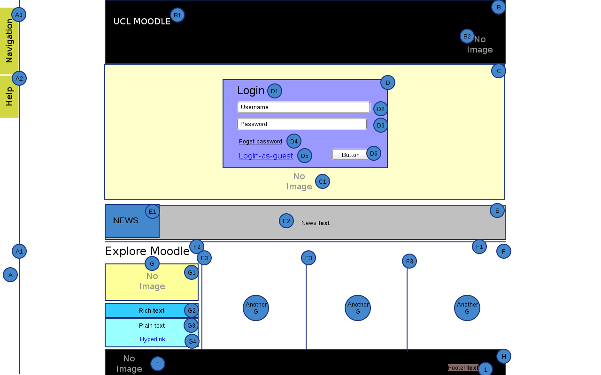

# Moodle UCL Theme Re-factoring Requirements

Background
The current production version of Moodle theme was developed during the Moodle 1.9 to 2.2 migration in 2012. The current theme has exposed many of compatibility and other issues during our next major Moodle 2.4 upgrade scheduled on 7th June 2013.  The scope of this re-factoring task are mainly the following.

-   Re-design the homepage/log-in area with new layout and background images.
-   Implement small change requests in theme (reported in Trac 2.2).
-   Minimize all customization to core code happened in Moodle 2.2 theme development.
-   Clean-up all dead and unused codes following Moodle theme design guidelines.
-   Document the theme customization.

The core objective of this task is to enhance the look and feel of theme and to increase the maintainability and compatibility for future Moodle major releases.

Development Requirements

-   Functional Requirements
    -    Homepage Pre-login wire-frame:
    -   
    -    Areas:  A = Left Docking panel, B = Top Header, C = Background image, D = Log-in Area, E = News box, F= Explore Moodle area, G = Explore block, H = Footer Area. 
-   Non-functional Requirements
    -   Follow clean and well-documented coding style. Please refer to Moodle coding standard (see [here](http://docs.moodle.org/dev/Coding)).

## Attachments:

 [Home Page - Pre-login.png](attachments/34374695/34701361.png) (image/png)

