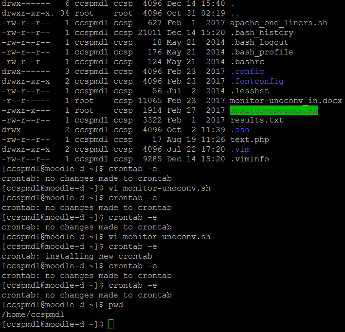
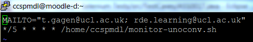
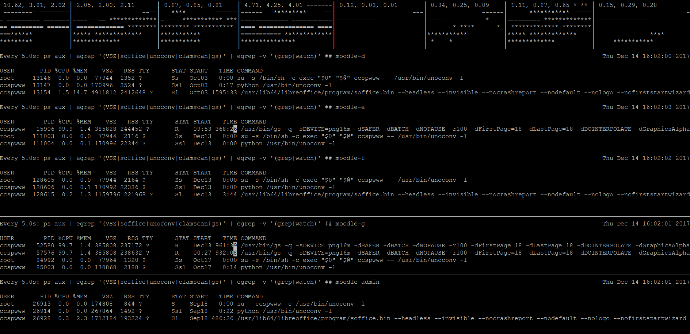
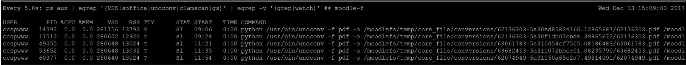
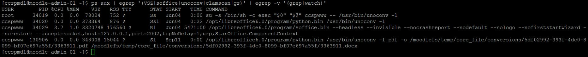
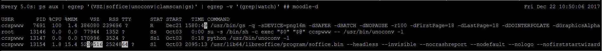
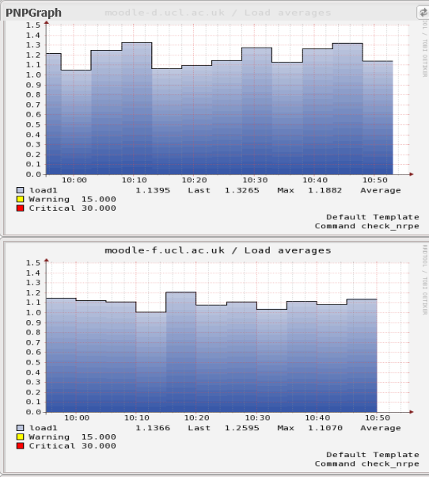

# Moodle Unoconv & GhostScript Process

[Niv's Unoconv notes](unoconv_notes)

### **Deleting stuck submissions**

Look in mdl\_assignfeedback\_editpdf\_queue   table.   Try to cross reference with mdl\_assign.id and the document filename

You will probably have to delete the original assignment in the submission inbox, if you can work out which one it is.

You can go to /moodlefs/temp/core\_file/conversions/  and delete the file there, but chances are a new file will get created**
**

### **Unoconv**

Moodle d-e-f-g all have a shell script called monitor-unoconv.sh located in /home/ccspmdl

This output of the shell script is emailed to the corresponding email address in the cron.  You can view the cron by typing crontab -e

On moodle-admin, there is a tmux session that shows the active unoconv processes running.  To view the tmux session log into moodle-admin and typing ***tmux attach -t monitor. *** To unattach from tmux hold ctrl and press b.  release ctrl and press d**.
**

The cause of concern is when a unoconv process gets stuck where a process should take no longer than a few minutes to complete.

To drill down further, log in to the app server in question and run

ps aux | egrep '(VSZ|soffice|unoconv|clamscan|gs)' | egrep -v '(grep|watch)' 

When a stuck process is identified, either ***python /usr/bin/unoconv -f pdf o /moodlelefs/temp/core\_files/conversions/.....*** will have a 0:00 time or ***/opt/libreoffice6.0/program/soffice.bin.....***** **will have a very long duration time.  These processes needs to be killed which can only be done by the Platforms Team as the process is run by user ccspwww.  Send an email to <isd-dcs-lob-wt@ucl.ac.uk> and <ias-team@ucl.ac.uk> with the following text

\*\*\*\*\*\*\*\*\*\*\*\*\*\*\*\*\*\*\*\*\*\*\*

Hi,

Please kill PID number .... on server name .....

Regards

\*\*\*\*\*\*\*\*\*\*\*\*\*\*\*\*\*\*\*\*\*\*\*

### **GhostScript**

This is also seen in the same tmux session which can be identified as usr/bin/gs -q -sDevice=png16m -dSafer ..... e.c.t as the ghost script is single core threading, you'll see that the CPU usage is at 100%.  Naemon will also show the applications servers thread load above 1.  To kill email Web Technologies**.
**

**
**

## Attachments:

 [image2017-12-14\_15-57-36.png](attachments/69503031/82445007.png) (image/png)
 [image2017-12-14\_15-59-26.png](attachments/69503031/82445008.png) (image/png)
 [image2017-12-14\_16-2-13.png](attachments/69503031/82445009.png) (image/png)
 [image2017-12-14\_16-4-10.png](attachments/69503031/82445011.png) (image/png)
 [image2017-12-22\_10-54-4.png](attachments/69503031/82446740.png) (image/png)
 [image2017-12-22\_10-56-14.png](attachments/69503031/82446741.png) (image/png)
 [image2018-9-12\_12-16-48.png](attachments/69503031/96728336.png) (image/png)

