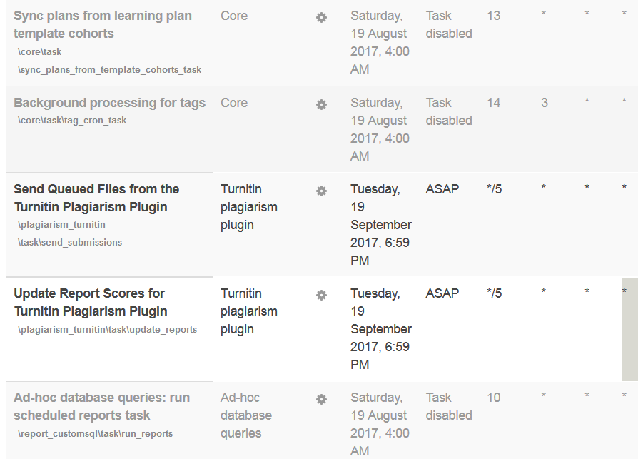

# Moodle assignment using Turnitin Plagiarism plugin on Moodle dev

This wiki page spacifically relates to the installed Plagiarism turnitintwo plugin for Moodle assignments on moodle-dev.ucl.ac.uk.The Plagiarism plugin allows Moodle assignments and other activities to use (turnitintoo plugin) Turnitin. When Turnitin is enabled on an assignment, all submitted documents are sent to a que and then submitted to Turnitin during the cron job run, cron jobs are disabled on Moodle dev instances so this will have to be executed manually.

## Issues when trying to manually run the cron job

There are three specific php plagiarism scripts (plagiarism\_cron\_task.php, send\_submissions.php and update\_reports.php) which needed to run but kept on failing. What intervened were two opcach.ini files which caused an error when trying to execute any php script using the cli. An extra config file was somehow added when php was upgraded at some point (/etc/php.d/10-opcach.ini). Every time when using the cli to execute a php script, php would try to load the opcach module again causing an error message and then terminating - Error: 'cannot load Zend OPcache - it was already loaded. The latest file (opcach.ini) was deleted, this solved the issue and allowed the scripts to successfully run, this issue may exist on other instances of Moodle.

## Scheduled tasks

To view the list of tasks which the cron job will run, log on to Moodle dev as an admin, Site administration &gt; Server &gt; Scheduled tasks.

All task as defult would already be enabled, to only run the required plagiarism and turnitin tasks, all other tasks will need to be disabled. This was completed by running a query on the database to set mdl\_task\_scheduled to 0 for Turnitin and plagiarism tasks and the rest to 1:

``` sql
#disable all tasks
update mdl_task_scheduled
set disabled = 1;

#enable turnitin and plagiarism tasks
update mdl_task_scheduled
set disabled = 0
where classname like '%turnitin%'
```

Once this query has been executed, you can check in Moodle to make sure that all other tasks are disabled by going back to the scheduled task page, you may need to refresh the page.




## Attachments:

 [plag.PNG](attachments/76386027/76386030.png) (image/png)

