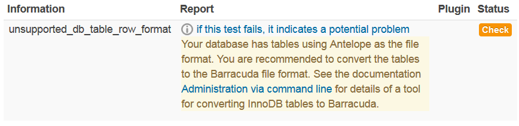

# Moodle database format - Antelope to Barracuda

In order for the Moodle database to use the full support of utf8\_unicode, the database format will need to be using Barracuda. Currently most UCL Moodle databases are using the Antelope format which has limited utf8\_unicode support. Moodle recommends that tables should be converted to use the Barracuda format.

There are a number of ways to check what format the MySql database is using for Moodle.

1.  Login as an administrator in to Moodle - Site administrator &gt; Server &gt; Environment. If the checks reports any errors relating to unsupported database table format then this indicates that some tables need to be converted into Barracuda format.
    
2.  Using an ssh client, connect to the server instance which you need to check, brows to the folder that contains the php files (/data/apache/htdocs/moodle\_v315/admin/cli) and run the script below to display the tables which needs converting:

    ``` bash
    $ php admin/cli/mysql_compressed_rows.php --list
    ```

For the full documantation on this please click [here](https://wiki.ucl.ac.uk/docs.moodle.org/33/en/Administration_via_command_line) and scroll down to the 'Converting InnoDB tables to Barracuda' heading.

## Getting tables converted

For effected tables to be converted, the task will need to be assigned to ISD.Database Technology and Architecture (DBA) please see RF Ticket 02520925. Example below of the mysql query which was applied and tested and working on Moodle dev.

>     Server: mysdb-01-d.adcom.ucl.ac.uk
>
>     Database: moodle_dev_20170215
>
>     Query to run:

``` sql
SET SESSION sql_mode=STRICT_ALL_TABLES;
SET GLOBAL innodb_file_per_table=1;
SET GLOBAL innodb_file_format=Barracuda;
SET GLOBAL innodb_large_prefix = 'on'

ALTER TABLE mdl_certificate ROW_FORMAT=Compressed;
ALTER TABLE mdl_data ROW_FORMAT=Compressed;
ALTER TABLE mdl_data_fields ROW_FORMAT=Compressed;
ALTER TABLE mdl_enrol_paypal ROW_FORMAT=Compressed;
ALTER TABLE mdl_hotpot ROW_FORMAT=Compressed;
ALTER TABLE mdl_hotpot_cache ROW_FORMAT=Compressed;
ALTER TABLE mdl_lti ROW_FORMAT=Compressed;
ALTER TABLE mdl_questionnaire_survey ROW_FORMAT=Compressed;
ALTER TABLE mdl_user ROW_FORMAT=Compressed;
ALTER TABLE mdl_user_info_field ROW_FORMAT=Compressed;
```

To check if the conversions were successfull, log back in to Moodle (Moodle - Site administrator &gt; Server &gt; Enviroment.) and check if there are no errors reported relating to database table formats, also run the script ($ php admin/cli/mysql\_compressed\_rows.php --list) again to see if it reports that no tables need converting, this will be indicated by 'Compressed' at the end of each line.

## Attachments:

 [cli.PNG](attachments/76385577/76385573.png) (image/png)
 [Capture.PNG](attachments/76385577/76385609.png) (image/png)

