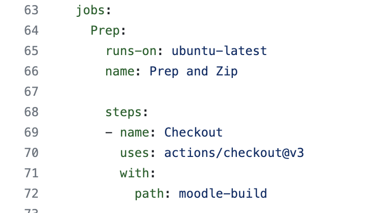
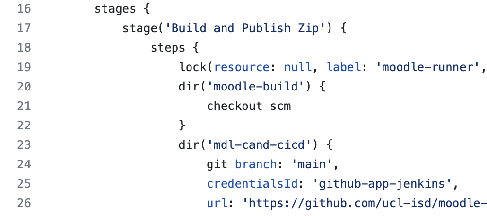

# Moodle github actions pipeline

### Introduction

Jenkins and Github actions are both CICD pipelines which has a series of stages/jobs containing steps.

Below are snippets of a Jenkins file and a github actions file:

| Github actions workflow                                        | Jenkins                                                        |
|----------------------------------------------------------------|----------------------------------------------------------------|
|  |  |

We are migrating from using Jenkins to use github actions, one obvious benifit is that everything will be used from one application, please visit the user guids [here](https://wiki.ucl.ac.uk/display/DP/GitHub+Actions+User+Guides).

## Attachments:

 [Screenshot 2023-05-01 at 07.46.44.png](attachments/262439614/260868062.png) (image/png)
 [Screenshot 2023-05-01 at 07.49.10.png](attachments/262439614/260868063.png) (image/png)

