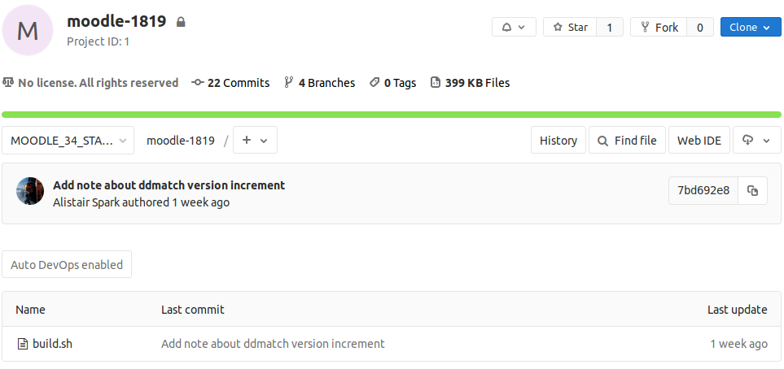
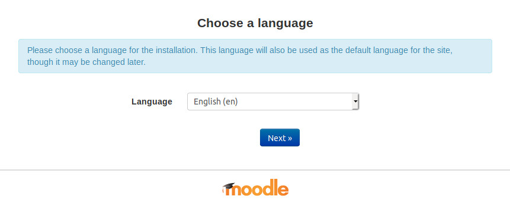

# Moodle new build - Git deployment

This has now been automated as part of the Moodle Candidate CICD Pipeline but the instructions are mostly still accurate if you want to run this manually

**Introduction**

Below are step by step instructions on how to create a newly released version of Moodle containing our UCL configurations, hacks and plugins.

We will be using various git processes to accomplish the build, after the build is completed, we will run the PHPUnit tests for the release.

**Requirements**

-   Git installed on your local system - <https://gitforwindows.org/>  <https://git-scm.com/downloads>
-   Access to Moodle test server - moodle-01-u.ucl.ac.uk
-   Access to Moolle UCL git repo - <https://git.automation.ucl.ac.uk/moodle>
-   Git basics - <https://git-scm.com/book/en/v1/Getting-Started-Git-Basics>
-   Your local systems public ssh-key added to your UCL GitLab account - <https://git.automation.ucl.ac.uk/help/ssh/README#generating-a-new-ssh-key-pair>

**Contents**

-   [1) Clone the latest stable release of public Moodle to your local system](#MoodlenewbuildGitdeployment-1)ClonethelateststablereleaseofpublicMoodletoyourlocalsystem)
-   [2) Add a remote entry in git to fetch UCL Moodle core files](#MoodlenewbuildGitdeployment-2)AddaremoteentryingittofetchUCLMoodlecorefiles)
-   [3) Create a new branch and track changes with public Moodle remote branch](#MoodlenewbuildGitdeployment-3)CreateanewbranchandtrackchangeswithpublicMoodleremotebranch)
-   [4) Cherry pick UCL hacks to your new branch (merge commits to your new branch)](#MoodlenewbuildGitdeployment-4)CherrypickUCLhackstoyournewbranch(mergecommitstoyournewbranch))
-   [5) Push your new branch to UCL Moodle remote repository](#MoodlenewbuildGitdeployment-5)PushyournewbranchtoUCLMoodleremoterepository)
-   [6) Edit UCL Moodle build.sh file to relate to new branch](#MoodlenewbuildGitdeployment-6)EditUCLMoodlebuild.shfiletorelatetonewbranch)
-   [7) Clone your build.sh file and run the script](#MoodlenewbuildGitdeployment-7)Cloneyourbuild.shfileandrunthescript)
-   [8) Viewing your new Moodle site](#MoodlenewbuildGitdeployment-8)ViewingyournewMoodlesite)
-   [9) PHPUnit Test and config](#MoodlenewbuildGitdeployment-9)PHPUnitTestandconfig)

#### 1) Clone the latest stable release of public Moodle  to your local system

Create a folder on your local drive (Moodle\_build\_xxx), this will be your local working directory for your git repository and build folders. Open git bash or your linux terminal and type the command below to download a copy of MOODLE\_XX\_STABLE

``` bash
git clone https://github.com/moodle/moodle.git
```

You should now have a new folder created called 'moodle', change to this directory and type: **git status**. This should give you the results below and confirm that you have a working git repository on your local system.

<table>
<thead>
<tr class="header">
<th><p><br />
</p>
<div class="content-wrapper">
<p><br />
</p>
<div class="code panel pdl" style="border-width: 1px;">
<div class="codeContent panelContent pdl">
<pre class="bash" data-syntaxhighlighter-params="brush: bash; gutter: false; theme: Midnight" data-theme="Midnight" style="brush: bash; gutter: false; theme: Midnight"><code>On branch master
Your branch is up-to-date with &#39;origin/master&#39;.

nothing to commit, working tree clean</code></pre>
</div>
</div>
<p><br />
</p>
</div></th>
</tr>
</thead>
<tbody>
</tbody>
</table>

#### 2) Add a remote entry in git to fetch UCL Moodle core files

Currently we have a remote entry called 'origin' setup automatically when we first cloned the Moodle public repository, type: **git remote -v** to check this

<table>
<thead>
<tr class="header">
<th><div class="content-wrapper">
<p><br />
</p>
<div class="code panel pdl" style="border-width: 1px;">
<div class="codeContent panelContent pdl">
<pre class="bash" data-syntaxhighlighter-params="brush: bash; gutter: false; theme: Midnight" data-theme="Midnight" style="brush: bash; gutter: false; theme: Midnight"><code>origin  https://github.com/moodle/moodle.git (fetch)
origin  https://github.com/moodle/moodle.git (push)</code></pre>
</div>
</div>
<p><br />
</p>
</div></th>
</tr>
</thead>
<tbody>
</tbody>
</table>

Create a new remote entry called 'ucl' to fetch the required UCL files (a fetch will not merge anything)

``` bash
git remote add ucl git@git.automation.ucl.ac.uk:moodle/moodle-core.git
```

Now type: **git fetch ucl** to download files from UCL Moodle core remote repository to your local repository. When the files have finished downloading, we should now have public Moodle latest release and UCL Moodle core in our local repository.

#### 3) Create a new branch and track changes with public Moodle remote branch

Our working branch is currently set or checked out to a branch called 'master'. this contains the public Moodle repository we cloned in step 1.

Create a new branch called MOODLE\_XX\_UCL\_RELXXX and track changes with the latest stable public Moodle branch called 'MOODLE\_XX\_STABLE' on your local repo.

it is important to keep this naming convention for branches (MOODLE\_XX\_UCL\_RELXXX) otherwise the remote repository will reject your requests.

``` bash
git branch --track moodle_xx_ucl_relxxx origin/MOODLE_XX_STABLE
```

Type: **git checkout moodle\_xx\_ucl\_relxxx** to switch to your new branch, list the files of your current directory and open the file 'version.php' to verify that the version of Moodle you have is correct.

#### 4) Cherry pick UCL hacks to your new branch (merge commits to your new branch)

The 'cherry-pick' command will allow us to merge our UCL hacks (commits) to our local public Moodle repo so that we will end up with a branch ready to push/upload.

 Make sure to get the latest list from [New Moodle - Documented changes to core](New_Moodle_-_Documented_changes_to_core)

``` bash
git cherry-pick bf4a2618279b019251834ec53194667bc1b570ff 215b08c6026816664971b28890d904bb67ab18e9 8bc2ba501d57a7f709ad5a2c0efdb0ad0a40f81d 82ea357fbf805f1d249eac94b2c266592965ac19 cabcdef49b793784921b6e9a5eba75a4468580c8 67350e7ae515c8d0b651b05aa139f366fe1ca247 3c681a38187abe05b9fc82c512aaa506a8f8a129
```

To check that all UCL hacks (commits) were successfully merged, type: **git log --oneline -7** to display the recent log files.

<table>
<thead>
<tr class="header">
<th><div class="content-wrapper">
<p><br />
</p>
<div class="code panel pdl" style="border-width: 1px;">
<div class="codeContent panelContent pdl">
<pre class="bash" data-syntaxhighlighter-params="brush: bash; gutter: false; theme: Midnight" data-theme="Midnight" style="brush: bash; gutter: false; theme: Midnight"><code>229828582e0 (HEAD -&gt; moodle_34_ucl_rel348_test) [UCLCoreHack7] Allow manager and tutor roles to unenrol students during course resets
dd62760df15 [UCLCoreHack6] Homepage for Guests - Redirect Guests to the index of courses so they can find a course to look at
960b877e6fc [UCLCoreHack5] Lesson - Grade Essays option should list students alphabetically
3844d5fbc89 [UCLCoreHack4] Add Kosovo to list of countries available for user profiles
cff8891abf6 [UCLCoreHack3] Course Reset should reset comments and completion data by default
7746eaaca3f [UCLCoreHack2] Make the recent and upcoming calendar export include events for the next 90 days
dee50ea8bec [UCLCoreHack1] Remove ability to select hourly and daily calendar subscription update frequencies due to impact on server load</code></pre>
</div>
</div>
<p><br />
</p>
</div></th>
</tr>
</thead>
<tbody>
</tbody>
</table>

#### 5) Push your new branch to UCL Moodle remote repository

The command below will create a new branch in GitLab - UCL Moodle remote repository and upload our local repository.

``` bash
git push ucl moodle_xx_ucl_relxxx:MOODLE_XX_UCL_RELXXX
```

After the push process has completed, you should now be able to visit the remote site at [git.automation](https://git.automation.ucl.ac.uk/groups/moodle/-/activity) to check your branch, files and commits.

#### 6) Edit UCL Moodle build.sh file to relate to new branch

Within GitLab, navigate to the latest moodle build (<https://git.automation.ucl.ac.uk/moodle/moodle-1819>) and remember to select the correct stable branch. For the purpose of this example, the branch name is: MOODLE\_34\_STABLE.

If you are creating a SnapShot instance please use build.sh at <https://git.automation.ucl.ac.uk/moodle/moodle-snapshots> and follow the extra steps [here](https://wiki.ucl.ac.uk/display/ISMoodle/Moodle+SnapShot+upgrade+checks). 

Open 'build.sh' by clicking on the 'build.sh' file icon, you will then be able to click the 'Edit' button to amend the file.



 Edit the following lines according to your new branch name and folder preferences:

| 1   
      
 80   
      
 81   | **git clone --branch MOODLE\_34\_UCL\_REL300 git@git.automation.ucl.ac.uk:moodle/moodle-core.git moodlesite/** 
                                                                                                                  
  mv moodlesite MOODLESITE-XX-RELEASE-MARCH-2019                                                                  
                                                                                                                  
  zip -r artefact-moodlesite-348-RELEASE-MARCH-2019.zip moodlesite-348-RELEASE-MARCH-2019/                        |
|-----|----------------------------------------------------------------------------------------------------------------|

Enter a new branch name (ISD-MOODLE\_XX\_STABLE\_XXX) in the 'Target Branch' field then click the 'Commit changes' button. The name must follow the naming convention otherwise you will receive an error message.

#### 7) Clone your build.sh file and run the script

Back on your local system, navigate to your working directory you created in step 1 and clone the Moodle build.sh file you just edited.

``` bash
git clone git@git.automation.ucl.ac.uk:moodle/moodle-1819.git ISD-MOODLE_XX_STABLE_XXX
```

You should now have a new folder created called 'ISD-MOODLE\_XX\_STABLE\_XXX', change to this directory and type: git checkout ISD-MOODLE\_XX\_STABLE\_XXX to switch to your new branch.

You may not have permissions to run the build script, type: **sudo chmod +x build.sh** to give you execute permissions on the file, now you can run the file.

``` bash
./build.sh
```

This process should take about 4 minutes to finish downloading your latest Moodle UCL build release in a folder and a zip file. repeat checks within steps 3 and 4  to verify the Moodle version and last commits.

For good house keeping, it is advised to remove all branches created within UCL GitLab if you have finished your tests or developments.

#### 8) Viewing your new Moodle site

Copy your zip file within your 'ISD-MOODLE\_XX\_STABLE\_XXX' to the moodle preview server.

``` bash
scp artefact-moodlesite-xxx-release-March-2019.zip username@mdl-preview01u.ad.ucl.ac.uk:/data/apache/htdocs
```

After the file has been copied, connect to moodle test server and unzip the file.

``` bash
ssh username@mdl-preview01u.ad.ucl.ac.uk
cd /data/apache/htdocs
unzip artefact-moodlesite-xxx-release-March-2019.zip
```

You should now have a new folder created called moodlesite-xxx-release-March-2019. Create a symlink to this folder so that the site will automatically be added as a htdocs directory.

``` bash
ln -s moodlesite-xxx-release-March-2019 xxxphpu
chmod o+w moodlesite-xxx-release-March-2019
```

Go to [https://](https://moodle-01-u.ucl.ac.uk/)[mdl-preview01u.ad.ucl.ac.uk](http://mdl-preview01u.ad.ucl.ac.uk/) and check if your vhost name (xxxphpu) has appeared on the list. Click on the url to verify that your Moodle site is up and running.

If you do not see your vhost name in the list, check if you are able to navigate to the directory using the symlink you created (cd xxxphpu), if not, delete the symlink and create another one.



You must also go in and disable the qtype\_stack plugin for the unit tests not to fail initial setup. (Issue will be logged upstream but unit tests don't seem able to use remote server for MaximaPool)

``` java
cd moodlesite-xxx-release-March-2019/question/type/
mv stack .stack
cd ../../..
```

Please note you might not have the stack plugin in your local build. If this is the case just continue to the next step.

#### 9) PHPUnit Test and config

On the Moodle test server, list the files in /data/apache/moodle-vhosts and copy config.php file from a previous Moodle release folder to your Moodle site folder(moodlesite-xxx-release-March-2019).

``` bash
cd moodlesite-348-release-March-2019-old
cp config.php config_local.php ../moodlesite-xxx-release-March-2019
cd ../moodlesite-xxx-release-March-2019
```

Open config.php in your moodlesite-xxx-release-March-2019 folder and amend the following lines replacing it with your current release version number (some configurations may be on different lines, if so, do a search for the entries)

config.php

| 32  
      
 38   
      
 52   
      
 656  
      
 657  | $CL-&gt;wwwroot = '<https://phpu.moodle-01-u.ucl.ac.uk>'; 
                                                             
  $CL-&gt;dataroot  = '/data/moodle/moodle\_phpu';           
                                                             
  $CFG-&gt;prefix    = 'mdl\_XXX';                           
                                                             
  $CFG-&gt;phpunit\_prefix = 'phpuXXX\_';                    
                                                             
  $CFG-&gt;phpunit\_dataroot = '/data/moodle/phpudataXXX';   |
|-----|-----------------------------------------------------------|

Now create the phpunit dataroot folder as referenced above and give the folder the relevant permissions.

``` bash
cd /data/moodle
mkdir phpudataxxx moodle_xxxphpu
chmod o+w phpudataxxx moodle_xxxphpu
```

PHPUnit requires an installation of Composer. Follow the instructions [here](https://getcomposer.org/download/) to install Composer in your Moodle site folder.

Once you have successfully installed composer.phar in /data/apache/moodle-vhosts/moodlesite-xxx-release-March-2019 execute composer installer.

``` bash
php composer.phar install
```

Then you need to initialise the test environment using following command.

``` bash
php admin/tool/phpunit/cli/init.php
```

Once the PHPUnit test enviroment setup is completed, you can now run the test in the background and create a text file output to save the results.

``` bash
vendor/bin/phpunit >> phpunitoutput-348-march2019build.txt &
```

\[Optional step\] To check progress you can run the following 

``` bash
tail -f  <outputfilename>
```

A typical run of a full PHPUnit tests for Moodle 3.4.8 may take over 2 hours so by running it in the background you can set it off and review the results the next day or after meetings.

Please visit <https://docs.moodle.org/dev/PHPUnit#Initialisation_of_test_environment> for information and installation instructions for PHPUnit test.

## Attachments:

 [gitlab\_1.png](attachments/115999506/116000238.png) (image/png)
 [moodle\_install.jpg](attachments/115999506/116000279.jpg) (image/jpeg)

