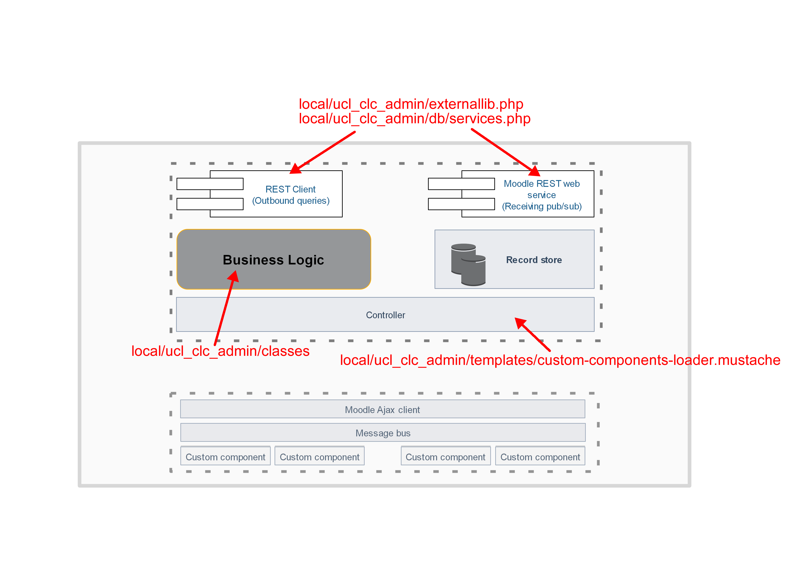
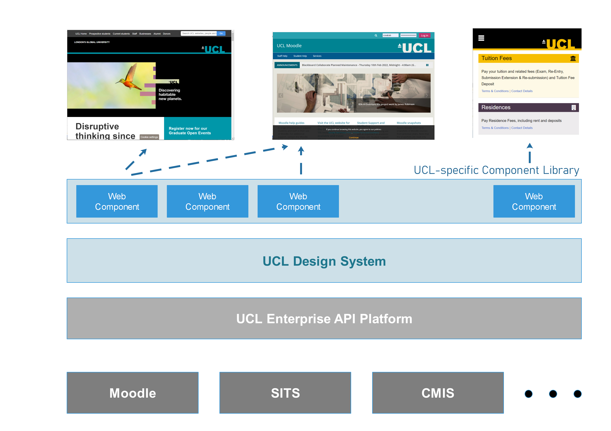
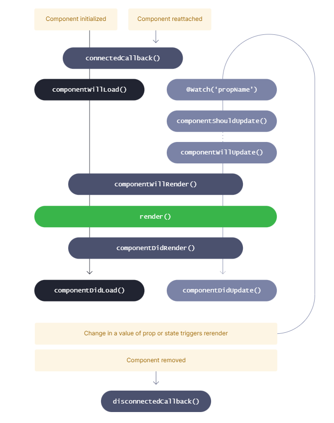

# Moodle plugin development

A custom Moodle plugin has been built to allow end users manage EoY and module occurrence data provided by SITS/Portico (via StuTalk)

The intention with the design choices made for this plugin is that it fits into a wider enterprise vision described by

The CLC admin plugin is split into two sections, a frontend built using the stenculJs framework, <https://stenciljs.com/>, that allows composing vendor-independent (i.e. neutral standards compliant), sophisticated web components. And a backend built as a conventional Moodle custom plugin.

The code for the frontend lives in local\\ucl\_clc\_admin\\amd\\custom-components, and can be compiled using the command: "**npm run build-for-moodle**"

Key to understanding the design and implementation of the frontend is the component lifecycle diagram from <https://stenciljs.com/docs/component-lifecycle>, reproduced below:

## Attachments:

 [plugin-component-design.png](attachments/188816241/188816239.png) (image/png)
 [plugin-component-design-annotated.png](attachments/188816241/230951411.png) (image/png)
 [tangential-ides.png](attachments/188816241/230951416.png) (image/png)
 [image2022-11-16\_16-43-7.png](attachments/188816241/230951426.png) (image/png)

