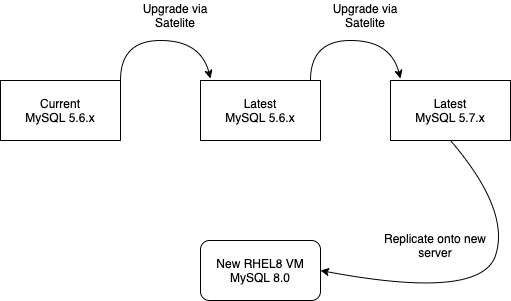

# MySQL upgrade plan

MySDB04 currently MySQL 5.6.x on RHEL6, we need to at least get to 5.7 to be able to continue updating Wiki & other apps. 

Outline of the long term plan to get to MySQL 8.0 / RHEL8

Dev - MySDB02D is MySQL 5.7.31 (→ 5.7.32)

Test - MySDB02T is  still MySQL 5.6.x

→ we must clear out databases & refresh databases on MySDB02T to do a dry-run before doing MySDB04 (prod)

Steps / Actions:

1) LA to send clear out instructions (Roy has sent list of databases which currently exist) - Harri will action so log as RF ticket

2) Dry run upgrade on MySDB02T to 5.6.x latest

3) Test apps ok on Test - DK

4) Prod MySDB04 update to 5.6 latest

5) Dry run upgrade on MySDB02T to 5.7.x latest

6) Test apps ok on Test - DK

7) Prod MySDB04 update to 5.7 latest

7.1) Mahara upgrade to 20.4 to make it compatible with RHEL8 / MySQL8???

→ Get here in April 2021

8) AS to request new RHEL8 / MySQL8 Prod + PP database servers as part decom/recom exercise

[DB Server Spec](DB_Server_Spec)

9) Setup replication from MySDB04 to new RHEL8 servers

10) Test apps ok on  MySQL8.0 / RHEL8 

11) Switchover app configs to RHEL8 / MySQL 8.0

12) decom mysdb04

13) Copy from mdl-db01 to new RHEL8 servers for 19/20 & 20/21 snapshot databases. Add missing entry in log table.

14) Test ok

15) Switchover 19/20 & 20/21 snapshots config to RHEL8 / MySQL 8.0

16) decom mdl-db01/mdl-db02/mdl-db01p/mdl-db02p

17) done (I think)

[Moodle Snapshot Tests with MySQL 5.7.33](Moodle_Snapshot_Tests_with_MySQL_5.7.33)

[Mahara Tests with MySQL 5.7.33](https://wiki.ucl.ac.uk/display/isdmyportf/Mahara+Tests+with+MySQL+5.7.33)

[Wiki Test Plan - Mysql 5.6 to 5.7](https://wiki.ucl.ac.uk/display/ISConfluence/Wiki+Test+Plan+-+Mysql+5.6+to+5.7)

[Opinio Tests](Opinio_Tests)

## Attachments:

 [MySQL upgrade plan.png](attachments/163650098/163650095.png) (image/png)

