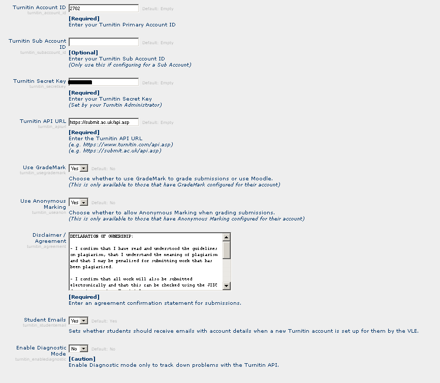

# New version of Turnitin from Northumbria Learning

-   [Sourcecode](#NewversionofTurnitinfromNorthumbriaLearning-Sourcecode)
-   [Installation instructions](#NewversionofTurnitinfromNorthumbriaLearning-Installationinstructions)
-   [Testing](#NewversionofTurnitinfromNorthumbriaLearning-Testing)
-   [Turnitin integration (from nLearning) bugs](#NewversionofTurnitinfromNorthumbriaLearning-Turnitinintegration(fromnLearning)bugs)
-   [Installation Road Map](#NewversionofTurnitinfromNorthumbriaLearning-InstallationRoadMap)
-   [Deployment to Production Moodle 12th November 2009: 8am - 9am (combined with 1.9.6 upgrade)](#NewversionofTurnitinfromNorthumbriaLearning-DeploymenttoProductionMoodle12thNovember2009:8am-9am(combinedwith1.9.6upgrade))
-   [Roll Back Procedure](#NewversionofTurnitinfromNorthumbriaLearning-RollBackProcedure)

## Sourcecode

Received a [new version](attachments/9801067/12091396.zip) of turnitin via email from Northumbria Learning on 10/11/09. This is the release candidate. It was installed on <http://moodle.ucl.ac.uk/> on 12/11/09

The fix log can be found here:  <http://bugzilla.nlearning.co.uk/fixlog/index.php?do=1>
A list of known issues can be found here: <http://bugzilla.nlearning.co.uk/fixlog/issuelist.php?do=1>

## Installation instructions

Extract the zip file to moodle/mod

This should create the directory moodle/mod/turnitintool

In moodle select the Notifications page. This will create the following tables:

mdl\_turnitintool

mdl\_turnitintool\_parts

mdl\_turnitintool\_users

mdl\_turnitintool\_courses

mdl\_turnitintool\_submissions

mdl\_turnitintool\_comments

The following records are inserted in to mdl\_log\_display

INSERT INTO mdl\_log\_display(module, action, mtable, field) VALUES ('turnitintool', 'add', 'turnitintool', 'name') 
INSERT INTO mdl\_log\_display(module, action, mtable, field) VALUES ('turnitintool', 'update', 'turnitintool', 'name') 
INSERT INTO mdl\_log\_display(module, action, mtable, field) VALUES ('turnitintool', 'view', 'turnitintool', 'name') 

A page is then displayed allowing you to specify new settings for Turnitin. Set these as below: 

The secret key is found in Jack's password file.

The text for the disclaimer agreement should be as follows:

- I confirm that I have read and understood the guidelines on plagiarism,
that I understand the meaning of plagiarism and that I may be penalised
for submitting work that has been plagiarised.

- I confirm that all work will also be submitted electronically and that
this can be checked using the JISC detection service, Turnitin®.

- If I have been asked to submit hard copy, I understand that the work
cannot be assessed unless both hard copy and electronic versions of the
work are handed in.

- I declare that all material presented in the accompanying work is
entirely my own work except where explicitly and individually indicated
and that all sources used in its preparation and all quotations are
clearly cited.

Turnitin Assignment should now be displayed when adding an activity within a course.

## Testing

Add a new Turnitin Assignment activity

On saving error message displayed:

"Could not update Turnitin Class data"

However on the Turnitin site, a new class has been created named the same as my moodle course.

I've emailed nLearning and received a reply on 26/05/09:

email from Paul Dawson

Hi Jo,

Indeed, please send through all errors and bugs you find to me, that would be very helpful. Also I see you have diagnostics mode on, thanks for that, it logs some stuff and tells me the line number of the code where the errors were found.

I have located the rogue sequence of code and will be looking into that bug. I will send you an amended lib.php file to replace the one you have once it has been patched.

Many thanks again for your help with the alpha integration testing.

Regards
Paul

 New code sent and installed on 26/05/09 but is giving same error. Emailed contents of mod/turnitintools/logs/commslog\_20090526.txt to Paul. I identified the problem to be due to the insert query failing when there is an apostrophe in the course title. The following error message was displayed:ERROR: Unclosed quote @ 153
STR: '
SQL: INSERT INTO mdl\_turnitintool\_courses ( COURSEID, OWNERID, TURNITIN\_CTL, TURNITIN\_CID ) VALUES ( 541, 64879, 'Joanne Matthews' Test Course (Moodle 121406)', 121406 ) .

Once I'd removed the apostrophe it worked well. A class was created in Turnitin and the assignment was added to the class. Initially there are no students added to the class. Students are added to the class when the student submits an assignment in Moodle. When I logged in as a student and submitted my first assignment, I got an error message saying that the file did not contain 100 words. I added some more text to the file and tried to re-submit but got an error saying that I could only submit the file once. In order to resubmit the file I had to first delete the assignment and then re-submit. The file was then uploaded to Turnitin. As a teacher I could view the assignment and give it a grade and see the similarity report. I was expecting the grade to be visible in moodle but it wasn't. As a student I got emailed a receipt to confirm that I had submitted an assignment. The grade is visible in moodle when logged on as admin. Clicking on the assignment loads the assignment in turnitin. I have emailed Bob Muid to arrange another meeting to answer some questions I have:

Q. When a turnitin assignment gets created in moodle, which account will it be created in, in turnitin. Is it created in the account of the currently logged in user?  or is there just one UCL account and all the moodle courses share this account.

A. The assignment gets created in a class (same name as moodle course) in your account in Turnitin. It knows what account to create it in because moodle uploads the userid and name. If you don't have an account set up in turnitin, one will be created for you. There is just one UCL account and all the courses get created in this account but only the user who created the assignment can see the assignment within the class in Turnitin.

Q. Does the person who is creating the assignment in moodle need to have an account set up in Turnitin?

A. No. The account gets created when the user creates an assignment in moodle.

Q. When logged in to turnitin can everyone see everyone elses courses?

A. No. you can only see your assignments.

Q. If an assignment is graded in turnitin, is the grade visible in moodle to the student?

A. Only if you set this in the assignment.

## [Turnitin integration (from nLearning) bugs](Turnitin_Bugs)

## Installation Road Map

<table>
<colgroup>
<col width="25%" />
<col width="25%" />
<col width="25%" />
<col width="25%" />
</colgroup>
<thead>
<tr class="header">
<th>
Date
</th>
<th>
Details 

</th>
<th>
Who 

</th>
<th>
Status 

</th>
</tr>
</thead>
<tbody>
<tr class="odd">
<td>
Mon 2nd Nov
</td>
<td>
Submit Turnitin/Moodle SCP to CAB before 2pm (for CAB meeting Tue 3rd Nov)
</td>
<td>
Jo/Rachel
</td>
<td>

</td>
</tr>
<tr class="even">
<td>
Weds 4th - Fri 6th Nov
</td>
<td>
LTSS have two independent testers testing the plug in - 'good to go' decision taken by end Friday
</td>
<td>
LTSS
</td>
<td>

</td>
</tr>
<tr class="odd">
<td>
Thursday 5th Nov 

</td>
<td>
Advertise outage to moodle users 

</td>
<td>
LTSS
</td>
<td>

</td>
</tr>
<tr class="even">
<td>
Mon 9th -Tues 10th Nov
</td>
<td>
deployment of plug-in on pp, final testing on pp (this should be easier)
</td>
<td>
Jo/LTSS 

</td>
<td>

</td>
</tr>
<tr class="odd">
<td>
Thurs 12th Nov 8am - 9am 

</td>
<td>
MOODLE OUTAGE: AppsDev install Turnitin Live Moodle (subject to testing/sign off from LTSS)
</td>
<td>
Jo
</td>
<td>

</td>
</tr>
</tbody>
</table>

## Deployment to Production Moodle 12th November 2009: 8am - 9am (combined with 1.9.6 upgrade)

<table>
<colgroup>
<col width="25%" />
<col width="25%" />
<col width="25%" />
<col width="25%" />
</colgroup>
<thead>
<tr class="header">
<th>
Responsibility
</th>
<th>
 
</th>
<th>
Details 

</th>
<th>
Notes 

</th>
</tr>
</thead>
<tbody>
<tr class="odd">
<td>
Systems
</td>
<td>
 
</td>
<td>
Stop Moodle CRON job (on c) 

</td>
<td>
 
</td>
</tr>
<tr class="even">
<td>
Systems
</td>
<td>
 
</td>
<td>
Remove Moodle-a/b from service (ie stop Apache)
</td>
<td>
 
</td>
</tr>
<tr class="odd">
<td>
apps-dev
</td>
<td>
 
</td>
<td>
Put Moodle in to maintenance mode
</td>
<td><ol>
<li> Log in to moodle as admin and select Administration &gt; server &gt; maintenance mode</li>
<li>Add a message to users telling them when we expect the server to be back in full service</li>
<li>Click Enable 
</li>
</ol></td>
</tr>
<tr class="even">
<td>
apps-dev
</td>
<td>
 
</td>
<td>
Backup database 

</td>
<td>
Login to moodledb as ccspsql and use this command: 
mysqldump moodle -u root -p &gt; /usr/local/mysql/backup/moodle_ddmmyy.sql 

</td>
</tr>
<tr class="odd">
<td>
apps-dev 

</td>
<td>
 
</td>
<td>
Copy the export tag for 1.9.6 over to a,b, and c and run the upgrade 

</td>
<td>
See the procedure in SVN repo. 

</td>
</tr>
<tr class="even">
<td>
apps-dev
</td>
<td>
 
</td>
<td>
Copy the exported turnitintools folder to: 
/data/apache/htdocs/moodle/mod 
on moodle-a/b/c 

</td>
<td>
 
</td>
</tr>
<tr class="odd">
<td>
apps-dev
</td>
<td>
 
</td>
<td>
Site Administration&gt; Notifications 

</td>
<td>
This will create the necessary tables and add records to mdl_log_display 

</td>
</tr>
<tr class="even">
<td>
apps-dev
</td>
<td>
 
</td>
<td>
Add the New Settings for the Turnitin pluggin 

</td>
<td>
see <a href="#NewversionofTurnitinfromNorthumbriaLearning-settings">#settings</a> 

</td>
</tr>
<tr class="odd">
<td>
apps-dev
</td>
<td>
 
</td>
<td>
Test it 

</td>
<td>
Go to a test course and a Turnitin assignment 

</td>
</tr>
<tr class="even">
<td>
Systems
</td>
<td>
 
</td>
<td>
Restart Apache on moodle-a/b 

</td>
<td>
 
</td>
</tr>
<tr class="odd">
<td>
Systems
</td>
<td>
 
</td>
<td>
Restart the Cron job 

</td>
<td>
 
</td>
</tr>
<tr class="even">
<td>
apps-dev
</td>
<td>
 
</td>
<td>
Take moodle out of maintenance mode 

</td>
<td>
 
</td>
</tr>
<tr class="odd">
<td>
 
</td>
<td>
 
</td>
<td>
 
</td>
<td>
 
</td>
</tr>
</tbody>
</table>

## Roll Back Procedure

Delete /data/apache/htdocs/moodle/mod/turnitintools/.

Login in to moodledb as ccspsql and type the following to delete 3 records from the mdl\_log\_display table:

 delete \* from mdl\_log\_display where module="turnitintool"

## Attachments:

 [turnitinsettings1.PNG](attachments/9801067/12091394.png) (image/png)
 [turnitintool\_2009102301\_RC1\_hotfix.zip](attachments/9801067/12091396.zip) (application/zip)

