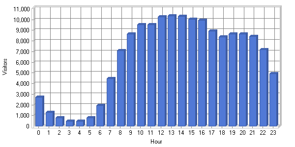

# OLD - Moodle management report autumn - winter 2010

-   [Quick refresher of Moodle infrastructure](#OLDMoodlemanagementreportautumnwinter2010-QuickrefresherofMoodleinfrastructure)
-   [Moodle problems at start of term](#OLDMoodlemanagementreportautumnwinter2010-Moodleproblemsatstartofterm)
-   [Large (slow) pages](#OLDMoodlemanagementreportautumnwinter2010-Large(slow)pages)
-   [Database performance](#OLDMoodlemanagementreportautumnwinter2010-Databaseperformance)
-   [Disk space for Moodledata](#OLDMoodlemanagementreportautumnwinter2010-DiskspaceforMoodledata)
-   [Statistics, capacity planning and Moodle 2](#OLDMoodlemanagementreportautumnwinter2010-Statistics,capacityplanningandMoodle2)
-   [Hardware failure (Sat 6 Nov 2010)](#OLDMoodlemanagementreportautumnwinter2010-Hardwarefailure(Sat6Nov2010))
-   [Server outages (Mon 8 Nov 2010)](#OLDMoodlemanagementreportautumnwinter2010-Serveroutages(Mon8Nov2010))
-   [Security patches](#OLDMoodlemanagementreportautumnwinter2010-Securitypatches)

#### Quick refresher of Moodle infrastructure

Moodle can be thought of as three main parts:

1.  Php web application (load balanced, served by moodle-a, b and c)
2.  MySQL database (known bottleneck, hence a dedicated 'master/slave' server - moodledb-c and d)
3.  Moodledata filestore (around 450GB of folders of session data and files used within courses (served by moodle-a and replicated on to b and c))

#### Moodle problems at start of term

After getting reports of extreme slow running at the start of term Pete Roberts analysed the apache logs and worked with Vivek Viswanathan to try to identify problematic pages and slow MySQL queries. There were two separate critical issues uncovered with third party plugins that together caused a 'perfect storm'. The most severe problem was some code which got into an infinite loop, eventually bringing Moodle to a halt. Scrapping the plugins was not an option as their functionality is desirable to users, so the PHP was traced and fixed, tested and Moodle was patched (see SCP 4820 : Moodle - critical bug fix to course menu block and SCP 4821 : Moodle - bug fix to mycourses block applied the week of 5th Oct 2010). Moodle performance improved and remained stable.

#### Large (slow) pages

While investigating the slow running, Pete worked with LTSS to identify moodle courses with large files or unnecessarily large home pages.  For example, courses set up with multiple large video files embedded on the home page can tie up the server for the equivalent of a hundred simultaneous 'normal' page views. LTSS then worked with the users to improve these courses and make the Moodle experience better for the course users and Moodle run faster for everyone else.

Longer term the Mediacast application (which has been delayed due to staff resource in Data Centre Services being directed to other projects) will allow users to upload these video files to a more appropriate location than the Moodle servers.

#### Database performance

Moodle database performance and maintenance has been vastly improved (with Vivek's expertise). The entire database is now being optimised monthly (see SCP 4130). Further investigations are underway to identify potential SQL bottlenecks in Moodle before they become problems. For example, the login process uses a function which works out the users role assignments. The SQL is slow and the problem will be exacerbated as the number of courses increase within Moodle (In Oct 2010 we are up to 3,305 active courses (5,485 total courses including test courses, courses in development)). This is another good reason to tighten up on housekeeping and remove redundant courses as this would keep the role assignments and contexts tables manageable.

#### Disk space for Moodledata

We were getting very close to running out of local disk space on the moodle application servers, we were down to 50Gb free space by the time the new disks were added and it was unlikely to have lasted until Christmas 2010 (we had planned to have Moodle on the central filestore by Autumn 2010 but due to delays with the filestore project this was not possible). Instead more local disks were installed in the application servers  by Andreas Roussos (see SCP 4842) and we now have 640GB free space available which should last us at least until Summer 2011 by which time we hope to migrate to the central filestore. Due to the load balanced set up of the Moodle service and good planning we were able to install these new hard disks with only one 20 minute outage to users at 8am on Thurs 4 Nov 2010) 

#### Statistics, capacity planning and Moodle 2

(We currently run Moodle 1.9.9, Moodle 2 is a complete rewrite of the application, we will begin investigations into how UCL could migrate when Moodle 2 is released)

In October 2010 there were 23,540 unique logins to Moodle, 418,287 logins in total

Pete produced an analysis of the apache logs for a 'typical' term time week for Moodle (data from 11-17 October 2010). Highlights are: 

***Overview***

<table>
<colgroup>
<col width="50%" />
<col width="50%" />
</colgroup>
<tbody>
<tr class="odd">
<td>
<strong>Hits</strong>
</td>
<td>
<strong> </strong>
</td>
</tr>
<tr class="even">
<td>
Total Hits
</td>
<td>
10,726,471
</td>
</tr>
<tr class="odd">
<td>
Visitor Hits
</td>
<td>
10,702,060
</td>
</tr>
<tr class="even">
<td>
Spider Hits
</td>
<td>
24,411
</td>
</tr>
<tr class="odd">
<td>
Average Hits per Day
</td>
<td>
1,532,353
</td>
</tr>
<tr class="even">
<td>
Average Hits per Visitor
</td>
<td>
69.62
</td>
</tr>
<tr class="odd">
<td>
Cached Requests
</td>
<td>
2,372,534
</td>
</tr>
<tr class="even">
<td>
Failed Requests
</td>
<td>
643,653
</td>
</tr>
<tr class="odd">
<td>
<strong>Page Views</strong>
</td>
<td>
<strong> </strong>
</td>
</tr>
<tr class="even">
<td>
Total Page Views
</td>
<td>
3,380,940
</td>
</tr>
<tr class="odd">
<td>
Average Page Views per Day
</td>
<td>
482,991
</td>
</tr>
<tr class="even">
<td>
Average Page Views per Visitor
</td>
<td>
21.99
</td>
</tr>
<tr class="odd">
<td>
<strong>Visitors</strong>
</td>
<td>
<strong> </strong>
</td>
</tr>
<tr class="even">
<td>
Total Visitors
</td>
<td>
153,721
</td>
</tr>
<tr class="odd">
<td>
Average Visitors per Day
</td>
<td>
21,960
</td>
</tr>
<tr class="even">
<td>
Total Unique IPs
</td>
<td>
35,237
</td>
</tr>
<tr class="odd">
<td>
<strong>Bandwidth</strong>
</td>
<td>
 

</td>
</tr>
<tr class="even">
<td>
Total Bandwidth
</td>
<td>
538.04 GB
</td>
</tr>
<tr class="odd">
<td>
Visitor Bandwidth
</td>
<td>
537.90 GB
</td>
</tr>
<tr class="even">
<td>
Spider Bandwidth
</td>
<td>
140.46 MB
</td>
</tr>
<tr class="odd">
<td>
Average Bandwidth per Day
</td>
<td>
76.86 GB
</td>
</tr>
<tr class="even">
<td>
Average Bandwidth per Hit
</td>
<td>
52.60 KB
</td>
</tr>
<tr class="odd">
<td>
Average Bandwidth per Visitor
</td>
<td>
3.58 MB
</td>
</tr>
</tbody>
</table>

*Activity by hour of day*

***Activity by day of week***

 
(The full stats report is available). Pete is working on extra reporting tools for Moodle for capacity planning (in association with LTSS). We can then advise ISD Data Centre Services and Network Services how much disk space Moodle will need in the coming years and what kind of loading / bandwidth we anticipate. The new release of Moodle (Moodle 2) stores files differently, so this needs to be investigated and taken into account.

#### Hardware failure (Sat 6 Nov 2010)

A disk failed on the Moodle master database server (moodledb-c) on Saturday 6 November around 2am. Unusually this caused the server to fail. The Moodle, Opinio and Myportfolio services were unavailable to users during this time. The DNS was manually changed to point at the slave mysql server by Adrian Barker following email discussion with Rachel Cooper. Things were back up and running by about 9am that morning. If we had not been checking our emails at the weekend these services would have been unavailable until Monday morning. Ways to automate this failover without manual intervention and improve the resilience of the Moodle service are being investigated through the VLE and Web Apps Planning meeting (held fortnightly, chaired by Rachel Cooper).

#### Server outages (Mon 8 Nov 2010)

Two of the three Moodle application servers became unresponsive on Monday 8th November. moodle-c remained operational and the service to users was not interrupted. moodle-a and -b had far too many apache processes running. Apache was restarted and these two servers were back in the load balanced farm. It isn't clear what caused this but it may well be related to a problem with Turnitin integration. Turnitin UK (submit.ac.uk hosted outside UCL) were experiencing problems for an hour or two and it is possible the Moodle turnitin plugin was effectively tying up processes.

We are looking at tuning the apache settings to prevent this happening again (again this will be tracked through the VLE and Web Apps Planning meetings). All three Moodle servers have been fine since.

#### Security patches

Version 1.9.10 of Moodle was recently released with some critical security fixes. We are currently running 1.9.9 but made the necessary fixes to the code to secure UCL Moodle on 29 Oct 2010 (see SCP 4858). The new version will be tested with a view to rolling out over the Xmas period.

## Attachments:

 [Activity\_by\_Hour\_of\_Day.png](attachments/15532806/14714869.png) (image/png)
 [Activity\_by\_Day\_of\_Week.png](attachments/15532806/14714870.png) (image/png)

