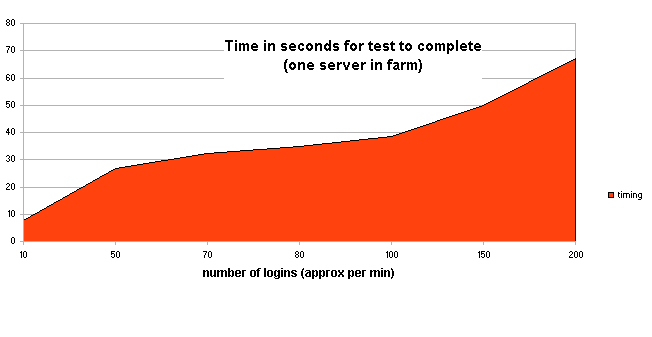
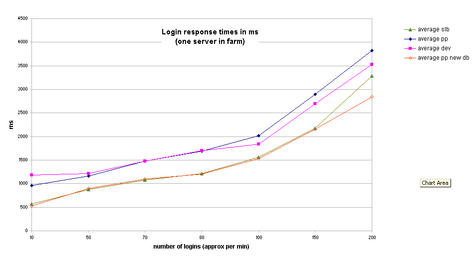

# OLD - UCL Moodle load testing

*This is a report from Pete about the initial, experimental load test on UCL Moodle. This took place August 26th 2009. There's some background information, a little bit about the approach and the results obtained.*

# Background

There was an initial requirement to gather some basic benchmarking figures for the existing UCL Moodle setup and to assess whether it will cope with expanded numbers of users.

After meeting with Pete Castle he helpfully provided me with some Badboy and Jmeter scripts which I adapted slightly.

The Jmeter test basically simulates a large amount of requests to Moodle using a small number of test user accounts. It reads a spreadsheet of users, passwords and search terms and then for each user in the list, it logs in, searches for a course and then logs out. This can be set to run using a number of simultaneous 'threads'.

It calculates the response time to deliver the HTML, though not the assorted stylesheets, javascript files etc. Although this isn't perhaps an exact mirror of real life, it does write to the database on every login which is one of the major Moodle performance bottlenecks - so it is quite a useful test. There is a limit on the number of threads that can be run from a single machine - above this and rather random and meaningless results are obtained.

At the VLE meeting (25 Aug) it was asked if I could simulate the effect of different numbers of simultaneous logins - or rather the effect of a class logging in. I therefore adapted my existing test to use different numbers of threads. Thus the number of logins over a short time period can be varied.

There was a requirement to test on the live infrastructure, but without an outage or risk. Obviously we didn't want to  risk database corruption  or simply  filling the live Moodle database with thousands of login records.

# A note on concurrent users

Although the object of the exercise was to test 'concurrent users' - this is a slightly misleading description. The nature of web applications is that there is quite a fleeting interaction with the actual server - there is no permanent connection as such - just the occasional request and response.

Advice from Moodle.org is to look at the number of events over a time period measured in minutes. They also provide advice on how to limit the damage in for example a lab class. Rather than say 'click Go to start' - say 'read the intro text and then click Go to start'. Since people read at different speeds - this effectively spreads the load out over a reasonable time.

More information on Moodle and loading - see Martin Langhoffs response on this thread: [http://moodle.org/mod/forum/discuss.php?d=102978](http://moodle.org/mod/forum/discuss.php?d=102978#p454659)

It was decided therefore to aim for up to about 200 logins over a minute.

# Test setup

It was decided to create a separate SLB test farm and place Moodle A and C into it. Then edit their config files to point at the moodle\_pp\_195 database which resides on the live server - so it's a fairly accurate test of the live setup with none of the risks. See also SCP 4191.

<table>
<colgroup>
<col width="50%" />
<col width="50%" />
</colgroup>
<thead>
<tr class="header">
<th>
moodle-test-slb.ucl.ac.uk  
(144.82.111.29)
</th>
<th>
moodle.ucl.ac.uk
</th>
</tr>
</thead>
<tbody>
<tr class="odd">
<td>
Test farm containing Moodle A and C 
Database - moodle_pp_195
</td>
<td>
Live service running on Moodle B 
Database - moodle
</td>
</tr>
</tbody>
</table>

# Issues on the day

The biggest problem with the SLB approach is that we were unable to test it in advance - it only works when there is a server in it.

On the day, it transpired that the DNS entry for the SLB hadn't been created.  I therefore had to re-edit the test script to use the IP address.  Also the config.php for the test machines needed their wwwroot entry modifying as well. Fortunately - fairly minor problems - but it did mean time was tight.

Slightly more of a showstopper was that the load balancing itself couldn't be tested with this approach. The original idea was to kick off simultaneous tests on two PCs - one connecting to Moodle A and one to Moodle C.

On the day all the WTS machines within reach connected to Moodle C, and all the local machines connected to Moodle A. Unfortunately jmeter wouldn't run under WTS - so it was only possible to test Moodle A's performance. This is a question for Bob to see if there is any way around this in future.

I noticed that the jmeter script 'logout' didn't actually work correctly - something to do with Moodle's session handling. Possibly this can be fixed in future - but forcibly logging in again as another user did write to the moodle log table and achieve the desired effect.  The database log file is the main bottleneck - so the logout  not really working is not that much of a problem.

# Notes for next time

-   The CRON job - it was necessary to stop this running on Moodle A and move it over to B for the duration of the test.
-   The config.php files needed their database entries changing AND their wwwroot entries.
-   The course search box HTML needs editing before running the test to make sure it points to the new wwwroot entry
-   Sort out some means of getting to Moodle A and C.

# Results

<table>
<colgroup>
<col width="33%" />
<col width="33%" />
<col width="33%" />
</colgroup>
<thead>
<tr class="header">
<th>
test
</th>
<th>
results
</th>
<th>
notes
</th>
</tr>
</thead>
<tbody>
<tr class="odd">
<td>
<strong>Elapsed time.</strong> 
The time taken in seconds for the entire test to complete was noted
</td>
<td>

</td>
<td>
 

</td>
</tr>
<tr class="even">
<td>
<strong>Response time.</strong> 
The response time in milliseconds was recorded for Moodle A, dev and pp. Then again on pp on 1st September with the new database
</td>
<td>

</td>
<td>
Note that the new database hardware has had a radical effect on the performance of PP, which was originally the slowest. 
It is safe to assume the live service is benefitting from a similar performance increase.
</td>
</tr>
</tbody>
</table>

**Conclusions?**

The results from this test seem pretty good and show a demonstrable improvement with the new database hardware. There wasn't time to increase the load to stressful levels, but as noted earlier - this can give random results from a single jmeter script.

In 'real life' response times would be slower as the browser requests other files - stylesheets, logos etc and of course has to then render them. Despite that, the test can be used as a benchmark to compare the effect of various configuration changes in future.

It's worth noting that the CRON job wasn't running on the test server farm - and this may be responsible for some of the slow running reported.
 

## Attachments:

 [login-elapsed.png](attachments/10333057/10486597.png) (image/png)
 [login-response-times.png](attachments/10333057/10486599.png) (image/png)

