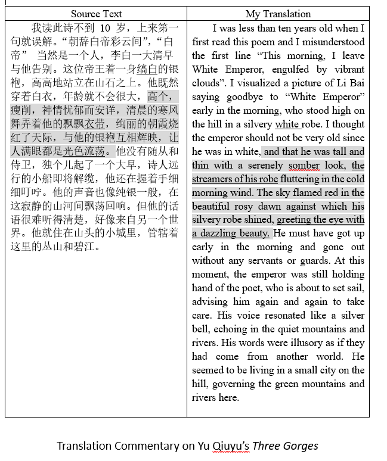
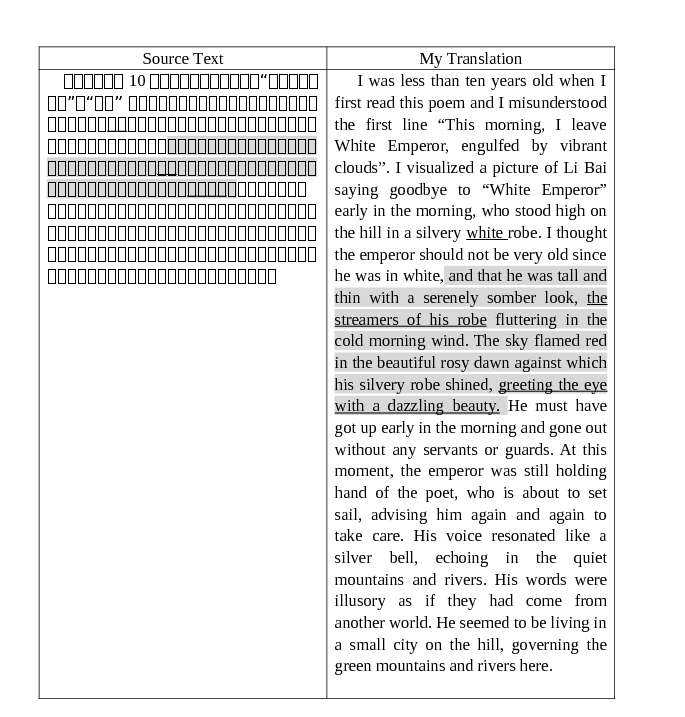
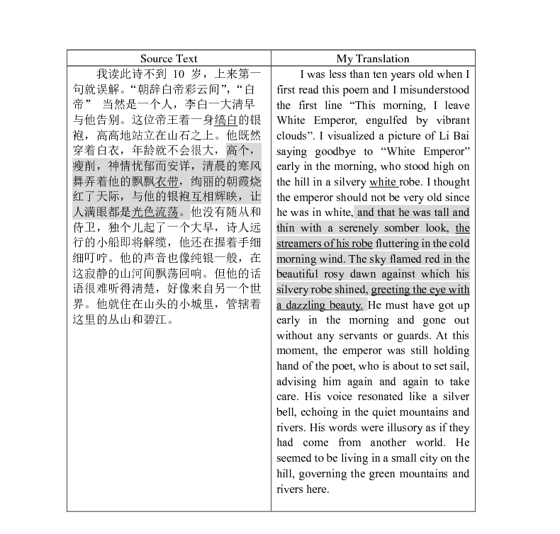
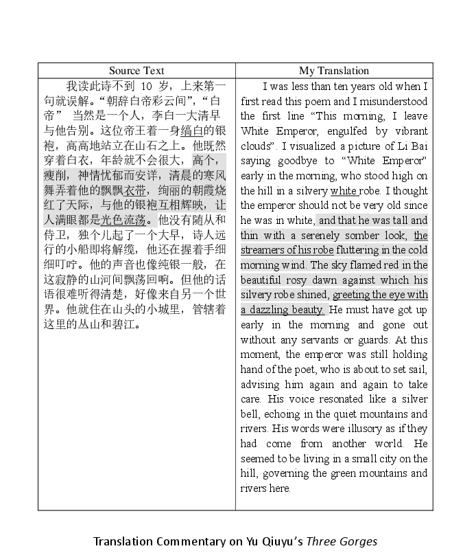
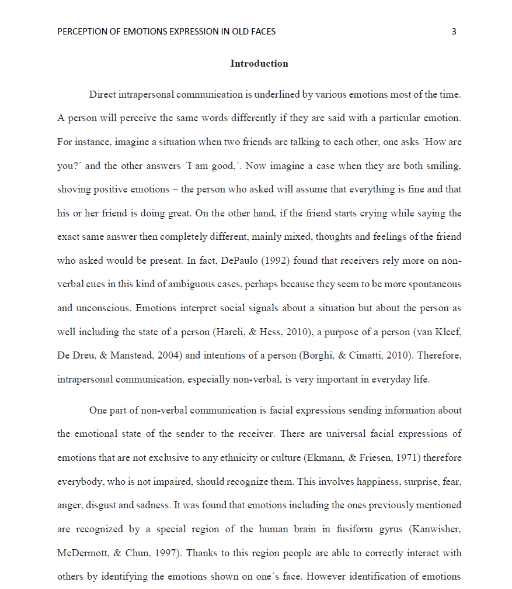
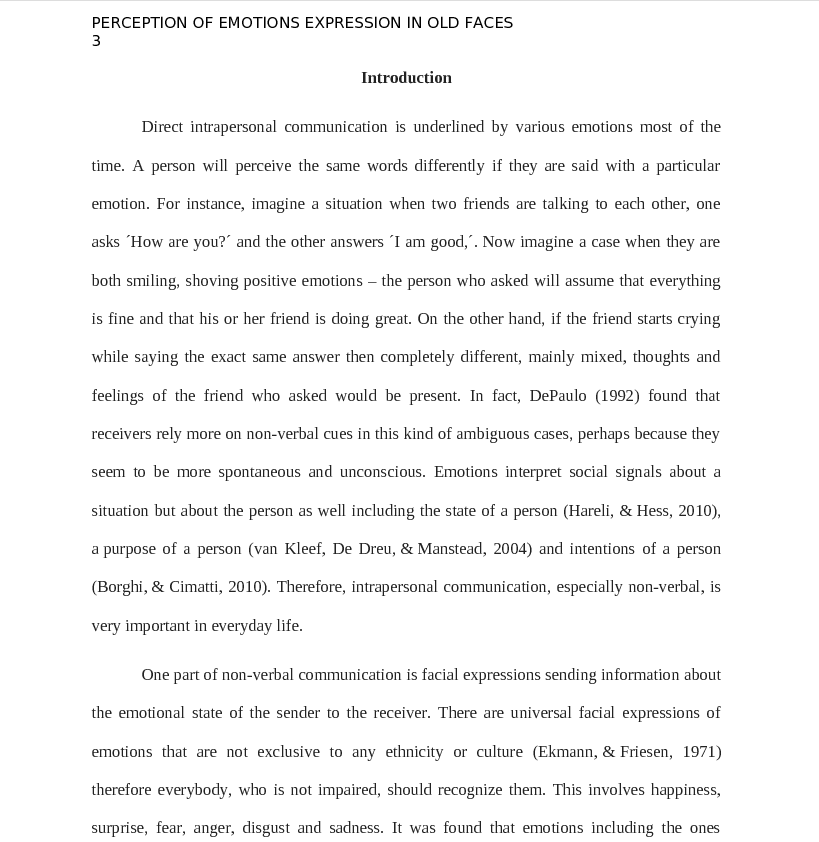
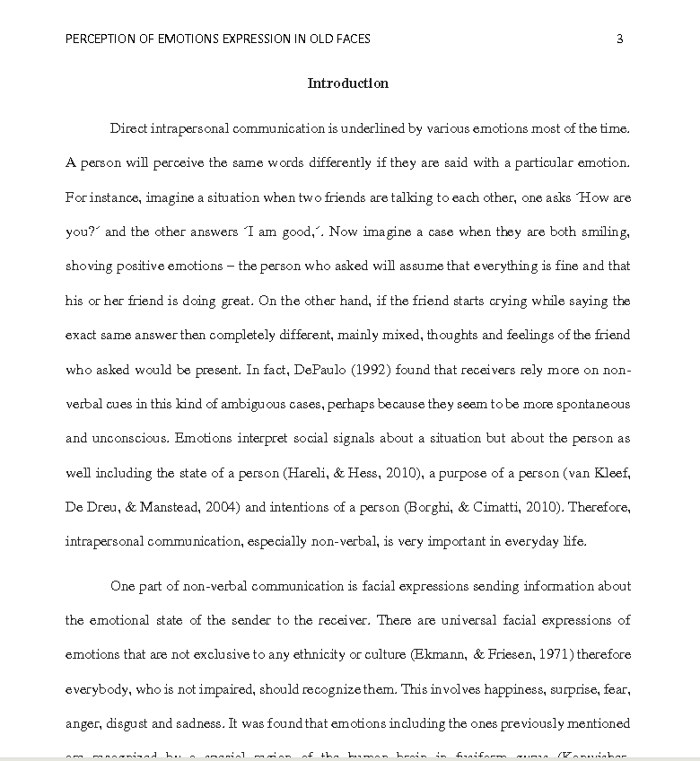
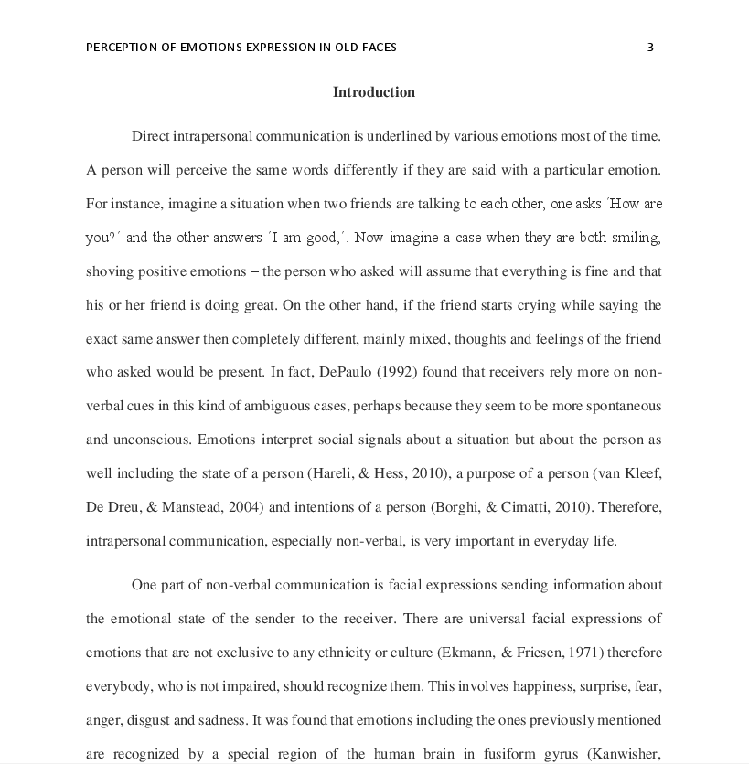

# Onedrive/Ghostscript Conversion tests

<table>
<thead>
<tr class="header">
<th>Problem</th>
<th>Original (Docx opened in Word)</th>
<th>Before (Prod - Unoconv &amp; ghostscript 8.70)</th>
<th>After (Pre-Prod - Onedrive for Business &amp; Ghostscript 8.70)</th>
<th>Further (PDF from OfB upload &amp; Ghostscript 9.26)</th>
<th>Conclusion................</th>
</tr>
</thead>
<tbody>
<tr class="odd">
<td>II]</td>
<td>N/A</td>
<td>
<a href="https://moodle-1819.ucl.ac.uk/mod/assign/view.php?id=730229&amp;rownum=0&amp;action=grader&amp;userid=84377" class="uri">https://moodle-1819.ucl.ac.uk/mod/assign/view.php?id=730229&amp;rownum=0&amp;action=grader&amp;userid=84377</a> 
 
<a href="https://moodle-1819.ucl.ac.uk/mod/assign/view.php?id=730229&amp;rownum=0&amp;action=grader&amp;blindid=38209" class="uri">https://moodle-1819.ucl.ac.uk/mod/assign/view.php?id=730229&amp;rownum=0&amp;action=grader&amp;blindid=38209</a>

Still do not load after 2 minutes
</td>
<td>
 
<a href="https://moodle-1819.ucl.ac.uk/mod/assign/view.php?id=730229&amp;rownum=0&amp;action=grader&amp;userid=84377">https://moodle-1819-pp.ucl.ac.uk/mod/assign/view.php?id=730229&amp;rownum=0&amp;action=grader&amp;userid=84377</a> 
 
<a href="https://moodle-1819.ucl.ac.uk/mod/assign/view.php?id=730229&amp;rownum=0&amp;action=grader&amp;blindid=38209">https://moodle-1819-pp.ucl.ac.uk/mod/assign/view.php?id=730229&amp;rownum=0&amp;action=grader&amp;blindid=38209</a>

Load accurately within 5-10 seconds
</td>
<td>N/A</td>
<td>Onedrive resolves this issue</td>
</tr>
<tr class="even">
<td>IV]</td>
<td>

</td>
<td>

</td>
<td>

</td>
<td>

</td>
<td>
Switching to the Onedrive converter resolves the asian character sets issue.

 

Ghostscript 9.26 rendering fidelity is lower than 8.70 for this document
</td>
</tr>
<tr class="odd">
<td>VII]</td>
<td>

</td>
<td>

 

<a href="https://moodle-1819.ucl.ac.uk/mod/assign/view.php?id=369008&amp;rownum=0&amp;action=grader&amp;userid=70405" class="uri">https://moodle-1819.ucl.ac.uk/mod/assign/view.php?id=369008&amp;rownum=0&amp;action=grader&amp;userid=70405</a>

</td>
<td>

 

 

<a href="https://moodle-1819-pp.ucl.ac.uk/mod/assign/view.php?id=369008&amp;rownum=0&amp;action=grader&amp;blindid=281019" class="uri">https://moodle-1819-pp.ucl.ac.uk/mod/assign/view.php?id=369008&amp;rownum=0&amp;action=grader&amp;blindid=281019</a>

</td>
<td>

</td>
<td>Onedrive rendering of the formatting is much better than unoconv but Ghostscript 8.70 renders document poorly. This is much improved in 9.26 but the fidelity is not perfect either (see 4th line)</td>
</tr>
</tbody>
</table>

## Attachments:

 [Prod-unoconv-gs8-70.PNG](attachments/112338346/112338413.png) (image/png)
 [PP-docx-onedrive-gs8-70-linebreak-added.PNG](attachments/112338346/112338414.png) (image/png)
 [IV-original.PNG](attachments/112338346/112338426.png) (image/png)
 [MDL34-PDF-upload-gs9-26-IV.PNG](attachments/112338346/112338427.png) (image/png)
 [Onedrive-PDF.PNG](attachments/112338346/112338429.png) (image/png)
 [PP-docx-unoconv-gs8-70.PNG](attachments/112338346/112338430.png) (image/png)
 [PP-docx-onedrive-gs8-70.PNG](attachments/112338346/112338431.png) (image/png)
 [MDL34-PDF-upload-gs9-26.PNG](attachments/112338346/112338432.png) (image/png)

