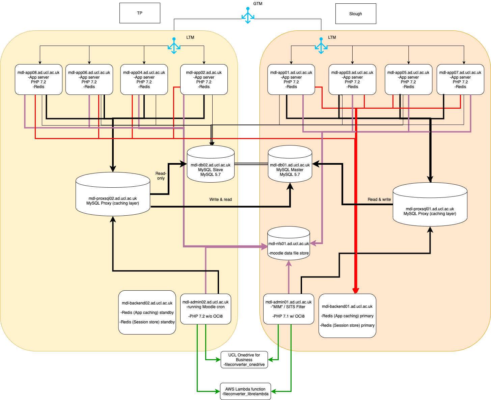
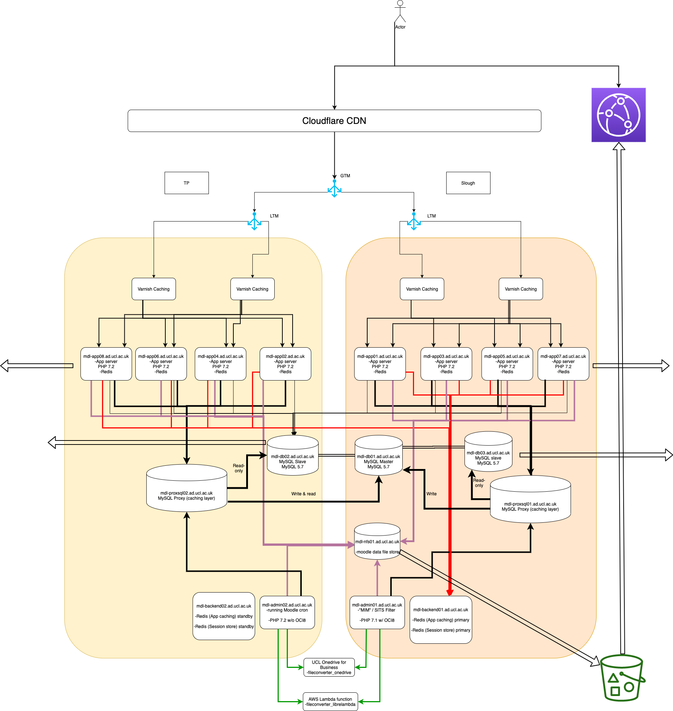

# ProxySQL

<table>
<thead>
<tr class="header">
<th>Docs</th>
<th>Rationale / Benefits</th>
<th>UCL Puppet config</th>
</tr>
</thead>
<tbody>
<tr class="odd">
<td><p><a href="https://github.com/sysown/proxysql" class="uri">https://github.com/sysown/proxysql</a></p>
<p><a href="https://github.com/sysown/proxysql/wiki/ProxySQL-Configuration" class="uri">https://github.com/sysown/proxysql/wiki/ProxySQL-Configuration</a></p>
<p><a href="https://github.com/voxpupuli/puppet-proxysql#reference" class="uri">https://github.com/voxpupuli/puppet-proxysql#reference</a></p></td>
<td><p><a href="https://mysqlserverteam.com/mysql-8-0-retiring-support-for-the-query-cache/" class="uri">https://mysqlserverteam.com/mysql-8-0-retiring-support-for-the-query-cache/</a></p>
<p><a href="https://proxysql.com/blog/scaling-with-proxysql-query-cache" class="uri">https://proxysql.com/blog/scaling-with-proxysql-query-cache</a></p>
<p><a href="https://www.percona.com/blog/2018/02/07/proxysql-query-cache/" class="uri">https://www.percona.com/blog/2018/02/07/proxysql-query-cache/</a></p>
<p><a href="https://www.percona.com/resources/webinars/utilizing-proxysql-connection-pooling-php" class="uri">https://www.percona.com/resources/webinars/utilizing-proxysql-connection-pooling-php</a></p>
<p><br />
</p></td>
<td><p><a href="https://git.dcs.ucl.ac.uk/puppet_infrastructure_services/profile_proxysql" class="uri">https://git.dcs.ucl.ac.uk/puppet_infrastructure_services/profile_proxysql</a></p>
<p><a href="https://git.dcs.ucl.ac.uk/puppet_infrastructure_services/hiera_mdl/blob/master/proxysql.yaml" class="uri">https://git.dcs.ucl.ac.uk/puppet_infrastructure_services/hiera_mdl/blob/master/proxysql.yaml</a></p>
<p><a href="https://git.dcs.ucl.ac.uk/puppet_infrastructure_services/hiera_mdl/blob/master/proxysql/preprod.eyaml" class="uri">https://git.dcs.ucl.ac.uk/puppet_infrastructure_services/hiera_mdl/blob/master/proxysql/preprod.eyaml</a></p></td>
</tr>
</tbody>
</table>

``` java
mysql -u admin -p -h127.0.0.1 -P6032
```

Password in Lastpass

List active rules

``` java
select rule_id,active,username,digest,destination_hostgroup,cache_ttl,apply from mysql_query_rules;
```

Find most intensive / frequent queries

``` java
SELECT digest,count_star,sum_time,digest_text FROM stats_mysql_query_digest WHERE digest_text LIKE 'SELECT%' ORDER BY sum_time DESC LIMIT 50;
SELECT digest,count_star,sum_time,digest_text FROM stats_mysql_query_digest WHERE digest_text LIKE 'SELECT%' ORDER BY count_star DESC LIMIT 50;
```

Add new rule

``` java
INSERT INTO mysql_query_rules (rule_id,active,username,digest,destination_hostgroup,apply) VALUES (55,1,'moodleuser',"0x07EBA4D8B8363287",2,1); 
LOAD MYSQL QUERY RULES TO RUNTIME;
```





## Attachments:

 [redis and proxysql.png](attachments/131389791/131389715.png) (image/png)
 [september.png](attachments/131389791/131391884.png) (image/png)

## Comments:

<table>
<colgroup>
<col width="100%" />
</colgroup>
<tbody>
<tr class="odd">
<td><p>Hi Alistair Spark did you do any cost analysis on implementing mySQLproxy? looking for esitmate to use with Drupal </p>
<div class="smallfont" align="left" style="color: #666666; width: 98%; margin-bottom: 10px;">
 Posted by cceajts at Oct 21, 2020 13:13
</div></td>
</tr>
<tr class="even">
<td><p>Cost isn't so much around the hardware(should really run directly on the frontend server) or software licensing (OSS), but on the time spent creating the rules about which queries should be cached - it's a very manual process &amp; because there is ideally meant to be one instance on each frontend server, rules need to be managed via Puppet rather than through the mysql-like interface on every single box to apply consistently but makes it an extra hurdle to make &amp; understand a change.</p>
<p>I think there is a benefit there but probably best to start with the implementation of InnoDB cluster on MySQL 8 from which you can have many read replicas; with MySQL Router handling the failover of the primary database. The read splitting really depends how it's implemented in your application but if working on active-active in multiple DCs then having you application configured to use an array of the read-only instances specifically located in the same DC as your frontend servers is key (cross-DC mysql adds a good 800ms/transaction) . Roy, Ehsan &amp; myself have spent a lot of time tweaking mysql router and the app server config to get optimal performance out of it and I think we are pretty much at the point of giving it the green light for wider adoption at Friday's OMM meeting - but really must avoid using Router to direct read traffic. </p>
<p>If you can do the read-only queries splitting and have many db read-replicas, probably worth starting there rather than going with ProxySQL - I'm not sure there was a significant server spec efficiency improvement in using proxysql vs having a similar sized read replica spec increase.  We had gone with 4 CPU / 16GB RAM for each proxysql node - adding 4 CPUs on the read-only replica is much easier. </p>
<p><br />
</p>
<p>And in all this is it's going to be DBA time which will be a significant constraint, had factored something between .5FTE - 1 FTE on the DBA front to ensure we had the necessary support in our on-prem scale up modelling.</p>
<p><br />
</p>
<div class="smallfont" align="left" style="color: #666666; width: 98%; margin-bottom: 10px;">
 Posted by cceaasp at Oct 21, 2020 14:06
</div></td>
</tr>
<tr class="odd">
<td><p>Had a quick google and I guess you don't currently have the read/write splitting in core drupal, so would need to look at something like <a href="https://www.drupal.org/project/autoslave" class="uri">https://www.drupal.org/project/autoslave</a> . Seems to do the array thing and similar failover mode as Moodle does, probably worth load testing with drupal specifically.</p>
<p><br />
</p>
<div class="smallfont" align="left" style="color: #666666; width: 98%; margin-bottom: 10px;">
 Posted by cceaasp at Oct 21, 2020 14:25
</div></td>
</tr>
</tbody>
</table>


