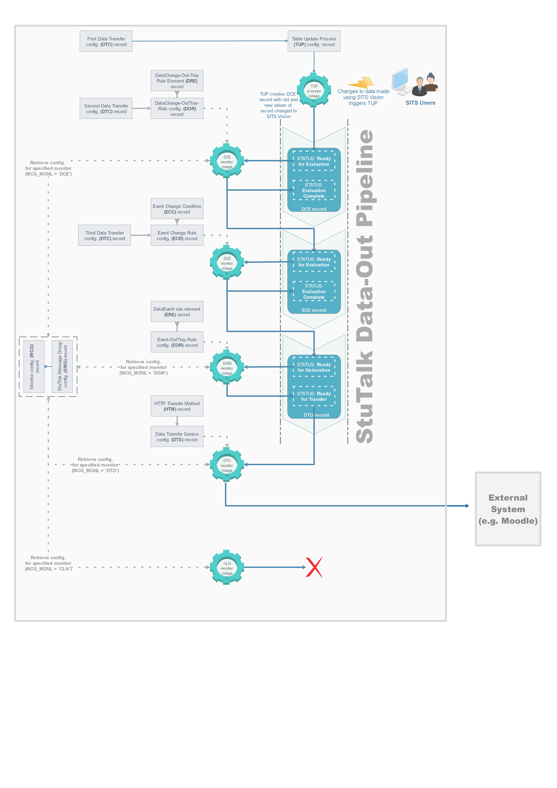
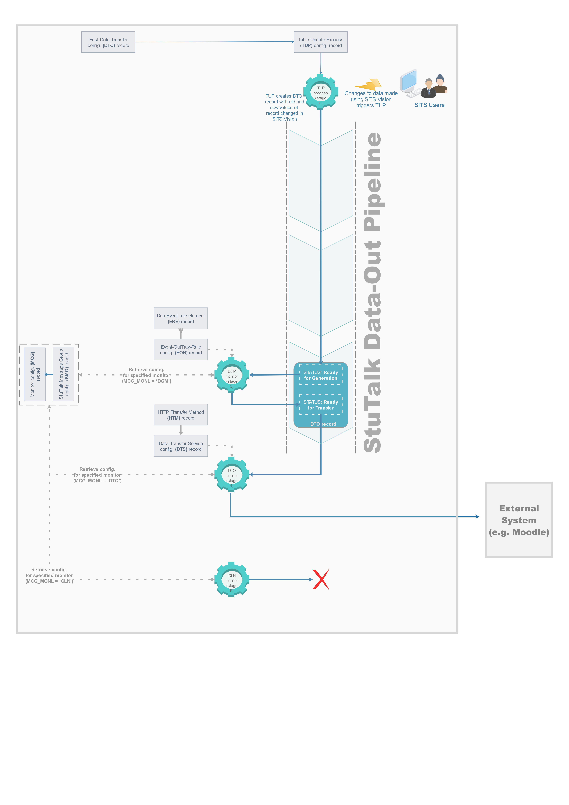

# Pub/sub API

A StuTalk pub/sub data pipeline (used to transfer data out of SITS) is really a collection of processes and configuration rules that work together to achieve the effect of a pipeline.

StuTalk pipelines can be quite general - accommodating complex types of change scenarios (for instance where changes across different types of records need to be "bundled" and published as a single change event). At the same it is possible to construct simpler pipelines to publish changes directly related to a single entity. This documentation briefly describes the general structure of pub/sub pipelines, but focusses in more detail on a simpler pipeline that is sufficient for the course lifecycle PoC. 

In order to configure StuTalk to notify Moodle whenever changes occur to module instance records in SITS, various types of records need to be created and configured:

-   Table Update Process (TUP) records - used to specify interest in changes to module instance (MAV) records. The TUP record created needs to be configured so it triggers the production of StuTalk 2.0 data event records, in the PoC pipeline, a Data Transfer Out (DTO) records (for downstream processing) when changes to MAV records are detected. DTO records are used in the Stu-Talk Publish process to record transfers moving out of SITS.

-   Various other types of data transfer and configuration records:

    -   Various “rule” and “pipeline” step processing records to specify when and how data generated by the the TUP should be processed and transferred out of SITS:Vision.

    -   Monitor configuration records - Monitors are SITS:Vision processes triggered by scheduled tasks or cron jobs, and that perform specific tasks that represent the processing steps in a StuTalk processing pipeline. Typically, the processing conducted by monitors involves creating, updating (records in a state indicating they are awaiting processing), importing or exporting records in the SITS:Vision database to reflect the progress of a data item through a StuTalk pipeline. StuTalk 2.0 depends on four types of monitor records to process data.

    -   StuTalk Message Group (SMG) records - used as a group-level identifier for the various types of message records needed to implement this integration. I.e. so it is clear which data records were created for this specific integration.

## General pipeline

## Simpler Pipeline (used for PoC)

## Attachments:

 [stutlak-pipeline-process-full.png](attachments/187271240/187271252.png) (image/png)
 [stutlak-pipeline-process-poc.png](attachments/187271240/187271302.png) (image/png)
 [stutlak-pipeline-process-full2.png](attachments/187271240/187271311.png) (image/png)
 [stutlak-pipeline-process-poc2.png](attachments/187271240/187271312.png) (image/png)

