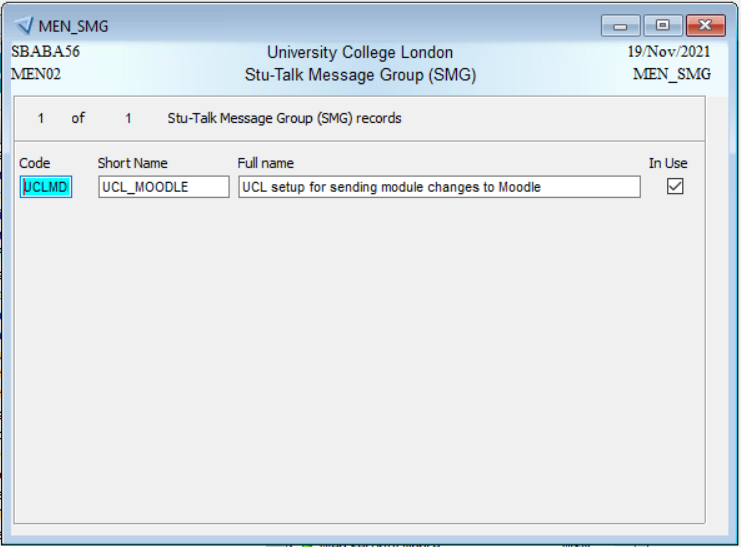
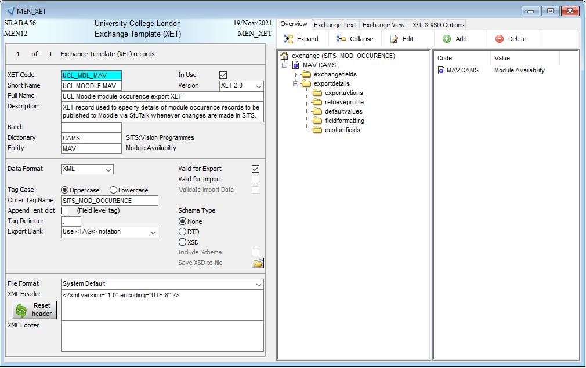
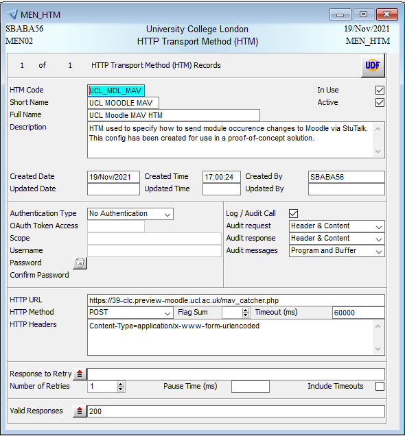
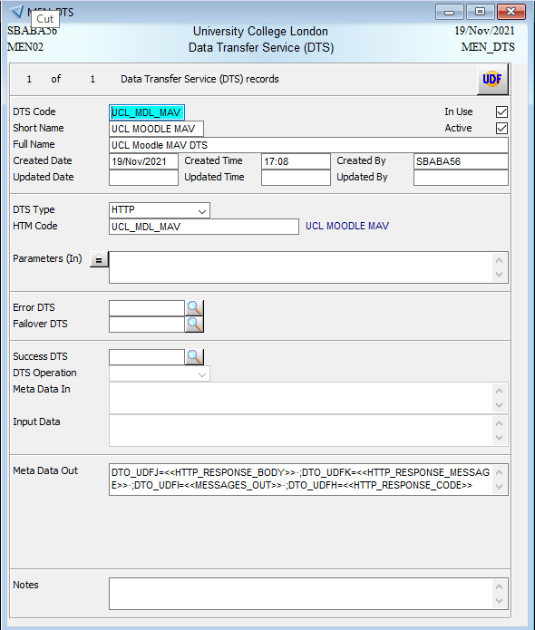
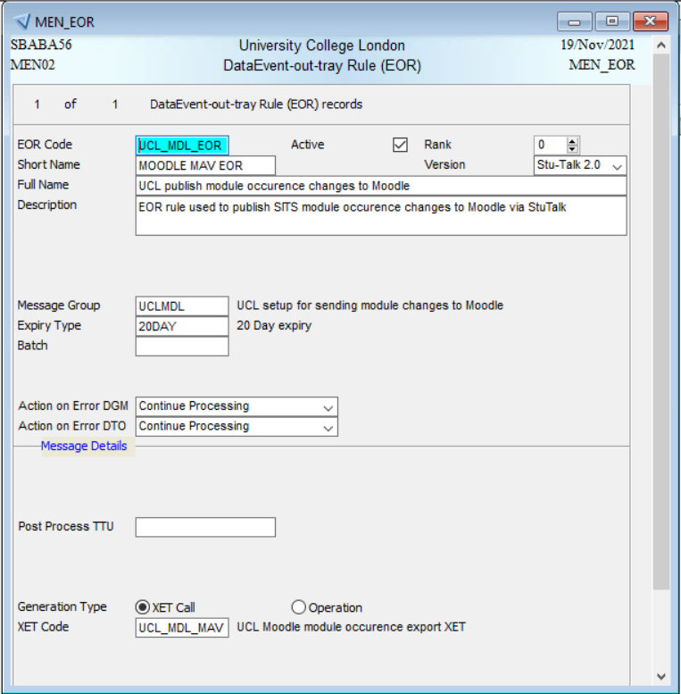
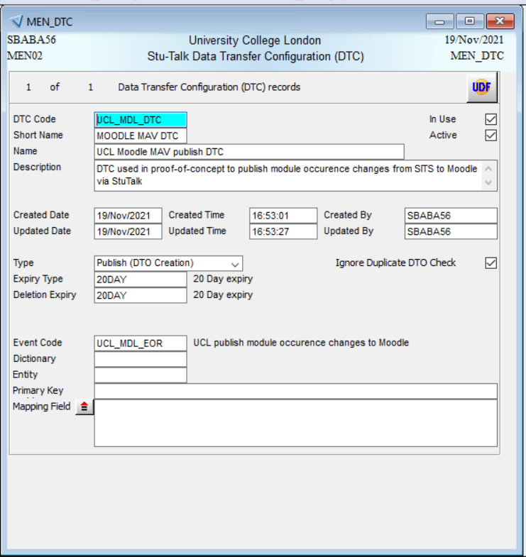
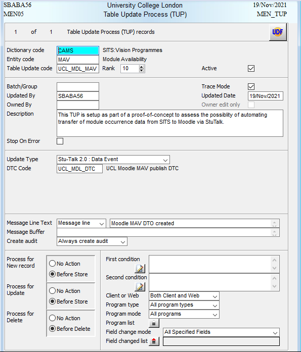
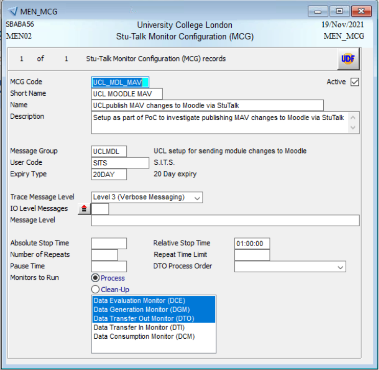

# Pub/sub API (for PoC)

**NOTE: It’s best to use the MAVS (MAV maintenance screen to edit MAV records)**

-   Create StuTalk Message Group (SMG) to associate all StuTalk messages and configuration for this proof-of-concept

-   Create XET template

-   Create HTM config

-   Create DTS record

-   Create EOR rule

-   Create DTC

-   Create TUP

-   Setup monitors

-   Create desktop shortcut to trigger monitor processes with property: **\\**[**ad.ucl.ac.uk**](http://ad.ucl.ac.uk)**\\GroupFolders\\SRS\_SITS\\siapp\\vision\\dev\\uniface\\bin\\uniface.exe /asn=\\**[**ad.ucl.ac.uk**](http://ad.ucl.ac.uk)**\\GroupFolders\\SRS\_SITS\\siapp\\vision\\dev\\adm\\uclisits.asn stutalkmon UCL\_MDL\_MAV**

## Attachments:

 [dtc-0208670c-2562-445f-8b53-37aaf4cff3ea.png](attachments/187271336/187271323.png) (image/png)
 [dts-53723086-be6f-489c-8947-725ad01b61ba.png](attachments/187271336/187271324.png) (image/png)
 [eor-454cedb9-8f23-4378-88ab-564fe2495f72.png](attachments/187271336/187271325.png) (image/png)
 [htm-7ca9ee87-b229-4450-8845-f755e5ce4311.png](attachments/187271336/187271326.png) (image/png)
 [mcg-29176af0-b9d7-4c6f-b487-596aec3f595a.png](attachments/187271336/187271327.png) (image/png)
 [smg-62175e25-7fb2-4c78-9fcc-2882a2f94274.png](attachments/187271336/187271328.png) (image/png)
 [tup-faeb85b4-7f10-449d-8186-945d913c9178.png](attachments/187271336/187271329.png) (image/png)
 [xet-32daabea-b6ab-49bc-a191-b80022f56d20.png](attachments/187271336/187271330.png) (image/png)

