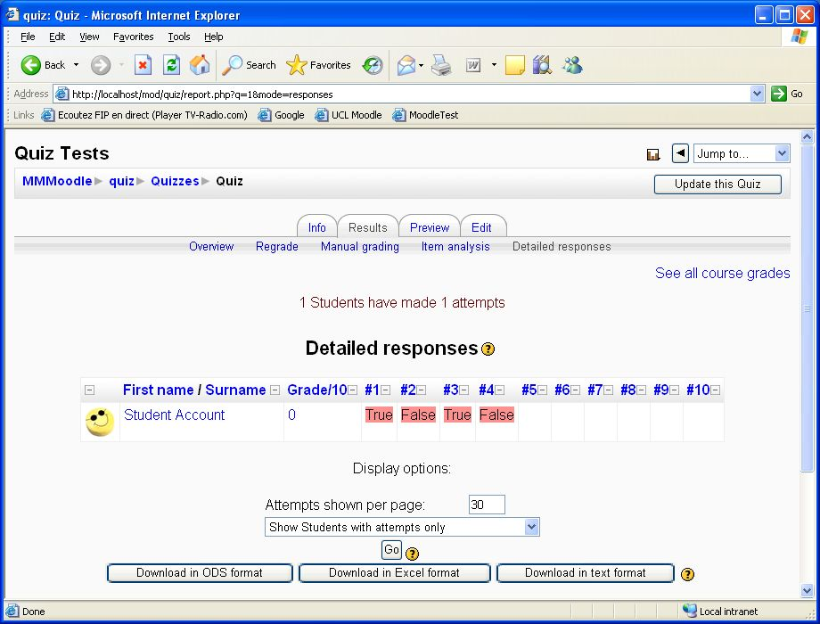

# Quiz Report - Detailed Responses

Information can be found at <http://moodle.org/mod/data/view.php?d=13&rid=96>

<http://download.moodle.org/download.php/plugins19/mod/quiz/report/responses.zip>

-   Download the responses zip file into the /data/apache/htdocs/moodle/mod/quiz/report folder by downloading it to your R: drive and using FTP to move it to the moodle server.
-   Unzip the file and a new responsesfolder will be created in the report folder.
-   Move the language files from /data/apache/htdocs/moodle/mod/quiz/report/reponses to data/apache/htdocs/moodle/lang
-   You do not need to go to notifications for this plugin.

### To test this block:

Go to your Moodle course and go to a quiz (create one if you have not already got one).

In your Quiz click on the Results tab and then the detailed responses tab.

### Notes:

We have been unable to get this block to work in 1.7.2 or 1.8.4, but it seems to work with no problems in 1.9.

------------------------------------------------------------------------

**Additional Notes for 1.9.3 Plugin**

This plugin was not committed to the 1.9.3 upgrade however the functionality has been requested so it is under review for inclusion back into the UCL Moodle service.

The latest versoin can be downloaded here;

 <http://download.moodle.org/download.php/plugins19/mod/quiz/report/responses.zip>

The plugin page:

<http://moodle.org/mod/data/view.php?d=13&rid=96> 

MoodleDocs page:

 <http://docs.moodle.org/en/Detailed_responses_report_plugin>

** Installation**

There are three parts to the installation:

1) Create a directory in **www/moodle/mod/quiz/report/responses/**

2) Extract report.php and styles.css into **www/moodle/mod/quiz/report/responses/**

3) Overwrite the language file  **quiz\_responses.php** in **www/lang/utf\_8/**

**Testing**

View the Report tab of a quiz in Moodle and click 'Detailed Responses'. Should look like below:

(click for bigger) 

## Attachments:

 [detailedResponses.jpg](attachments/2031755/7798923.jpg) (image/jpeg)

