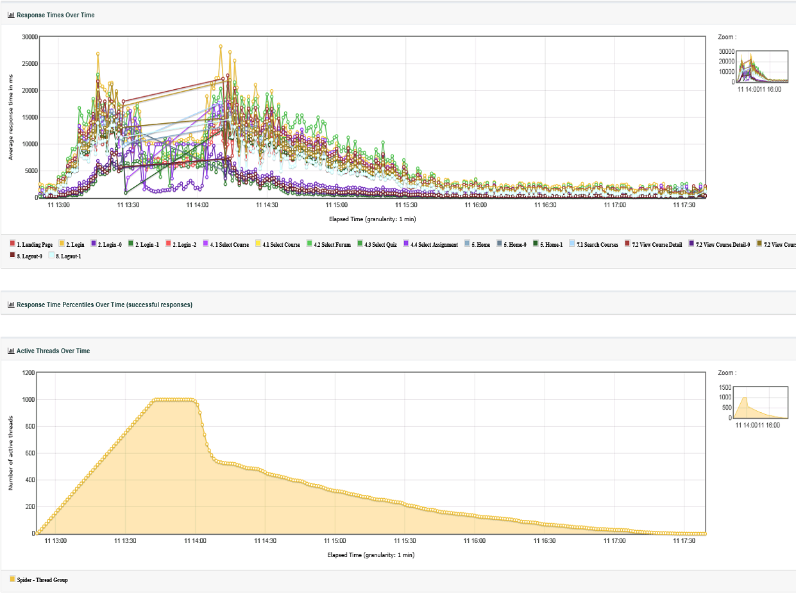

# RHEL6 vs RHEL7

## LOAD TEST 1 - 900 Active Threads

### RHEL6

### RHEL7

|                          |                                                               |
|--------------------------|---------------------------------------------------------------|
| Environment              | [moodle-1819-pp.ucl.ac.uk/](http://moodle-1819-pp.ucl.ac.uk/) |
| Jmeter Version           | 5.1.1                                                         |
| Source file              | "SpiderVM03\_2019-10-07\_13\_46\_04.csv"                      |
| Number of Threads        | 600                                                           |
| Ramp up period (seconds) | 600                                                           |
| Loop Count               | 3                                                             |
| Start Time               | "10/7/19 1:46 PM"                                             |
| End Time                 | "10/7/19 2:20 PM"                                             |

|                          |                                                         |
|--------------------------|---------------------------------------------------------|
| Environment              | [moodle-pp.ucl.ac.uk](http://moodle-1819-pp.ucl.ac.uk/) |
| Jmeter Version           | 5.1.1                                                   |
| Source file              | "SpiderVM03\_2019-09-26\_17\_21\_16.csv"                |
| Number of Threads        | 600                                                     |
| Ramp up period (seconds) | 600                                                     |
| Loop Count               | 3                                                       |
| Start Time               | "9/26/19 5:21 PM"                                       |
| End Time                 | "9/26/19 6:06 PM"                                       |

### RHEL6

### RHEL7

| Environment              | [moodle-1819-pp.ucl.ac.uk/](http://moodle-1819-pp.ucl.ac.uk/) |
|--------------------------|---------------------------------------------------------------|
| Jmeter Version           | 5.1.1                                                         |
| Source file              | "GradeRptVM05\_2019-10-07\_13\_47\_08.csv"                    |
| Number of Threads        | 300                                                           |
| Ramp up period (seconds) | 300                                                           |
| Loop Count               | 3                                                             |
| Start Time               | "10/7/19 1:47 PM"                                             |
| End Time                 | "10/7/19 2:09 PM"                                             |

|                          |                                                         |
|--------------------------|---------------------------------------------------------|
| Environment              | [moodle-pp.ucl.ac.uk](http://moodle-1819-pp.ucl.ac.uk/) |
| Jmeter Version           | 5.1.1                                                   |
| Source file              | "GradeRptVM05\_2019-09-26\_17\_21\_37.csv"              |
| Number of Threads        | 300                                                     |
| Ramp up period (seconds) | 300                                                     |
| Loop Count               | 3                                                       |
| Start Time               | "9/26/19 5:21 PM"                                       |
| End Time                 | "9/26/19 5:57 PM"                                       |

## LOAD TEST 2 - 1200 Active Threads

### RHEL6

### RHEL7

|                          |                                                               |
|--------------------------|---------------------------------------------------------------|
| Environment              | [moodle-1819-pp.ucl.ac.uk/](http://moodle-1819-pp.ucl.ac.uk/) |
| Jmeter Version           | 5.1.1                                                         |
| Source file              | "SpiderVM03\_2019-10-09\_12\_59\_30.csv"                      |
| Number of Threads        | 600                                                           |
| Ramp up period (seconds) | 600                                                           |
| Loop Count               | 3                                                             |
| Start Time               | "10/9/19 12:59 PM"                                            |
| End Time                 | "10/9/19 1:34 PM"                                             |

|                          |                                                         |
|--------------------------|---------------------------------------------------------|
| Environment              | [moodle-pp.ucl.ac.uk](http://moodle-1819-pp.ucl.ac.uk/) |
| Jmeter Version           | 5.1.1                                                   |
| Source file              | "SpiderVM03\_2019-07-31\_16\_01\_48.csv"                |
| Number of Threads        | 600                                                     |
| Ramp up period (seconds) | 600                                                     |
| Loop Count               | 3                                                       |
| Start Time               | "7/31/19 4:01 PM"                                       |
| End Time                 | "7/31/19 4:30 PM"                                       |

### RHEL6

### RHEL7

|                          |                                                               |
|--------------------------|---------------------------------------------------------------|
| Environment              | [moodle-1819-pp.ucl.ac.uk/](http://moodle-1819-pp.ucl.ac.uk/) |
| Jmeter Version           | 5.1.1                                                         |
| Source file              | "GradeRptVM05\_2019-10-09\_12\_59\_53.csv"                    |
| Start Time               | "10/9/19 1:00 PM"                                             |
| End Time                 | "10/9/19 1:33 PM"                                             |
| Number of Threads        | 600                                                           |
| Ramp up period (seconds) | 600                                                           |
| Loop Count               | 3                                                             |

|                          |                                                         |
|--------------------------|---------------------------------------------------------|
| Environment              | [moodle-pp.ucl.ac.uk](http://moodle-1819-pp.ucl.ac.uk/) |
| Jmeter Version           | 5.1.1                                                   |
| Source file              | "GradeRptVM05\_2019-07-31\_16\_03\_12.csv"              |
| Number of Threads        | 600                                                     |
| Ramp up period (seconds) | 600                                                     |
| Loop Count               | 3                                                       |
| Start Time               | "7/31/19 4:03 PM"                                       |
| End Time                 | "7/31/19 4:31 PM"                                       |

<table>
<thead>
<tr class="header">
<th><h2 id="RHEL6vsRHEL7-LOADTEST3-2000ActiveThreads" style="text-align: center;">LOAD TEST 3 - 2000 Active Threads</h2></th>
</tr>
</thead>
<tbody>
<tr class="odd">
<td><h3 id="RHEL6vsRHEL7-RHEL6.4">RHEL6</h3></td>
</tr>
<tr class="even">
<td>

<table>
<tbody>
<tr class="odd">
<td>Environment</td>
<td><a href="http://moodle-1819-pp.ucl.ac.uk/">moodle-1819-pp.ucl.ac.uk/</a></td>
</tr>
<tr class="even">
<td>Jmeter Version</td>
<td>5.1.1</td>
</tr>
<tr class="odd">
<td>Source file</td>
<td>&quot;SpiderVM03_2019-10-11_12_52_40.csv&quot;</td>
</tr>
<tr class="even">
<td>Start Time</td>
<td>&quot;10/11/19 12:52 PM&quot;</td>
</tr>
<tr class="odd">
<td>End Time</td>
<td>&quot;10/11/19 5:39 PM&quot;</td>
</tr>
<tr class="even">
<td>Number of Threads</td>
<td>1000</td>
</tr>
<tr class="odd">
<td>Ramp up period (seconds)</td>
<td>3000</td>
</tr>
<tr class="even">
<td>Loop Count</td>
<td>1000</td>
</tr>
</tbody>
</table>

 

 

</td>
</tr>
<tr class="odd">
<td><h3 id="RHEL6vsRHEL7-RHEL6.5">RHEL6</h3></td>
</tr>
<tr class="even">
<td>

<table>
<tbody>
<tr class="odd">
<td>Environment</td>
<td><a href="http://moodle-1819-pp.ucl.ac.uk/">moodle-1819-pp.ucl.ac.uk/</a></td>
</tr>
<tr class="even">
<td>Jmeter Version</td>
<td>5.1.1</td>
</tr>
<tr class="odd">
<td>File:</td>
<td>&quot;GradeRptVM05_2019-10-11_12_52_48.csv&quot;</td>
</tr>
<tr class="even">
<td>Start Time:</td>
<td>&quot;10/11/19 12:52 PM&quot;</td>
</tr>
<tr class="odd">
<td>End Time:</td>
<td>&quot;10/11/19 5:54 PM&quot;</td>
</tr>
<tr class="even">
<td>Number of Threads</td>
<td>1000</td>
</tr>
<tr class="odd">
<td>Ramp up period (seconds)</td>
<td>3000</td>
</tr>
<tr class="even">
<td>Loop Count</td>
<td>1000</td>
</tr>
</tbody>
</table>

</td>
</tr>
</tbody>
</table>

## Attachments:

 [image2019-10-7\_16-37-42.png](attachments/123706323/123706279.png) (image/png)
 [image2019-10-7\_16-38-38.png](attachments/123706323/123706280.png) (image/png)
 [image2019-10-7\_16-44-54.png](attachments/123706323/123706281.png) (image/png)
 [image2019-10-7\_16-45-35.png](attachments/123706323/123706282.png) (image/png)
 [image2019-10-7\_17-13-28.png](attachments/123706323/123706319.png) (image/png)
 [image2019-10-7\_17-14-7.png](attachments/123706323/123706320.png) (image/png)
 [image2019-10-7\_17-14-50.png](attachments/123706323/123706321.png) (image/png)
 [image2019-10-7\_17-15-53.png](attachments/123706323/123706322.png) (image/png)
 [image2019-10-7\_18-4-53.png](attachments/123706323/123706329.png) (image/png)
 [image2019-10-7\_18-5-30.png](attachments/123706323/123706330.png) (image/png)
 [image2019-10-7\_18-6-51.png](attachments/123706323/123706331.png) (image/png)
 [image2019-10-7\_18-7-34.png](attachments/123706323/123706332.png) (image/png)
 [image2019-10-8\_16-52-52.png](attachments/123706323/123706863.png) (image/png)
 [image2019-10-8\_17-43-55.png](attachments/123706323/123706893.png) (image/png)
 [image2019-10-8\_17-44-31.png](attachments/123706323/123706895.png) (image/png)
 [image2019-10-8\_17-44-54.png](attachments/123706323/123706896.png) (image/png)
 [image2019-10-8\_17-46-26.png](attachments/123706323/123706897.png) (image/png)
 [image2019-10-8\_17-47-15.png](attachments/123706323/123706899.png) (image/png)
 [image2019-10-9\_11-50-21.png](attachments/123706323/123707138.png) (image/png)
 [image2019-10-9\_12-7-36.png](attachments/123706323/123707151.png) (image/png)
 [image2019-10-9\_12-8-16.png](attachments/123706323/123707152.png) (image/png)
 [image2019-10-9\_12-12-17.png](attachments/123706323/123707159.png) (image/png)
 [image2019-10-9\_12-20-42.png](attachments/123706323/123707161.png) (image/png)
 [image2019-10-9\_12-21-31.png](attachments/123706323/123707162.png) (image/png)
 [image2019-10-9\_12-23-28.png](attachments/123706323/123707163.png) (image/png)
 [image2019-10-9\_12-24-4.png](attachments/123706323/123707164.png) (image/png)
 [image2019-10-9\_13-5-41.png](attachments/123706323/123707182.png) (image/png)
 [image2019-10-9\_13-6-40.png](attachments/123706323/123707183.png) (image/png)
 [image2019-10-9\_13-9-21.png](attachments/123706323/123707185.png) (image/png)
 [image2019-10-9\_13-11-20.png](attachments/123706323/123707191.png) (image/png)
 [image2019-10-9\_15-3-28.png](attachments/123706323/123707262.png) (image/png)
 [image2019-10-9\_15-5-45.png](attachments/123706323/123707263.png) (image/png)
 [image2019-10-9\_16-46-45.png](attachments/123706323/123707311.png) (image/png)
 [image2019-10-9\_16-47-23.png](attachments/123706323/123707313.png) (image/png)
 [image2019-10-10\_16-1-27.png](attachments/123706323/123707787.png) (image/png)
 [image2019-10-14\_10-15-30.png](attachments/123706323/123708214.png) (image/png)
 [image2019-10-14\_10-16-11.png](attachments/123706323/123708215.png) (image/png)
 [image2019-10-14\_10-19-55.png](attachments/123706323/123708216.png) (image/png)
 [image2019-10-14\_10-21-21.png](attachments/123706323/123708217.png) (image/png)

