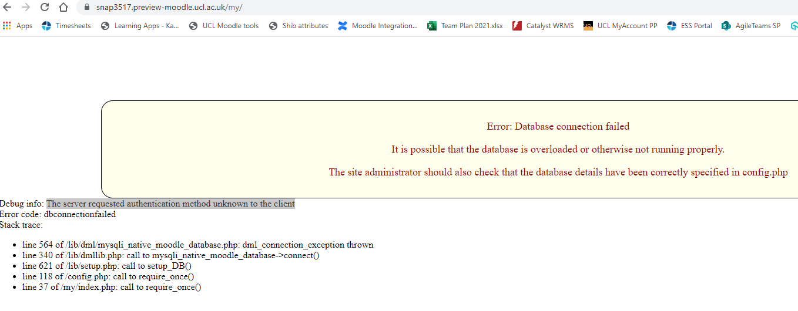

# RHEL8 Server with MySQL 8

[mydb-uata01n.addev.ucl.ac.uk](http://mydb-uata01n.addev.ucl.ac.uk) is configured with RHEL8 and MySQL 8. Currently set to replicate [mysdb-02-t.adcom.ucl.ac.uk](http://mysdb-02-t.adcom.ucl.ac.uk)

Accessing the new server at present is via :

``` bash
mysql -u moodle_user -h mydb-uata01n.addev.ucl.ac.uk -p
```

Access through Workbench 

Actions:

-   Nikola to create RF ticket for Rohith to add his ISD service account to the above new server - RF04728650 raised
-   LA team to check databases and confirm to Roy to break replication and make the new service Read/Write
-   Nikola to request access for LA team to the above server. RF04746524. - rg-itsd-learning-apps. 
-   Request 15/16 snapshot database to be restored to the above server. 18/19 to be deleted (also from mysdb02t) RF04748353
-   LA Team to configure apps to connect to MySQL8 databases
-   Product team to test apps are working with MySQL8

## Compatibility with MySQL8:

-   Moodle 3.5 (snapshot currently on 3.5.17) - requires MySQL 5.5.31 or higher <https://docs.moodle.org/dev/Moodle_3.5_release_notes>
-   Wiki Confluence 7.2.0 - <https://confluence.atlassian.com/conf72/supported-platforms-982323986.html>
    -   MySQL 8 supported
    -   Some plugins will not work with Confluence 7.2 running on MySQL 8 - see [CONFSERVER-59391](https://jira.atlassian.com/browse/CONFSERVER-59391).
-   MyPortofolio - requires MySQL 5.7 or higher
-   Opinio -

## Issues with connecting to MySQL8

-   Moodle -  solution is to change the authentication type for the database and alter the user <https://stackoverflow.com/questions/52364415/php-with-mysql-8-0-error-the-server-requested-authentication-method-unknown-to>



Wiki:

Issue:

    2020-03-03 08:58:36,338 WARN [C3P0PooledConnectionPoolManager[identityToken->2zpby9a818mmioianzgpk|2f53fb9]-HelperThread-#2] [mchange.v2.resourcepool.BasicResourcePool] log com.mchange.v2.resourcepool.BasicResourcePool$ScatteredAcquireTask@57c970a0 -- Acquisition Attempt Failed!!! Clearing pending acquires. While trying to acquire a needed new resource, we failed to succeed more than the maximum number of allowed acquisition attempts (30). Last acquisition attempt exception: 
    java.sql.SQLException: Unknown system variable 'tx_isolation'

Fix:

Changing config to use the correct systemvariable <https://confluence.atlassian.com/confkb/confluence-fails-to-start-and-throws-mysql-session-isolation-level-repeatable-read-is-no-longer-supported-error-241568536.html>

Change MySql Connector to 8  <https://confluence.atlassian.com/confkb/confluence-does-not-start-after-upgrading-mysql-998868008.html>

MySQL 8 Testing completed - [Wiki Test Plan - Mysql 5.7 to 8](https://wiki.ucl.ac.uk/display/ISConfluence/Wiki+Test+Plan+-+Mysql+5.7+to+8)

## Attachments:

 [image2021-6-28\_11-21-3.png](attachments/169217277/172459927.png) (image/png)
 [image2021-6-28\_11-21-14.png](attachments/169217277/172459928.png) (image/png)
 [image2021-6-28\_11-21-45.png](attachments/169217277/172459933.png) (image/png)

