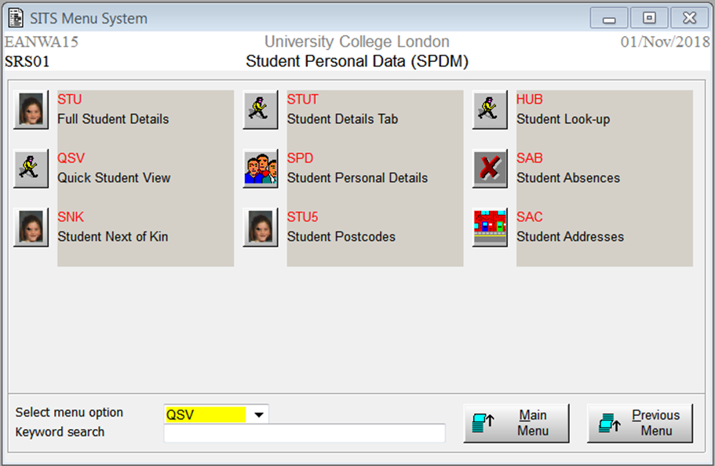
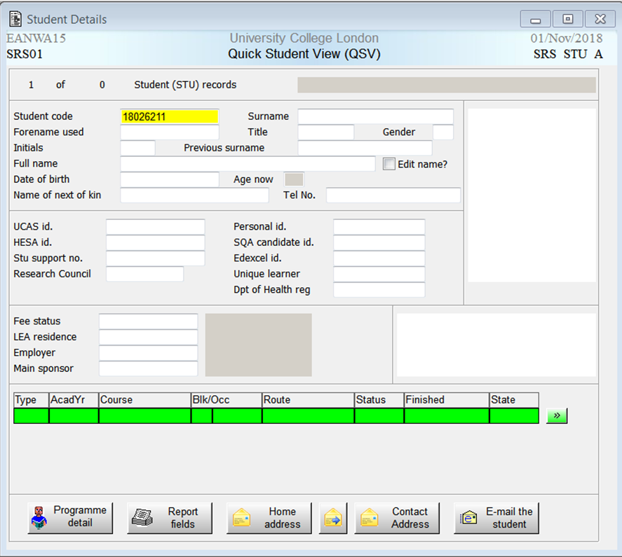

# SITS/Portico status codes & enrolment action taken

### Portico status codes

N.B. This is documented for end users here [M06a - Portico enrolments\#Porticoenrolments-Furtherinformation](https://wiki.ucl.ac.uk/display/MoodleResourceCentre/M06a+-+Portico+enrolments#M06a-Porticoenrolments-Furtherinformation)

The table below outlines each Portico status code and what happens in Moodle overnight when a student's status has changed.

|                 |                                 |                                                                |                  |
|-----------------|---------------------------------|----------------------------------------------------------------|------------------|
| **STA\_CODE**   | **Short Name (STA\_SNAM)**      | **Name (STA\_NAME)**                                           | **Action taken** |
| CE              | CLOSED ENROLMNT                 | Closed Enrolment Record                                        | unenrol          |
| CI              | CLOSED INTRPTN                  | Closed Interruption Record                                     | ENROL            |
| E               | ENROLLED                        | Enrolled                                                       | ENROL            |
| ED              | ENROLLED DEBTOR                 | Enrolled - In Debt                                             | ENROL            |
| ES              | ENROL-SANCTIONS                 | Enrolled with sanctions                                        | ENROL            |
| ET              | TIME LTD ENROLD                 | Time limited enrolled - pending payment                        | ENROL            |
| EQ              | ?                               | Enrolled Pending Eligibility Check                             | ENROL            |
| I               | OUT OF ATTENDNC                 | Temporary Leaver - Not In Attendance                           | ENROL            |
| ID              | INTRPT - DEBT                   | Not In Attendance - In Debt                                    | unenrol          |
| IR              | RESITTING                       | Interrupting – Resitting                                       | ENROL            |
| IRF             | RESIT FINAL YR                  | Interrupting - Resitting (Final Year)                          | ENROL            |
| IS              | SUSPENDED-DEBT                  | Suspended (now not enrolled) due to unpaid fees                | unenrol          |
| L               | LEFT                            | Permanent leaver                                               | unenrol          |
| LE              | LEFT                            | Permanent leaver - was enrolled                                | unenrol          |
| LRF             | LEFT- RESITTING                 | Left - resitting finalist                                      | ENROL            |
| PE              | PRE-ENROLLED                    | Completed pre-enrolment                                        | ENROL            |
| XC              | OUTSTDG CONDS                   | Can't enrol - outstanding entry conditions                     | unenrol          |
| XD              | DEBT - NO ENROL                 | In Debt - Cannot Enrol                                         | unenrol          |
| XE              | YET TO ENROL                    | Expected to Enrol                                              | ENROL            |
| XF              | DIDN'T RE-ENROL                 | Failed to re-enrol (continuing student)                        | unenrol          |
| XN              | DID NOT ARRIVE                  | Did not Arrive (Fresher)                                       | unenrol          |
| XQ              | UG - REFER FAC                  | UG UCAS  fresher - refer to faculty                            | unenrol          |
| XU              | UNCERTAIN PROG                  | Not Enrolled - progress uncertain                              | unenrol          |

### Viewing statuses in SITS

1.  Once logged into SITS &gt; enter QSV &gt; press tab button on keyboard
    
2.  Enter the students ID &gt; press tab button &gt; enrolment status shown
    

## Attachments:

 [image2018-11-1\_12-59-18.png](attachments/102171091/102173680.png) (image/png)
 [image2018-11-1\_13-0-8.png](attachments/102171091/102173683.png) (image/png)
 [image2018-11-1\_13-0-41.png](attachments/102171091/102173684.png) (image/png)

