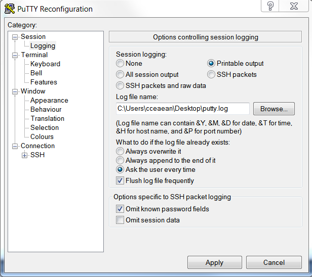
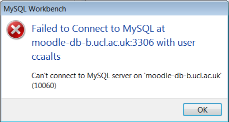
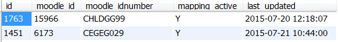
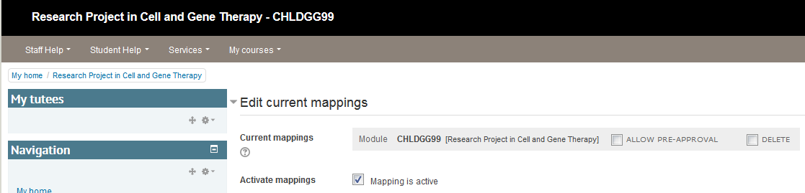
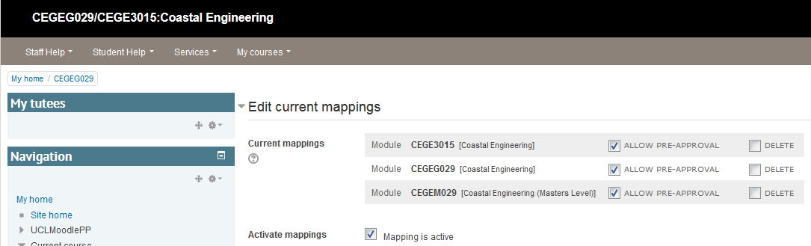
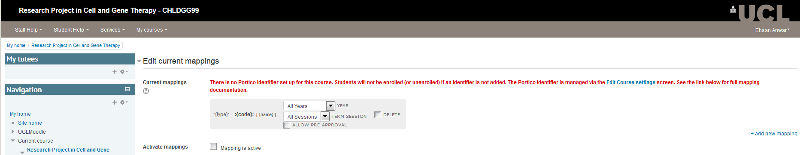
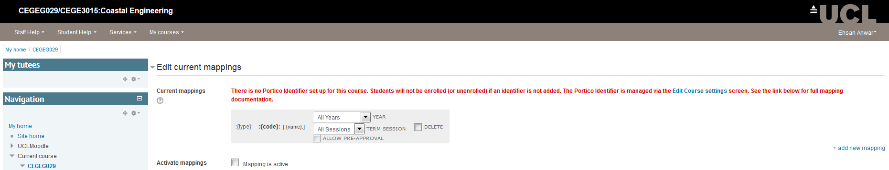

# SQL Queries of Moodle

-   [Myfeedback queries](#SQLQueriesofMoodle-Myfeedbackqueries)
-   [SQL Queries](#SQLQueriesofMoodle-SQLQueries)
    -   [How to export a query output to a file](#SQLQueriesofMoodle-Howtoexportaqueryoutputtoafile)
    -   [Finding all the section (topic) numbers on a course](#SQLQueriesofMoodle-Findingallthesection(topic)numbersonacourse)
    -   [Details of a courses in a Category](#SQLQueriesofMoodle-DetailsofacoursesinaCategory)
    -   [Finding which quiz are during upgrade window](#SQLQueriesofMoodle-Findingwhichquizareduringupgradewindow)
    -   [Finding users who have not logged in from XXX date (and remove from Moodle)](#SQLQueriesofMoodle-FindinguserswhohavenotloggedinfromXXXdate(andremovefromMoodle))
    -   [Identify Moodle backup files for a specific date range](#SQLQueriesofMoodle-IdentifyMoodlebackupfilesforaspecificdaterange)
    -   [Identify users enrolled on a course](#SQLQueriesofMoodle-Identifyusersenrolledonacourse)
    -   [Legacy files by course](#SQLQueriesofMoodle-Legacyfilesbycourse)
    -   [Scorm File Size in MB](#SQLQueriesofMoodle-ScormFileSizeinMB)
    -   [Grade Activity Count](#SQLQueriesofMoodle-GradeActivityCount)
    -   [TII Submissions by day](#SQLQueriesofMoodle-TIISubmissionsbyday)
    -   [TII Assignments by day](#SQLQueriesofMoodle-TIIAssignmentsbyday)
    -   [Number of Tii submissions by a user](#SQLQueriesofMoodle-NumberofTiisubmissionsbyauser)
    -   [Courses using completion tracking](#SQLQueriesofMoodle-Coursesusingcompletiontracking)
    -   [Update sits filter mapping active from ‘Y’ to ‘N’](#SQLQueriesofMoodle-Updatesitsfiltermappingactivefrom‘Y’to‘N’)
    -   [MIM orphan records search and clean](#SQLQueriesofMoodle-MIMorphanrecordssearchandclean)
    -   [Deactivate Portico mappings](#SQLQueriesofMoodle-DeactivatePorticomappings)
    -   [Show courses using menu block](#SQLQueriesofMoodle-Showcoursesusingmenublock)
    -   [Show courses which already have Groups where the CMIS Add Groups flag has been enabled in the portico block mapping](#SQLQueriesofMoodle-ShowcourseswhichalreadyhaveGroupswheretheCMISAddGroupsflaghasbeenenabledintheporticoblockmapping)
    -   [Disable CMIS Add Groups flag on mappings for courses with pre-existing groups](#SQLQueriesofMoodle-DisableCMISAddGroupsflagonmappingsforcourseswithpre-existinggroups)
    -   [Role capabilities comparison](#SQLQueriesofMoodle-Rolecapabilitiescomparison)
    -   [Time stamped log query](#SQLQueriesofMoodle-Timestampedlogquery)
    -   [Courses using campus packs](#SQLQueriesofMoodle-Coursesusingcampuspacks)
    -   [Hidden Topic 0](#SQLQueriesofMoodle-HiddenTopic0)
    -   [Roles assigned at category level](#SQLQueriesofMoodle-Rolesassignedatcategorylevel)
    -   [Course Resets](#SQLQueriesofMoodle-CourseResets)
    -   [Students grades with quiz and course details](#SQLQueriesofMoodle-Studentsgradeswithquizandcoursedetails)
    -   [Total size of all files in a course excluding backup files](#SQLQueriesofMoodle-Totalsizeofallfilesinacourseexcludingbackupfiles)
    -   [Largest single filesize in a course excluding backup files](#SQLQueriesofMoodle-Largestsinglefilesizeinacourseexcludingbackupfiles)
    -   [Largest files for a specific course excluding backup files](#SQLQueriesofMoodle-Largestfilesforaspecificcourseexcludingbackupfiles)
    -   [List of users and their roles for course categories](#SQLQueriesofMoodle-Listofusersandtheirrolesforcoursecategories)
    -   [Student logs using multiple field values](#SQLQueriesofMoodle-Studentlogsusingmultiplefieldvalues)
    -   [Unoconv Submission Conversions](#SQLQueriesofMoodle-UnoconvSubmissionConversions)
    -   [See which Moodle assignment have used pdf annotations/comments](#SQLQueriesofMoodle-SeewhichMoodleassignmenthaveusedpdfannotations/comments)
    -   [See submission/feedback comments users have made](#SQLQueriesofMoodle-Seesubmission/feedbackcommentsusershavemade)
    -   [See file count, size for file types supported by the Onedrive file converter](#SQLQueriesofMoodle-Seefilecount,sizeforfiletypessupportedbytheOnedrivefileconverter)
    -   [See file count, size for file types not supported by the Onedrive file converter](#SQLQueriesofMoodle-Seefilecount,sizeforfiletypesnotsupportedbytheOnedrivefileconverter)
    -   [See files bigger than 60MB for file types supported by the Onedrive file converter but which it will fail to upload until chunking implemented](#SQLQueriesofMoodle-Seefilesbiggerthan60MBforfiletypessupportedbytheOnedrivefileconverterbutwhichitwillfailtouploaduntilchunkingimplemented)
    -   [See file count for common file types in Moodle](#SQLQueriesofMoodle-SeefilecountforcommonfiletypesinMoodle)
    -   [Role capabilties with course reset](#SQLQueriesofMoodle-Rolecapabiltieswithcoursereset)
    -   [Show all tutors and course admins in a course](#SQLQueriesofMoodle-Showalltutorsandcourseadminsinacourse)
    -   [Show all courses and their portico module mappings](#SQLQueriesofMoodle-Showallcoursesandtheirporticomodulemappings)
    -   [Show users moodle assignment submission status](#SQLQueriesofMoodle-Showusersmoodleassignmentsubmissionstatus)
    -   [Module Evaluation - QUERY 1: Responses and Category Query](#SQLQueriesofMoodle-ModuleEvaluation-QUERY1:ResponsesandCategoryQuery)
    -   [Module Evaluation - QUERY 2: All Responses Count including no responses](#SQLQueriesofMoodle-ModuleEvaluation-QUERY2:AllResponsesCountincludingnoresponses)
    -   [Show file upload details](#SQLQueriesofMoodle-Showfileuploaddetails)
-   [Using MySQL Workbench](#SQLQueriesofMoodle-UsingMySQLWorkbench)
    -   [Configuring MySQL Workbench](#SQLQueriesofMoodle-ConfiguringMySQLWorkbench)
    -   [Using MySQL Workbench](#SQLQueriesofMoodle-UsingMySQLWorkbench.1)
        -   [Raising the 1000 row limit](#SQLQueriesofMoodle-Raisingthe1000rowlimit)

# Myfeedback queries

    S:\ISD_Digital_Education\Digital Education\Moodle\DB queries_MySQL queries\MyFeedback

The code below shows how many times a student has accessed MyFeedback and performed an action.

``` sql
select 
u.username,
u.firstname, 
u.lastname,
s.email,
s.personal_tutor,
m.action, 
from_unixtime(m.timecreated), 
s.enrolment_status
    from mdl_user u
    right join 
mdl_logstore_standard_log m
    on u.id = m.userid
    right join
moodle_int_management.sits_students s
    on u.username = s.username
where m.component = "report_myfeedback"
and m.timecreated > 1514764800
```

By adding 'distinct' after the 'select' and 'group by u.username' at the end of the query, you will get the results of the number of unique students.

The code below shows how many times a personal tutor has accessed MyFeedback and performed an action.

``` sql
SELECT distinct
    ut.username AS ut_username
  , ra.userid
  , FROM_UNIXTIME(ra.timemodified) AS ra_timemodified
  , ra.component AS ra_component
  , ut.firstname AS ut_firstname
  , ut.lastname AS ut_lastname
  , ut.email AS ut_email
  , ut.department AS ut_department
FROM moodle_live.mdl_role_assignments ra
    right JOIN moodle_live.mdl_role r
        ON (ra.roleid = r.id)
    right JOIN moodle_live.mdl_user ut
        ON ra.userid = ut.id
    right join mdl_logstore_standard_log m
        on ut.id = m.userid
where m.component = "report_myfeedback"
        and r.shortname = 'personal_tutor'
        #and m.timecreated > 1514764800
ORDER BY ut.username
```

# SQL Queries

See the full list of queries on S:\\AASG\\ELE\\Moodle\\DB queries\_MySQL queries

## How to export a query output to a file

Normally the output can be saved to a .csv file through workbench but when the query is too long, workbench times out.  Another option was to add the following code after the desired SQL query but unfortunately we don't have permissions to do this anymore.

``` sql
select * from mdl_course
limit 10
INTO OUTFILE '/data/mysql/mysql-5.6/courseresults.csv'
FIELDS TERMINATED BY ','
ENCLOSED BY '"'
LINES TERMINATED BY '\n';
```

The work around is to use the putty screen logging

1.  log into moodle-db-a through the shell
2.  right click on the top bar &gt; change settings
3.  under session &gt; logging &gt; set the output file destination and choose printable output &gt; apply.  Now every action will be recorded in the log file.



## Finding all the section (topic) numbers on a course

``` sql
SELECT
    *
FROM mdl_course_sections
WHERE course = 13667;
```

The course code will need to be changed to reflect the course you are looking for.  You will need to change the number after the '=' sign to do this.

Once you have the section ids for a course paste each id in turn after the = sign in the following URL in a web browser: [https://moodle.ucl.ac.uk/course/editsection.php?id=](https://moodle.ucl.ac.uk/course/editsection.php?id=226857)

and click Save.

## Details of a courses in a Category

``` sql
SELECT
    id
  , category
  , fullname
  , shortname
  , idnumber
  , summary
  , format
  , visible
  , timecreated
  , timemodified
FROM mdl_course
WHERE category = :categoryid
;
```

## Finding which quiz are during upgrade window 

``` sql
SELECT
    *
FROM `mdl_quiz`
WHERE `timeopen` BETWEEN UNIX_TIMESTAMP(STR_TO_DATE('Jun 7 2013 5:00PM', '%M %d %Y %h:%i%p')) AND UNIX_TIMESTAMP(STR_TO_DATE('Jun 12 2013 9:00AM', '%M %d %Y %h:%i%p'));
```

## Finding users who have not logged in from XXX date (and remove from Moodle)

To remove redundant Moodle accounts, a MySQL script needs to be run to identify the users

1.  Launch MySQL Workbench
2.  Choose **[moode.ucl.ac.uk](http://moode.ucl.ac.uk) (moodle\_live)** under the **Open connection to start querying**
3.  From **S:\\AASG\\ELE\\Moodle\\DB queries\_MySQL queries**, select 'Moodle 2- users who haven't logged in since 29th Feb 2012' and paste in
4.  It should read:

``` sql
SELECT u.id, u.username, u.firstname, u.lastname, u.email, FROM_UNIXTIME(u.lastaccess) FROM mdl_user u 
WHERE lastaccess < 'XXXXXXXXXX'
AND auth ='ldap' 
and deleted = 0 
and username != 'ccspmdl'
and not (email LIKE 'trail%' or email LIKE 'ltss%' or email LIKE 'moodl%')
```

This script will ensure that the Moodle admin account is not included in the return results.  

1.  In the notes section beneath the script, copy the time stamp converter URL.  Go to <http://www.onlineconversion.com/unix_time.htm>
2.  Enter the required date and copy the resulting time stamp and paste it in the quotation marks after lastaccess &lt;
3.  Click the **lightningbolt** to get the results
4.  You can now export this data to use in Moodle.  Click on the **Export** box and save the CSV
5.  Delete the **lastaccess** column
6.  Add a column called **deleted** and ensure all users have 1 allocated to them.  Save changes.

Now the users need to be deleted from Moodle:

1.  Log into Moodle
2.  Click **Settings** &gt; **Site Admin** &gt; **Upload users**
3.  Select the CSV just created
4.  Click **Upload Users**
5.  Ensure **upload type** is set to **Update existing users only**
6.  Existing user details is set to **Override with file**
7.  Change Allow deletes to set to **Yes**
8.  Click **Upload Users**

You can check if the users exist by searching for them.  Go to your start menu, click in the search box and type: cmd

1.  hit enter.
2.  A command line will launch.
3.  Type: ipconfig
4.  Hit enter.
5.  Underneath the **Ethernet adapter Local Area Connection** you will see an **IPv4 Address**. This is your IP address.
6.  Send your IP address and the Moodle replicated database address (see hostname below) to [**isd-dcs-lob@ucl.ac.u**k](mailto:isd-dcs-lob@ucl.ac.uk) requesting access to the Moodle replicated database.
7.  They may require you to prove you are allowed access by asking a manager or someone in LTA to vouch for you.
8.  Once approved, they will open up access to the database from your computer. Until then you will probably receive the following error when trying to connect using MySQL Workbench (instructions below):
    

## Identify Moodle backup files for a specific date range

``` sql
SELECT 
    f.filename, 
    DATE_FORMAT(FROM_UNIXTIME(f.timecreated), '%e %b %Y') AS 'date created',
    DATE_FORMAT(FROM_UNIXTIME(f.timemodified), '%e %b %Y') AS 'date modified',
    f.userid, 
    f.filesize,
    u.firstname, 
    u.lastname, 
    cou.fullname AS 'course fullname'
    
    FROM mdl_files as f, mdl_context as co, mdl_course as cou, mdl_user as u
    
    WHERE f.contextid = co.id
    AND f.timemodified < UNIX_TIMESTAMP(CURDATE() - INTERVAL 1 YEAR)
    AND co.instanceid = cou.id
    AND f.userid = u.id
    AND f.filename like "%-course-%.mbz"
    GROUP BY cou.shortname
    ORDER BY f.filesize DESC
    ;
```

## Identify users enrolled on a course

``` sql
SELECT
c.id AS courseid, 
c.fullname, 
u.username, 
u.firstname, 
u.lastname, 
u.email,
u.department,
DATE_FORMAT(FROM_UNIXTIME(ra.timemodified),'%d/%m/%Y') AS EnrolledFrom

                                
FROM 
mdl_role_assignments ra 
JOIN mdl_user u ON u.id = ra.userid
JOIN mdl_role r ON r.id = ra.roleid
JOIN mdl_context cxt ON cxt.id = ra.contextid
JOIN mdl_course c ON c.id = cxt.instanceid

WHERE ra.userid = u.id
                                
AND ra.contextid = cxt.id
AND cxt.contextlevel =50
AND cxt.instanceid = c.id
#AND  roleid = 5
AND c.id = 26205

ORDER BY u.lastname
LIMIT 1000;
```

## Legacy files by course

``` sql
SELECT Count(f.contextid) as "Number of Files",
cou.id as "Course ID", cou.fullname

FROM mdl_files as f, mdl_context as co, mdl_course as cou
where filearea ="legacy"
and f.contextid = co.id
AND co.instanceid = cou.id

group by f.contextid
order by Count(f.contextid) desc
limit 1000;

```

## Scorm File Size in MB

``` sql
SELECT course, round(sum(filesize) / 1024 / 1024) as filesize_mb FROM mdl_course_modules
#SELECT course, filename, sum(filesize) FROM mdl_course_modules
inner join mdl_modules on mdl_modules.id = mdl_course_modules.module
inner join mdl_context on mdl_context.instanceid = mdl_course_modules.id
inner join mdl_files on mdl_files.contextid = mdl_context.id 
where course = 21545 and contextlevel = 70 and filename like '%zip'
LIMIT 10;
```

## Grade Activity Count

``` sql
SELECT from_unixtime(timecreated), count(id), eventname  from mdl_logstore_standard_log
where eventname like "%submission_graded%"
and timecreated between 1453680000 and 1456617600 #25/01/2016 - 28/02/2016
GROUP BY timecreated DIV 86400;
```

## TII Submissions by day

``` sql
select u.firstname AS 'First', u.lastname AS 'Last',
tts.submission_title as 'Title', from_unixtime(tts.submission_modified) as
'Time Created'
from `mdl_turnitintooltwo_submissions` as tts 
JOIN mdl_user AS u ON u.id = tts.userid
WHERE tts.submission_modified >
unix_timestamp('2017-04-24 00:00:00') AND tts.submission_modified <
unix_timestamp('2017-04-28 00:00:00')
ORDER BY tts.submission_modified desc;
```

## TII Assignments by day

``` sql
select
from_unixtime(ttp.dtdue) as 'Due Date',
ttp.partname as 'Part Name',
tt.name as 'Assignment',
c.fullname as 'Course'
from mdl_turnitintooltwo as tt 
join mdl_turnitintooltwo_parts ttp on ttp.turnitintooltwoid = tt.id
join mdl_course c on c.id = tt.course
join mdl_turnitintooltwo_courses ttc on ttc.courseid = tt.course  
WHERE ttp.dtdue > unix_timestamp(20180101) AND ttp.dtdue < unix_timestamp(20180131)
ORDER BY ttp.dtdue desc;
```

## Number of Tii submissions by a user

``` sql
select l.userid, u.firstname, u.lastname, l.action as
'Number of submissions', l.objecttable as 'Submission type', c.fullname as
'Course', from_unixtime(l.timecreated) as 'Time' 
from `mdl_logstore_standard_log` as l 
left join mdl_user as u on u.id = l.userid
left join mdl_course as c on c.id = l.courseid
where component = 'mod_turnitintooltwo' and action =
'submission' and target = 'add'
and u.timecreated > unix_timestamp('2017-04-24
00:00:00') AND u.timecreated < unix_timestamp('2017-04-28 00:00:00')
and (l.other like '%user resubmission%' or l.other like
'%user submission%')
order by userid desc;
```

## Courses using completion tracking

``` sql
select c.id as 'Course ID', c.fullname as 'Course name', from_unixtime(timemodified) as 'Time modified'
from `mdl_course_completion_criteria` as ccc
left join mdl_course as c on c.id = ccc.course
group by course
order by from_unixtime(timemodified) desc;
```

## Update sits filter mapping active from ‘Y’ to ‘N’

It's recommended run the queries for both SITS Filter and CMIS Groups Import

## MIM orphan records search and clean

Connect to the MIM database [mdl-db01.ad.ucl.ac.uk](http://mdl-db01.ad.ucl.ac.uk) / moodle\_int\_management to run query.

``` sql
-- Search for orphan records
select * from sits_moduleoccurence mdo 
where mdo.mod_inst_bdo_id 
not in (select md.mod_inst_bdo_id from sits_modules md);

-- If there are new records found, continue to next step:
-- create table and populate it with orphened records
create table deleted_occurences_pp_current_date as 
select * from sits_moduleoccurence mdo 
where mdo.mod_inst_bdo_id not in (select md.mod_inst_bdo_id from sits_modules md);

-- Delete orphaned records from sits_moduleoccurence table
select * from deleted_occurences_pp_current_date de
where de.mod_occ_bdo_id
in (select  * from sits_moduleoccurence mdo 
where mdo.mod_inst_bdo_id 
not in (select md.mod_inst_bdo_id from sits_modules md))
```

## Deactivate Portico mappings

``` sql
--
-- SITS Filter / Portico mappings. Globally deactivate 
--

-- create backup table
CREATE table moodle_int_management.sits_mapping_statuses_050319 like moodle_int_management.sits_mapping_statuses;
-- insert records into backup table
INSERT moodle_int_management.sits_mapping_statuses_050319
select * from moodle_int_management.sits_mapping_statuses;

-- set safe updates to OFF
SET SQL_SAFE_UPDATES = 0;

-- update mappings
UPDATE moodle_int_management.sits_mapping_statuses
SET mapping_active = 'N'
WHERE mapping_active = 'Y';

-- set safe update back to ON
SET SQL_SAFE_UPDATES = 1;

-- rollback
update mapping_statuses
set mapping_active = 'Y'
where id in (select id from backup_mapping_statuses);
--
drop table if exists backup_mapping_statuses;

--
-- CMIS GROUPS IMPORT. Globally deactivate 
-- UNTIL OTHERWISE SPECIFIED, UPDATE THE 'GROUP_IMPORT' COLUMN IN 'MAPPED_MODULES'

--AS copy pasteable just change backup table with date 

create table moodle_int_management.sits_moduleoccurence_mapping_090620 like moodle_int_management.sits_moduleoccurence_mapping;
INSERT moodle_int_management.sits_moduleoccurence_mapping_090620
select * from moodle_int_management.sits_moduleoccurence_mapping;
update moodle_int_management.sits_moduleoccurence_mapping
set group_import = 'NA'
where group_import <> 'NA';

--AS end

-- create backup table
drop table if exists backup_mapped_modules;
create table backup_mapped_modules like mapped_modules;
-- insert targeted records into temporary table
INSERT backup_mapped_modules
select * from mapped_modules
where group_import <> 'NA';

-- update records
update mapped_modules
set group_import = 'NA'
where group_import <> 'NA';
-- rollback
-- original value could have been 'ADD' or 'RMV'; therefore we copy back the value in the backup table
update mapped_modules
inner join backup_mapped_modules using (id)
set mapped_modules.group_import = backup_mapped_modules.group_import;
--
drop table if exists backup_mapped_modules;

```











## Show courses using menu block

``` sql
select c.id as 'Course ID', c.fullname as 'Full Name', cc.name as 'Category', i.blockname as 'Block Name'  from mdl_block_instances as i
join mdl_context as ctxt on i.parentcontextid = ctxt.id
join mdl_course as c on ctxt.instanceid = c.id
join mdl_course_categories as cc on cc.id = c.category
where i.blockname = "course_menu"
order by c.category
limit 10;
```

## Show courses which already have Groups where the CMIS Add Groups flag has been enabled in the portico block mapping

Useful prior to switching the CMIS integration to find potential clashes

``` java
SELECT DISTINCT courseid FROM moodle_live.mdl_groups where courseid IN (SELECT DISTINCT vle_courseid FROM moodle_int_management.sits_moduleoccurence_mapping where group_import ='ADD' AND last_updated >='2019-07-27 00:00:00'
```

## Disable CMIS Add Groups flag on mappings for courses with pre-existing groups

Useful prior to switching the CMIS integration to prevent clashes and allow course admins to choose to opt-in safely

``` java
Step 1 - Take a backup


CREATE table moodle_int_management.sits_mapping_statuses_181019 like moodle_int_management.sits_mapping_statuses;
-- insert records into backup table
INSERT moodle_int_management.sits_mapping_statuses_181019
select * from moodle_int_management.sits_mapping_statuses;


Step 2 - Set the CMIS mapping to NA where it is ADD for courses which already have groups
UPDATE moodle_int_management.sits_moduleoccurence_mapping SET group_import='NA' WHERE group_import='ADD' AND vle_courseid IN (SELECT DISTINCT courseid FROM moodle_live.mdl_groups where courseid IN (SELECT DISTINCT vle_courseid FROM moodle_int_management.sits_moduleoccurence_mapping where group_import ='ADD' AND last_updated >='2019-07-27 00:00:00'));
```

## 
Role capabilities comparison

``` sql
select rc.capability,
GROUP_CONCAT(if(r.id=1, 'X', NULL)) as Manager,
GROUP_CONCAT(if(r.id=2, 'X', NULL)) as Course_Creator,
GROUP_CONCAT(if(r.id=3, 'X', NULL)) as Tutor,
GROUP_CONCAT(if(r.id=4, 'X', NULL)) as Non_Edit,
GROUP_CONCAT(if(r.id=5, 'X', NULL)) as Student,
GROUP_CONCAT(if(r.id=6, 'X', NULL)) as Guest,
GROUP_CONCAT(if(r.id=7, 'X', NULL)) as Course_Administrator,
GROUP_CONCAT(if(r.id=24,'X', NULL)) as UCL_Support_Staff,
GROUP_CONCAT(if(r.id=26,'X', NULL)) as Participant,
GROUP_CONCAT(if(r.id=28,'X', NULL)) as Authenticated_user,
GROUP_CONCAT(if(r.id=64,'X', NULL)) as Enrolment_keyholder,
GROUP_CONCAT(if(r.id=90,'X', NULL)) as Service_Desk_Administrator,
GROUP_CONCAT(if(r.id=96,'X', NULL)) as CALT_Support,
GROUP_CONCAT(if(r.id=99,'X', NULL)) as Sub_Administrator,
GROUP_CONCAT(if(r.id=102,'X', NULL)) as Question_Sharer,
GROUP_CONCAT(if(r.id=103,'X', NULL)) as Overviewing_Advisor,
GROUP_CONCAT(if(r.id=107,'X', NULL)) as Report_Reader,
GROUP_CONCAT(if(r.id=109,'X', NULL)) as Report_Writer,
GROUP_CONCAT(if(r.id=111,'X', NULL)) as Leader,
GROUP_CONCAT(if(r.id=113,'X', NULL)) as Library_Administrator,
GROUP_CONCAT(if(r.id=115,'X', NULL)) as Webservice_role,
GROUP_CONCAT(if(r.id=123,'X', NULL)) as Personal_Tutor_Role,
GROUP_CONCAT(if(r.id=131,'X', NULL)) as Course_Administrator_no_email,
GROUP_CONCAT(if(r.id=133,'X', NULL)) as MyFeedback_Departmental_Administrator,
GROUP_CONCAT(if(r.id=137,'X', NULL)) as Digital_Education_Admin,
GROUP_CONCAT(if(r.id=139,'X', NULL)) as QAA_Reviewer,
GROUP_CONCAT(if(r.id=139,'X', NULL)) as Non_editing_Tutor_no_emails
from mdl_role_capabilities rc left join mdl_role r on rc.roleid=r.id
GROUP BY rc.capability
order by rc.capability asc
limit 10;
```

## Time stamped log query

``` sql
version 1

SELECT from_unixtime(timecreated)
  as time_interval, 
COUNT(id) as Cnt
FROM mdl_logstore_standard_log
WHERE action = 'failed' AND target = 'user_login'
  and timecreated BETWEEN UNIX_TIMESTAMP('2017/01/13 00:00:00') AND UNIX_TIMESTAMP('2017/01/13 23:59:00')
GROUP BY timecreated DIV (10*60);


version 2

SELECT
  from_unixtime(FLOOR((timecreated)/(10*60))*(10*60))
  as time_interval, 
COUNT(*) as Cnt 
  FROM mdl_logstore_standard_log
WHERE action = 'failed' AND target = 'user_login'
  and timecreated BETWEEN UNIX_TIMESTAMP('2017/01/13 00:00:00') AND UNIX_TIMESTAMP('2017/01/13 23:59:00')
GROUP BY time_interval
```

## Courses using campus packs

``` sql
select c.id as 'Course ID', c.fullname as 'Course Name', cc.name as 'Category', m.name as 'Activity'
from mdl_course_modules as cm
join mdl_modules as m on m.id = cm.module
join mdl_course as c on c.id = cm.course
join mdl_course_categories as cc on cc.id = c.category
#where course = 37571
and m.name like 'cp%'
order by c.fullname;
```

## Hidden Topic 0

``` sql
SELECT * FROM mdl_course_sections
where section = 0
and visible = 0;

UPDATE mdl_course_sections
SET visible = 1
WHERE visible = 0
AND section = 0;
```

## Roles assigned at category level

``` sql
SELECT * FROM moodle_live.mdl_role_assignments assig
join moodle_live.mdl_context con on assig.contextid = con.id
where con.contextlevel = 40  #40 is the category context level
and assig.roleid=111 #SELECT * FROM moodle_live.mdl_role;  to get a list of role id's
;
```

## Course Resets

``` sql
SELECT c.shortname, c.fullname, l.courseid, l.userid, from_unixtime(l.timecreated) from mdl_logstore_standard_log l
JOIN mdl_context con ON l.courseid = con.instanceid
JOIN mdl_course c ON l.courseid = c.id
WHERE con.path LIKE '%/1/%' AND con.contextlevel = 50
AND l.timecreated between 1500595200 and 1505260800
AND target = 'course_reset' AND action = 'ended'
group by shortname;

#Below with turnitin assignments

select
l.courseid,
c.shortname,
c.fullname,
t.name as "Turnitin Assignment",
from_unixtime(l.timecreated) as "Course Reset Date/Time"
from mdl_logstore_standard_log l 
JOIN mdl_turnitintooltwo t on t.course = l.courseid
JOIN mdl_course as c on c.id = t.course
WHERE target = 'course_reset' AND action = 'ended'
AND l.timecreated BETWEEN UNIX_TIMESTAMP('2017/07/21') AND UNIX_TIMESTAMP('2017/09/13')
group by l.courseid
order by l.timecreated asc
```

## Students grades with quiz and course details

``` sql
SELECT
qz.id as "Quiz ID",
q.qtype as "Quiz Type",
q.name as "Question Name",
q.questiontext as "Question Text",
ctx.instanceid as "Course ID",
c.fullname as "Course Name",
u.id as "User ID",
u.username as "User Name",
u.firstname as "First Name",
u.lastname as "Last Name",
qzg.grade as "Quiz Grade"
FROM mdl_question q
LEFT JOIN mdl_question_categories qc ON qc.id = q.category
LEFT JOIN mdl_context ctx ON ctx.id = qc.contextid
LEFT JOIN mdl_course_modules cm ON cm.id = ctx.instanceid AND ctx.contextlevel = 70
LEFT JOIN mdl_course c ON (ctx.contextlevel = 50 AND c.id = ctx.instanceid)
LEFT JOIN mdl_quiz qz ON qz.course = ctx.instanceid
LEFT JOIN mdl_quiz_grades qzg ON qzg.quiz = qz.id
LEFT JOIN mdl_user u ON u.id = qzg.userid
OR (ctx.contextlevel = 70 AND c.id = cm.course)
WHERE questiontext LIKE '%please choose the correct shape?%
```

## Total size of all files in a course excluding backup files

``` sql
SELECT
c.id as 'Course ID',
c.fullname as 'Full Name',
c.shortname as 'Short Name',
(sum(f.filesize) / (1024 * 1024)) as 'Size in MB',
filearea
FROM mdl_files f
JOIN mdl_context con on f.contextid = con.id
JOIN mdl_course c on c.id = con.instanceid
AND contextlevel = 50
AND filename != '.'
AND filearea != 'course'
AND ((f.filesize) / (1024 * 1024)) > 1
GROUP BY c.id
ORDER BY f.filesize desc;
```

## Largest single filesize in a course excluding backup files

``` sql
SELECT
c.id as 'Course ID',
c.fullname as 'Full Name',
c.shortname as 'Short Name',
filename as 'File name',
from_unixtime(f.timecreated) as 'Time Created',
((filesize) / (1024 * 1024)) as 'Size in MB',
filearea
FROM mdl_files f
JOIN mdl_context con on f.contextid = con.id
JOIN mdl_course c on c.id = con.instanceid
AND contextlevel = 50
AND ((f.filesize) / (1024 * 1024)) > 50
AND filename != '.'
AND filearea != 'course'
ORDER BY f.filesize desc;
```

## Largest files for a specific course excluding backup files

``` sql
SELECT
c.id as 'Course ID',
c.fullname as 'Full Name',
c.shortname as 'Short Name',
filename as 'File name',
from_unixtime(f.timecreated) as 'Time Created',
((filesize) / (1024 * 1024)) as 'Size in MB',
filearea
FROM mdl_files f
JOIN mdl_context con on f.contextid = con.id
JOIN mdl_course c on c.id = con.instanceid
WHERE c.id = 2350 
AND contextlevel = 50
AND ((f.filesize) / (1024 * 1024)) > 1
AND filename != '.'
AND filearea != 'course'
ORDER BY c.id desc, f.filesize desc;
```

## List of users and their roles for course categories

``` sql
SELECT
cc.id as 'Category ID',
cc.name as 'Category Name',
ra.contextid as 'Assign Roles Page ID',
r.name as 'Role Name',
u.username as 'Username',
u.firstname as 'First Name',
u.lastname as 'Last Name'
FROM mdl_role_assignments as ra
JOIN mdl_role as r on r.id = ra.roleid
JOIN mdl_user as u on u.id = ra.userid
JOIN mdl_context con on con.id = ra.contextid
JOIN mdl_course c on c.category = con.instanceid
JOIN mdl_course_categories cc on cc.id = c.category
WHERE con.contextlevel = 40
GROUP BY username
ORDER BY cc.name asc;
```

## Student logs using multiple field values

``` sql
select
u.idnumber as 'Student Number/UPI',
u.username as 'Username',
u.firstname as 'Firstname',
u.lastname as 'Lastname',
u.email as 'Email Address',
u.department as 'Department',
l.action as 'Action Performed',
l.target as 'Target',
from_unixtime(l.timecreated) as 'Date/Time Stamp'
from mdl_logstore_standard_log l
join mdl_user as u on u.id = l.userid
where u.idnumber IN
(14009868,
14047027,
14036503,
110077018)
```

## Unoconv Submission Conversions

``` sql
SELECT
a.course as 'Course ID',
ctx.instanceid as 'Instance ID',
a.name as 'Instance Name',
aeq.submissionid 'Submission ID',
f.id as 'Unoconv File ID',
f.filename as 'Filename'
FROM mdl_files as f
JOIN mdl_assignfeedback_editpdf_queue as aeq on aeq.submissionid = f.itemid
JOIN mdl_assignsubmission_file as af on af.submission = aeq.submissionid
JOIN mdl_assign as a on a.id = af.assignment
JOIN mdl_context as ctx on ctx.id = f.contextid
WHERE f.id = 79631865; #This number appears on the filename when viewing the unoconv process on the app server
```

## See which Moodle assignment have used pdf annotations/comments

``` sql
SELECT DISTINCT name as "Assignment Name", course as "Course ID", fullname as "course title", "Standard" as "Annotation"
FROM prefix_assignfeedback_editpdf_annot ant
INNER JOIN prefix_assign_grades grd ON ant.gradeid = grd.id
INNER JOIN prefix_assign assign ON grd.assignment = assign.id
INNER JOIN prefix_course c ON assign.course = c.id
UNION
SELECT DISTINCT name as "Assignment Name", course as "Course ID", fullname as "course title", "Comment" as "Annotation"
FROM prefix_assignfeedback_editpdf_cmnt cmnt
INNER JOIN prefix_assign_grades grd ON cmnt.gradeid = grd.id
INNER JOIN prefix_assign assign ON grd.assignment = assign.id
INNER JOIN prefix_course c ON assign.course = c.id
```

## See submission/feedback comments users have made

``` sql
SELECT

#distinct cmt.content as 'submission comment',
distinct afc.commenttext as 'feedback comment',
#distinct f.filename,
c.id AS courseid,
c.fullname,
u.username,
u.firstname,
u.lastname,
f.itemid,
a.name

FROM
mdl_role_assignments ra
JOIN mdl_user u ON u.id = ra.userid
JOIN mdl_role r ON r.id = ra.roleid
JOIN mdl_context cxt ON cxt.id = ra.contextid
JOIN mdl_course c ON c.id = cxt.instanceid
JOIN mdl_comments cmt on cmt.userid = u.id
JOIN mdl_assign a on a.course = c.id
JOIN mdl_assignfeedback_comments afc on afc.assignment = a.id
JOIN mdl_assign_submission asub on asub.userid = u.id
JOIN mdl_files f on f.itemid = asub.id
 
WHERE ra.userid = u.id
                                 
AND ra.contextid = cxt.id
AND cxt.contextlevel =50
AND cxt.instanceid = c.id
#AND  roleid = 5
#AND c.id = 1932
AND u.username ='cceaean'
```

## See file count, size for file types supported by the Onedrive file converter

``` sql
SELECT 
    SUBSTR(filename, 1-LOCATE('.', REVERSE(filename))) AS ext, 
    MAX(filesize) / (1024*1024) AS max, 
    avg(filesize) / (1024*1024) as avg, 
    stddev(filesize) / (1024*1024) as stddev, 
    count(*) 
FROM moodle_live.mdl_files
WHERE 
    component = 'assignsubmission_file' 
    AND filearea = 'submission_files' 
    AND filename <> '.' 
    AND LOCATE('.', REVERSE(filename)) > 0 
    AND SUBSTR(filename, 1-LOCATE('.', REVERSE(filename))) IN ('csv', 'doc', 'docx', 'odp', 'ods', 'odt', 'pot', 'potm', 'potx', 'pps', 'ppsx', 'ppsxm', 'ppt', 'pptm', 'pptx','rtf', 'xls', 'xlsx')
GROUP BY SUBSTR(filename, 1-LOCATE('.', REVERSE(filename)));
```

## See file count, size for file types not supported by the Onedrive file converter

``` sql
SELECT 
    SUBSTR(filename, 1-LOCATE('.', REVERSE(filename))) AS ext, 
    MAX(filesize) / (1024*1024) AS max, 
    avg(filesize) / (1024*1024) as avg, 
    stddev(filesize) / (1024*1024) as stddev, 
    count(*) 
FROM moodle_live.mdl_files
WHERE 
    component = 'assignsubmission_file' 
    AND filearea = 'submission_files' 
    AND filename <> '.' 
    AND LOCATE('.', REVERSE(filename)) > 0 
    AND SUBSTR(filename, 1-LOCATE('.', REVERSE(filename))) IN ('bib', 'xml', 'fodt', 'html', 'ltx', 'txt', 'ott', 'pdb', 'psw', 'sdw', 'stw', 'sxw', 'uot', 'vor', 'wps', 'bmp', 'emf', 'eps', 'fodg', 'gif', 'jpg', 'met', 'odd', 'otg', 'pbm', 'pct', 'pgm', 'png', 'ppm', 'ras', 'std', 'svg', 'svm', 'swf', 'sxd', 'tiff', 'wmf', 'xhtml', 'xpm', 'fodp', 'odg', 'otp', 'pwp', 'sda', 'sdd', 'sti', 'sxi', 'uop', 'dbf', 'dif', 'fods', 'ots', 'pxl', 'sdc', 'slk', 'stc', 'sxc', 'uos', 'xlt')
    GROUP BY SUBSTR(filename, 1-LOCATE('.', REVERSE(filename)));
```

## See files bigger than 60MB for file types supported by the Onedrive file converter but which it will fail to upload until chunking implemented

``` java
select * FROM moodle_live.mdl_files
WHERE 
    component = 'assignsubmission_file' 
    AND filearea = 'submission_files' 
    AND filesize > (60*1024*1024)
    AND SUBSTR(filename, 1-LOCATE('.', REVERSE(filename))) IN ('csv', 'doc', 'docx', 'odp', 'ods', 'odt', 'pot', 'potm', 'potx', 'pps', 'ppsx', 'ppsxm', 'ppt', 'pptm', 'pptx','rtf', 'xls', 'xlsx')
    
```

<https://bitbucket.org/uonmoodle/moodle-fileconverter_onedrive/issues/1/max-file-size-supported-is-4mb-should>

## See file count for common file types in Moodle

``` java
SELECT 
SUBSTR(filename, 1-LOCATE('.', REVERSE(filename))) AS ext, 
count(*) 
FROM moodle_live.mdl_files
WHERE 
filename <> '.' 
AND LOCATE('.', REVERSE(filename)) > 0 
AND SUBSTR(filename, 1-LOCATE('.', REVERSE(filename))) IN ('mp4', 'mp3', 'mpg', 'mov', 'avi', 'csv', 'doc', 'docx', 'docm' 'odp', 'ods', 'odt', 'pot', 'potm', 'potx', 'pps', 'ppsx', 'ppsxm', 'ppt', 'pptm', 'pdf', 'xlsm', 'xml', 'html', 'txt', 'bmp', 'eps', 'gif', 'jpg', 'png', 'svg', 'swf', 'sxd', 'tiff', 'wmf', 'xhtml')
GROUP BY SUBSTR(filename, 1-LOCATE('.', REVERSE(filename)));
```

## Role capabilties with course reset

``` java
select rc.roleid, rc.capability, r.shortname, permission
from mdl_role_capabilities rc join mdl_role r on rc.roleid=r.id
where rc.capability = 'moodle/course:reset'
GROUP BY rc.roleid
order by rc.capability asc;
```

## Show all tutors and course admins in a course

``` java
SELECT
c.id AS 'Course ID',
c.fullname AS 'Course Full Name',
u.username,
u.firstname,
u.lastname,
u.email,
r.name AS 'Role'
FROM
mdl_role_assignments ra
JOIN mdl_user u ON u.id = ra.userid
JOIN mdl_role r ON r.id = ra.roleid
JOIN mdl_context cxt ON cxt.id = ra.contextid
JOIN mdl_course c ON c.id = cxt.instanceid
WHERE ra.userid = u.id
AND ra.contextid = cxt.id
AND cxt.contextlevel =50
AND cxt.instanceid = c.id
AND  roleid IN (17, 18)
AND c.id IN (
431,
436,)
#AND c.id = 2
ORDER BY c.id;
```

## Show all courses and their portico module mappings

``` java
SELECT
sms.vle_courseid AS 'Course ID',
sms.vle_idnumber AS 'Course Name',
sms.mapping_active AS 'Portico Block Mapping Active',
sms.last_updated,
smm.mapping_action,
sm.mod_code,
sm.mod_occ_psl_code,
sm.mod_occ_mav,
sm.mod_occ_year_code,
sm.mod_occ_name 
FROM sits_mapping_statuses sms
JOIN sits_moduleoccurence_mapping smm ON smm.vle_courseid = sms.vle_courseid
JOIN sits_moduleoccurence sm ON sm.mod_occ_bdo_id = smm.mod_occ_bdo_id
#WHERE sms.last_updated > '2019-07-01 00:00:00'
#AND sm.mod_occ_year_code = 2019
#AND smm.mapping_action = 'ADD'
#AND sms.mapping_active = 'Y'
#where sms.vle_courseid = 2
order by sms.last_updated desc
```

## Show users moodle assignment submission status

``` java
SELECT
c.fullname AS 'Course Name',
a.course AS 'Course ID',
a.name AS 'Assignment Name',
asub.userid AS 'UserID',
u.firstname AS 'First Name',
u.lastname AS 'Last Name',
from_unixtime(asub.timecreated) AS 'Time Created',
from_unixtime(asub.timemodified) AS 'Time Modified',
asub.status AS 'Submission Status',
log.other
FROM mdl_assign_submission asub
join mdl_assign a ON a.id = asub.assignment
join mdl_user u ON u.id = asub.userid
join mdl_course c on c.id = a.course
join mdl_logstore_standard_log log on log.userid =
asub.userid
where log.other like '%submitted%'
and c.id = ...
and u.id = ...
order by asub.timemodified desc
```

## 
Module Evaluation - QUERY 1: Responses and Category Query

``` java
select mc.id, mc.fullname, mc.shortname, mc.fullname, mcc.name as "Category Name",  COUNT( distinct u.id) AS "Number of Students", count(distinct mqr.id) as "Number of Questionnaire Responses"
from mdl_questionnaire mq, mdl_questionnaire_survey mqs, mdl_questionnaire_response mqr, mdl_course mc,mdl_course_categories mcc, mdl_role_assignments ra, mdl_context ctx, mdl_user u
where mq.course=mc.id and
      mq.course=mqs.courseid and
      mq.sid=mqs.id and
      mc.category=mcc.id and
      ra.contextid = ctx.id and
     ctx.contextlevel = 50 and
     u.id = ra.userid and
     ctx.instanceid = mc.id and
     ra.roleid = 14 and 
      (mqs.title ='UCL Module Evaluation') and 
      mq.id=mqr.questionnaireid and
      realm='private'
      group by mc.id;
```

## Module Evaluation - QUERY 2: All Responses Count including no responses

``` java
select mc.id, mc.fullname, mc.shortname, mc.fullname,mcc.name as "Category Name",  COUNT( distinct u.id) AS "Number of Students"
from mdl_questionnaire mq, mdl_questionnaire_survey mqs,  mdl_course mc,mdl_course_categories mcc, mdl_role_assignments ra, mdl_context ctx, mdl_user u
where mq.course=mc.id and
      mq.course=mqs.courseid and
      mq.sid=mqs.id and
       mc.category=mcc.id and
      ra.contextid = ctx.id and
     ctx.contextlevel = 50 and
     u.id = ra.userid and
     ctx.instanceid = mc.id and
     ra.roleid = 14 and
      (mqs.title ='UCL Module Evaluation')  and 
      realm='private'
      group by mc.id;
```

## Show file upload details

``` java
select  
f.contenthash,
f.itemid,
f.filename,
f.userid,
u.username,
f.author,
ctx.instanceid,
from_unixtime(f.timecreated),
from_unixtime(f.timemodified)
from mdl_files as f
JOIN mdl_context as ctx on ctx.id = f.contextid
JOIN mdl_user as u on u.id = f.userid
#where f.contenthash = ''  
#where userid = 
#and instanceid = #activity
order by from_unixtime(f.timemodified) desc;
```

Updating TII license hack

``` java
UPDATE mdl_turnitintooltwo_users ttu
RIGHT JOIN mdl_user u
ON u.id = ttu.userid
SET ttu.user_agreement_accepted = 1
WHERE u.firstname = 'jmeter
```

# Using MySQL Workbench

MySQL Workbench can be used to retrieve statistics directly from the MySQL databases. 

Download the (free) software from here: <http://www.mysql.com/downloads/workbench>

You also need to (first) install the following libraries - go to the below links and click the big red **Download** button:

-   [Microsoft .NET Framework 4 Client Profile](http://www.microsoft.com/download/en/details.aspx?id=17113)
-   [Visual C++ Redistributable for Visual Studio 2013](http://www.microsoft.com/en-us/download/details.aspx?id=40784)

## Configuring MySQL Workbench

1.  If you don't already have it installed, download MySQL Workbench and install it
2.  Launch MySQL Workbench
3.  Alongside the 'Stored Connection' drop-down box click on the \[...\] button
4.  Click \[New Connection\]
5.  Enter the following settings for Moodle
    1.  Connection: Moodle
    2.  Username: ccaalts
    3.  Password: (old password starting with u)
    4.  Hostname: ~~moodledb-c.ucl.ac.uk~~ moodle-db-b.ucl.ac.uk
    5.  Port: 3306
    6.  Type: MySQL
    7.  Schema: moodle\_live
6.  Click \[Apply\]
7.  Click \[New Connection\]
8.  Enter the following settings for Confluence
    1.  Connection:Confluence Wiki
    2.  Username: ccaalts
    3.  Password: (old password starting with u)
    4.  Hostname: mysql-c.ucl.ac.uk
    5.  Port: 3306
    6.  Type: MySQL
    7.  Schema: confluence\_live
9.  Click \[Apply\]
10. Click \[Close\]

    IMPORTANT

    Remove the row restriction of 1000 or you won't always get complete result sets!!

    Edit &gt; Preferences &gt; SQL Editor tab &gt; Query Results &gt; (untick) Limit Rows

##  Using MySQL Workbench

1.  Launch MySQL Workbench
2.  Choose 'Confluence Wiki' or 'Moodle' from the 'Stored Connection' drop down box.
3.  Enter the old ccaalts password
4.  Click \[OK\]
5.  Copy the query you want to run from above. Each query relevant to the spreadsheet is marked with a  and the name of the spreadsheet column title.
6.  Paste into the field at the top of the window.
7.  Change the dates to the ones relevant for the current month (Note: You may receive errors if you try to search between a date that doesn't exist. E.g. Feb 31)
8.  Click \[Execute\]
9.  Enter the number displayed under Resultset 1 into the relevant worksheet in the spreadsheet located at: S:\\AASG\\Service Statistics\\AASG Service Stats.xls  Note: To change databases, go to File &gt; New Instance Connection...

#### Raising the 1000 row limit

In some cases, your search results will return more than 1000 rows and you will need to increase this to display/export the dataset generated.  To do this:
1.  Click on **Edit**&gt; **Preferences**
2.  Click on the **SQL Editor** tab and change 'limit rows count' to approx required number, and click **Ok**

    SELECT
    c.fullname AS 'Course Name',
    a.course AS 'Course ID',
    a.name AS 'Assignment Name',
    asub.userid AS 'UserID',
    u.firstname AS 'First Name',
    u.lastname AS 'Last Name',
    from_unixtime(asub.timecreated) AS 'Time Created',
    from_unixtime(asub.timemodified) AS 'Time Modified',
    asub.status AS 'Submission Status',
    log.other
    FROM mdl_assign_submission asub
    join mdl_assign a ON a.id = asub.assignment
    join mdl_user u ON u.id = asub.userid
    join mdl_course c on c.id = a.course
    join mdl_logstore_standard_log log on log.userid =
    asub.userid
    where log.other like '%submitted%'
    and c.id = ...
    and u.id = ...
    order by asub.timemodified desc

## Attachments:

 [Moodle Course Categories.txt](attachments/6164026/6521258.txt) (text/plain)
 [image2015-8-12 14:20:24.png](attachments/6164026/56499566.png) (image/png)
 [image2015-8-12 14:21:11.png](attachments/6164026/56499567.png) (image/png)
 [image2017-5-17 12:20:19.png](attachments/6164026/66761732.png) (image/png)
 [image2017-5-17 12:20:47.png](attachments/6164026/66761733.png) (image/png)
 [image2017-5-17 12:23:34.png](attachments/6164026/66761736.png) (image/png)
 [image2017-5-17 12:29:13.png](attachments/6164026/66761739.png) (image/png)
 [image2017-5-17 12:29:58.png](attachments/6164026/66761740.png) (image/png)
 [image2017-5-17 12:30:57.png](attachments/6164026/66761743.png) (image/png)
 [image2017-5-17 12:38:43.png](attachments/6164026/66761746.png) (image/png)
 [image2017-5-17 12:39:34.png](attachments/6164026/66761747.png) (image/png)
 [image2018-1-4\_13-16-15.png](attachments/6164026/82447711.png) (image/png)

