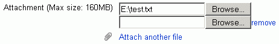

# SSO Plugin - eMailList

-   [Installing eMail list plugin](#SSOPlugineMailList-InstallingeMaillistplugin)
    -   [An additional 'hack' to hide mailboxes other courses from appearing:](#SSOPlugineMailList-Anadditional'hack'tohidemailboxesothercoursesfromappearing:)
-   [To test this new block:](#SSOPlugineMailList-Totestthisnewblock:)
-   [Problems with uploading an attachment](#SSOPlugineMailList-Problemswithuploadinganattachment)
    -   [An additional hack to stop an empty attachment text box appearing by default:](#SSOPlugineMailList-Anadditionalhacktostopanemptyattachmenttextboxappearingbydefault:)
-   [How the eMail List block works and stores data](#SSOPlugineMailList-HowtheeMailListblockworksandstoresdata)

# Installing eMail list plugin

There are two additional 'hacks' to do to this plugin, see notes below

Download the file from <http://moodle.org/mod/data/view.php?d=13&rid=701>

The documentation for this plugin is in Spanish, an English translation can be found at <http://babelfish.altavista.com/babelfish/trurl_pagecontent?lp=es_en&url=http%3A%2F%2Fmnm.uib.es%2FeMail%2Fdoc%2F>

**1.** On the moodle server go to the **/data/apache/htdocs/moodle** folder and type:

``` java
wget http://mnm.uib.es/eMail/realises/eMail-1.3.1.tar.gz
```

(this downloads the plugin for Moodle 1.9, check the moodle website for the latest version of this plugin)

**2.** You then need to uncompress this downloaded file

``` java
tar -xzvf eMail-1.3.1.tar.gz
```

this will create a new eMail folder at /data/apache/htdocs/moodle. 

**3.** Move the following files/folders from their original to new locations as described in this table.

<table>
<colgroup>
<col width="50%" />
<col width="50%" />
</colgroup>
<thead>
<tr class="header">
<th><p>original file location</p></th>
<th><p>new file location</p></th>
</tr>
</thead>
<tbody>
<tr class="odd">
<td><p>moodle/eMail/email</p></td>
<td><p>moodle/email</p></td>
</tr>
<tr class="even">
<td><p>moodle/eMail/blocks/email_list</p></td>
<td><p>moodle/blocks/email_list</p></td>
</tr>
<tr class="odd">
<td><p>moodle/eMail/lang</p></td>
<td><p>moodle/lang</p></td>
</tr>
</tbody>
</table>

It also provides a few css files that are in the moodle/email folder. We can look at integrating these into our themes ....

You can then remove the 'eMail' folder in order to keep the moodle server tidy. 

**4.** Go to the Admin &gt; **Notifications** page. The Moodle database will be updated, the following 7 new tables will be created:

-   mdl\_email\_filter
-   mdl\_email\_folder
-   mdl\_email\_foldermail
-   mdl\_email\_mail
-   mdl\_email\_preference
-   mdl\_email\_send
-   mdl\_email\_subfolder

See full changes made to database: eMail plugin database changes.rtf

**5.** Go to **Administration** &gt; **Modules** &gt; **Blocks** &gt; **Manage blocks**
**eMail list** does not appear alphabetically, but at the bottom of the list.
From here there are some settings you can adjust, I have left them all as default for now.

## An additional 'hack' to hide mailboxes other courses from appearing:

Comment out line 545 in the **lib.php** file:

``` java
544  // Print block of my courses
545      // print_side_block($startdivtitle.$strcourses.$enddivtitle, '', $list, $icons);
```

# To test this new block:

Go to your course, turn editing on and add the block (again, it appears at the bottom of the list, not alphabetically).

# Problems with uploading an attachment 

When you upload an attachment be careful how many text boxes are on the form. Each time you add an attachment another 'browse' button is generated, see screen grab below. When you go to send your message it is important that there are no 'empty' attachment text boxes/browse buttons (like in the screen grab below). If you attempt to send your email message with an empty attachment box you will see the error "Incorrect upload attempt!".



To successfully send your email message with an attachment then remove an unused text boxes by clicking on the 'remove' link as shown in the grab above.
I think this needs to be documented as it will easily catch users out.
In the longer term I may be able to look at the moodle code to see if i can make it not automatically bring up more attachment text boxes as most times I expect users would only want to attach one file. If they did want to attach a 2nd file they could use the 'attach another file' link to bring up another attachment text box. (Rachel)

## An additional hack to stop an empty attachment text box appearing by default:

Edit file **moodle/email/mail\_edit\_form.php** commenting out part of line 76 as shown below:

``` java
        // Upload files
        $mform->addElement('file', 'FILE_0', get_string('attachment', 'email')/*, 'onchange="addFileInput(\'\
'.get_string("remove", "email").'\');"'*/);
```

# How the eMail List block works and stores data

When you send a message the text for the body of the email and the subject line is saved as a new row in the **mdl\_email\_mail** table.

For each message that is sent a new folder is created in the 'course' area of the 'moodledata' folder. For example for 'Rachel's test course' that has the database ID 490, folders are created as follows:

``` java
/data/moodle/490/email/174/28

/data/moodle/{course_id}/email/{userid}/{email_message_id}

mdl_course.id = 490    //(the moodle auto-increment id for Rachel Griffith's test course)
mdl_user.id = 174       //(the moodle auto-increment id for my ccaarfg account within moodle)
mdl_email_mail.id = 28   //(the auto-increment id of the message that was sent)

select * from mdl_email_mail where userid = 174;
+----+--------+--------+--------------------------+-------------+------------+
| id | userid | course | subject                  | timecreated | body       |
+----+--------+--------+--------------------------+-------------+------------+
| 20 |    174 |    490 | testing admin to student |  1210852429 |            |
| 24 |    174 |    490 | test                     |  1210855957 | test       |
| 26 |    174 |    490 | test test                |  1210858379 |            |
| 28 |    174 |    490 | test test test           |  1210860845 | test test  |
+----+--------+--------+--------------------------+-------------+------------+
```

When the user sends a email message with an attachment the file is uploaded to the **/data/moodle/490/email/174/28** folder (moodle knows which folders names to create based on the auto-increment numbers generated by the database)

When Moodle displays the email messages it checks in the **/data/moodle/490/email/174/28** folder to see if there is anything there. If there is, this is displayed as an attachment for the message.

## Attachments:

 [eMail plugin.gif](attachments/2032067/2785287.gif) (image/gif)
 [eMail plugin database changes.rtf](attachments/2032067/2785288.rtf) (application/msword)

