# Selenium Automated Testing

# Pre-Requisites

Overview

Source: <https://wiki.saucelabs.com/display/DOCS/Getting+Started+with+Selenium+for+Automated+Website+Testing#GettingStartedwithSeleniumforAutomatedWebsiteTesting-TestFrameworks>

### Introducing Selenium

Selenium is designed to **automate web browser interaction**, so scripts can automatically perform the same interactions that any user can perform manually. Selenium can perform any sort of automated interaction, but was originally intended and is primarily used for automated web application testing. 

This topic is intended to provide you with a quick overview of what Selenium does, and the basic components of a Selenium test script. For full documentation of Selenium with extensive examples in the most popular scripting languages, check out [the documentation at SeleniumHQ](http://www.seleniumhq.org/docs/index.jsp). 

### Selenium Architecture

Selenium has a **client-server architecture**, and includes both client and server components

**Selenium Client** includes:

-   The **WebDriver** API, which you use to develop test scripts to interact with page and application elements
-   The `RemoteWebDriver` class, which communicates with a remote Selenium server

**Selenium Server** includes:

-   A server component, to receive requests from Selenium Client 's `RemoteWebDriver` class
-   The **WebDriver** API, to run tests against web browsers on a server machine
-   **Selenium Grid**, implemented by Selenium Server in command-line options for grid features, including a central hub and nodes for various environments and desired browser capabilities

### The Seven Basic Steps of Selenium Tests

There are seven basic steps in creating a Selenium test script, which apply to any test case and any application under test (AUT). 

1.  Create a WebDriver instance.

2.  Navigate to a Web page.

3.  Locate an HTML element on the Web page.

4.  Perform an action on an HTML element.

5.  Anticipate the browser response to the action.

6.  Run tests and record test results using a test framework.

7.  Conclude the test.

Why Automated Testing

Source: <https://www.apicasystems.com/blog/automated-testing-vs-manual-testing/>

<table>
<tbody>
<tr class="odd">
<td><h4 id="SeleniumAutomatedTesting-ManualTesting" style="text-align: center;">Manual Testing</h4></td>
<td><h4 id="SeleniumAutomatedTesting-AutomatedTesting" style="text-align: center;">Automated Testing</h4></td>
</tr>
<tr class="even">
<td><ul>
<li>Manual testing is not accurate at all times due to human error, hence it is less reliable.</li>
</ul></td>
<td><ul>
<li>Automated testing is more reliable, as it is performed by tools and/or scripts.</li>
</ul></td>
</tr>
<tr class="odd">
<td><ul>
<li>Manual testing is time-consuming, taking up human resources.</li>
</ul></td>
<td><ul>
<li>Automated testing is executed by software tools, so it is significantly faster than a manual approach.</li>
</ul></td>
</tr>
<tr class="even">
<td><ul>
<li>Investment is required for human resources.</li>
</ul></td>
<td><ul>
<li>Investment is required for testing tools.</li>
</ul></td>
</tr>
<tr class="odd">
<td><ul>
<li>Manual testing is only practical when the test cases are run once or twice, and frequent repetition is not required.</li>
</ul></td>
<td><ul>
<li>Automated testing is a practical option when the test cases are run repeatedly over a long time period.</li>
</ul></td>
</tr>
<tr class="even">
<td><ul>
<li>Manual testing allows for human 
observation, which may be more useful if 
the goal is user-friendliness or improved customer experience.</li>
</ul></td>
<td><ul>
<li>Automated testing does not entail human observation and cannot guarantee user-friendliness or positive customer experience.</li>
</ul></td>
</tr>
</tbody>
</table>

# Workflow

Learning Tutorials

### Learning Java

<https://www.lynda.com/Java-tutorials/Up-Running-Java/184457-2.html?org=ucl.ac.uk><http://www.seleniumhq.org/docs/>

### Selenium Tutorials

<http://toolsqa.com/selenium-tutorial/>
<https://www.guru99.com/selenium-tutorial.html>
<http://toolsqa.com/selenium-webdriver/testng-introduction/>

### HTML Extent Reports

Folder & Git Locations

### S:\\APPSERV\_LTA\\Moodle\\Moodle Selenium Testing\\Data

Contains the appdataS.xlsx which the tests retrieve data from.  The .pdf's and .docx are used a student submission files

### S:\\APPSERV\_LTA\\Moodle\\Moodle Selenium Testing\\Driver

Contains the geckodriver.exe file

### S:\\APPSERV\_LTA\\Moodle\\Moodle Selenium Testing\\Test Results

Contains the HTML Extent Reports for

### C:\\Eclipse

Where Eclipse should be installed on you local machine

### N:\\Eclipse Selenium Project Folder

Your Eclipse project folder

### Git Repository

<https://git.dcs.ucl.ac.uk/lta/moodle-selenium-testing>

### N:\\Git

Your local Git Repository

Installation

### Installation:

1.  Install Java 8 SDK **(important to install first )**<http://www.oracle.com/technetwork/java/javase/downloads/jdk8-downloads-2133151.html>
2.  Install Eclipse Neon IDE to your C: drive <http://www.eclipse.org/downloads/download.php?file=/technology/epp/downloads/release/neon/3/eclipse-jee-neon-3-win32-x86_64.zip>
3.  Create folder on the N: drive called Eclipse Selenium Project Workspace and amend/check that you have full permission to the folder
    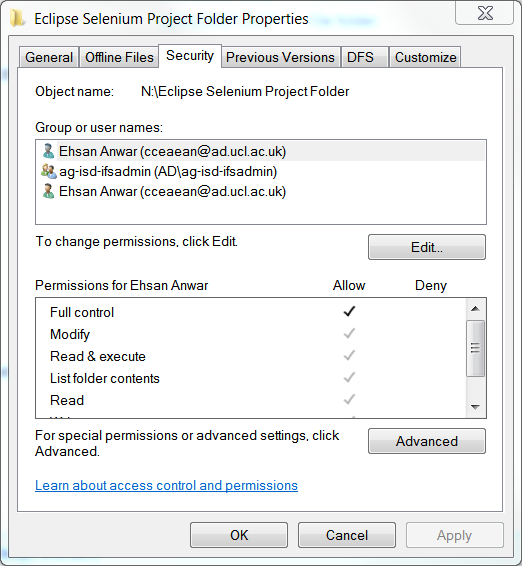
4.  Create a Git folder on your N drive &gt; go into the folder &gt; right click &gt; click bash her

    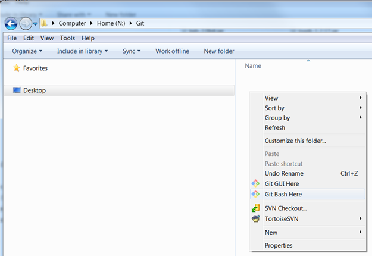

5.  type the command git clone git@git.dcs.ucl.ac.uk:lta/moodle-selenium-testing.git to pull down the repository
    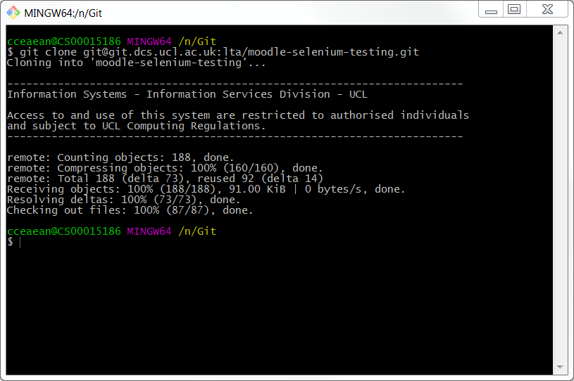
6.  Launch Eclipse and choose the Eclipse Selenium Project Workspace folder you created &gt; click OK
    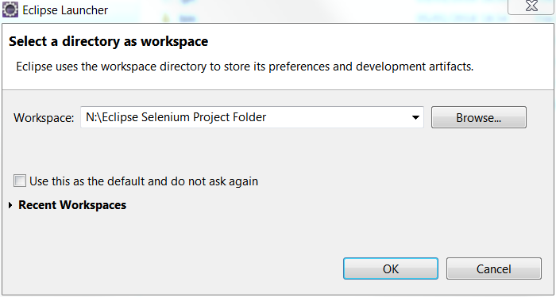
7.  Now we will install the testng repository by clicking help &gt; install software &gt; add and follow the screenshots below

    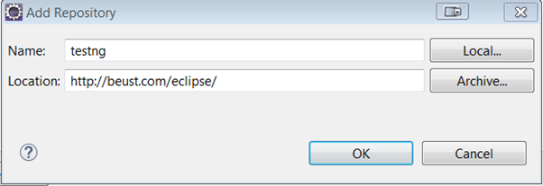

    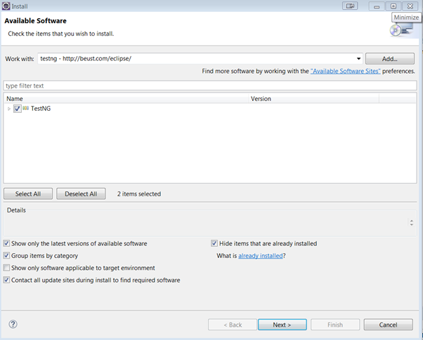

    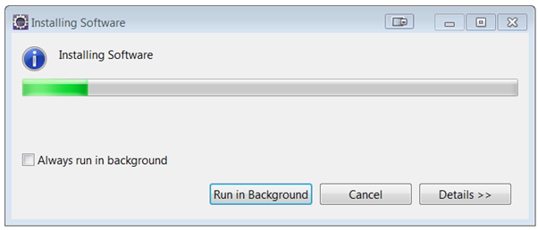

    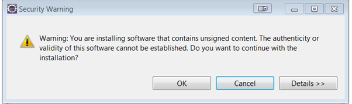

    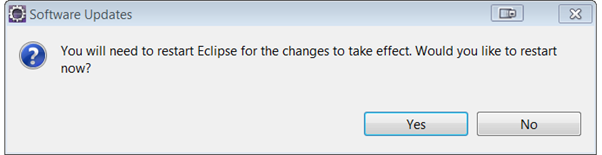

8.  Once Eclipse has restarted click file &gt; open projects from file system
    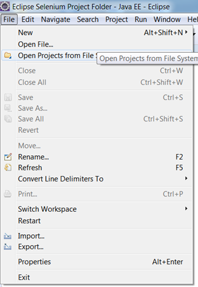
9.  Chose your moodle-selenium-testing git repository as the import source &gt; click finished
    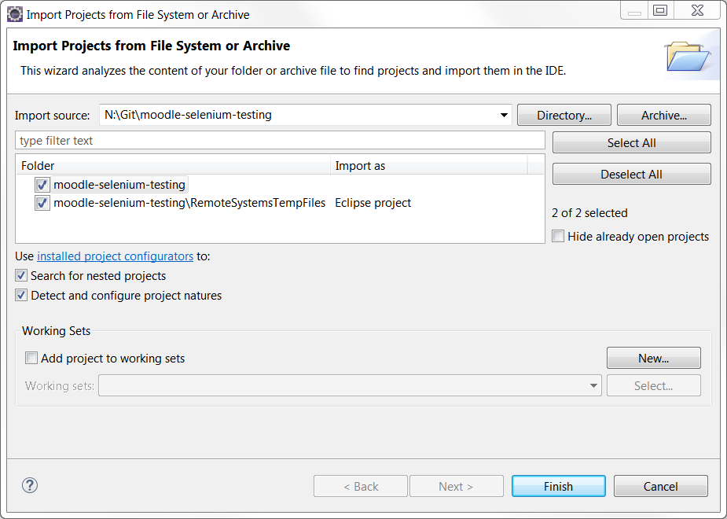
     
10. The repository will start to add the files to your project; wait for the status in the bottom right hand corner to finish before continuing.  Once completed you'll the repository added to your project
    

    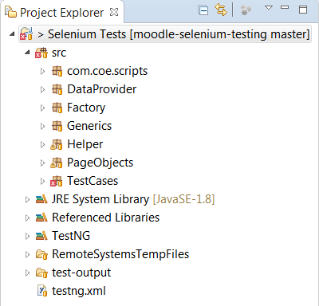

11. Now add the java build paths by right clicking on top the top level project &gt; properties &gt; java build paths &gt; libraries tab &gt; add external JAR's.  The Java paths are located on the git repository.  Once added click OK.
    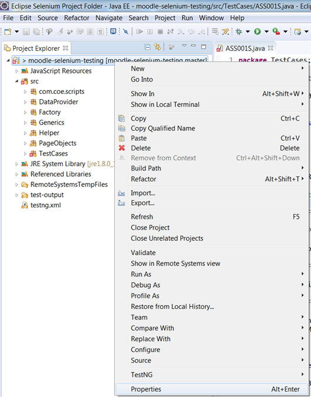

    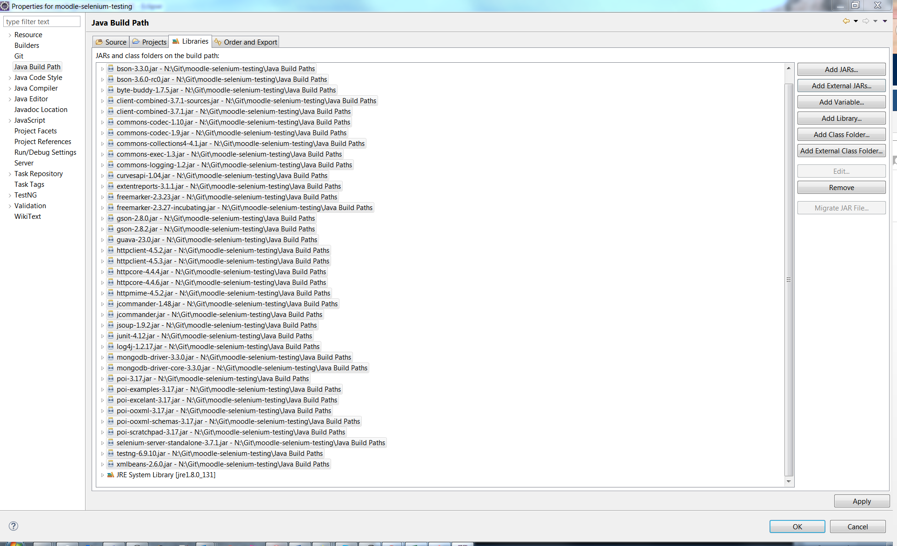
     

Create Tests

Each activity has has 1 set of tests for staff and one set of tests for students; the current full list of manual tests are located on wiki page: [Tests.](Tests)  These test are automated by using the unique elements on the page.  Further details on this can be found in link: <http://toolsqa.com/selenium-webdriver/findelement-and-findelements-command/> 

Configuring & Executing Tests

### Configuring

1.  Along the top bar click on green button drop down &gt; run configurations
    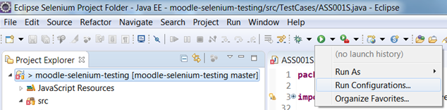
2.  Click TestNG &gt; press the new button &gt; set the name, project and run class &gt; apply.  Create a new configuration for each test class
    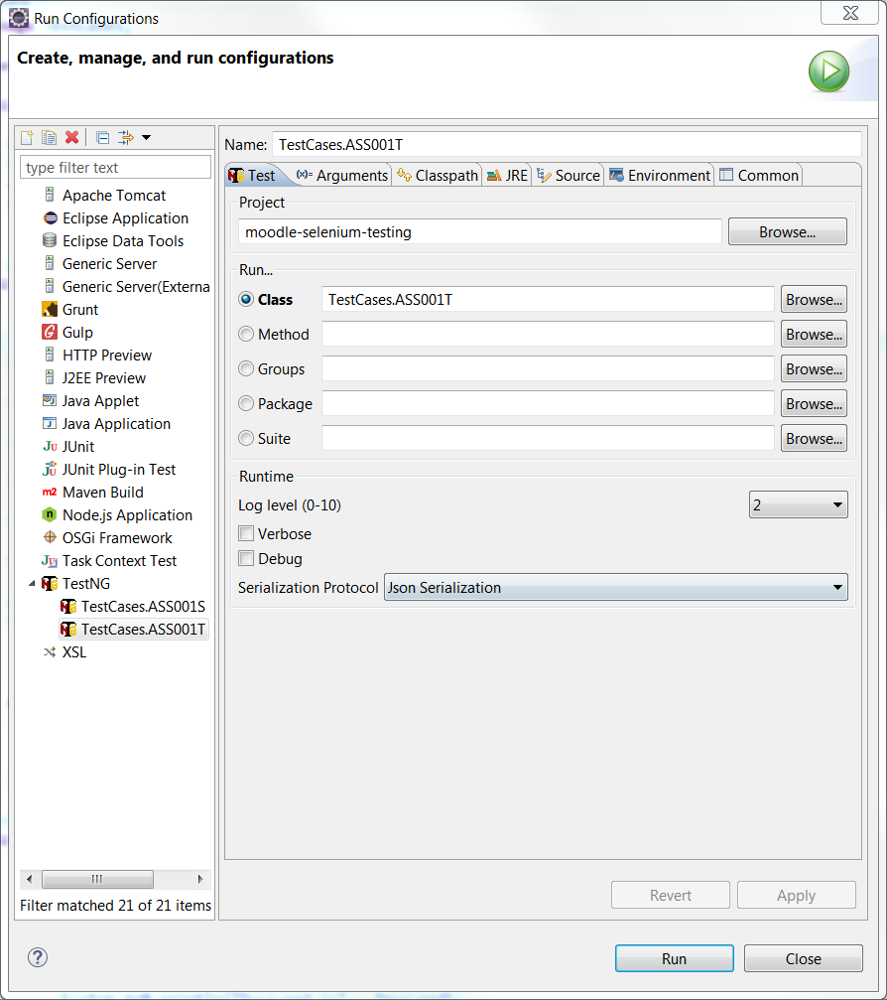

### Executing Tests individually

1.  Click on Testng &gt; choose a TestNG configuration and click run.  To run the test again, just simply click on the run and its visible in the list.  Ignore the error message and proceed.

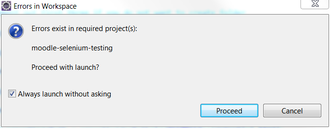

### Running All Tests In Sequence

1.  Click on the testng.xml file &gt; then click on the green run as button &gt; run as &gt; TestNG Suite.  The suite will run the test class that has been added to the testng.xml.

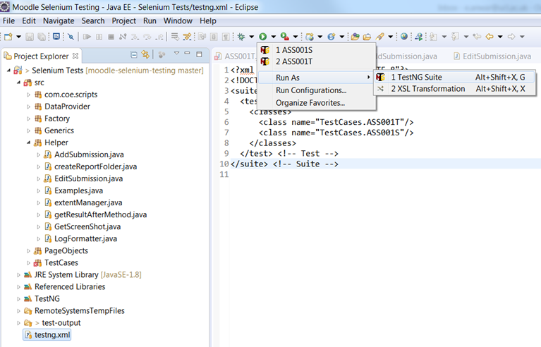

2. To view the testng.xml right click on the file in project explorer &gt; open with text editor.  You can then add/remove class test between the brackets &lt;class&gt;&lt;/class&gt; 

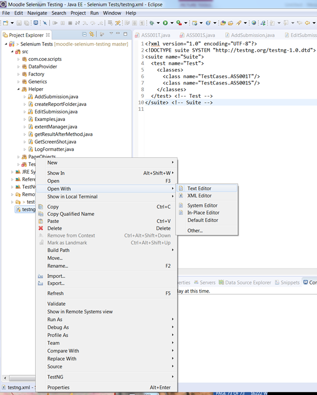

Test Results Report

Once a test is completed, you'll see the results output in the Eclipse Results and HTML Extent Report.

**PASSED -** Each step has passed successfully ****

**FAILED -** An error in the code or a test step was not met i.e. a test class is required to login to PASS but the incorrect username is entered**
**

**SKIPPED -** bypass a specific step if required but all the test are written to either PASS or FAIL.**
**

### Eclipse Results

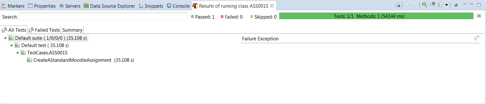

The Eclipse Results just shows simply the end status of the test (Passed, Failed, Skipped).  For failed and skipped, clicking the console tab will show further details

### HTML Extent Report

The report are saved to S:\\APPSERV\_LTA\\Moodle\\Moodle Selenium Testing\\Test Results with the activity type being a folder and a sub folder for each test.

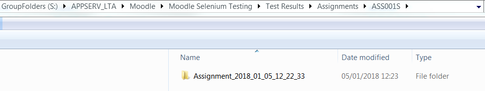

Every time a test is ran, a new folder will be created with the activity name, date and time.  Inside the folder will be the HTML Report with screenshots.  Opening up the report will show the full details; the main interest will be the screenshots steps where we can see where the test are passed successfully or narrow down where a test has failed and investigate accordingly.  

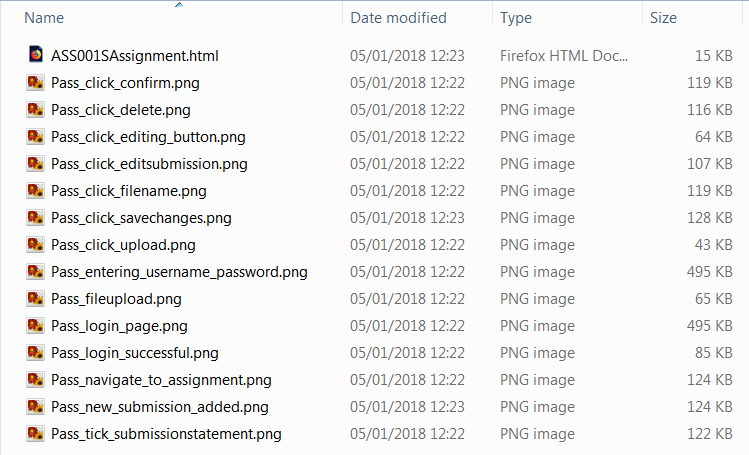

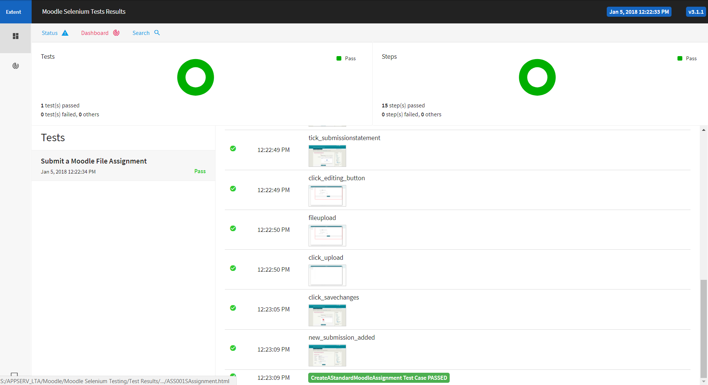

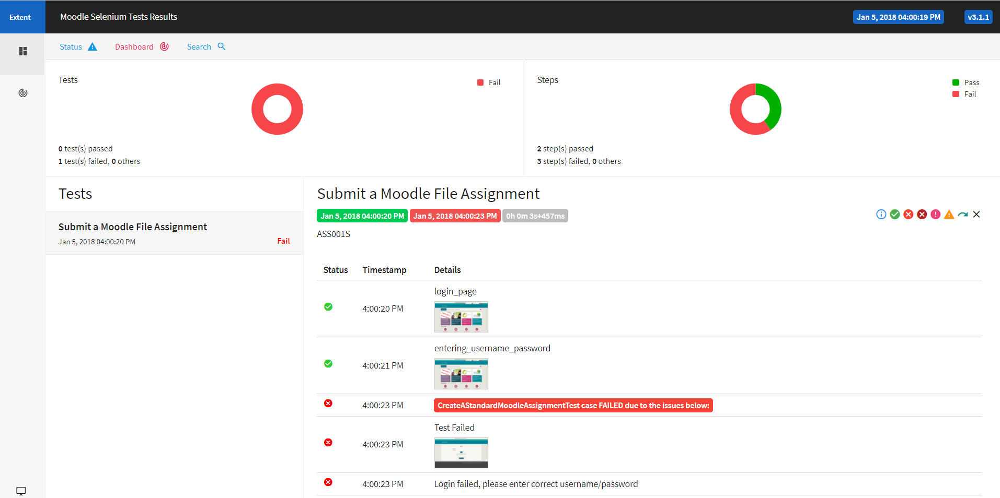

## Attachments:

 [image2017-8-1 15:3:52.png](attachments/70749555/70749521.png) (image/png)
 [image2017-8-1 15:4:11.png](attachments/70749555/70749522.png) (image/png)
 [image2017-8-1 15:7:37.png](attachments/70749555/70749527.png) (image/png)
 [image2017-8-1 15:8:25.png](attachments/70749555/70749528.png) (image/png)
 [image2017-8-1 15:8:33.png](attachments/70749555/70749529.png) (image/png)
 [image2017-8-1 15:8:46.png](attachments/70749555/70749530.png) (image/png)
 [image2017-8-1 15:8:53.png](attachments/70749555/70749531.png) (image/png)
 [image2017-8-1 15:9:2.png](attachments/70749555/70749533.png) (image/png)
 [image2017-8-1 15:31:28.png](attachments/70749555/70749553.png) (image/png)
 [image2017-8-1 15:45:1.png](attachments/70749555/70749565.png) (image/png)
 [image2017-8-1 15:47:35.png](attachments/70749555/70749571.png) (image/png)
 [image2017-8-1 15:47:53.png](attachments/70749555/70749572.png) (image/png)
 [image2017-8-3 16:19:45.png](attachments/70749555/70750179.png) (image/png)
 [image2017-8-3 16:20:14.png](attachments/70749555/70750180.png) (image/png)
 [image2017-8-3 16:32:31.png](attachments/70749555/70750192.png) (image/png)
 [image2017-8-3 16:34:29.png](attachments/70749555/70750195.png) (image/png)
 [image2017-8-3 16:34:57.png](attachments/70749555/70750196.png) (image/png)
 [image2017-8-3 16:35:32.png](attachments/70749555/70750197.png) (image/png)
 [image2017-8-3 16:36:15.png](attachments/70749555/70750198.png) (image/png)
 [image2017-8-3 16:38:13.png](attachments/70749555/70750202.png) (image/png)
 [image2017-8-3 16:38:50.png](attachments/70749555/70750205.png) (image/png)
 [image2017-8-7 11:52:12.png](attachments/70749555/70750616.png) (image/png)
 [image2017-8-7 15:13:39.png](attachments/70749555/70750671.png) (image/png)
 [image2018-1-4\_16-37-51.png](attachments/70749555/82447781.png) (image/png)
 [image2018-1-4\_16-41-49.png](attachments/70749555/82447784.png) (image/png)
 [image2018-1-4\_16-42-40.png](attachments/70749555/82447787.png) (image/png)
 [image2018-1-4\_16-43-39.png](attachments/70749555/82447791.png) (image/png)
 [image2018-1-4\_16-44-30.png](attachments/70749555/82447792.png) (image/png)
 [image2018-1-4\_16-45-42.png](attachments/70749555/82447793.png) (image/png)
 [image2018-1-4\_17-14-1.png](attachments/70749555/82447806.png) (image/png)
 [image2018-1-5\_11-3-48.png](attachments/70749555/82447975.png) (image/png)
 [image2018-1-5\_11-4-10.png](attachments/70749555/82447976.png) (image/png)
 [image2018-1-5\_11-31-29.png](attachments/70749555/82447988.png) (image/png)
 [image2018-1-5\_11-32-22.png](attachments/70749555/82447989.png) (image/png)
 [image2018-1-5\_11-33-19.png](attachments/70749555/82447991.png) (image/png)
 [image2018-1-5\_11-41-40.png](attachments/70749555/82448001.png) (image/png)
 [image2018-1-5\_11-44-25.png](attachments/70749555/82448002.png) (image/png)
 [image2018-1-5\_11-47-12.png](attachments/70749555/82448007.png) (image/png)
 [image2018-1-5\_12-24-50.png](attachments/70749555/82448025.png) (image/png)
 [image2018-1-5\_15-45-20.png](attachments/70749555/82448169.png) (image/png)
 [image2018-1-5\_15-46-46.png](attachments/70749555/82448173.png) (image/png)
 [image2018-1-5\_15-51-27.png](attachments/70749555/82448176.png) (image/png)
 [image2018-1-5\_16-1-42.png](attachments/70749555/82448180.png) (image/png)
 [image2018-1-5\_16-42-18.png](attachments/70749555/82448213.png) (image/png)
 [image2018-1-5\_16-43-19.png](attachments/70749555/82448216.png) (image/png)
 [image2018-1-5\_16-44-23.png](attachments/70749555/82448222.png) (image/png)
 [image2018-1-5\_16-49-2.png](attachments/70749555/82448238.png) (image/png)
 [image2018-1-5\_16-51-1.png](attachments/70749555/82448241.png) (image/png)
 [image2018-1-5\_16-51-16.png](attachments/70749555/82448242.png) (image/png)
 [image2018-1-5\_17-1-54.png](attachments/70749555/82448257.png) (image/png)
 [image2018-1-5\_17-2-22.png](attachments/70749555/82448258.png) (image/png)
 [image2018-1-5\_17-2-53.png](attachments/70749555/82448260.png) (image/png)
 [image2018-1-5\_17-12-55.png](attachments/70749555/82448264.png) (image/png)
 [image2018-1-5\_17-35-32.png](attachments/70749555/82448278.png) (image/png)
 [image2018-1-5\_17-35-46.png](attachments/70749555/82448279.png) (image/png)
 [image2018-1-5\_17-41-52.png](attachments/70749555/82448288.png) (image/png)
 [image2018-1-5\_18-26-58.png](attachments/70749555/82448304.png) (image/png)
 [image2018-1-5\_18-31-36.png](attachments/70749555/82448307.png) (image/png)
 [image2018-1-5\_18-34-26.png](attachments/70749555/82448310.png) (image/png)
 [image2018-1-5\_18-40-18.png](attachments/70749555/82448316.png) (image/png)
 [image2018-1-5\_18-42-38.png](attachments/70749555/82448317.png) (image/png)
 [image2018-1-5\_18-46-18.png](attachments/70749555/82448321.png) (image/png)
 [image2018-1-5\_18-49-24.png](attachments/70749555/82448327.png) (image/png)
 [image2018-1-5\_19-14-59.png](attachments/70749555/82448332.png) (image/png)
 [image2018-1-5\_19-20-43.png](attachments/70749555/82448333.png) (image/png)
 [image2018-1-5\_19-25-55.png](attachments/70749555/82448334.png) (image/png)
 [image2018-1-5\_19-27-31.png](attachments/70749555/82448335.png) (image/png)
 [image2018-1-5\_19-28-21.png](attachments/70749555/82448336.png) (image/png)
 [image2018-1-5\_19-30-43.png](attachments/70749555/82448337.png) (image/png)
 [image2018-1-5\_19-45-9.png](attachments/70749555/82448343.png) (image/png)

