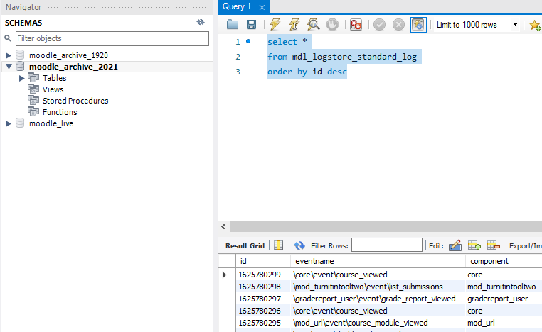

# Snapshot 20-21 Plan

Expected Release date: 14 Jul 2021 

Deployment lead: Alistair Spark/Nikola Bozhkov

Change Request: TBC

Catalyst TO DO:

1) Take Database backup including log tables to EFS share (to be agreed) (measure time)

2) Copy to EFS share lang and repository from moodledata

3) Need to truncate mdl\_logstore\_log\_standard in UCL Moodle prod environment

UCL TO DO:

4)Copy Moodle prod backup and required moodledata to mdl-db01 and mdl-snpsht-ap01 respectively 

5) Start restore on mdl-db01 as moodle\_archive\_2021 (DBA team)

Questions for Catalyst:

-   Do we need to refresh Moodle Staging from Moodle Prod before doing the mock-up run to allows accurate measure of how long it is going to take when done in Prod? 

**A: We took a backup from Moodle prod. It took about 12.5 hours to restore locally**

-   Where the db and moodledata backups will be placed once taken for UCL to access? EFS?

**A: Only lang and repository is required from moodledata.  DB backup will be placed in mdl-admin01 /mim-efs/db\_backups. LA team can then copy to db backup to mdl-db01 and lang and repository folder to the mdl-snpsht-ap01**

-   Discuss 2 step R-sync process - initial and final.

**A: Not needed**

-   How are we going to deal with the current setup for Moodle in AWS (80% S3 bucket and 20% local EFS) when Snapshot 20/21 is running on UCL servers? Can we use read-only S3 credentials or we need write?

**A: New files will be stored locally. Existing files will be served from S3**

Days 0 - Prep

<table>
<thead>
<tr class="header">
<th>Team</th>
<th>Who</th>
<th>What</th>
<th>Expected Completion</th>
<th>Completed</th>
</tr>
</thead>
<tbody>
<tr class="odd">
<td>DBA</td>
<td>Roy</td>
<td>Dry-run of DB restore times on mdl-db01 </td>
<td>

09 Jun 2021  

</td>
<td>

09 Jun 2021 

</td>
</tr>
<tr class="even">
<td>Learning Apps</td>
<td> 
</td>
<td>
Moodle 3.9.7 build &amp; config.php deployed for 20-21 on <a href="http://mdl-snpsht-ap01.ad">mdl-snpsht-ap01.ad</a> with .htaccess

Make sure config.php has S3 credentials for AWS
</td>
<td>

17 Jun 2021  

</td>
<td>

17 Jun 2021 

</td>
</tr>
<tr class="odd">
<td>Learning Apps</td>
<td> 
</td>
<td>Dry-run testing of 20-21 on <a href="http://mdl-snpsht-ap01.ad">mdl-snpsht-ap01.ad</a> to check that all apache etc configs are good</td>
<td>

17 Jun 2021 

</td>
<td>

17 Jun 2021 

</td>
</tr>
</tbody>
</table>

Required team under ESS

-MySQL DBA - Roy (TBC 12th 9.30pm-11pm)

-LA team x2 (TBC 12th 9.00pm-11pm)

Required team during business hours

--Ed Apps - All → AS/DK/EA/DO (TBC)

## Day 1 - Take Moodle snapshot (12th July 2021)

<table>
<thead>
<tr class="header">
<th>Team</th>
<th>Who</th>
<th>What</th>
<th>Start time</th>
<th>Expected Completion</th>
<th>Completed</th>
</tr>
</thead>
<tbody>
<tr class="odd">
<td>Learning Apps</td>
<td> 
</td>
<td>Moodle 3.9.8 build &amp; config.php deployed for 20-21 on <a href="http://mdl-snpsht-ap01.ad">mdl-snpsht-ap01.ad</a> with .htaccess applied</td>
<td>10;00am</td>
<td>4:00pm</td>
<td><ul>
<li>start</li>
<li>completes</li>
</ul></td>
</tr>
<tr class="even">
<td>Learning apps</td>
<td> 
</td>
<td>Request uclmoodleprod in mdl-db01 to be removed by DBA (used for dry-run)</td>
<td>10am</td>
<td>10:05</td>
<td><ul>
<li>start</li>
<li>completes</li>
</ul></td>
</tr>
<tr class="odd">
<td>Catalyst</td>
<td> 
</td>
<td>Give Catalyst resource all clear to start dump</td>
<td>6:30pm</td>
<td> 
</td>
<td><ul>
<li> </li>
</ul></td>
</tr>
<tr class="even">
<td>Catalyst</td>
<td> 
</td>
<td>
MySQL dump backup of moodle_live including log tables
</td>
<td>6:35pm</td>
<td>10:00pm</td>
<td><ul>
<li> start</li>
<li>completes</li>
</ul></td>
</tr>
<tr class="odd">
<td>Catalyst</td>
<td> 
</td>
<td>Catalyst notify Learning Apps db backup, lang and repository data copied over.</td>
<td>9:50pm</td>
<td> 
</td>
<td><ul>
<li> </li>
</ul></td>
</tr>
<tr class="even">
<td>Learning apps</td>
<td> 
</td>
<td>Once db backup is ready, copy to mdl-db01 and notify UCL DBA resource.</td>
<td>10:15pm</td>
<td>10:30pm</td>
<td><ul>
<li> start</li>
<li>completes</li>
</ul></td>
</tr>
<tr class="odd">
<td>UCL DBA</td>
<td> 
</td>
<td>
Start Restore of Moodle database on mdl-db01

dbname: moodle_archive_2021

user: moodleuser
</td>
<td> 
</td>
<td> 
</td>
<td><ul>
<li>start</li>
<li>completes</li>
</ul></td>
</tr>
</tbody>
</table>

## 
Create, upgrade & release snapshot on day 2 (13th July 2021)

<table>
<thead>
<tr class="header">
<th>Team</th>
<th>Who</th>
<th>What</th>
<th>Start time</th>
<th>Expected Completion</th>
<th>Completed</th>
</tr>
</thead>
<tbody>
<tr class="odd">
<td>DBA</td>
<td>DBA</td>
<td>
Verify restore of moodle_archive_2021<strong> </strong>on mdl completes successfully &amp; moodleuser for mysql has access
</td>
<td>9:00am</td>
<td>9.30am</td>
<td><ul>
<li> </li>
</ul></td>
</tr>
<tr class="even">
<td>Learning Apps</td>
<td> 
</td>
<td>Copy lang and repository folders from <a href="http://mdl-admin01/mim-efs/db_backups">mdl-admin01:/mim-efs/db_backups</a> to mdl-snpsht-ap01</td>
<td>9:00am</td>
<td>9.30am</td>
<td><ul>
<li>start</li>
<li>completes</li>
</ul></td>
</tr>
<tr class="odd">
<td>Learning Apps</td>
<td> 
</td>
<td>Verify lang and repository folders from moodledata are present in mdl-snpsht-ap01</td>
<td>9:05am</td>
<td>9.30am</td>
<td><ul>
<li>start</li>
<li>completes</li>
</ul></td>
</tr>
<tr class="even">
<td>Learning Apps</td>
<td> 
</td>
<td>

Note the last id in mdl_logstore_standard_log table (to notify Catalyst to delete after snapshot 2021 is released) id=1625780299

</td>
<td>9:05</td>
<td>9.30am</td>
<td><ul>
<li>start</li>
<li>completes</li>
</ul></td>
</tr>
<tr class="odd">
<td>Learning Apps</td>
<td> 
</td>
<td>
Clear all cache &amp; temp folders

rm -rf /data/moodle/20-21/cache/*

rm -rf /data/moodle/20-21/localcache/*

rm -rf /data/moodle/20-21/muc/*

rm -rf /data/moodle/20-21/sessions/*

rm -rf /data/moodle/20-21/temp/*
</td>
<td>9:10am</td>
<td>9.30am</td>
<td><ul>
<li> </li>
</ul></td>
</tr>
<tr class="even">
<td>Learning Apps</td>
<td> 
</td>
<td>Remove .htaccess redirect &amp; enable maintenance mode for 20-21  (only accessible via host name) 
 
</td>
<td>10am</td>
<td>10:15am</td>
<td><ul>
<li> </li>
</ul></td>
</tr>
<tr class="odd">
<td>Learning Apps</td>
<td> 
</td>
<td>
site admin &gt; plugin &gt; block &gt; manage block &gt; disable portico plugin

Disable Lecturecast Connector
</td>
<td> 
</td>
<td> 
</td>
<td><ul>
<li> </li>
</ul></td>
</tr>
<tr class="even">
<td>Learning Apps</td>
<td> 
</td>
<td>
Disable tasks:

<ul>
<li>\enrol_imsenterprise\task\cron_task</li>
<li>\local_userprofilefields_import\task\cron_task</li>
<li>\tool_ally\task\content_updates_task</li>
<li>\tool_ally\task\file_updates_task</li>
</ul></td>
<td> 
</td>
<td> 
</td>
<td><ul>
<li> </li>
</ul></td>
</tr>
<tr class="odd">
<td>Learning Apps</td>
<td> 
</td>
<td>Update config.php to use the <a href="https://moodle-snapshot.ucl.ac.uk/19-20">https://moodle-snapshot.ucl.ac.uk/20-21</a> url</td>
<td>10:00am</td>
<td>10:30am</td>
<td><ul>
<li> </li>
</ul></td>
</tr>
<tr class="even">
<td>Learning Apps</td>
<td> 
</td>
<td>

Run URL update tool in <strong>TMUX session or via web interface</strong>

php admin/tool/replace/cli/replace.php --search='https://moodle.ucl.ac.uk/' --replace='https://moodle-snapshot.ucl.ac.uk/20-21/' --non-interactive --shorten=true

Snapshot2021-url_replacement_result.txt

</td>
<td>2pm</td>
<td> 
</td>
<td>
need TBC

<ul>
<li> start</li>
<li>complete</li>
</ul></td>
</tr>
<tr class="odd">
<td>Learning Apps</td>
<td> 
</td>
<td>
Remove use of read-only db instance for MyFeedback on snapshot

 <a href="https://moodle-snapshot.ucl.ac.uk/19-20/admin/settings.php?section=reportmyfeedback">https://moodle-snapshot.ucl.ac.uk/</a><a href="https://moodle-snapshot.ucl.ac.uk/19-20/">20-21</a>/admin/settings.php?section=reportmyfeedback
</td>
<td> 
</td>
<td> 
</td>
<td><ul>
<li> </li>
</ul></td>
</tr>
<tr class="even">
<td>Learning Apps</td>
<td> 
</td>
<td>Remove muc/config.php in 19-20 (needed to disable Redis application cache) </td>
<td> 
</td>
<td> 
</td>
<td><ul>
<li> </li>
</ul></td>
</tr>
<tr class="odd">
<td>Learning Apps</td>
<td> 
</td>
<td>
Configure Redis Application Cache &amp; Session Store (same as in 19-20)
</td>
<td> 
</td>
<td> 
</td>
<td><ul>
<li> </li>
</ul></td>
</tr>
<tr class="even">
<td>Learning Apps</td>
<td> 
</td>
<td>
Set sessioncookie to mdl2021

Set sessioncookiepath to /20-21/

<a href="https://moodle-snapshot.ucl.ac.uk/20-21/admin/settings.php?section=sessionhandling" class="uri">https://moodle-snapshot.ucl.ac.uk/20-21/admin/settings.php?section=sessionhandling</a>
</td>
<td> 
</td>
<td> 
</td>
<td><ul>
<li> </li>
</ul></td>
</tr>
<tr class="odd">
<td>Learning Apps</td>
<td> 
</td>
<td>
Enable cron for 20-21 

nano /usr/local/bin/moodle-main.sh 
</td>
<td> 
</td>
<td> 
</td>
<td><ul>
<li> </li>
</ul></td>
</tr>
<tr class="even">
<td>Learning Apps</td>
<td> 
</td>
<td>Take 20-21 site out of Maintenance Mode</td>
<td>10:00am</td>
<td>10:05am</td>
<td><ul>
<li> </li>
</ul></td>
</tr>
<tr class="odd">
<td>Digi-ED</td>
<td> 
</td>
<td>Make sure hub landing page content updated and ready for new LSA/snapshot <a href="https://moodle.ucl.ac.uk/admin/settings.php?section=local_hub" class="uri">https://moodle.ucl.ac.uk/admin/settings.php?section=local_hub</a></td>
<td> 
</td>
<td> 
</td>
<td><ul>
<li> </li>
</ul></td>
</tr>
<tr class="even">
<td>Learning Apps</td>
<td> 
</td>
<td>
Remove .htaccess and do a git pull in /data/apache/htdocs/moodle/ from <a href="https://git.automation.ucl.ac.uk/moodle/dirroot-snapshot_index_page" class="uri">https://git.automation.ucl.ac.uk/moodle/dirroot-snapshot_index_page</a> to update the index.php to add link to 20-21 snapshot
</td>
<td>1:30pm</td>
<td>1:45pm</td>
<td><ul>
<li> </li>
</ul></td>
</tr>
<tr class="odd">
<td>Learning Apps</td>
<td> 
</td>
<td>Update Site Name to &quot;UCL Moodle 20/21&quot; - <a href="https://moodle-snapshot.ucl.ac.uk/20-21/admin/settings.php?section=frontpagesettings" class="uri">https://moodle-snapshot.ucl.ac.uk/20-21/admin/settings.php?section=frontpagesettings</a></td>
<td> 
</td>
<td> 
</td>
<td><ul>
<li> </li>
</ul></td>
</tr>
<tr class="even">
<td>Learning Apps</td>
<td> 
</td>
<td>add link to 20/21 snapshot on Live Moodle dashboard block</td>
<td>1:45pm</td>
<td>1:50pm</td>
<td><ul>
<li> </li>
</ul></td>
</tr>
<tr class="odd">
<td>Learning Apps</td>
<td> 
</td>
<td>Enable Hub <a href="https://moodle.ucl.ac.uk/admin/settings.php?section=local_hub" class="uri">https://moodle.ucl.ac.uk/admin/settings.php?section=local_hub</a></td>
<td> 
</td>
<td> 
</td>
<td><ul>
<li> </li>
</ul></td>
</tr>
<tr class="even">
<td>Digi-Ed</td>
<td> 
</td>
<td>Comms that 20-21 snapshot released</td>
<td> 
</td>
<td> 
</td>
<td><ul>
<li> </li>
</ul></td>
</tr>
<tr class="odd">
<td>Learning Apps</td>
<td> 
</td>
<td>
Update prod roles to allow course resets - <a href="Disable_role_course_reset">Disable role course reset</a>

<a href="https://ucldata.atlassian.net/browse/CTP-153" class="uri">https://ucldata.atlassian.net/browse/CTP-153</a> 
</td>
<td> 
</td>
<td> 
</td>
<td><ul>
<li> </li>
</ul></td>
</tr>
<tr class="even">
<td>Learning Apps</td>
<td> 
</td>
<td>Log a ticket with Catalyst to trim mdl_logstore_standard_log in Moodle Prod up to the last entry recorded above</td>
<td> 
</td>
<td> 
</td>
<td><ul>
<li>start</li>
<li>completes</li>
</ul></td>
</tr>
</tbody>
</table>

Step 3 - Complete (14th July)

| Who           | What                                                  | Expected Completion | Completed |
|---------------|-------------------------------------------------------|---------------------|-----------|
| Learning Apps | Notify ele-core & Service Desk that snapshot released | am                  | -         |
| Learning Apps | Thank everyone involved                               | am                  | -         |
| Learning Apps | Update CR and mark change as complete and successful  | am                  | -         |

## Attachments:

 [MoodleAdaptableTheme\_ColourSettings.docx](attachments/167512022/167511995.docx) (application/vnd.openxmlformats-officedocument.wordprocessingml.document)
 [image2021-7-13\_22-43-48.png](attachments/167512022/172465529.png) (image/png)
 [Snapshot2021-url\_replacement\_result.txt](attachments/167512022/172465637.txt) (text/plain)

