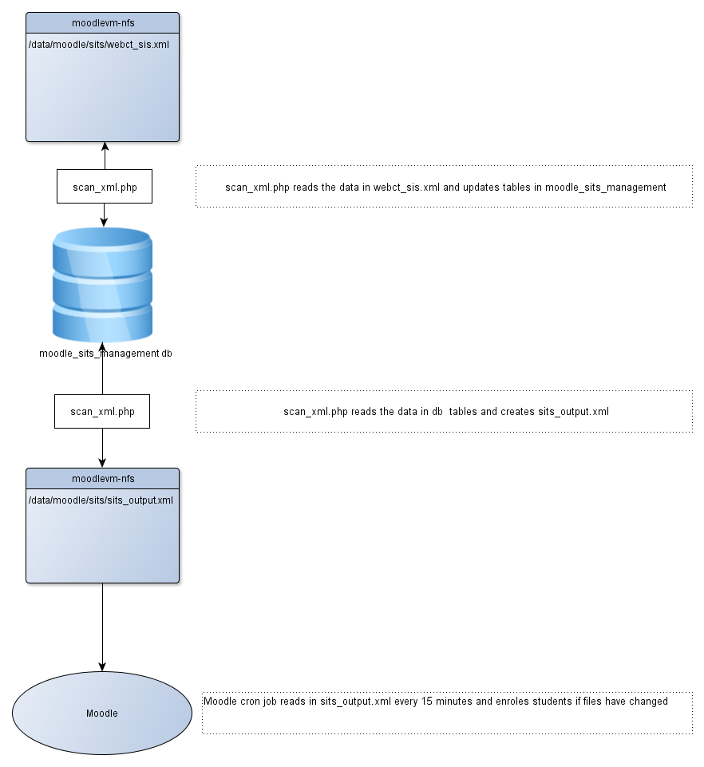

# Student account creation

scan\_xml.php is run by a server cron job at about 2.30am. It reads in webct\_sis\_xml (which comes from Portico), updates the moodle\_sits\_management db and produces sits\_output.xml. The moodle cron job which runs every 15 minutes, checks whether sits\_output.xml has changed since the last imsenteprise import was run. If it has changed, the imsenterprise import is run and will enrol students in to courses.

# Work Flow Diagram



<table>
<colgroup>
<col width="25%" />
<col width="25%" />
<col width="25%" />
<col width="25%" />
</colgroup>
<thead>
<tr class="header">
<th><p>host</p></th>
<th><p>folder</p></th>
<th><p>filename</p></th>
<th><p>comments</p></th>
</tr>
</thead>
<tbody>
<tr class="odd">
<td><p>moodlevm-nfs</p></td>
<td><p>/data/moodle/sits</p></td>
<td><p>webct_SIS.xml</p></td>
<td><p>comes from portico</p></td>
</tr>
<tr class="even">
<td><p>moodlevm-nfs</p></td>
<td><p>/data/moodle/sits</p></td>
<td><p>sits_output.xml</p></td>
<td><p>gets generated from sits manager</p></td>
</tr>
<tr class="odd">
<td><p>moodlevm-a</p></td>
<td><p>/data/apache/htdocs/moodle/ucl_tools/sits_filter</p></td>
<td><p>scan_xml.php</p></td>
<td><p>run by a cron job once a day. It updates tables in moodle_sits_management from webct_sis.xml</p></td>
</tr>
<tr class="even">
<td><p>moodlevm-nfs</p></td>
<td><p>/data/moodle/sits</p></td>
<td><p>module_list.txt</p></td>
<td><p>file provided by ELE to map portico codes to moodle codes</p></td>
</tr>
</tbody>
</table>

Creating a local Sits Filter database from production

**On moodledb-c**

cd /data/mysql/backup/temp

mysqldump -umoodleuser -p moodle\_sits\_management &gt; moodle\_sits\_management.sql

Copy moodle\_sits\_management.sql to your local server

**On your local server**

mysql&gt; create database moodle\_sits\_management DEFAULT CHARACTER SET UTF8 COLLATE utf8\_unicode\_ci;

mysql&gt; use moodle\_sits\_management;
Database changed
mysql&gt; SET NAMES 'utf8';
Query OK, 0 rows affected (0.00 sec)

mysql&gt; GRANT SELECT, INSERT, UPDATE, DELETE, CREATE, CREATE TEMPORARY TABLES, DROP, INDEX, ALTER ON moodle\_sits\_management.\* TO \`moodleuser\`@\`localhost\`;
Query OK, 0 rows affected (0.13 sec)
mysql&gt; exit
Bye

D:\\xampp\\mysql\\bin&gt;mysql -uroot -p moodle\_sits\_management &lt; d:\\xampp\\htdocs\\moodle2\\ucl\_tools\\sits\_filter\\moodle\_sits\_management.sql

scan\_xml.php is run by a cron job once a day. It updates tables in moodle\_sits\_management from webct\_sis.xml

update person set active=0, already\_in\_moodle=0

<table style="width:100%;">
<colgroup>
<col width="11%" />
<col width="11%" />
<col width="11%" />
<col width="11%" />
<col width="11%" />
<col width="11%" />
<col width="11%" />
<col width="11%" />
<col width="11%" />
</colgroup>
<tbody>
<tr class="odd">
<td><p>id</p></td>
<td><p>idnumber</p></td>
<td><p>username</p></td>
<td><p>firstname</p></td>
<td><p>lastname</p></td>
<td><p>email</p></td>
<td><p>active</p></td>
<td><p>last_updated</p></td>
<td><p>already_in_moodle</p></td>
</tr>
<tr class="even">
<td><p>57399</p></td>
<td><p>TCARY58</p></td>
<td><p>zcqae18</p></td>
<td><p>Theodora</p></td>
<td><p>Carydias</p></td>
<td><p>t.carydias@ucl.ac.uk</p></td>
<td><p>0</p></td>
<td><p>1343698512</p></td>
<td><p>0</p></td>
</tr>
</tbody>
</table>

update module set status=0

<table>
<colgroup>
<col width="12%" />
<col width="12%" />
<col width="12%" />
<col width="12%" />
<col width="12%" />
<col width="12%" />
<col width="12%" />
<col width="12%" />
</colgroup>
<tbody>
<tr class="odd">
<td><p>id</p></td>
<td><p>upi</p></td>
<td><p>sits_code</p></td>
<td><p>name</p></td>
<td><p>dept_id</p></td>
<td><p>visible</p></td>
<td><p>last_updated</p></td>
<td><p>status</p></td>
</tr>
<tr class="even">
<td><p>3733</p></td>
<td><p><br />
</p></td>
<td><p>FREN4212</p></td>
<td><p>French Texts XXV</p></td>
<td><p>87</p></td>
<td><p>1</p></td>
<td><p>1311245152</p></td>
<td><p>0</p></td>
</tr>
</tbody>
</table>

update membership set active=0, already\_in\_moodle=0

<table style="width:100%;">
<colgroup>
<col width="16%" />
<col width="16%" />
<col width="16%" />
<col width="16%" />
<col width="16%" />
<col width="16%" />
</colgroup>
<tbody>
<tr class="odd">
<td><p>sits_code</p></td>
<td><p>person_idnumber</p></td>
<td><p>person_username</p></td>
<td><p>role</p></td>
<td><p>active</p></td>
<td><p>already_in_moodle</p></td>
</tr>
<tr class="even">
<td><p>FREN4001</p></td>
<td><p>TCARY58</p></td>
<td><p>zcqae18</p></td>
<td><p>01</p></td>
<td><p>0</p></td>
<td><p>0</p></td>
</tr>
<tr class="odd">
<td><p>FREN4002</p></td>
<td><p>TCARY58</p></td>
<td><p>zcqae18</p></td>
<td><p>01</p></td>
<td><p>0</p></td>
<td><p>0</p></td>
</tr>
<tr class="even">
<td><p>FREN4206</p></td>
<td><p>TCARY58</p></td>
<td><p>zcqae18</p></td>
<td><p>01</p></td>
<td><p>0</p></td>
<td><p>0</p></td>
</tr>
<tr class="odd">
<td><p>FREN4212</p></td>
<td><p>TCARY58</p></td>
<td><p>zcqae18</p></td>
<td><p>01</p></td>
<td><p>0</p></td>
<td><p>0</p></td>
</tr>
<tr class="even">
<td><p>SPAN4001</p></td>
<td><p>TCARY58</p></td>
<td><p>zcqae18</p></td>
<td><p>01</p></td>
<td><p>0</p></td>
<td><p>0</p></td>
</tr>
<tr class="odd">
<td><p>SPAN4407</p></td>
<td><p>TCARY58</p></td>
<td><p>zcqae18</p></td>
<td><p>01</p></td>
<td><p>0</p></td>
<td><p>0</p></td>
</tr>
</tbody>
</table>

Get an array of departments from the department table

Get an array of modules from the module tables

### process the xml:

Get each group element

``` java
<group>
  <sourcedid>
    <source>sits:vision</source>
  <id>FREN4212A2012/13T1/2</id> = coursecode
  </sourcedid>
  <description>
    <short>Swiss Cinema</short> = description
  </description>
    <org>
        <orgunit>French</orgunit> = category
    </org>
  <extension>
    <template>blank</template>
  </extension>
</group>
```

remove the last 12 chars from id and assign it to course code

assign short value to description

assign orgunit to category

if the category does not exist in the array of departments create a new record in the departments table and add dept id to departments array

<table style="width:100%;">
<colgroup>
<col width="16%" />
<col width="16%" />
<col width="16%" />
<col width="16%" />
<col width="16%" />
<col width="16%" />
</colgroup>
<tbody>
<tr class="odd">
<td><p>id</p></td>
<td><p>parent_id</p></td>
<td><p>dept_name</p></td>
<td><p>last_updated</p></td>
<td><p>level</p></td>
<td><p>visible</p></td>
</tr>
<tr class="even">
<td><p>87</p></td>
<td><p>2</p></td>
<td><p>French</p></td>
<td><p>1311245235</p></td>
<td><p>0</p></td>
<td><p>1</p></td>
</tr>
</tbody>
</table>

if the coursecode doesn't exist in modules array add it to the modules table and the modules array. If the coursecode does exist set the status flag in the module table.

<table>
<colgroup>
<col width="12%" />
<col width="12%" />
<col width="12%" />
<col width="12%" />
<col width="12%" />
<col width="12%" />
<col width="12%" />
<col width="12%" />
</colgroup>
<tbody>
<tr class="odd">
<td><p>id</p></td>
<td><p>upi</p></td>
<td><p>sits_code</p></td>
<td><p>name</p></td>
<td><p>dept_id</p></td>
<td><p>visible</p></td>
<td><p>last_updated</p></td>
<td><p>status</p></td>
</tr>
<tr class="even">
<td><p>3733</p></td>
<td><p><br />
</p></td>
<td><p>FREN4212</p></td>
<td><p>French Texts XXV</p></td>
<td><p>87</p></td>
<td><p>1</p></td>
<td><p>1311245152</p></td>
<td><p>1</p></td>
</tr>
</tbody>
</table>

Get the person element and add them to the person table if they don't exist set active to 1. If they do exist, update the active field to 1.

``` java
<person>
    <sourcedid>
      <source>sits:vision</source>
      <id>TCARY58</id>
    </sourcedid>
<userid>zcqae18</userid>
    <name>
      <fn>Theodora Carydias</fn>
      <n>
        <family>Carydias</family>
        <given>Theodora</given>
      </n>
    </name>
    <email>
        t.carydias@ucl.ac.uk
    </email>
  <extension>
    <webcredential></webcredential>
  </extension>
</person>
```

<table style="width:100%;">
<colgroup>
<col width="11%" />
<col width="11%" />
<col width="11%" />
<col width="11%" />
<col width="11%" />
<col width="11%" />
<col width="11%" />
<col width="11%" />
<col width="11%" />
</colgroup>
<tbody>
<tr class="odd">
<td><p>id</p></td>
<td><p>idnumber</p></td>
<td><p>username</p></td>
<td><p>firstname</p></td>
<td><p>lastname</p></td>
<td><p>email</p></td>
<td><p>active</p></td>
<td><p>last_updated</p></td>
<td><p>already_in_moodle</p></td>
</tr>
<tr class="even">
<td><p>57399</p></td>
<td><p>TCARY58</p></td>
<td><p>zcqae18</p></td>
<td><p>Theodora</p></td>
<td><p>Carydias</p></td>
<td><p>t.carydias@ucl.ac.uk</p></td>
<td><p>1</p></td>
<td><p>1343698512</p></td>
<td><p>0</p></td>
</tr>
</tbody>
</table>

Get the membership element. Assign id element value to coursecode. Assign member to idnumber. Assign roletype value to roletype. Assign userid value to username. Assign status value to status. Add new record to membership if one doesn't exist already if does exist - set active to 1.

``` java
<membership>
  <sourcedid>
    <source>sits:vision</source>
    <id>FREN4212A2011/12T1/2</id> = coursecode
  </sourcedid>
  <member>
  <sourcedid>
    <source>sits:vision</source>
    <id>AMARS79</id> = idnumber
  </sourcedid>
  <idtype idtype="1"/>
  <role roletype="01"> = roletype
<userid>zclme49</userid> = username
    <status>1</status> = status
  </role>
  </member>
  <member>
  <sourcedid>
    <source>sits:vision</source>
    <id>CLHJA30</id>
  </sourcedid>
  <idtype idtype="1"/>
  <role roletype="01">
<userid>zcqae58</userid>
    <status>1</status>
  </role>
  </member>
  <member>
  <sourcedid>
    <source>sits:vision</source>
    <id>HMJCO83</id>
  </sourcedid>
  <idtype idtype="1"/>
  <role roletype="01">
<userid>zclfh17</userid>
    <status>1</status>
  </role>
  </member>
  <member>
  <sourcedid>
    <source>sits:vision</source>
    <id>RHERC23</id>
  </sourcedid>
  <idtype idtype="1"/>
  <role roletype="01">
<userid>zclfe73</userid>
    <status>1</status>
  </role>
  </member>
  <member>
  <sourcedid>
    <source>sits:vision</source>
    <id>RIKNI59</id>
  </sourcedid>
  <idtype idtype="1"/>
  <role roletype="01">
<userid>zcqae67</userid>
    <status>1</status>
  </role>
  </member>
  <member>
  <sourcedid>
    <source>sits:vision</source>
    <id>TCARY58</id>
  </sourcedid>
  <idtype idtype="1"/>
  <role roletype="01">
<userid>zcqae18</userid>
    <status>1</status>
  </role>
  </member>
</membership>
<membership>
```

<table style="width:100%;">
<colgroup>
<col width="16%" />
<col width="16%" />
<col width="16%" />
<col width="16%" />
<col width="16%" />
<col width="16%" />
</colgroup>
<tbody>
<tr class="odd">
<td><p>sits_code</p></td>
<td><p>person_idnumber</p></td>
<td><p>person_username</p></td>
<td><p>role</p></td>
<td><p>active</p></td>
<td><p>already_in_moodle</p></td>
</tr>
<tr class="even">
<td><p>FREN4001</p></td>
<td><p>TCARY58</p></td>
<td><p>zcqae18</p></td>
<td><p>01</p></td>
<td><p>0</p></td>
<td><p>0</p></td>
</tr>
<tr class="odd">
<td><p>FREN4002</p></td>
<td><p>TCARY58</p></td>
<td><p>zcqae18</p></td>
<td><p>01</p></td>
<td><p>0</p></td>
<td><p>0</p></td>
</tr>
<tr class="even">
<td><p>FREN4206</p></td>
<td><p>TCARY58</p></td>
<td><p>zcqae18</p></td>
<td><p>01</p></td>
<td><p>0</p></td>
<td><p>0</p></td>
</tr>
<tr class="odd">
<td><p>FREN4212</p></td>
<td><p>TCARY58</p></td>
<td><p>zcqae18</p></td>
<td><p>01</p></td>
<td><p>1</p></td>
<td><p>0</p></td>
</tr>
<tr class="even">
<td><p>SPAN4001</p></td>
<td><p>TCARY58</p></td>
<td><p>zcqae18</p></td>
<td><p>01</p></td>
<td><p>0</p></td>
<td><p>0</p></td>
</tr>
<tr class="odd">
<td><p>SPAN4407</p></td>
<td><p>TCARY58</p></td>
<td><p>zcqae18</p></td>
<td><p>01</p></td>
<td><p>0</p></td>
<td><p>0</p></td>
</tr>
</tbody>
</table>

If a student has a record in the membership table for a course they were enrolled on last year, they will get enrolled on the same course this year each time the IMS import is run. For example, ZCQAE18 was enrolled on FREN4212 on 21/06/12. ie they were in the webct\_sis.xml file on this date). A record was created in the membership table at this time. Each time the ims import is run they will be enrolled in the course if they aren't already. The membership table should be emptied certainly at the end of the academic year but possible before each time scan\_xml.php is run.

There is a field in the the membership table called active which is supposed to indicate whether the user was enrolled in the course in the last imported xml but this is updated to 0 each time the scan\_xml.php is run. If that user is in the

check if idnumber in person table exists in mdl\_user table, update the alreadyinmoodle field.

check if course idnumber in course table exists in mdl\_course. If it does, update the alreadyinmoodle field to 1.

------------------------------------------------------------------------

## Write out the xml

This is executed by the function write\_filtered\_xml in scan\_xml.php.

Open sits\_output.xml for writing

#### Create Person tag

Get records from Person table that are not yet in moodle and were in the latest webct\_sis.xml file.

Create a tag for each person.

#### Create the Group tag

Get a list of course from Course table that don't exist in Moodle and the dept\_id in the course table matches the id in the dept table

Create a group tag for each course

#### Create the Membership tag

Get all the records from courses where sits\_enrol\_active=1

SELECT c.id, c.idnumber, c.name as coursename FROM course c where c.sits\_enrol\_active=1

+----------------------------+
| id | idnumber | coursename             |
+----------------------------+
|  3 | SITS     | SITS Filter test       |
|  6 | Zaman    | Zaman Wong Test Course |
+----------------------------+
2 rows in set (0.00 sec)

For each course call function get\_members\_still\_to\_import\_for\_course($c\_id)

The function get\_members\_still\_to\_import\_for\_course does the following:

get a count of the modules for each course: function =  get\_count\_of\_mappings\_for\_course($c\_id)

SELECTcount(a.module\_id)AStotal
FROMassignmenta
WHEREa.course\_id=3

+-------+
| total |
+-------+
|     1 |
+-------+

get the portico identifier for this course and assign it to $idnumber ($idnumber=SITS)

select idnumber from course c where c.id=3;
+----------+
| idnumber |
+----------+
| SITS     |
+----------+
1 row in set

if the count is 1,

check if the portico identifier is the same as the sits code

SELECT sits\_code from module m ,assignment a WHERE a.course\_id=3 and a.module\_id=m.id

+-----------+
| sits\_code |
+-----------+
| BIOC1001  |
+-----------+
1 row in set

if the sits\_code(BIOC1001)=$idnumber(SITS) then it's a one to one mapping

else it's a complex mapping and the following sql is run

SELECT DISTINCT c.user\_upi as person\_idnumber,c.user\_id as person\_username, '02' as role FROM moodle\_sits\_management\_dev.course c WHERE id=3 AND length(c.user\_upi)&gt;0 AND length(c.user\_id)&gt;0 UNION SELECT DISTINCT s.person\_idnumber, s.person\_username, s.role FROM moodle\_sits\_management\_dev.membership s, moodle\_sits\_management\_dev.module m, moodle\_sits\_management\_dev.assignment a WHERE m.id = a.module\_id AND s.sits\_code = m.sits\_code AND a.course\_id =3 AND UCASE(person\_idnumber) not in ( (SELECT UCASE(u.idnumber) from moodle\_dev\_245.mdl\_user u, moodle\_dev\_245.mdl\_role\_assignments r, moodle\_dev\_245.mdl\_context cx, moodle\_dev\_245.mdl\_course c WHERE u.id = r.userid AND r.contextid = cx.id AND cx.instanceid = c.id AND r.roleid = 5 AND c.idnumber ='SITS' ) )

This will get the members for all the modules mapped to this course that are still flagged as not being in moodle and build the membership tag.

### Start of term procedure

Sometime during August, Registery notify ELE when module selection is starting. Up until that time, ims enterprise enrolments is usually prevented by specifying an invalid filename as the xml file to import in the portico admin page. (site admin&gt;plugins&gt;enrolments&gt;portico enrolment and change the file location to a file that doesn’t exist so that sits\_output.xml is not read in and students are not enrolled on moodle courses).

email from Andrew Higman

> I can confirm that the file Portico sends to Moodle is written anew each night.
>
> It contains only data for the current academic year, by which it means the year starting on 1st August. So from 1st August 2012 to  31st July 2013 it would have sent data for 2012, and from 1st August 2013 data for 2013. It applies this condition to the module availability (MAV) records it selects, and then selects student module selections (SMS) for the selected MAV records.
>
> It contains only data for approved or confirmed module selections.
>
> I should mention that the MAV records for an academic year are created starting sometime in early August. Until that happens the file will not contain any person, group or membership data.
>
> Module selection for 2013 started this week and so far there are 716 confirmed selections. I believe compulsory modules are automatically approved and confirmed and they will account for the 50,000+ memberships Moodle should be receiving now.

#### Step 1

After the end of the academic year and before the start of first term, ELE notify all moodle course admins to reset their courses. This will un-enrol all students from a course.

#### Step 2

When ELE want to start registering students on to moodle courses, Ele

-   truncate  person, course, assignment tables in the moodle\_sits\_management database by selecting options 2 and 3 on <http://moodle.ucl.ac.uk/ucl_tools/sits_filter/setup.php>

<!-- -->

-   provide module\_list.txt. This is a list of moodle module codes mapped to portico sits codes.eg.

ANAT2099:ANAT2099
ANAT3003\_ANATG003\_ANATM003\_ANAT3004:ANATG003,ANATM003,ANAT3003

BIOL2004:BIOLG004,BIOL2004A,BIOL2004

The moodle module code is on the left of the colon

#### Step 3

module\_list.txt needs to be copied to /data/moodle/sits on moodlevm-nfs by LTA. This file is not read by scan\_xml.php. It is only used to populate moodle\_sits\_management.assignment and moodle\_sits\_management.course. The assignment and course table are read by scan\_xml.php. Each record in the assignment table contains the course\_id which relates to the id in the course table and module\_id which relates to the id in the module table eg.

module

<table>
<colgroup>
<col width="33%" />
<col width="33%" />
<col width="33%" />
</colgroup>
<thead>
<tr class="header">
<th><p>id</p></th>
<th><p>sits_code</p></th>
<th><p>name</p></th>
</tr>
</thead>
<tbody>
<tr class="odd">
<td><p>1359</p></td>
<td><p>Biol2004</p></td>
<td><p>Fundamentals of Molecular Biology</p></td>
</tr>
</tbody>
</table>

assigment

<table>
<colgroup>
<col width="33%" />
<col width="33%" />
<col width="33%" />
</colgroup>
<thead>
<tr class="header">
<th><p>id</p></th>
<th><p>course_id</p></th>
<th><p>module_id</p></th>
</tr>
</thead>
<tbody>
<tr class="odd">
<td><p>1</p></td>
<td><p>1</p></td>
<td><p>1359</p></td>
</tr>
</tbody>
</table>

course

<table>
<colgroup>
<col width="33%" />
<col width="33%" />
<col width="33%" />
</colgroup>
<thead>
<tr class="header">
<th><p>id</p></th>
<th><p>idnumber</p></th>
<th><p>name</p></th>
</tr>
</thead>
<tbody>
<tr class="odd">
<td><p>1</p></td>
<td><p>Biol2004</p></td>
<td><p>Fundamentals of Molecular Biology</p></td>
</tr>
</tbody>
</table>

#### Step 4

ELE  populate moodle\_sits\_management.membership table by selecting option 10 -  "import and check module list txt" link on \#<http://moodle.ucl.ac.uk/ucl_tools/sits_filter/setup.php>. It only needs to be run once.

##### Step 5

Once the Assignment table has been populated, the next time scan\_xml.php is run, either by the cron job at 2.30 am or manually in the browser by going to  <https://moodle.ucl.ac.uk/ucl_tools/sits_filter/scan_xml.php> it will create a new sits\_output.xml based on what is in the database and webct\_sis.xml file. Running scan\_xml.php does not enrol students in to courses on moodle, it just creates sits\_output.xml. You can see who will get enrolled in to which moodle course by going to <https://moodle.ucl.ac.uk/ucl_tools/sits_filter/mappings.php> and specify the moodle course code for which you want to view memberships (in other words, who is enrolled on this course).

#### Step 6

Specifying the correct filename for the xml file to import in the portico admin page. (site admin&gt;plugins&gt;enrolments&gt;portico enrolment  so that sits\_output.xml is read the next time moodle's cron job runs or it can be manually read by going to  site admin&gt;plugins&gt;enrolments&gt;portico enrolment and selecting the [perform an IMS Enterprise import right now](https://moodle.ucl.ac.uk/enrol/imsenterprise/importnow.php) link at the bottom of the page. This will enrol students on to courses in moodle.

### Testing the enrolment of students on moodle-dev.

There are no cron jobs running on v245.moodle-dev so the scripts have to be run manually.

copy the following files from /data/moodle/sits on moodlevm-nfs to /data/moodle/v245/sits on v245.moodle-dev:

-   webct\_sis.xml
-   module\_list.txt

Go to <https://v245.moodle-dev.ucl.ac.uk/ucl_tools/sits_filter/setup.php> and do steps 2 and 3 to truncate the course, assignment and membership and person tables.

Select step 10 to populate the assignment and course tables.

Go to <https://v245.moodle-dev.ucl.ac.uk/ucl_tools/sits_filter/scan_xml.php> to read the webct\_sis.xml file and populate the membership and person table and create the sits\_output.xml

In moodle Go to site admin&gt;plugins&gt;enrolments&gt;portico enrolment and selecting the [perform an IMS Enterprise import right now](https://moodle.ucl.ac.uk/enrol/imsenterprise/importnow.php) link at the bottom of the page. This will enrol students on to courses in moodle.

### References

[Sits Filter Quick Guide](https://wiki.ucl.ac.uk/download/attachments/26515746/SITS+Filter+-+quick+guide.docx?version=1&modificationDate=1352192619000) (for the ELE team)

[Issues and things that need fixing](https://wiki.ucl.ac.uk/display/ISMoodle/SITS-Filter+Issues+and+further+developments)

## Attachments:

 [sits import.png](attachments/22644144/26903457.png) (image/png)
 [sits import.png](attachments/22644144/26903456.png) (image/png)

