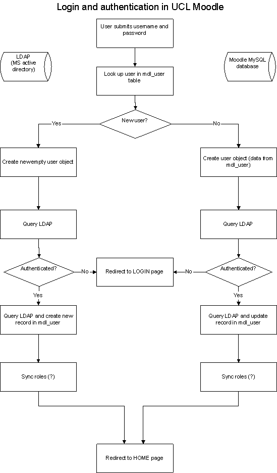

# TO UPDATE? - Moodle - mapping login

# Tracking the Moodle login process and why it might be slow.

Work in progress - this document contains a quick overview of the login process, then a list of all the SQL queries, looks at filesizes and suggests some next steps.

This has been deduced from a combination of stepping through with the debugger, printing SQL debug to screen and logging the SQL queries within MySQL. Also it borrows heavily from: <http://docs.moodle.org/en/Development:Authentication_plugins>.

## Overview of login process

The following process takes place when you login to Moodle at UCL.

After entering your name and password into the LOGIN form and submitting it, the handler code in /login/index.php does the following:

-   First it gets a list of enabled authentication plugins. *In our case the main one of interest is ldap.*
-   It checks the username is valid in terms of allowed characters.
-   It calls authenticate\_user\_login() in lib/moodlelib.php which returns a user object (success) or false if none of the plugins authenticated successfully. *See below for detail on this function.*
-   After authentication - or all the plugins have been tried - the user is then redirected to a new page. This is either the login page (if there was a problem) or somewhere appropriate for a correct log in.

**authenticate\_user\_login()**

This gets a list of authenticated plugins (again).

This then looks up the supplied username in mdl\_user. It checks to see if the user is allowed to log in and which authentication plugin to use.

A user object is then created:

-   an empty one for a new user
-   populated with information from mdl\_user for an existing user.

It calls the user\_login() function for ldap. This returns true or false. (If false - it will try any other authentication plugins that are enabled).

If authenticated successfully and an existing user, it calls update\_user\_record() to get the latest information from ldap and amend the Moodle user record. For a new user it will create the Moodle user record (using some info from ldap).

It calls the plugin's sync\_roles() function? Not sure what this is for yet.

It then returns a user object or false if it failed.

## Flow chart

 

*(Actually new users are redirected to their profile page).*

## Database queries

The SQL queries used are listed below in the order they occur. I've also attempted to flag up what is happening - eg: the point at which ldap is accessed using hints in italics.

*NB: The SQL shown further below is from a successful login which then redirects to the home page. Also some of the queries seem to be run several times from different functions.*

SELECT \* FROM mdl\_config
SELECT \* FROM mdl\_course WHERE category = '0' LIMIT 1
SELECT \* FROM mdl\_context WHERE contextlevel = '10' LIMIT 1
SELECT \* FROM mdl\_user WHERE username = 'guest' AND mnethostid = '1' LIMIT 1
SELECT name,value FROM mdl\_config\_plugins WHERE plugin = 'auth/manual'
SELECT name,value FROM mdl\_config\_plugins WHERE plugin = 'auth/ldap'
SELECT \* FROM mdl\_user WHERE username = 'ccaapcb' AND deleted &lt;&gt; '1' AND mnethostid = 1 LIMIT 100
SELECT \* FROM mdl\_course\_display WHERE userid = '66038'
SELECT \* FROM mdl\_user\_preferences WHERE userid = '66038'
SELECT \* FROM mdl\_user\_lastaccess WHERE userid = '66038'
SELECT g.id, g.courseid FROM mdl\_groups g, mdl\_groups\_members gm WHERE gm.groupid=g.id AND gm.userid=66038
SELECT \* FROM mdl\_user\_info\_field
SELECT name,value FROM mdl\_config\_plugins WHERE plugin = 'auth/ldap'

*user\_login()*
*ldap\_connect*
*ldap\_find\_userdn*

SELECT name,value FROM mdl\_config\_plugins WHERE plugin = 'auth/ldap'
UPDATE mdl\_user SET password = 'not cached' WHERE id = '66038'
SELECT name,value FROM mdl\_config\_plugins WHERE plugin = 'auth/ldap'
SELECT username, auth FROM mdl\_user WHERE username = 'ccaapcb' LIMIT 100
SELECT name,value FROM mdl\_config\_plugins WHERE plugin = 'auth/ldap'

*get\_userinfo()*
*ldap\_connect*
*ldap\_find\_userdn*
*ldap\_get\_entries*

- *Moodle user table is updated from info from ldap*

UPDATE mdl\_user SET email = 'p.roberts@ucl.ac.uk' WHERE username = 'ccaapcb'
UPDATE mdl\_user SET idnumber = 'pcboa26' WHERE username = 'ccaapcb'
UPDATE mdl\_user SET department = 'IS Academic & Applications Sup' WHERE username = 'ccaapcb'

SELECT \* FROM mdl\_user WHERE username = 'ccaapcb' AND deleted &lt;&gt; '1' AND mnethostid = 1 LIMIT 100
SELECT \* FROM mdl\_course\_display WHERE userid = '66038'
SELECT \* FROM mdl\_user\_preferences WHERE userid = '66038'
SELECT \* FROM mdl\_user\_lastaccess WHERE userid = '66038'
SELECT g.id, g.courseid FROM mdl\_groups g, mdl\_groups\_members gm WHERE gm.groupid=g.id AND gm.userid=66038
SELECT \* FROM mdl\_user\_info\_field
SELECT name,value FROM mdl\_config\_plugins WHERE plugin = 'auth/manual'
SELECT name,value FROM mdl\_config\_plugins WHERE plugin = 'auth/ldap'
INSERT INTO mdl\_log (time, userid, course, ip, module, cmid, action, url, info) VALUES ('1241517012', '66038', '1', '127.0.0.1', 'user', '0', 'login', 'view.php?id=0&course=1', '66038')

SELECT \* FROM mdl\_user\_preferences WHERE userid = '66038'
SHOW COLUMNS FROM \`mdl\_user\`
UPDATE mdl\_user SET lastaccess = '1241517012',lastlogin = '1241516917',currentlogin = '1241517012' WHERE id = 66038

*At this point the login cookie is set - $USER-&gt;username*

SELECT ctx.path, ra.roleid, rc.capability, rc.permission FROM mdl\_role\_assignments ra
JOIN mdl\_context ctx
ON ra.contextid=ctx.id
LEFT OUTER JOIN mdl\_role\_capabilities rc
ON (rc.roleid=ra.roleid AND rc.contextid=ra.contextid)
WHERE ra.userid = 66038 AND ctx.contextlevel &lt;= 50
ORDER BY ctx.depth, ctx.path, ra.roleid

SELECT ctx.path, rc.roleid, rc.capability, rc.permission
FROM mdl\_role\_capabilities rc
JOIN mdl\_context ctx
ON rc.contextid=ctx.id
WHERE (roleid=26 AND contextid IN (1,5)) OR (roleid=5 AND contextid IN (1,5))
ORDER BY ctx.depth ASC, ctx.path DESC, rc.roleid ASC

SELECT sctx.path, ra.roleid,
ctx.path AS parentpath,
rco.capability, rco.permission
FROM mdl\_role\_assignments ra
JOIN mdl\_context ctx
ON ra.contextid=ctx.id
JOIN mdl\_context sctx
ON (sctx.path LIKE CONCAT(ctx.path,'/%') )
JOIN mdl\_role\_capabilities rco
ON (rco.roleid=ra.roleid AND rco.contextid=sctx.id)
WHERE ra.userid = 66038
AND sctx.contextlevel &lt;= 50
ORDER BY sctx.depth, sctx.path, ra.roleid

SELECT ctx.path,
rc.capability, rc.permission
FROM mdl\_context ctx
JOIN mdl\_role\_capabilities rc
ON rc.contextid=ctx.id
WHERE rc.roleid = 28
AND ctx.contextlevel &lt;= 50
ORDER BY ctx.depth, ctx.path

SELECT \* FROM mdl\_context WHERE contextlevel = '50' AND instanceid = '1' LIMIT 100
SELECT name,value FROM mdl\_config\_plugins WHERE plugin = 'auth/ldap'
SELECT id, name FROM mdl\_capabilities
SELECT name,value FROM mdl\_config\_plugins WHERE plugin = 'auth/ldap'

*(~ 35 database queries so far)*

*---- at this point redirects to the desired start page (usually the home page)*

*---- the following is therefore typical of any visit to the home page by an authenticated user*
SELECT \* FROM mdl\_config
SELECT \* FROM mdl\_course WHERE category = '0' LIMIT 1
SELECT \* FROM mdl\_context WHERE contextlevel = '10' LIMIT 1
UPDATE mdl\_user

SET lastip = '127.0.0.1', lastaccess = 1241518975 WHERE id = 66038

SELECT id, name FROM mdl\_capabilities
SELECT name,value FROM mdl\_cache\_flags WHERE flagtype='accesslib/dirtycontexts' AND expiry &gt;= 1241518975 AND timemodified &gt; 1241518973
SELECT \* FROM mdl\_modules WHERE name = 'assignment' LIMIT 100
SELECT \* FROM mdl\_modules WHERE name = 'book' LIMIT 100
SELECT \* FROM mdl\_modules WHERE name = 'certificate' LIMIT 100
SELECT \* FROM mdl\_modules WHERE name = 'chat' LIMIT 100
SELECT \* FROM mdl\_modules WHERE name = 'choice' LIMIT 100
SELECT \* FROM mdl\_modules WHERE name = 'data' LIMIT 100
SELECT \* FROM mdl\_modules WHERE name = 'forum' LIMIT 100
SELECT \* FROM mdl\_modules WHERE name = 'glossary' LIMIT 100
SELECT \* FROM mdl\_modules WHERE name = 'hotpot' LIMIT 100
SELECT \* FROM mdl\_modules WHERE name = 'ilpconcern' LIMIT 100
SELECT \* FROM mdl\_modules WHERE name = 'ilptarget' LIMIT 100
SELECT \* FROM mdl\_modules WHERE name = 'journal' LIMIT 100
SELECT \* FROM mdl\_modules WHERE name = 'label' LIMIT 100
SELECT \* FROM mdl\_modules WHERE name = 'lams' LIMIT 100
SELECT \* FROM mdl\_modules WHERE name = 'lesson' LIMIT 100
SELECT \* FROM mdl\_modules WHERE name = 'questionnaire' LIMIT 100
SELECT \* FROM mdl\_modules WHERE name = 'quiz' LIMIT 100
SELECT \* FROM mdl\_modules WHERE name = 'resource' LIMIT 100
SELECT \* FROM mdl\_modules WHERE name = 'scheduler' LIMIT 100
SELECT \* FROM mdl\_modules WHERE name = 'scorm' LIMIT 100
SELECT \* FROM mdl\_modules WHERE name = 'survey' LIMIT 100
SELECT \* FROM mdl\_modules WHERE name = 'wiki' LIMIT 100
SELECT \* FROM mdl\_modules WHERE name = 'workshop' LIMIT 100

INSERT INTO mdl\_log (time, userid, course, ip, module, cmid, action, url, info)
VALUES ('1241518975', '66038', '1', '127.0.0.1', 'course', '0', 'view', 'view.php?id=1', '1')

SELECT \* FROM mdl\_block\_instance WHERE pageid = '1' AND pagetype = 'course-view' ORDER BY position, weight
SELECT \* FROM mdl\_block
SELECT \* FROM mdl\_context WHERE contextlevel = '50' AND instanceid = '1' LIMIT 100
SELECT COUNT FROM mdl\_log WHERE module='login' AND action='error' AND time &gt; 1241518797
SELECT COUNT FROM mdl\_message WHERE useridto = '66038' AND timecreated &gt; '0'

- *writes out the HTML head section at this point*

SELECT \* FROM mdl\_context WHERE contextlevel = '80' AND instanceid = '48255' LIMIT 100
SELECT ctx.path, ra.roleid
FROM mdl\_role\_assignments ra
JOIN mdl\_context ctx
ON ra.contextid=ctx.id
WHERE ra.userid = 66038
AND (ctx.path = '/1/84168' OR ctx.path LIKE '/1/84168/%')
ORDER BY ctx.depth, ctx.path, ra.roleid
 

SELECT ctx.path, rc.roleid, rc.capability, rc.permission
FROM mdl\_role\_capabilities rc
JOIN mdl\_context ctx
ON rc.contextid=ctx.id
WHERE (rc.roleid IN (1,28) AND
(ctx.id=84168 OR ctx.path LIKE '/1/84168/%'))
ORDER BY ctx.depth ASC, ctx.path DESC, rc.roleid ASC

SELECT \* FROM mdl\_context WHERE contextlevel = '80' AND instanceid = '48263' LIMIT 100
SELECT \* FROM mdl\_cache\_text WHERE md5key = 'fe39733dd94b464c7c3b7e1c991a34ca' LIMIT 1
SELECT \* FROM mdl\_context WHERE contextlevel = '80' AND instanceid = '2717' LIMIT 100
SELECT \* FROM mdl\_role ORDER BY sortorder ASC
SELECT MAX(id), name FROM mdl\_timezone GROUP BY name
SELECT \* FROM mdl\_modules
SELECT \* FROM mdl\_modules
SELECT \* FROM mdl\_block
SELECT \* FROM mdl\_context WHERE contextlevel = '80' AND instanceid = '8754' LIMIT 100

SELECT m.useridfrom as id, COUNT(m.useridfrom) as count,
u.firstname, u.lastname, u.picture, u.imagealt, u.lastaccess
FROM mdl\_user u,
mdl\_message m
WHERE m.useridto = '66038'
AND u.id = m.useridfrom
GROUP BY m.useridfrom, u.firstname,u.lastname,u.picture,u.lastaccess,u.imagealt

SELECT \* FROM mdl\_context WHERE contextlevel = '80' AND instanceid = '6304' LIMIT 100
SELECT \* FROM mdl\_course\_sections WHERE course = '1' AND section = '1' LIMIT 100
SELECT \* FROM mdl\_cache\_text WHERE md5key = 'cc47ca1981bbe09ca4c9c1113b6b7f37' LIMIT 1
SELECT \* FROM mdl\_modules
SELECT cm.\*, m.name as modname
FROM mdl\_modules m,
mdl\_course\_modules cm
WHERE cm.course = 1
AND cm.module = m.id AND m.visible = 1

SELECT COUNT FROM mdl\_course
SELECT \* FROM mdl\_forum WHERE course = '1' AND type = 'news' ORDER BY id ASC
SELECT \* FROM mdl\_forum\_subscriptions WHERE userid = '66038' AND forum = '1' LIMIT 1
SELECT cm.\*, m.name, md.name as modname

FROM mdl\_course\_modules cm,
mdl\_modules md,
mdl\_forum m
WHERE cm.course = 1 AND
cm.instance = m.id AND
md.name = 'forum' AND
md.id = cm.module AND
m.id = 1 LIMIT 100

SELECT \* FROM mdl\_context WHERE contextlevel = '70' AND instanceid = '1' LIMIT 100
SELECT p.\*, d.name, d.timemodified, d.usermodified, d.groupid, d.timestart, d.timeend,
u.firstname, u.lastname, u.email, u.picture, u.imagealt
FROM mdl\_forum\_discussions d
JOIN mdl\_forum\_posts p ON p.discussion = d.id
JOIN mdl\_user u ON p.userid = u.id
WHERE d.forum = 1 AND p.parent = 0
ORDER BY p.modified DESC LIMIT 2

SELECT p.discussion, COUNT(p.id) AS replies, MAX(p.id) AS lastpostid
FROM mdl\_forum\_posts p
JOIN mdl\_forum\_discussions d ON p.discussion = d.id
WHERE p.parent &gt; 0 AND d.forum = 1
GROUP BY p.discussion

SELECT g.\*
FROM mdl\_groups g , mdl\_groups\_members gm
WHERE g.courseid = 1 AND g.id = gm.groupid AND gm.userid = '58813'
ORDER BY name ASC

SELECT \* FROM mdl\_cache\_text WHERE md5key = '034db606915f8a06f45943a49fc8e38d' LIMIT 1
SELECT g.\*
FROM mdl\_groups g , mdl\_groups\_members gm
WHERE g.courseid = 1 AND g.id = gm.groupid AND gm.userid = '64297'
ORDER BY name ASC

SELECT \* FROM mdl\_cache\_text WHERE md5key = '460bec61d06e69e9bc6fb66122b0bc01' LIMIT 1
SELECT \* FROM mdl\_context WHERE contextlevel = '80' AND instanceid = '36713' LIMIT 100
SELECT \* FROM mdl\_cache\_text WHERE md5key = 'a084ae8b8ac4024d9c403b5a617b2e46' LIMIT 1
SELECT ctx.\*
FROM mdl\_context ctx
WHERE ctx.path LIKE '/1/84168/%'
AND ctx.contextlevel IN (70,80)
UNION
SELECT ctx.\*
FROM mdl\_context ctx
JOIN mdl\_groups g
ON (ctx.instanceid=g.id AND ctx.contextlevel=60)
WHERE g.courseid=1
UNION
SELECT ctx.\*
FROM mdl\_context ctx
JOIN mdl\_block\_pinned b
ON (ctx.instanceid=b.blockid AND ctx.contextlevel=80)
WHERE b.pagetype='course-view'
 

SELECT cc.\*,
ctx.id AS ctxid, ctx.path AS ctxpath,
ctx.depth AS ctxdepth, ctx.contextlevel AS ctxlevel
FROM mdl\_course\_categories cc
JOIN mdl\_context ctx
ON cc.id=ctx.instanceid AND ctx.contextlevel=40
WHERE cc.parent=0
ORDER BY cc.sortorder ASC

SELECT \* FROM mdl\_course WHERE id = '1' LIMIT 100
SELECT \* FROM mdl\_block\_library\_search
SELECT \* FROM mdl\_block\_rss\_client WHERE id = '109' LIMIT 100
SELECT \* FROM mdl\_block\_rss\_client WHERE id = '21' LIMIT 100
SELECT \* FROM mdl\_block\_rss\_client WHERE id = '28' LIMIT 100
SELECT \* FROM mdl\_block\_rss\_client WHERE id = '30' LIMIT 100

SELECT \* FROM mdl\_config
SELECT \* FROM mdl\_course WHERE category = '0' LIMIT 1
SELECT \* FROM mdl\_context WHERE contextlevel = '10' LIMIT 1
SELECT \* FROM mdl\_block\_rss\_client WHERE id = '158' LIMIT 100
SELECT \* FROM mdl\_user WHERE id = '64297' AND deleted = '0' AND picture = '1' LIMIT 1

*~77 database queries ( plus previous 35)*

*---page load complete.*

## Conclusions?

When logging in the user is basically experiencing "two pages" worth of quite intense processing as well as querying an external ldap server twice, this might explain why it's a little slow sometimes.

***Other performance issues***

<table>
<colgroup>
<col width="50%" />
<col width="50%" />
</colgroup>
<thead>
<tr class="header">
<th>
issue
</th>
<th>
action / suggestion
</th>
</tr>
</thead>
<tbody>
<tr class="odd">
<td>
<strong>Caching and file sizes.</strong> 
Moodle is not optimised for speed - mainly because it has to deliver personalised content. The UCL Moodle home page requires 20 HTTP requests and has a total weight of 394.4K. Some of this is cacheable and might make a small improvement. Some of the files are huge - 400Mb - these will have an impact on performance if a class accesses them all at once.
</td>
<td>
Moodle.org recommend having mod_expires enabled under apache.This has been requested on wasdev-a for testing. 
We should also reduce size of favicon.ico (currently 11k) - every little helps. 
Look at reducing some of the very large files (in hand with LTSS). 
Rearrange the servers to move Moodle data folder to a separate machine. Free up A and B to be web application servers. 
</td>
</tr>
<tr class="even">
<td>
<strong>Server traffic.</strong> 
It is possible that the site is being periodically spidered or scraped - or something more sinister - which could potentially impact the performance from time to time - and make Moodle's database log files huge.
</td>
<td>
Analyse the apache access and error logs. Get figures for bandwidth and identify suspicious activity. At present the logs are several gigabytes. These ideally should be created daily. We can then copy them over easily and analyse them with a low cost package - <a href="http://moodle-dev.ucl.ac.uk/ucl_tools/moodle-a/">example here</a>. We have put in a request for server log rotation.
</td>
</tr>
<tr class="odd">
<td>
<strong>Other Moodle issues - the database</strong> 
There are a LOT of database lookups - database server performance and connectivity would have an impact. 
The Moodle database is 3Gb. 1.8Gb of this are the mdl_log and mdl_backup_log tables. The size of the log table is a known issue - every login and page access adds to this table. We can look at pruning it (deleting course 1 entries) or converting it to innodb - which means it wouldn't be locked while being written to. And replace the automated backups.
</td>
<td>
Look at Moodle's database caching (set to 1 record at present - as opposed to 50) 
Remove course 1 entries from mdl_log (SCP 3917) 
Try converting log table to innodb on wasdev. 

</td>
</tr>
<tr class="even">
<td>
<strong>External factors</strong> 
Anti-virus software either scanning, updating or similar? Browser issues (IE can be slow). LDAP? SLB?
</td>
<td>
 

</td>
</tr>
</tbody>
</table>

# Nagios

Nagios is currently set up to monitor the following:

-   Moodle A/B/C
-   Moodle-db-a / Moodle-db-b
-   ldap-auth.ucl.ac.uk can be seen under the 'web infrastructure machine' (a load-balanced address that points to the three Windows 2000 domain controllers) - not sure if Nagios is somehow testing the ldap service itself or just pinging the server

# Recent incidents

-   11 May 09 - around 08.45 Moodle took around a minute to login. No problems according to Nagios. Must be external factor? ldap-auth.ucl.ac.uk maybe?
-   12 May 09 - around 8.50 - again took 45 seconds at least

## Attachments:

 [Moodle-login-process.png](attachments/9798423/9895973.png) (image/png)

