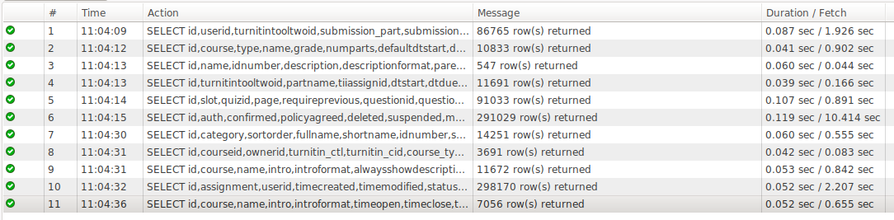

# Tableau / ETL Access

Has access to read-only endpoint

User accounts:

Database access required:

SELECT on:

mdl\_assign
mdl\_assign\_submission
mdl\_course
mdl\_course\_categories
mdl\_quiz
mdl\_quiz\_slots
mdl\_turnitintooltwo
mdl\_turnitintooltwo\_courses
mdl\_turnitintooltwo\_submissions
mdl\_turnitintooltwo\_parts
mdl\_user

Performance test of the queries:

Moodle\_ETL\_queries.sql

## Attachments:

 [Screenshot from 2020-06-17 11-05-00.png](attachments/146080055/146080054.png) (image/png)
 [Moodle\_ETL\_queries.sql](attachments/146080055/146080927.sql) (application/octet-stream)

