# Test plan for php5.6 upgrade

### Current Issues

On <https://moodle-pp.ucl.ac.uk> keeps logging user out after every few clicks

 

To test that the upgrade to php5.6 has not affected the functionality of Moodle.  Behat is being used to test the main functionality of Moodle and below is a list of manuals test for our UCL hacks.   

### Test Plan

<table>
<colgroup>
<col width="20%" />
<col width="20%" />
<col width="20%" />
<col width="20%" />
<col width="20%" />
</colgroup>
<tbody>
<tr class="odd">
<td> </td>
<td><h3 id="Testplanforphp5.6upgrade-Whattotest">What to test</h3></td>
<td><h3 id="Testplanforphp5.6upgrade-Howtotest">How to test</h3></td>
<td><h3 id="Testplanforphp5.6upgrade-Passed/Failed">Passed/Failed</h3></td>
<td><h3 id="Testplanforphp5.6upgrade-Screenshot">Screenshot</h3></td>
</tr>
<tr class="even">
<td><h3 id="Testplanforphp5.6upgrade-EnvironmentCheck">Environment Check</h3></td>
<td> </td>
<td> </td>
<td> </td>
<td> </td>
</tr>
<tr class="odd">
<td> </td>
<td>Environment is showing OK status for php</td>
<td>
go to site administration &gt; server &gt; environment &gt; status shows OK with php version

 
</td>
<td>Passed</td>
<td>
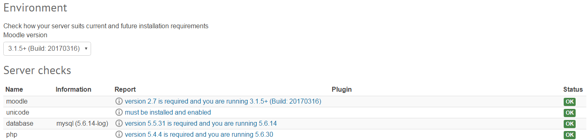
</td>
</tr>
<tr class="even">
<td><h3 id="Testplanforphp5.6upgrade-UCLfixesandhacks" class="with-breadcrumbs">UCL fixes and hacks</h3></td>
<td> </td>
<td> </td>
<td> </td>
<td> </td>
</tr>
<tr class="odd">
<td> </td>
<td>Add the 'all course link to the bottom of the Course overview</td>
<td>
Go to my Home, look at bottom of your course list.

Look for &quot;<a href="https://moodle.ucl.ac.uk/course/index.php">Browse all courses on UCL Moodle</a> ...&quot; at the bottom of the course list

 
</td>
<td>Passed</td>
<td>
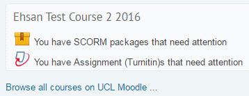
</td>
</tr>
<tr class="even">
<td>2.</td>
<td>Add the extra setting to the block</td>
<td>
Go to /admin/settings.php?section=blocksettingcourse_overview

look for the last setting &quot;Hide 'Browse all courses on UCL Moodle' link&quot;
</td>
<td> </td>
<td> </td>
</tr>
<tr class="odd">
<td>3.</td>
<td>
calendar export settings - change from 60 to 90 days
</td>
<td><ul>
<li> Go to calendar, click on Month Year above calendar&gt; Export Calendar</li>
<li>Select <strong>Export</strong> events and check <strong>Recent and next 90 days</strong></li>
<li>Click <strong>Export</strong> 
This should generate a URL for calendar- check this works 
<strong> 
</strong></li>
</ul>

Go to /calendar/export.php. Check Lang is ok on 90 day option. Check events up to 90 days are exported.
</td>
<td>Passed</td>
<td>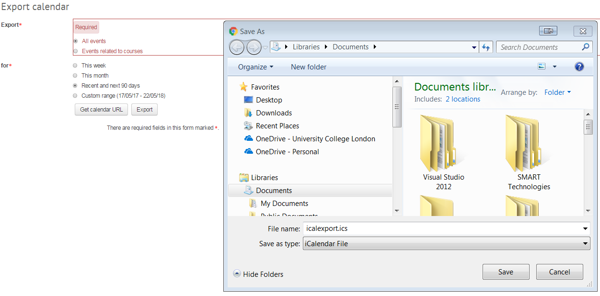</td>
</tr>
<tr class="even">
<td>4.</td>
<td>Stop people being able to select hourly and daily calendar subscription update frequencies</td>
<td>
Go to <a href="https://moodle.ucl.ac.uk/calendar/managesubscriptions.php" class="uri">https://moodle.ucl.ac.uk/calendar/managesubscriptions.php</a>

and make sure you can't see hourly and daily from the &quot;update interval&quot; dropdown

 
</td>
<td>Passed</td>
<td>
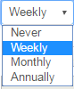
</td>
</tr>
<tr class="odd">
<td>5.</td>
<td>
added size, added unenrol_users
</td>
<td>
Go to Course <strong>Reset</strong> page, at bottom click Select default and see that Student is highlighted in roles to remove

 
</td>
<td>Passed</td>
<td>
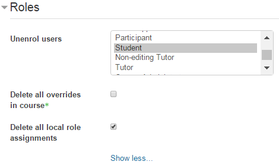
</td>
</tr>
<tr class="even">
<td>6.</td>
<td>Allow manager and tutor roles to unenrol during course resets?</td>
<td>Login as manager/tutor &gt; go to course &gt; reset &gt; option available to unenrol users</td>
<td>Passed</td>
<td>
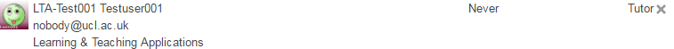

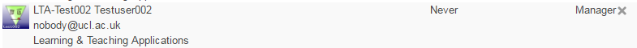

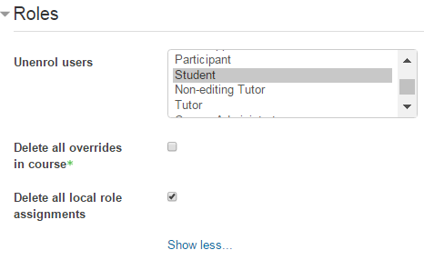
</td>
</tr>
<tr class="odd">
<td>7.</td>
<td>
Allow manual unenrol for students
</td>
<td>Login as a course admin. Reset a course with portico enrolments. Check that all students get unenrolled.</td>
<td> </td>
<td>
 

 

 
</td>
</tr>
<tr class="even">
<td>8.</td>
<td>Middle name fuzzy search</td>
<td><ul>
<li>Go to <strong>Site Admin &gt; Users &gt; Accounts &gt; Browse list of all users</strong></li>
<li>Search Matthew Smith<strong> 
</strong></li>
<li>Check all M Smiths with middle initials are returned in search</li>
<li>**Currently a bug that LTA is aware of**</li>
</ul>

 
</td>
<td>Failed</td>
<td>
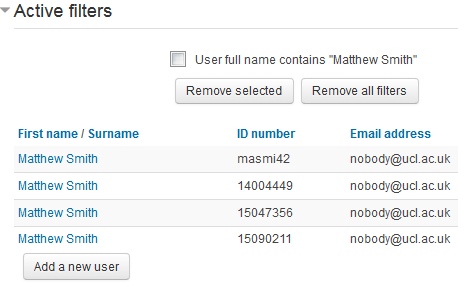
</td>
</tr>
<tr class="odd">
<td>9.</td>
<td>added string for kosovo</td>
<td>
Edit your profile and look for Kosovo in list of countries

 

 
</td>
<td>Passed</td>
<td>
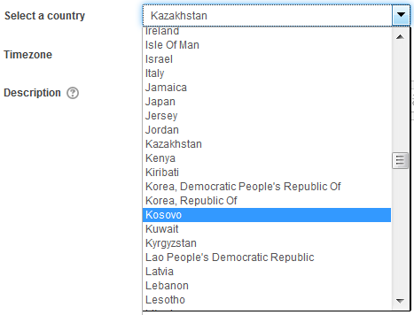
</td>
</tr>
<tr class="even">
<td>10.</td>
<td>Grade Essays option in Lesson- students not listed alphabetically</td>
<td><ul>
<li>Find lesson activity (<a href="https://moodle-pp.ucl.ac.uk/mod/lesson/essay.php?id=2207857" class="uri">https://moodle-pp.ucl.ac.uk/mod/lesson/essay.php?id=2207857</a>)</li>
<li>Are the students' names listed alphabetically by surname?</li>
</ul>

 
</td>
<td>Passed</td>
<td>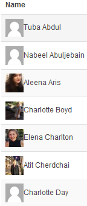</td>
</tr>
<tr class="odd">
<td>11.</td>
<td>remove auto-population of author field</td>
<td>Upload a file. See if your name appears in the 'Author' field</td>
<td>
Failed when &quot;dragging and dropping&quot;

Passed when &quot;choosing and uploading a file&quot;
</td>
<td>
**Drag and drop into upload box **

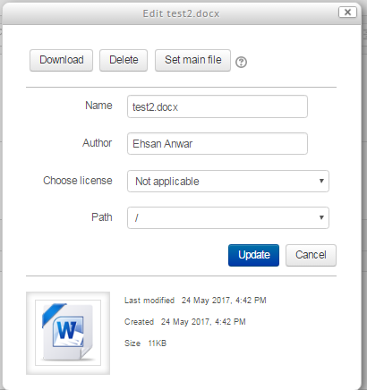

** choosing and uploading a file **

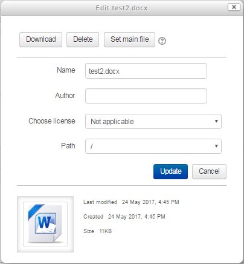
</td>
</tr>
<tr class="even">
<td>12.</td>
<td>Turnitin course reset.</td>
<td>Reset a course with a TII assignment. Check the reset doesnt hang, and that any submissions in the TII inbox are removed.</td>
<td>Passed</td>
<td>
** Before Reset **

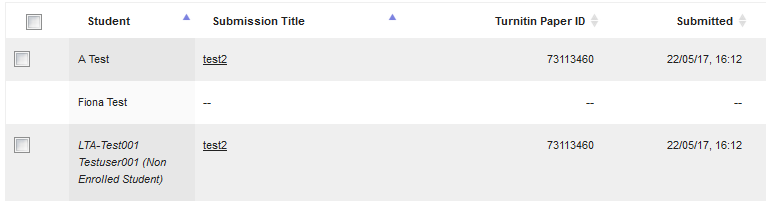

 

**After Reset**

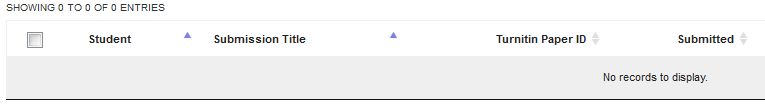
</td>
</tr>
<tr class="odd">
<td><h3 id="Testplanforphp5.6upgrade-BehattestingofMoodlecorefunctionality">Behat testing of Moodle core functionality</h3></td>
<td> </td>
<td> </td>
<td> </td>
<td> </td>
</tr>
<tr class="even">
<td> </td>
<td>Create file assignment</td>
<td><ul>
<li>Logging in as Tutor</li>
<li>Turning Editing ON</li>
<li>Clicking on Add Activity</li>
<li>Selecting Assignment</li>
<li>Add Activity Window</li>
<li>Adding Activity</li>
<li>Entered New File Assignment title</li>
<li>Entered New Title</li>
<li>Selecting anonymous marking No</li>
<li>Selecting anonymous marking No</li>
<li>Saving and Returning</li>
<li>Expected title:File Assignment 001 and Current</li>
</ul></td>
<td>Passed</td>
<td>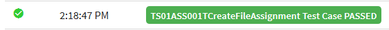</td>
</tr>
<tr class="odd">
<td>2.</td>
<td>Student submit file assignment</td>
<td><ul>
<li>Logging in as student</li>
<li>Clicking Assignment button</li>
<li>Clicking Add/Edit submissions</li>
<li>Clicking submission statement</li>
<li>Clicking add file</li>
<li>Browsing file</li>
<li>Uploading file</li>
<li>Click on Save changes</li>
<li>Saved changes succesfully</li>
<li>Saved Changes Succesfully</li>
</ul></td>
<td>Passed</td>
<td></td>
</tr>
<tr class="even">
<td>3.</td>
<td>Student delete update file assignment</td>
<td><ul>
<li>Logging in as Student</li>
<li>Clicking Assignment button</li>
<li>Clicking Edit submissions</li>
<li>Clicking submission statement</li>
<li>Clicking on File Attachment</li>
<li>Deleting Attachment</li>
<li>Nothing was submitted</li>
<li>Alert Text found: Nothing was submitted</li>
<li>Clicking add file</li>
<li>Browsing file</li>
<li>Uploading file</li>
<li>Student Delete Update File Assignment Completed</li>
</ul></td>
<td>Passed</td>
<td>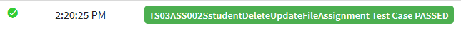</td>
</tr>
<tr class="odd">
<td>4.</td>
<td>Tutor create text assignment</td>
<td><ul>
<li>Logging in as Tutor</li>
<li>Clicking Editing On</li>
<li>Clicking on add activity</li>
<li>Selecting Assignment</li>
<li>Submitting activity</li>
<li>Inputting new Assignment Title: Text Assignment 001</li>
<li>Check only Online text submission is permitted</li>
<li>Check only Online text submission is permitted</li>
<li>Students submit in groups - set to Yes</li>
<li>Require group to make submission - set to Yes</li>
<li>Require all group members submit - set to No</li>
<li>Set to use CW Submission grouping</li>
<li>Clicking on Grade to set anonymous marking No</li>
<li>Under Grade - Anonymous marking set to No</li>
<li>Saving and Returning</li>
</ul></td>
<td>Passed</td>
<td></td>
</tr>
<tr class="even">
<td>5.</td>
<td>Student submit text assignment</td>
<td><ul>
<li>Logging in as student</li>
<li>Clicking Assignment button</li>
<li>Clicking Add submissions</li>
<li>Clicking submission statement</li>
<li>typed online text assignment submission text</li>
<li>Sending online text assigenment text</li>
<li>Click on Save changes</li>
</ul></td>
<td>Passed</td>
<td></td>
</tr>
<tr class="odd">
<td>6.</td>
<td>Student delete text assignment</td>
<td><ul>
<li>Logging in as student</li>
<li>Clicking Assignment button</li>
<li>Clicking Edit submissions</li>
<li>Clicking submission statement</li>
<li>Clearing text</li>
<li>Clicking on Save changes</li>
<li>Clicking in Edit Submissions</li>
<li>Clicking submission statement again</li>
<li>Sending online text assigenment text again</li>
<li>Click on Save changes again</li>
</ul></td>
<td>Passed</td>
<td>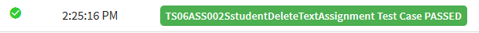</td>
</tr>
<tr class="even">
<td>7.</td>
<td>View and grade text assignment</td>
<td><ul>
<li>Logging in as tutor</li>
<li>Click on File Assignment</li>
<li>Click on View All Submissions</li>
<li>Click on First two Grade button</li>
<li>Entering Grade points</li>
<li>Entering grade feedback</li>
<li>Adding grade feedback file</li>
<li>Browsing file feedback</li>
<li>Click on upload this file button</li>
<li>Saving changes</li>
<li>Clicking OK button</li>
<li>Clicking browser back button</li>
<li>Clicking browser refresh button</li>
<li>Expected title:90.00 / 100.00 and Current title:90.00 / 100.00</li>
<li>Text Assignment Graded</li>
<li>Grade status is graded</li>
<li>Verifying grade Status</li>
<li>Expected title:Well done and Current title:Well done</li>
</ul></td>
<td>Passed</td>
<td>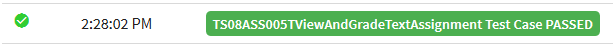</td>
</tr>
<tr class="odd">
<td>8.</td>
<td>Marking work flow in marking</td>
<td><ul>
<li>Logging in as tutor</li>
<li>Click on File Assignment</li>
<li>Clickin on Edit Settings</li>
<li>Changing marking work flow YES</li>
<li>Saving and Returning</li>
<li>Clicking on File Assignment again</li>
<li>Clicking on View all Submissions</li>
<li>Clicking on First Row Grade Button</li>
<li>Entering Grade Points</li>
<li>Changing Marking workflow state to 'In marking'</li>
<li>Changing Marking workflow state to 'In marking'</li>
<li>Saving Changes:</li>
<li>Message displayed The changes to the grade and feedback were saved</li>
<li>Clicking OK button</li>
</ul></td>
<td>Passed</td>
<td>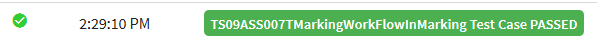</td>
</tr>
<tr class="even">
<td>9.</td>
<td>Marking work flow view grade as student</td>
<td><ul>
<li>Logging in as Student to view grade</li>
<li>Clicking on Grade</li>
<li>Grade not available</li>
</ul></td>
<td>Passed</td>
<td>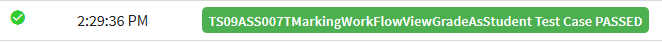</td>
</tr>
<tr class="odd">
<td>10.</td>
<td>Marking work flow released</td>
<td><ul>
<li>Login As Tutor to change Workflow to 'Released'</li>
<li>Click on File Assignment</li>
<li>Click on View All Submissions</li>
<li>Click on First rwo Grade button</li>
<li>Changing Marking workflow state to 'Released'</li>
<li>Saving changes</li>
<li>Clicking Browser Back Button</li>
</ul></td>
<td>Passed</td>
<td>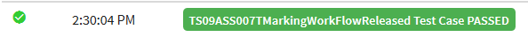</td>
</tr>
<tr class="even">
<td>11.</td>
<td>Marking work flow released view grade as student</td>
<td><ul>
<li>Login As Student to view grades</li>
<li>Clicking on grades</li>
<li>Expected title:67.00 and Current title:67.00</li>
</ul></td>
<td>Passed</td>
<td>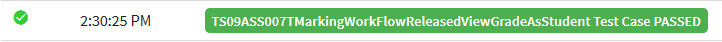</td>
</tr>
<tr class="odd">
<td>12.</td>
<td>Check group submission</td>
<td><ul>
<li>Logging in as student</li>
<li>Clicking Assignment button</li>
<li>Expected title:90.00 / 100.00 and Current title:90.00 / 100.00</li>
</ul></td>
<td>Passed</td>
<td>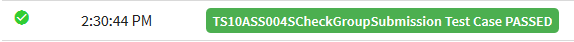</td>
</tr>
<tr class="even">
<td>13.</td>
<td>Check group grade feedback</td>
<td><ul>
<li>Submit Text Assignment</li>
<li>Click on Text Assignment</li>
<li>Viewing grade</li>
<li>Expected text:90.00 / 100.00 and Current text:90.00 / 100.00</li>
</ul></td>
<td> </td>
<td>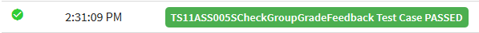</td>
</tr>
</tbody>
</table>

## Attachments:

 [image2017-5-19 13:29:30.png](attachments/67535435/67535438.png) (image/png)
 [image2017-5-19 13:31:38.png](attachments/67535435/67535441.png) (image/png)
 [image2017-5-19 13:33:6.png](attachments/67535435/67535442.png) (image/png)
 [image2017-5-19 15:10:55.png](attachments/67535435/67535478.png) (image/png)
 [image2017-5-22 14:34:29.png](attachments/67535435/67535884.png) (image/png)
 [image2017-5-22 14:48:43.png](attachments/67535435/67535898.png) (image/png)
 [image2017-5-22 14:51:18.png](attachments/67535435/67535899.png) (image/png)
 [image2017-5-22 14:51:54.png](attachments/67535435/67535900.png) (image/png)
 [image2017-5-22 15:49:37.png](attachments/67535435/67535964.png) (image/png)
 [image2017-5-22 15:50:26.png](attachments/67535435/67535967.png) (image/png)
 [image2017-5-22 16:14:4.png](attachments/67535435/67535977.png) (image/png)
 [image2017-5-22 16:15:28.png](attachments/67535435/67535978.png) (image/png)
 [image2017-5-22 16:33:21.png](attachments/67535435/67535989.png) (image/png)
 [image2017-5-22 16:33:41.png](attachments/67535435/67535990.png) (image/png)
 [image2017-5-22 16:36:40.png](attachments/67535435/67535994.png) (image/png)
 [image2017-5-22 16:49:8.png](attachments/67535435/67535997.png) (image/png)
 [image2017-5-24 14:30:20.png](attachments/67535435/67961416.png) (image/png)
 [image2017-5-24 14:36:6.png](attachments/67535435/67961421.png) (image/png)
 [image2017-5-24 14:38:21.png](attachments/67535435/67961425.png) (image/png)
 [image2017-5-24 14:47:27.png](attachments/67535435/67961432.png) (image/png)
 [image2017-5-24 14:52:0.png](attachments/67535435/67961433.png) (image/png)
 [image2017-5-24 14:54:55.png](attachments/67535435/67961436.png) (image/png)
 [image2017-5-24 14:57:37.png](attachments/67535435/67961440.png) (image/png)
 [image2017-5-24 15:2:23.png](attachments/67535435/67961443.png) (image/png)
 [image2017-5-24 15:7:25.png](attachments/67535435/67961446.png) (image/png)
 [image2017-5-24 15:8:42.png](attachments/67535435/67961448.png) (image/png)
 [image2017-5-24 15:10:38.png](attachments/67535435/67961450.png) (image/png)
 [image2017-5-24 15:28:5.png](attachments/67535435/67961464.png) (image/png)
 [image2017-5-24 15:29:58.png](attachments/67535435/67961466.png) (image/png)
 [image2017-5-24 15:31:55.png](attachments/67535435/67961470.png) (image/png)
 [image2017-5-24 16:44:39.png](attachments/67535435/67961528.png) (image/png)
 [image2017-5-24 16:46:24.png](attachments/67535435/67961529.png) (image/png)

