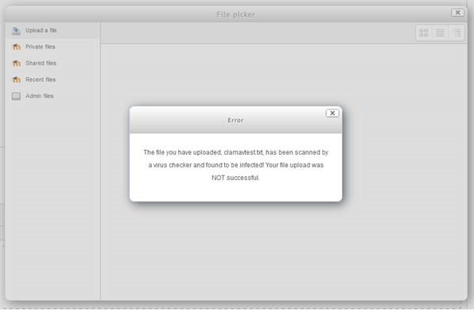
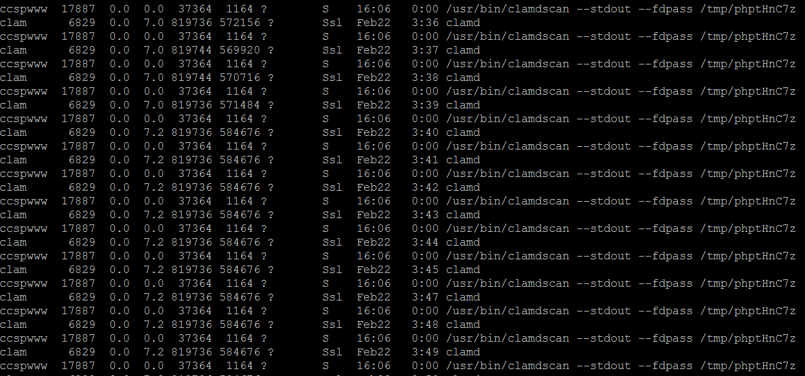

# Testing ClamAV Daemon

The ClamAV process has been changed to a daemon process to continuously run in the background.  The following test have been performed on <https://moodle-pp.ucl.ac.uk/>

**Virus File Test**

1.  Log into <https://moodle-pp.ucl.ac.uk/>
2.  Navigate to <https://moodle-pp.ucl.ac.uk/admin/settings.php?section=antivirussettingsclamav> and update Clamav path to /usr/bin/clamdscan
3.  Create a fake virus file on your desktop.  This can be done my creating a text document with the content

    X5O!P%@AP\[4PZX54(P^)7CC)7}$EICAR-STANDARD-ANTIVIRUS-TEST-FILE!$H+H\* Note: Ensure that you temporary disable your antivirus on your device otherwise the file will get deleted straight away buy the virus scanner

4.  Upload the virus file anywhere in Moodle &gt; you should be presented with the following error message

    

**OK file upload**

1.  Log into <https://moodle-pp.ucl.ac.uk/>
2.  Upload a file anywhere in Moodle &gt; the file should upload successfully

**Clamscan Process**

1.  SSH into any of the moodle-pp-a -b -c -d
2.  Run the command to see the clamdscan process refresh every 1 second
    while true;do ps aux|grep -i clam|grep -v grep;sleep 1;done
3.  When you upload a file to Moodle, you will see the clamdscan running
    

## Attachments:

 [image2018-3-12\_16-46-4.png](attachments/87920759/87920762.png) (image/png)
 [image2018-3-12\_16-51-52.png](attachments/87920759/87920765.png) (image/png)

