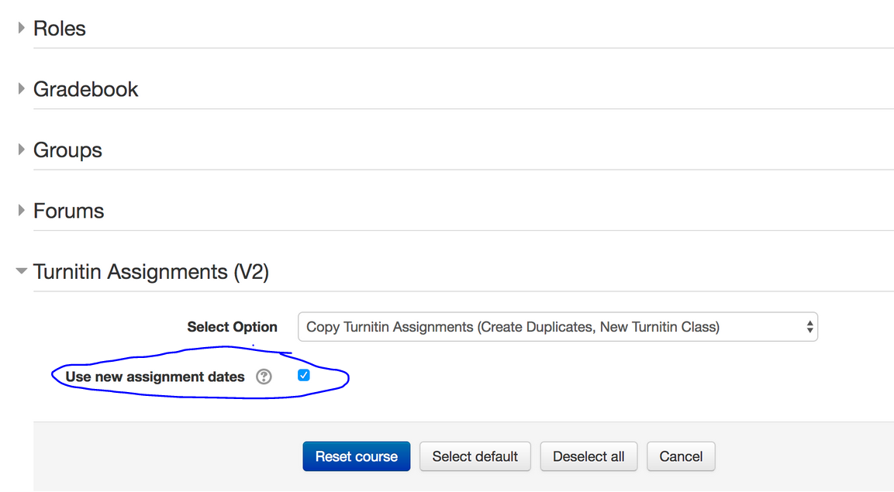

# Tests-Turnitin

/\*\*/ \[TII001T\] Create New Anonymous Turnitin Assignment \[TII002T\] Create New Unanonymous Turnitin Assignment \[TII003T\] Check existing assignment \[TII004T\] Test RESET function \[TII005T\] Test RESET function with CLC channges

Test Results - https://wiki.ucl.ac.uk/x/N489BQ

##### \[TII001T\] Create New Anonymous Turnitin Assignment

-   Turn editing on &gt; Add an activity or resource&gt; Assignment (Turnitin)
-   Change **Store student papers **to **No repository
    **
-   Submit paper on behalf of - do for mood/trail Test accounts.  Go to inbox and click on upload icon to right of the student's name.
-   Check submission inbox
-   Give paper a grade and add grademark comments
-   Check Moodle course gradebook - all ok?
-   Check row of links under tabs is visible 
-   Try deleting a submitted assignment
-   Quick look at student view (log in as ...)
-   Try bulk downloading (need to set post date to the past) and the three options and opening them to see the files / data is there
-   Change post date to see if anonymity is lost permanently.  Check you are given the warning/pop up box when you try to change the date(s)

##### \[TII002T\] Create New Unanonymous Turnitin Assignment

-   Turn editing on &gt; Add an activity or resource&gt; Assignment (Turnitin)
-   Change ****Anonymous marking** **to **No**
-   Change **Store student papers **to **No repository**
-   Submit paper on behalf of - do for mood/trail Test accounts.  Go to inbox and click on upload icon to right of the student's name.
-   Check submission inbox
-   Give paper a grade and add grademark comments
-   Check Moodle course gradebook - all ok?
-   Check row of links under tabs is visible 
-   Try deleting a submitted assignment
-   Quick look at student view (log in as ...)
-   Try bulk downloading (need to set post date to the past) and the three options and opening them to see the files / data is there. Check you are given the warning/pop up box when you try to change the date(s)

##### \[TII003T\] Check existing assignment

-   Look at currently active dept submission areas. SELCS submission page (<https://moodle-pp.ucl.ac.uk/course/view.php?id=29591&section=1>) should have recent submissions (~3 months)
-   Submission inbox accessible? (may be slow on big courses)
-   Assignments still display properly?
-   Gradebook displaying grades?
-   Quick look at student view (log in as specific student...) to view grademark comments/grade and check grade appears in Gradebook
-   Make sure submission titles are displayed (especially in anonymous).  
-   Find a Moodle course with groups and check the
-   Do Moodle groups work for filtering submission inbox?  Check here: <https://moodle-pp.ucl.ac.uk/mod/turnitintooltwo/view.php?id=2084757&do=submissions&group=0>

##### \[TII004T\] Test RESET function

Issue: during a course reset, anonymous marking settings were not carried over if an assignment's due date had already passed. The fix released 09/08/17  should resolve this.

-   Create new Turnitin assignment
-   Make submissions (Min 2) as a student
-   Change the Post date so that it is in the past
-   Reset the course- use new assignment dates during course reset (see image below).  The assignment start date will be set to the date and time of the course reset, while the due and post date will elapse seven days from then.
-   Check TII assignment settings to see ensure anonymous assignment is set to 'Yes'
-   Enrol students
-   Make sure student names are not listed in the assignment inbox
-   make submissions on behalf of students - ensure they still remain anonymous
-   Check that TII assignment settings are the same on the Tunritin website as they are on the TII assignment in Moodle
-   Check that you can edit assignment settings

If possible, also test the RESET function on a test course that has carried over from the snapshot taken in July 2017 and already has submissions to it.

##### \[TII005T\] Test RESET function with CLC channges

<https://git.automation.ucl.ac.uk/moodle/moodle-mod_turnitintooltwo/-/commits/CTP-1005>

<table>
<thead>
<tr class="header">
<th>Scenario</th>
<th>Settings</th>
<th>Expected Result</th>
<th>Pass/Fail</th>
</tr>
</thead>
<tbody>
<tr class="odd">
<td>

reset course with course start date 25 May 2022 

</td>
<td>

default

</td>
<td>
course reset successfully

tii2 start date - same as course start

tii2 end date - today + 1 week

 

turnitinuk - new class id

turnitinuk class start date - course reset date

turnitinuk class end date - start date + 6 months
</td>
<td>pass</td>
</tr>
<tr class="even">
<td>

reset course with course start date 03 Oct 2022 and endate 31 Oct 2022 

</td>
<td>

default

</td>
<td>
course reset successfully

tii2 start date - same as course start

tii2 end date - same as course end date

 

turnitinuk - new class id

turnitinuk class start date - course reset date

turnitinuk class end date - course end date + 1 months
</td>
<td>pass</td>
</tr>
<tr class="odd">
<td>

reset course with course start date 01 Mar 2022 and enddate 01 Apr 2022 

</td>
<td>default</td>
<td>
course reset successfully

tii2 start date - same as course start

tii2 end date - today date + 1 week

(past end dates always set in future)

 

turnitinuk - new class id

turnitinuk class start date - course reset date

turnitinuk class end date - course date + 1 months
</td>
<td>pass</td>
</tr>
</tbody>
</table>

For post-upgrade testing, use the live versions of the courses listed above

## Attachments:

 [Turnitin testing RC.doc](attachments/18394156/18547784.doc) (application/msword)
 [TIIReset.PNG](attachments/18394156/70754963.png) (image/png)

