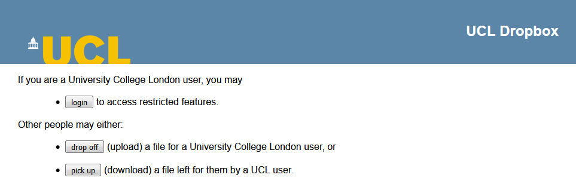
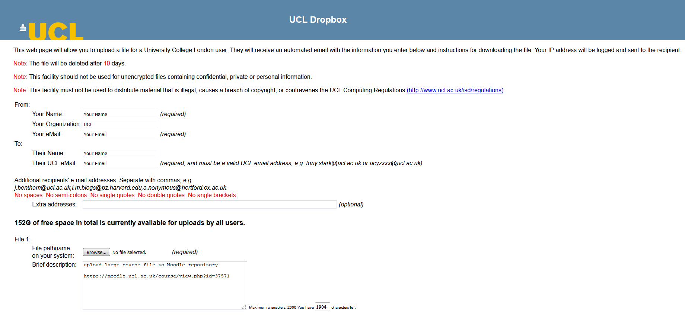
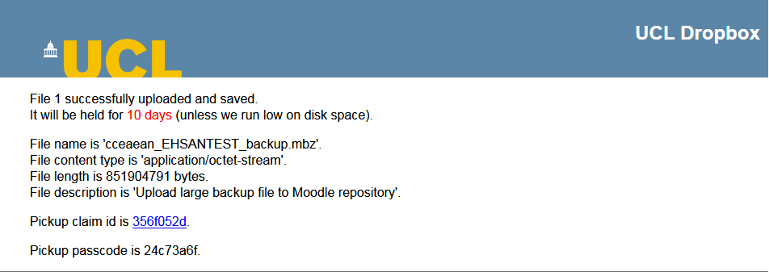
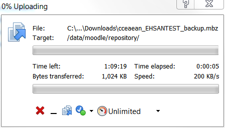

# Uploading large Moodle backup files to Moodle

The upload limit on Moodle is 160mb.  Courses are continuously growing larger exceeding the upload limit.  Follow the steps below to request for a large file upload to Moodle

### User uploading to UCL Dropbox

1.  Navigate to <http://www.ucl.ac.uk/dropbox/> &gt; click drop off
    
2.  **Fills in your own details for 'From' and 'To' fields.**
3.  Before uploading, rename Moodle course backfile to '**yourusername\_shortcoursename\_date\_backup**' &gt; click browse and upload file.  In the file brief description add the link to the course and the message "upload large course file to Moodle repository" 
4.  Once the required details are filled in, scroll to the bottom and click 'upload all files'.  NOTE: Keep the browser window open and depending on the size of the file, it can take a minute or a couple of minutes to upload.

    

5.  Once uploaded; you will see a confirmation with your upload details.  These details will also be emailed to your mailbox.
    
    Ask the user to reply to the remedy force ticket with the confirmation details they received into their mailbox and assign ticket to queue [ISD.LTA - Learning Applications](https://ucl--bmcservicedesk.eu7.visual.force.com/apex/SuggestionPage?queueId=&parentObjectId=a1N0J00000RKp6nUAD&parentObjectName=Incident__c&inctype=Incident&fromInciOwnerLkup=true&ownerType=QUEUE&idValstr=)

    ### LTA to upload to Moodle repository

6.  Click on the collection link and follow the steps

7.  Once the file has downloaded &gt; open up winscp &gt; connect to [moodlevm-nfs.ucl.ac.uk](http://moodlevm-nfs.ucl.ac.uk) and copy the Moodle backup file to folder /data/moodle/repository/course\_backups.
    
8.  Add the file to Moodle repository
    *- Navigate to your course &gt; under course administrator click Repositories*
    *- Click create "File System" instance &gt; set name as “large\_course\_backup” and choose “course\_backups” from the drop down menu.  Leave the “allow relative files” unticked*
9.  Add the file course course backup area
    *- Under course administrator menu click restore &gt; under course backup area click “manage backup files”*
    *- Click add &gt; course\_backup &gt; click on your course file
    - **Ensure that "make a copy of the file" is selected** &gt; rename if required &gt; click "select this file" &gt; once the file has been added click "save changes"*
    *- You will now have a copy of the file for you to restore as normal*

10. Once the file has been added, delete the repository link form the course and also the file from the moodle-nfs repository

11. Email the user with the closing ticket text
    "Hi..
    Your Moodle file is now available in the course backup area for your to restore as normal
    Regards
    ...."

## Attachments:

 [image2018-1-11\_12-36-56.png](attachments/82449768/82449761.png) (image/png)
 [image2018-1-11\_12-37-29.png](attachments/82449768/82449762.png) (image/png)
 [image2018-1-11\_12-58-4.png](attachments/82449768/82449766.png) (image/png)
 [image2018-1-11\_13-47-38.png](attachments/82449768/82449782.png) (image/png)
 [image2018-1-11\_13-53-45.png](attachments/82449768/82449796.png) (image/png)
 [image2018-1-11\_13-54-29.png](attachments/82449768/82449799.png) (image/png)
 [image2018-1-11\_13-54-50.png](attachments/82449768/82449801.png) (image/png)
 [image2018-1-11\_13-58-24.png](attachments/82449768/82449803.png) (image/png)
 [image2018-1-11\_13-58-58.png](attachments/82449768/82449804.png) (image/png)
 [image2018-1-11\_15-52-22.png](attachments/82449768/82449846.png) (image/png)
 [image2018-1-11\_15-56-26.png](attachments/82449768/82449852.png) (image/png)
 [image2018-1-11\_16-44-43.png](attachments/82449768/82449910.png) (image/png)
 [image2018-1-11\_16-47-22.png](attachments/82449768/82449913.png) (image/png)
 [image2018-1-11\_16-48-38.png](attachments/82449768/82449914.png) (image/png)
 [image2018-1-11\_16-51-20.png](attachments/82449768/82449920.png) (image/png)
 [image2018-1-11\_16-52-56.png](attachments/82449768/82449924.png) (image/png)
 [image2018-1-11\_17-21-13.png](attachments/82449768/82449942.png) (image/png)
 [image2018-1-12\_11-39-29.png](attachments/82449768/82450068.png) (image/png)
 [image2018-1-12\_11-47-4.png](attachments/82449768/82450072.png) (image/png)
 [image2018-1-12\_11-48-54.png](attachments/82449768/82450075.png) (image/png)
 [image2018-1-16\_14-59-33.png](attachments/82449768/82450679.png) (image/png)
 [image2018-1-17\_10-42-30.png](attachments/82449768/82450899.png) (image/png)
 [image2018-1-22\_15-10-20.png](attachments/82449768/84181923.png) (image/png)

