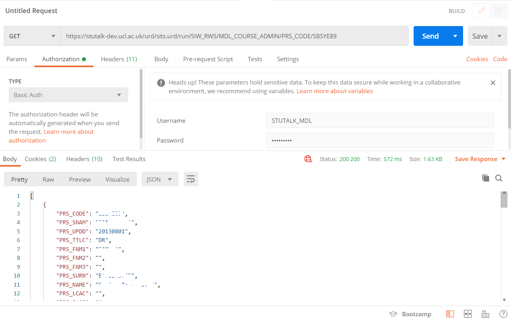

# Web Services (for PoC)

-   Create WSF record

-   Create Role group to control access to REST functionality and give Moodle service account access to the Role group

-   Add WSF to the Role group

-   Create REST resource

    

-   Create GET web service record for REST resource

    

-   Test the above setup using XRWS

    

-   Test using POSTMAN

## Attachments:

 [MRG-8fbf13bd-164b-4b81-9da1-c606dffa5021.png](attachments/187271364/187271351.png) (image/png)
 [potman-6e06a2b4-b7eb-472d-baf9-2563d200b3c5.png](attachments/187271364/187271352.png) (image/png)
 [RGD-c0102a69-4148-4995-9f48-a097833e809b.png](attachments/187271364/187271353.png) (image/png)
 [rgf-38f68870-53b4-4df9-a267-91822130f3e3.png](attachments/187271364/187271354.png) (image/png)
 [rrs-94ef65ce-6146-4ef4-8e8e-68689823c10e.png](attachments/187271364/187271355.png) (image/png)
 [rws-24f6f13f-ea9a-42a9-bff7-3530751394c2.png](attachments/187271364/187271356.png) (image/png)
 [wsf-cb7ae689-7c4c-4760-b600-f66f2366d996.png](attachments/187271364/187271357.png) (image/png)
 [xrws-62d83758-9ee0-4b66-9922-eb9410d3ea51.png](attachments/187271364/187271359.png) (image/png)

