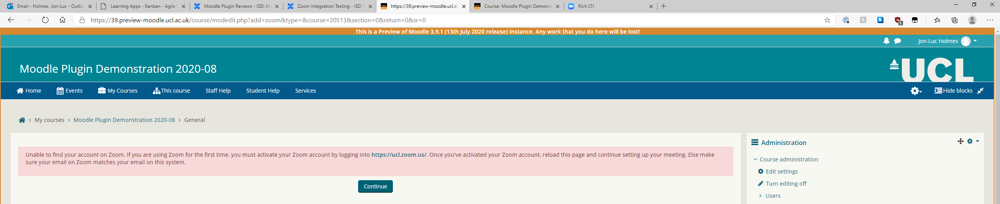
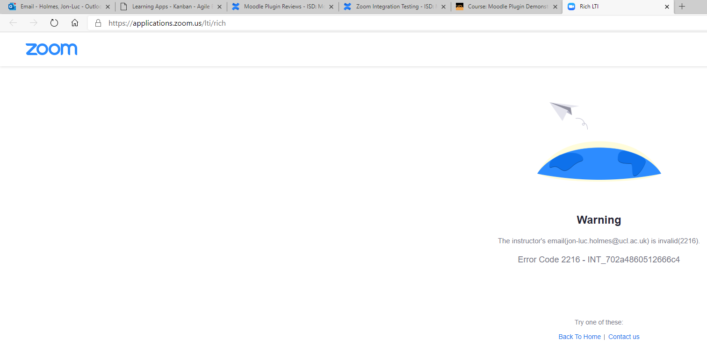

# Zoom Integration Testing

Plug-in issues identified during testing 

-   when trying to create webinar within Moodle the pass-code field is blanked out but the meeting cannot be saved. Invalid value in pass-code field error comes up.
-   no matching user in Zoom 

-   Webinar license need to assigned to the user in Zoom in order to use the plugin for scheduling webinars
-   Deleting Zoom activity doesn't delete created meeting on Zoom itself
    -   Deleted from Zoom when activity was deleted once recycle bin was disabled
    -   Need to test recycle bin function - requires cron to run

## LTI issues identified during testing

-   Zoom to Moodle calendar sync is not working
-   No matching user in Zoom 

## Zoom Plugin vs LTI integration comparison

<table>
<thead>
<tr class="header">
<th>Plugin</th>
<th>LTI</th>
</tr>
</thead>
<tbody>
<tr class="odd">
<td>Moodle look and feel when creating the meeting. Meeting is created  and can be started within Moodle.</td>
<td>The meeting creation process is done in Zoom as LTI redirects to a zoom page</td>
</tr>
<tr class="even">
<td>Developed and maintained by an external team (not Zoom) and the community </td>
<td>Officially provided in the zoom marketplace by CoSo Cloud LLC.</td>
</tr>
<tr class="odd">
<td>n/a</td>
<td>Uses LTI 1.1.1 (old)</td>
</tr>
<tr class="even">
<td>Code involved</td>
<td>
No code involved
</td>
</tr>
<tr class="odd">
<td>GDPR compliant</td>
<td>GDPR issues ( e.g. China datacenter to be enabled) - covered by the Live Teaching Project</td>
</tr>
<tr class="even">
<td>Moodle reporting native</td>
<td>Moodle reporting difficult to achieve</td>
</tr>
<tr class="odd">
<td>Bugs tracking list openly available.</td>
<td>Only fixed bugs available when new version is released.</td>
</tr>
<tr class="even">
<td>Recurring meeting option creates one <em>endless</em> meeting</td>
<td>Recurring meeting option creates multiple meetings around the specified criteria</td>
</tr>
<tr class="odd">
<td>One activity per Zoom meeting</td>
<td>One LTI link for all of a courses Zoom meetings</td>
</tr>
<tr class="even">
<td> 
</td>
<td> 
</td>
</tr>
<tr class="odd">
<td> 
</td>
<td> 
</td>
</tr>
<tr class="even">
<td> 
</td>
<td> 
</td>
</tr>
<tr class="odd">
<td> 
</td>
<td> 
</td>
</tr>
<tr class="even">
<td> 
</td>
<td> 
</td>
</tr>
<tr class="odd">
<td> 
</td>
<td> 
</td>
</tr>
<tr class="even">
<td> 
</td>
<td> 
</td>
</tr>
</tbody>
</table>

## Outstanding Questions

**Plugin outstanding questions:**

-   Does duplicating the Zoom activity create additional meetings within Zoom?
    -   Yes which can edited individually
-   Do course backup, restores and imports create additional meetings within Zoom?
    -   Yes but host is the original activity creator
-   What happens if another course admin duplicates, edits or deletes a Zoom activity they didn't create?
    -   A second course admin can duplicate or edit a Zoom meeting and it will be reflected in the Zoom account of the original creator
-   Breakout groups - <https://moodle.ucl.ac.uk/mod/forum/discuss.php?d=406254#p773324>
    -   breakout rooms could still be created in Zoom. Not an advantage of the LTI over the plugin. Hopefully the feature will be available soon for the plugin.
-   What does authenticated users only option do?
    -   This setting forces them to sign in first. It is a security measure. 
-   Can the co-host be a user with non-ucl email?
    -   the user account (email) needs to exist in the UCL Zoom institutional account. Some non-ucl email address are still present there but these will be suspended if not update to a ucl user account.
-   How do we add meeting in Moodle if they have already been added to Zoom (before the plugin is switched on)?
    -   Copy invitation from Zoom and paste it in a suitable place in the course in Moodle
-   Webinars - should not be needed for teaching. Also a bug with passcode present (07 Sept 2020)

**LTI outstanding questions:**

-   Does Zoom think you're a host or student when opening an LTI link you didn't create as a course admin?
-   get WebServices integration for calendar events working

## Feature requests

-   To automatically provision users from the Zoom plugin in Moodle.

**Cron:**

Get meeting report from Zoom \\mod\_zoom\\task\\get\_meeting\_reports

Reset the number of available API calls \\mod\_zoom\\task\\reset\_api\_calls 

Update meeting settings from Zoom \\mod\_zoom\\task\\update\_meetings

Error - The plugin needs to handle.

    Execute scheduled task: Update meeting settings from Zoom (mod_zoom\task\update_meetings)
    ... started 14:50:56. Current memory use 16.1MB.
    Error updating Zoom meeting with meeting_id 98222772749: zoom_not_found_exception: The resource does not exists: {$a} in /data/apache/htdocs/cicd-moodlesite-391-release-July-2020/mod/zoom/classes/webservice.php:223
    Stack trace:
    #0 /data/apache/htdocs/cicd-moodlesite-391-release-July-2020/mod/zoom/classes/webservice.php(575): mod_zoom_webservice->_make_call('https://api.zoo...')
    #1 /data/apache/htdocs/cicd-moodlesite-391-release-July-2020/mod/zoom/classes/task/update_meetings.php(85): mod_zoom_webservice->get_meeting_webinar_info('98222772749', '0')
    #2 /data/apache/htdocs/cicd-moodlesite-391-release-July-2020/lib/cronlib.php(248): mod_zoom\task\update_meetings->execute()
    #3 /data/apache/htdocs/cicd-moodlesite-391-release-July-2020/admin/cli/scheduled_task.php(150): cron_run_inner_scheduled_task(Object(mod_zoom\task\update_meetings))
    #4 {main}
    ... used 15 dbqueries
    ... used 5.6348791122437 seconds
    Scheduled task complete: Update meeting settings from Zoom (mod_zoom\task\update_meetings)

<https://39.preview-moodle.ucl.ac.uk/admin/tool/task/scheduledtasks.php>

Unknown User (cceaolm) make sure to run these when looking at backup/restore/duplicate/delete as these may take care of the cleanup involved.

## Attachments:

 [zoom-plugin-noaccount.png](attachments/144514038/144519057.png) (image/png)
 [zoom-lti-noaccount.png](attachments/144514038/144519058.png) (image/png)

