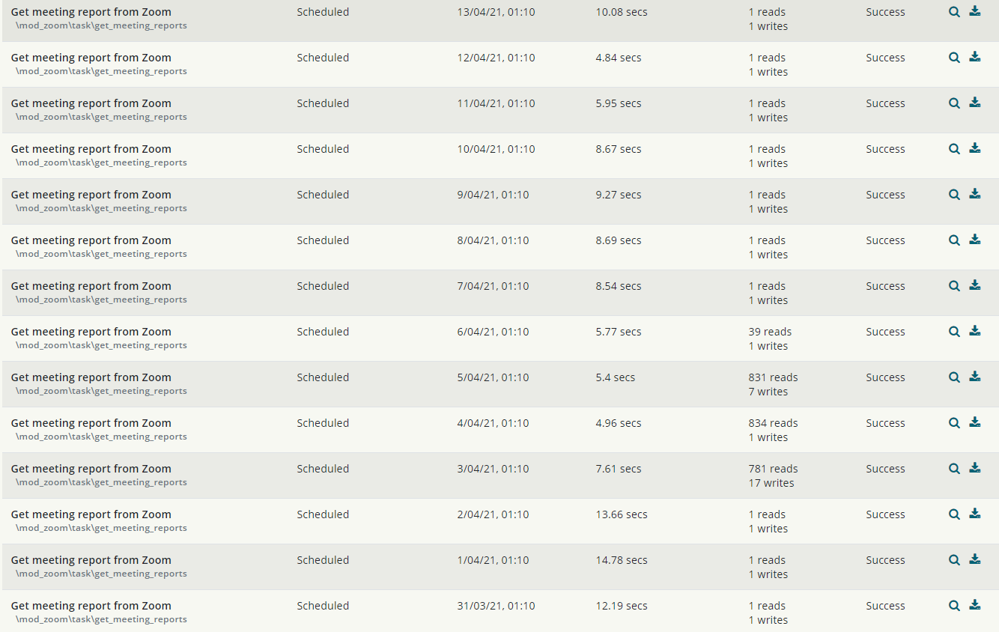
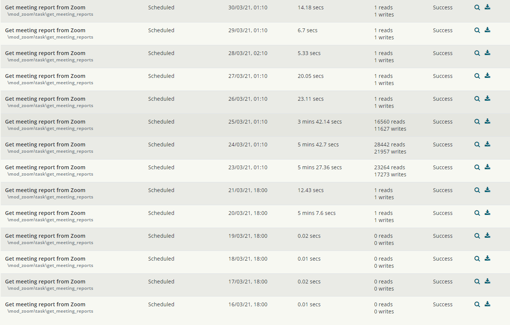
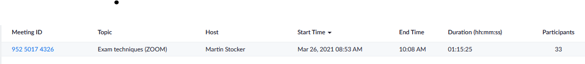
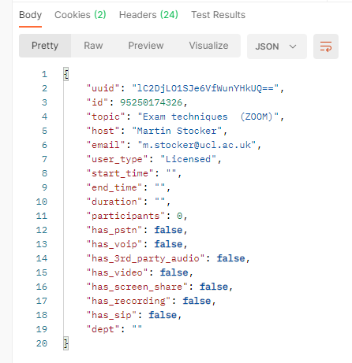

# Zoom Participants Report Issue Dec 2020 - Fixed

# The initial problem

A problem with syncing participants data from Zoom into Moodle was introduced with version 3.4 of the plugin from early Dec 2020. More info <https://github.com/ucla/moodle-mod_zoom/issues/174>

# The solution

The above problem was fixed by the plugin developers in early March 2021 and we updated the Zoom plugin to the latest version with the Moodle release from 11 March 2021

# The subsequent problem

Since the original problem was resolved and fix implemented in our Moodle instance another problem has emerged with the limits on the number of API calls Zoom allows.

The Zoom API endpoints that this plugin is calling most of the time and their rate limits are (valid as of 22/03/2021):

-   v2/metrics/meetings/

20 req. / min.
**Daily limit of 60,000 requests/day** shared by heavy & resource-intensive APIs.

-   v2/metrics/meetings/{meetingId}/participants

40 req. / second
**Daily limit of 60,000 requests/day** shared by heavy & resource-intensive APIs.

The other part of the plugin that is syncing meetings create in Moodle with Zoom has the following limits (valid as of 22/03/2021):

-   v2/meetings

List Meetings: 60 req. / second
Create Meetings: 100 requests per day, per **user**

-   v2/users

List Users: 60 req. / second
Create Users:  80 req. / second

## Changes made to try and overcome the API calls limits in the short term and allow the functionality to fulfil its intended purpose:

-   Changes on when the get\_meeting\_report job runs in Moodle - from 18:00 to 1:10am. Zoom API calls resets daily at midnight
    -   after the change on 22/03/2021 

Report from 23/03/2021 [GetMeetingReport20210323.txt](attachments/165447132/165452602.txt)

-   Changes to roles in Moodle to prevent Refresh session reports functionality to be available only to admin users. This is done to minimise the API calls to Zoom Dashboard API. Roles changed to Prohibit:
    -   all course admin
    -   all tutor
    -   leader
    -   student
-   Asked Zoom Dev Support if we can get our limit on API calls on v2/metrics/meetings/ endpoint increased to meet our needs. In discussions 13/04/2021

## Update 14/04/2021

After changing the run time of the job to 1:10am everything was running fine for several days. Then it stopped bringing data again and It seems to be due to another problem caused by the Zoom API - more info <https://github.com/ucla/moodle-mod_zoom/pull/236>

Meeting in Zoom direct

API returns no start and end time and meeting is ignored by the integration

GET https://api.zoom.us/v2/metrics/meetings/lC2DjLO1SJe6VfWunYHkUQ== or https://api.zoom.us/v2/metrics/meetings/95250174326 

## Update 24 May 2021 

Fixed with Moodle 3.9.7 release and Zoom $plugin-&gt;release = 'v3.6';

## Attachments:

 [image2021-4-13\_9-23-30.png](attachments/165447132/165452595.png) (image/png)
 [image2021-4-13\_9-27-40.png](attachments/165447132/165452596.png) (image/png)
 [GetMeetingReport20210323.txt](attachments/165447132/165452602.txt) (text/plain)
 [image2021-4-14\_15-44-13.png](attachments/165447132/165453143.png) (image/png)
 [image2021-4-21\_12-14-46.png](attachments/165447132/165455495.png) (image/png)

