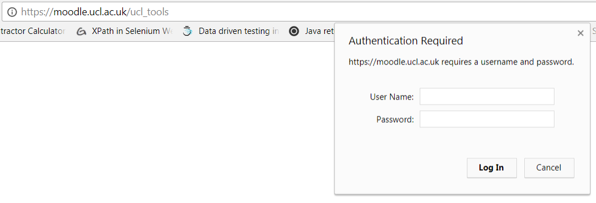

# sa-ldap-moodle password reset

*For testing purposes we are using adtest.  These same steps are to be followed for production using admgmt01.ad.ucl.ac.uk **or development on admgmt01d.addev.ucl.ac.uk
***

### **Password reset**

1.  Log into [https://moodle-pp.ucl.ac.uk/](https://moodle.ucl.ac.uk/) with the moodle admin local account.
2.  Navigate to site administrator &gt; plugins &gt; authentication &gt; LDAP server
3.  Log into [admgmt01t.adtest.bcc.ac.uk](http://admgmt01t.adtest.bcc.ac.uk) with adtest\\isd***yourusername***
4.  Press ctrl + alt + end to bring up the change password screen &gt; change the sa-ldap-moodle password.  The password change is instant.
5.  Change the password on the moodle page &gt; click save

    ### **Testing Password Change**

6.  Open another browser windows in incognito mode &gt; you should be able to log into Moodle successfully with your normal AD account.

7.  As a final step, the <https://moodle.ucl.ac.uk/ucl_tools/> also uses ldap to authenticate access to the page.  To update the password log into each moodle- e, f, g, h using winscp &gt; navigate to /data/apache/htdocs/moodle\_v312/ucl\_tools and edit the .htaccess file and update the AuthLDAPBindPassword  password

    

8.  Also all the <https://moodle-snapshot.ucl.ac.uk/> instance will need their ldap password updated.

    ### **Troubleshooting**

     

9.  If login is unsuccessful &gt; log back in as the local Moodle admin account and check the password and try login again
     
10. If you are unable to login as the local moodle admin; you can change the ldap password with the following sql queries

    ``` sql
    select * from mdl_config_plugins where name like "%bind%";

    update mdl_config_plugins
    set value = the new ldap password
    where id = if of the field;
    ```

## Attachments:

 [image2018-3-1\_17-7-10.png](attachments/87922734/87922735.png) (image/png)
 [image2018-3-21\_18-8-52.png](attachments/87922734/87922861.png) (image/png)
 [image2018-3-22\_11-19-10.png](attachments/87922734/87922964.png) (image/png)
 [image2018-3-23\_8-55-40.png](attachments/87922734/87923268.png) (image/png)

