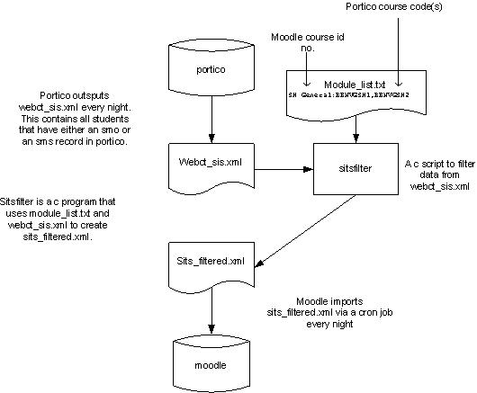

# user account import

-   [Importing student accounts into Moodle](#useraccountimport-ImportingstudentaccountsintoMoodle)
    -   [Troubleshooting](#useraccountimport-Troubleshooting)
        -   [Making sure module\_list.txt contains the correct moodule course id](#useraccountimport-Makingsuremodule_list.txtcontainsthecorrectmoodulecourseid)
        -   [What happens if a student is not in the sits\_filtered.xml file?](#useraccountimport-Whathappensifastudentisnotinthesits_filtered.xmlfile?)
        -   [If an email gets sent with the following message"Could not open /nfs/rcs/sysman/cso/sits/webct\_SIS.xml"](#useraccountimport-Ifanemailgetssentwiththefollowingmessage%22Couldnotopen/nfs/rcs/sysman/cso/sits/webct_SIS.xml%22)
        -   [Obtaining accurate data from the SITS export file](#useraccountimport-ObtainingaccuratedatafromtheSITSexportfile)
-   [Importing staff account into Moodle](#useraccountimport-ImportingstaffaccountintoMoodle)
-   [Importing users into Moodle courses](#useraccountimport-ImportingusersintoMoodlecourses)

See also item 2.6 at VLE meeting 21Oct08

# Importing student accounts into Moodle

In Portico an SMS record gets created for a student when a student chooses their modules and gets confirmed by the parent department without approval by the teaching department. Once the student has the approval of the teaching department, an SMO record is created for the student. The Portico interface will process all modules running in the current academic year which either

1. Have an student module selection (SMS) record which has been approved or confirmed for at least one student for the current academic year i.e. an SMS record exists for the current academic year with SMS\_UDF1='APP' or SMS\_UDF4 = 'CON' (the latter is to allow the inclusion
of SMS records which have been 'blanket' confirmed by the parent department without approval by the teaching department).

OR

2. Have a student module taking (SMO) record for the current academic year if this module/student combination is not selected by 1 above. This is necessary because staff may have directly entered the SMO record without having created an SMS record.

Only students that are attending the classes will be exported (occur='A'). Note use of R is being phased out as this was intended for migrated data only.The output from this process is webct\_sis.xml

Files involved:

<table>
<colgroup>
<col width="25%" />
<col width="25%" />
<col width="25%" />
<col width="25%" />
</colgroup>
<thead>
<tr class="header">
<th><p>Filename</p></th>
<th><p>Location</p></th>
<th><p>Description<br />
</p></th>
<th><p> </p></th>
</tr>
</thead>
<tbody>
<tr class="odd">
<td><p>webct_SIS.xml</p></td>
<td><p>ftp.ucl.ac.uk in /nfs/rcs/sysman/cso/sits/ and copied to /data/moodle/sits on moodlevm-nfs<br />
</p></td>
<td><p>Portico export of all students enrolled on courses. Created daily at 0217<br />
</p></td>
<td><p> </p></td>
</tr>
<tr class="even">
<td><p>sitsfilter</p></td>
<td><p>moodle-a in /home.local/ccspmdl<br />
</p></td>
<td><p>A c program that filters those students enrolled on courses listed in module_list.txt into a file called sits_filtered.xml. It runs daily at 0225<br />
</p></td>
<td><p> </p></td>
</tr>
<tr class="odd">
<td><p>sits_filtered.xml</p></td>
<td><p>moodle-a in /home.local/ccspmdl</p></td>
<td><p>An xml file containing those students enrolled on courses listed in module_list.txt<br />
</p></td>
<td><p> </p></td>
</tr>
<tr class="even">
<td><p>module_list.txt</p></td>
<td><p>moodle-a/b/c in /data/moodle/1<br />
</p></td>
<td><p>A text file containing the course module names. Used by sitsfilter to create sits_filtered.xml which is a subset of webct_SIS.xml<br />
</p></td>
<td><p> </p></td>
</tr>
</tbody>
</table>

Student accounts and enrolment information (SMS records) are imported from Portico (SITS) using a nightly cron job, described in [SCP 3565](http://ccaajrl@www.ucl.ac.uk/~ccaascp/paper.cgi?category=SCP&number=3565&do=viewpaper). The file that is created by this cron job is on ftp.ucl.ac.uk in /nfs/rcs/sysman/cso/sits/webct\_SIS.xml. The file has that name because we use a similar mechanism for imports into WebCT. Another file - sitsfilter is also run by a cron job at 0225 every day. sitsfilter is an executable file in folder ~ccspmdl on moodle-a.  The source is a C program in sitsfilter.c.  The cron job that runs this sitsfilter is owned by ccspmdl:

**25 2 \* \* 1-5 ./sitsfilter &gt; sits\_filtered.xml**

when sitsfilter is run it creates a new file called sits\_filtered.xml in  folder ~ccspmdl on moodle-a.

This program filters the webct\_sis.xml export file, throwing away all &lt;group&gt; records and all &lt;membership&gt; records that don't correspond to courses already in moodle. We only need to enrol students on a small subset of the course modules in the file, so sitsfilter picks out the required modules according to a file called **module\_list.txt** in folder **/data/moodlefs/1**.  module\_list.txt is maintained by the Learning Technology Support Service and is uploaded to data/moodle/1 when a change is required and is a simple text file, with a line for each Moodle course.  Each line contains the course id no. (this is the id that is entered when the course is setup not the id no. that is automatically assigned to it by moodle)  of the Moodle course, followed by a colon and then one or more comma-separated official Portico course module names.  Most often there is just one module name, with the same name as  the Moodle course, but sometimes it is required to enrol the students from more than one module onto a single Moodle course.

At the VLE meeting on VLE meeting 21Oct08 it was decided that the **module\_list.txt** file would be emptied and Fiona did this on 21 Oct 08.

The file created by sitsfilter is sits\_filtered.xml. sits\_filtered.xml is a specially formatted text file that follows the IMS Enterprise specifications containing person, group, and membership XML elements.

The imported data is then brought into Moodle by the main 15-minute Moodle [cron job](cron_job), but only when IMS Enterprise enrolment is switched on: From the **Site Administration** menu in Moodle, select **Courses**, then **Enrolments**. There is a check box to enable enrolment from an **IMS Enterprise file**. If you click **Edit** under **Settings**, the File Location shown should be /home.local/ccspmdl/sits\_filtered.xml.
From this page there is a link at the bottom of the page to "*perform an IMS Enterprise import right now*": <http://moodle.ucl.ac.uk/enrol/imsenterprise/importnow.php>. The Moodle IMS Enterprise cron function checks to see if this file needs importing at regular intervals by check whether anything has been added to the file since it was last imported. On this page you can also specify whether to create the course and the user if they don't already exist.

 

SMS records are temporary and are cleared down by the Portico Services office during the academic year. Some courses in the SMS file do not exist in Moodle because the tutor has not requested that a course be set up within Moodle. In this case, the students will be imported into the database but not enrolled in a course.  
If the SMS records are deleted and the tutor then asks for the course to be added to Moodle the students would then have to be manually enrolled in a course.  
It is important that the file created from the SMS records is backed up before the SMS records are deleted. In the event that the records get deleted before they are backed up, a back up has taken on 25/01/2008 in ccspmdl's home directory in file webct\_SIS.xml.  It's been put on both moodle-a and moodle-b to be on the safe side.   
James Ansell has agreed to send an email to is-appsdev-section@ucl.ac.uk prior to deleting the SMS records. 
Contacts

Portico Services

Jen Burrows x30631

Mick Cairns x28612

James Ansell x30633

-   See also [IMS Enterprise import bug](IMS_Enterprise_import_bug)

## Troubleshooting

There can be number of reasons why a student does not get enrolled on a course in moodle:

1.  The student isn't in the sits\_filtered.xml file.
2.  The student isn't in the webct\_sits.xml file
3.  The module\_list.txt file doesn't contain the correct moodle course id
4.  The moodle course id is empty.
5.  The student doesn't have an smo or an sms record in Portico

### Making sure module\_list.txt contains the correct moodule course id

The text before the : in module\_list.txt must match the name of the moodle course id in moodle. The moodle course id in this case is the course id that is entered below the short course code when setting up a course. If the course id in moodle is empty or doesn't match text before the : in module\_list.txt then the students will not get imported. A number of courses do not have the course id specified in moodle. To add them using sql use the following query:

``` java
update mdl_course set idnumber=shortname where idnumber=""
```

### What happens if a student is not in the sits\_filtered.xml file?

#### Check that the student  is in /home.local/ccspmdl/sits\_filtered.xml on moodle-c.

sits\_filtered.xml can be difficult to search as it's quite big so you can chop it down a bit leaving you with just the students that are enrolled in a specific course. The following instuctions explains how to truncate the file.

1. Login to moodle-c as ccspmdl. (The current directory will be  /home.local/ccspmdl so no need to change)

 2. Edit the file by typing:

``` java
vi sits_filtered.xml
```

3. When you first start Vi, you're in command mode, to get to insert mode you need to type ':'. Search for the course that is supposed to contain the student eg. to find course BIOC1001 type (forward slash course name):

/BIOC1001

This will put your cursor on the same line as BIOC1001. Delete everything above the course by typing:

d1G

you have to be in insert mode to do this, hit ESC if not.

Now go to the end of the course by searching for membership. Type

/membership

Delete everything after this line by typing

dG

As you only want the user id's for this course get rid of all the other rubbish by removing any line that doesn't contain userid. You now need to be in insert mode so type:

:v/userid/d

You should just be left with the userid's in that course. In the bottom right of the screen a line no. is displayed which will be the same as the number of user id's.

So you should now have all the user id's that should be enrolled in the moodle course BIOC1001 but not exactly. Some users have more than 1 userid. If this is the case, when the sits\_filterered.xml file gets imported in to moodle, only the last userid listed for the student will be enrolled on the course.

You can compare this list of users exported from Portico to the ones actually registered in the course by running the following query to get all the students enrolled on a moodle course. Substitute the c.id for the course you're checking:

SELECT c.id, c.fullname, u.firstname, u.lastname, u.email, u.id FROM mdl\_course c LEFT OUTER JOIN mdl\_context cx ON c.id = cx.instanceid LEFT OUTER JOIN mdl\_role\_assignments ra ON cx.id = ra.contextid AND ra.roleid = '5' LEFT OUTER JOIN mdl\_user u ON ra.userid = u.id Where cx.contextlevel = '50' and c.id = 3053

On 1 Oct 2008 we had a problem with a student not being in Moodle even though they were in Portico. The student was: zcjteb7. The student was listed in Portico but was not in the **sits\_filtered.xml** file and so had not been pulled into Moodle. On investigation we found that the student was listed in Portico as having paid their fees but was not listed as being registered on any courses. The file exported from Portico, **/nfs/rcs/sysman/cso/sits/webct\_SIS.xml**, did not contain the user, so the omission must be occurring at the Portico end. The criteria for including a student record must include the fact that the student is enrolled on at least one course, which is the case for virtually all undergraduates. To change this criterion, we'd have to ask Mick Cairns in MS to change the query that creates the SITS export file.

As this is a one off we decided to add the user to Moodle manually, listing them as LDAP, rather than try to change the scripts than automatically register users. If we see more instances of this problem we can review this.

#### What to do if you need to import students in to a course in an emergency

If students haven't been imported in to a course but the data is in sits\_filtered.xml then you can import this data on the fly. Importing the original sits\_filtered.xml takes about 45 minutes and will affect moodle performance so you need to chop the file down so that it only contains the students for the course you're worried about. The following instructions describe how to truncate the xml file to import students in to a moodle course with a course id of BIOC1001

Open the file in vi

vi sits\_filtered.xml

Search for the course

/BIOC1001

Move your cursor up a few lines to the beginning of the &lt;membership&gt; tag

Mark the first line of the bit you want to keep with a \# by typing i to insert and then type \# in front of &lt;membership&gt;

Move to the first line of the file by typing i to get out of insert mode and then 1G to go to the first line.

You want to keep the first 6 lines so move your cursor to line 6.

Now delete everything from here to the \# by typing d/\#

Goto the closing &lt;/membership&gt; tag for this course by typing /membership

Move your cursor down a line and delete the rest of the file by typing DG

This will also delete &lt;/enterprise&gt; tag which you actually need so type it back in. It should be on the last line of the file.

Save the file as something else by typing :w bioc1001\_filtered.xml and then quit by typing :q!

You now have an xml file containing just the students that need enrolling in to course BIOC1001.

Test on moodle-dev first by logging in to moodle-dev and selecting Site Administration&gt;Courses&gt;Enrolments. Edit the settings for the IMS Enterprise file. In the File Location field type the path and file name of your newly created BIOC1001\_filtered.xml and save the settings.   Edit the settings for the IMS Enterprise file again and this time select "perform an IMS Enterprise import now". It's a link at the bottom of the page. This should import the students in to the moodle course. Select the course and check that the students got enrolled.

### If an email gets sent with the following message"Could not open /nfs/rcs/sysman/cso/sits/webct\_SIS.xml"

It could mean that the  remote mount from moodle-pp or moodle-a to /nfs/rcs/sysman has been lost. We need to contact systems to sort this out.

### Obtaining accurate data from the SITS export file

#### Background

Tutors were complaining that students that had been registered on courses in Portico were not being enrolled on courses in Moodle. Further investigation revealed that these students were not in the Portico export file. This occurred because the exports contains students from the SMS records but departments were circumventing the system and creating SMO records without the equivalent SMS record. It is not possible to use data from the SMO records because there is a significant time lag between students choosing their courses and students being approved for the course and tutors are requesting that students be enrolled on courses in moodle before courses have been officially approved.

#### Recommendation

Mick Cairns suggested that the data exported from Portico is a union of the both the sms and the smo records. This would resolve the problem of students being registered for courses in the smo records but not in the sms records. It would also mean that when the sms records are deleted later in the year, we would still get the smo records which should at that point be a accurate.
Actions from a meeting to address the problem of obtaining an accurate export file of which students are registered on what courses.
Attended by Joanne Matthews, Jack levy, Fiona Strawbridge, Jen Burrows, Mick Cairns.

1.  MC to implement export based on union of Sms (selection)/smo (taking) data
2.  JB to discuss with Rob Churm the possibility of deleting sms records before the start of the module selection process for the January affliate intake.
3.  JB to ensure that the email sent to staff advised them to replace both sms and smo records if appropriate.
4.  JB to ensure that John Nicholas covered point 3 in training
5.  MC to run the export process against the SITS 811 UAT environment before and after implementing 1 above.
6.  JL to check the output from 5.
7.  Moodle team to ensure new import was run in January for affiliates. (Exams section 'freeze' the data in mid Feb after which changes should be minimal)
8.  JB to check what happens to the sms/smo records for students who don't arrive (XN status)
9.  JL to check moodle import settings re. removing student registrations
10. MC to update document and circulateThis could potentially result in a student being enrolled in a course in moodle that they are not actually taking. Even if the student is removed from the course in moodle, the next time the IMS import was run, the student would be re-registered.

#### Potential problems with the recommendation

Students might be enrolled on courses in moodle that they are not actually taking. Even if they are removed from a moodle course, they will be re-registered on the course when the next import is run because they have a record in the sms data 

# Importing staff account into Moodle

SCP 3275 was written by Dan and Faisal in July 2006. This adds a PHP file to the moodle server which must be saved as /data/apache/htdocs/moodle/**ucl\_tools/ucl-mdl-usersync.php** on moodlevm-a

Also see SCP 3812. This file *should* be running each night as a cron job to import new staff members but I'm not sure it does at present (25/06/09)

It uses the file: `/nfs/rcs/sysman/cso/upi/webct-data`
This is mounted on the `moodlevm-a/b/c` servers, the `webct-data` file is updated each night with information from a central Oracle ( ? ) databases.

If you login as `ccspmdl` into the above servers you can go to the `/nfs/rcs/sysman/cso/upi/` folder and view the `webct-data` file. It contains a long list of users in the format:

&lt;userid&gt;,&lt;Name&gt;,&lt;status&gt; (eg staff, pg etc)

This script was implemented on 08/05/2008 by Rachel on the `moodle-pp` server (<http://moodle-pp.ucl.ac.uk>). Extra lines were added to the script to allow it to add the email address of the user in the form of &lt;userid&gt;@ucl.ac.uk and set the field 'trackforums' to 1 (this means that all users can see easily when new posts have been made to forums without them having to go into each forum).

This file can be run manually by going to <http://moodle.ucl.ac.uk/ucl_tools/ucl-mdl-usersync.php> but now needs to be added to the [cron job](cron_job) so that it can be called each night automatically.

This script only adds new accounts, rather than re-adding all accounts into Moodle, it gives a report such as:

> Number of accounts in source file: 9039
> Number of new accounts added: 4
> Number of failed attempts to create new accounts: 0

If the script isn't run, new members of staff should be able to login to Moodle using their LDAP details and their Moodle account is created on login. However if a member off staff has never logged into Moodle (and the script has not been run) other users can not find them in moodle and add them to courses so it is desirable for this script to be run regularly.

A cron job is running on moodlevm-a which executes /usr/local/bin/ucl-mdl-usersync.sh. This logs output to /var/log/moodlecron/ucl-mdl-usersync.log and executes /data/apache/htdocs/moodle/ucl\_tools/ucl-mdl-usersync.php.

# Importing users into Moodle courses

See: <https://wiki.ucl.ac.uk/display/ISLTSS/Moodle+-+Bulk+uploading+users>

## Attachments:

 [enrol\_students](attachments/2032804/14713992) (text/plain)
 [Spec-SITSVision-WebCT-Interface.doc](attachments/2032804/3375109.doc) (application/octet-stream)
 [sitsfilter.c](attachments/2032804/3375110.c) (text/plain)
 [moodle import from portico.jpg](attachments/2032804/11075765.jpg) (image/jpeg)
 [enrol\_students](attachments/2032804/2785281) (application/octet-stream)

